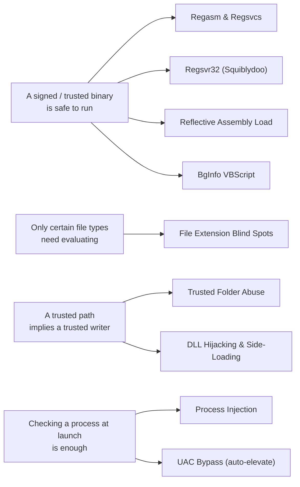

AppLocker is Microsoft's application whitelisting solution, built into Windows and widely deployed across enterprise environments. When misconfigured, or relying entirely on default rules, it becomes an attack surface rather than a control.

This series covers AppLocker bypass techniques from a red team perspective alongside the detection and hardening guidance a blue teamer needs to close each gap. Each post documents a specific bypass, explains why it works at a technical level, and covers the telemetry it generates and how to detect or prevent it.

Every technique here defeats one of four assumptions AppLocker makes. The map below groups the bypasses by the assumption they break:


  
  
  
  
  
  
  
  
  

