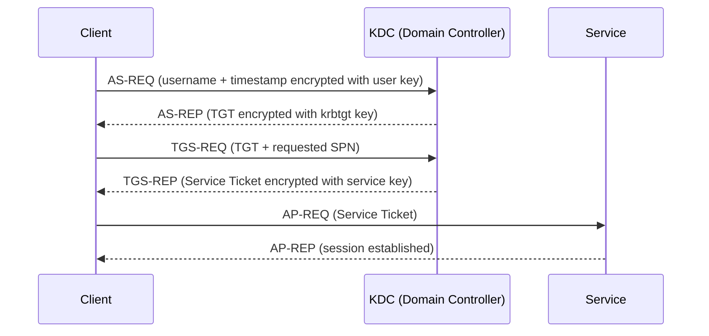

## Overview

Kerberos is a network authentication protocol designed to prove identity over an untrusted network without transmitting passwords. It is the default authentication protocol in Windows Active Directory environments. Understanding how Kerberos works is foundational to understanding how modern enterprise networks authenticate users and how attackers abuse that process.

The protocol relies on a trusted third party called the Key Distribution Center (KDC), which runs on every Domain Controller. All authentication flows through it. Kerberos operates on symmetric key cryptography, meaning both sides of a conversation use the same key to encrypt and decrypt, so that key must never travel over the network. If you can interact with a Domain Controller, you are interacting with a KDC.

## How Does Kerberos Authentication Work?

When a user logs in to a Windows domain, Kerberos handles authentication in a series of exchanges. The user never sends their password directly to a service. Instead, they prove their identity to the KDC, receive a time-limited ticket, and present that ticket to the service.

The three actors in every Kerberos exchange are the client, the KDC, and the target service.

The KDC never sends secrets in the clear. Every ticket is encrypted with a key that only the intended recipient can read. AS stands for Authentication Service, TGS stands for Ticket Granting Service, and AP is the application-level exchange where the client presents its ticket directly to the target service.

The diagram below maps the full authentication flow against every attack primitive covered in this section.

## Kerberos Tickets

[Tickets](/docs/kerberos/tickets/) are the core primitive of Kerberos. They are encrypted blobs that carry identity claims and are valid for a limited window of time, typically 10 hours with a 7-day renewal window in a default Active Directory configuration.

### Ticket Granting Ticket

The Ticket Granting Ticket (TGT) is issued by the Authentication Service (AS) component of the KDC after a successful login. It is encrypted with the hash of the `krbtgt` account, which means only the KDC itself can read or forge one. The TGT proves that the user has already authenticated and allows them to request service tickets without re-entering their password.

Possession of a TGT is equivalent to having an authenticated session. If an attacker captures a TGT they can request service tickets as that user for the entire validity window.

### Service Ticket

A Service Ticket (ST), sometimes called a TGS ticket after the Ticket Granting Service that issues it, grants access to a specific service. It is encrypted with the hash of the account running that service (identified by its Service Principal Name). The target service decrypts it and reads the client's identity and authorization data from inside.

### PAC

Embedded inside every ticket is a Privilege Attribute Certificate (PAC). The PAC contains the user's group memberships, RID, and other authorization data. It is signed by the KDC. Services use the PAC to make access decisions without calling back to a Domain Controller on every request.

## Roasting

Roasting is a class of offline password attacks that exploit the fact that parts of certain Kerberos messages are encrypted with user or service account keys derived from passwords. Because the encrypted material can be requested without special privileges, an attacker can capture it and attempt to crack it offline. Beyond Kerberoasting and AS-REP Roasting, the family also includes [AS-REQ Roasting](/docs/kerberos/asreqroast/), which harvests pre-authentication timestamps straight off the wire, and [Timeroasting](/docs/kerberos/timeroast/), which targets machine-account passwords over NTP.

### Kerberoasting

Any authenticated domain user can request a service ticket for any service that has a Service Principal Name registered. The ticket body is encrypted with the NTLM hash of the account running that service. If the service runs as a domain user account (rather than a computer account or built-in like NETWORK SERVICE), the encrypted blob can be [cracked offline against a wordlist](/docs/kerberos/kerberoast/). Managed service accounts (accounts with automatically rotated, long random passwords) are not practical targets.

### AS-REP Roasting

Normally, the AS-REQ from a client includes a timestamp encrypted with the user's key, which the KDC uses to verify the request. Kerberos pre-authentication is the mechanism that enforces this. If pre-authentication is disabled for a user account, the KDC will respond to an AS-REQ for that account without verifying the requester's identity, and the AS-REP will contain material encrypted with the target user's key. An attacker can [request this for any account with pre-auth disabled](/docs/kerberos/asreproast/) and crack it offline.

## Delegation

Kerberos delegation allows a service to authenticate to other services on behalf of a user. This exists to support multi-tier application architectures where a front-end web service needs to query a back-end database using the connecting user's identity. Delegation is a legitimate feature and a frequent source of privilege escalation paths.

### Unconstrained Delegation

When a computer or service account is configured for unconstrained delegation, the KDC embeds a copy of the user's TGT inside the service ticket it issues. The service can then use that embedded TGT to impersonate the user to any service in the domain. Any user who authenticates to a host with unconstrained delegation effectively hands that host their TGT. If an attacker compromises such a host they can [collect TGTs and impersonate every user who connects](/docs/kerberos/delegation/unconstrained-delegation/).

### Constrained Delegation

Constrained delegation restricts which target services a delegating account is allowed to reach. The allowed targets are listed in the [`msDS-AllowedToDelegateTo` attribute](/docs/kerberos/delegation/constrained-delegation/). This uses the S4U2Proxy extension under the hood. The risk here is narrower than unconstrained, but accounts configured for constrained delegation can still be abused to impersonate users against specific high-value services.

### Resource-Based Constrained Delegation

Resource-Based Constrained Delegation (RBCD) flips the control model. Instead of the delegating account listing where it can delegate, the target resource lists which accounts are allowed to delegate to it via the [`msDS-AllowedToActOnBehalfOfOtherIdentity` attribute](/docs/kerberos/delegation/rbcd/). Because any user who can write to a computer object can set this attribute on it, RBCD is a common privilege escalation primitive when write permissions over computer objects exist.

## Relays

Kerberos relay attacks exploit the fact that Kerberos Service Tickets are bound to a Service Principal Name but not always to the connection itself. When a client receives a service ticket for a given SPN, it does not verify that the server it connects to is actually the machine behind that SPN. An attacker on the network who can coerce authentication and redirect it to a different service can [relay valid Kerberos tickets](/docs/kerberos/relays/) to targets that accept them.

Relaying Kerberos is harder than relaying NTLM because tickets are SPN-bound and extended protection can tie a ticket cryptographically to the specific network connection it was issued for. Even so, specific conditions such as loopback relay scenarios and SPN confusion make it practical in many real environments.

## Service-for-User Extensions

S4U extensions are protocol additions that allow services to request tickets on behalf of users. There are two variants.

### S4U2Self

S4U2Self lets a service request a ticket to itself on behalf of any user, by username only, without requiring that user to authenticate first. This produces a forwardable service ticket for the named user. It is used by services that receive authentication through non-Kerberos mechanisms (like NTLM or forms-based auth) and then need to enter the Kerberos delegation chain. From an attacker perspective, S4U2Self is useful when you control a service account and want to [obtain impersonatable tickets for arbitrary users](/docs/kerberos/delegation/s4u2self-abuse/).

### S4U2Proxy

S4U2Proxy allows a service to use a ticket obtained via S4U2Self (or a forwarded TGT in the unconstrained case) to request a service ticket to a different target service on behalf of the user. This is the mechanism that makes constrained delegation and RBCD work. S4U2Proxy enforces the delegation allowlist in classical constrained delegation but is controlled by the target resource in RBCD.

## User-to-User Authentication

User-to-User (U2U) authentication is a Kerberos mode where both parties are ordinary users rather than a client and a registered service. In standard Kerberos, service tickets are encrypted with the service account's long-term key. In U2U, the ticket is instead encrypted with the target user's TGT session key, which is ephemeral. This allows two user processes to mutually authenticate without either side having a registered SPN or a static service key.

U2U is less commonly encountered in normal administration but appears in specific attack techniques, including [some methods of ticket forgery](/docs/kerberos/user-to-user/) and in tools that interact with the KDC in non-standard ways. It is worth understanding because it represents a distinct code path in the KDC that has historically received less scrutiny.

---

Each of the topics above has its own dedicated note with full technical depth, tooling, detection, and examples. The [delegation attacks](/docs/kerberos/delegation/) and [ticket forgery attacks](/docs/kerberos/ticket-attacks/) each have their own subsection covering the full chain. Use the sidebar to navigate to the specific area you want to explore.

## References

### Tools
- [Impacket](https://github.com/fortra/impacket) — Python network protocol library and scripts
- [Rubeus](https://github.com/GhostPack/Rubeus) — C# Kerberos toolkit
- [mimikatz](https://github.com/gentilkiwi/mimikatz) — Windows credential extraction and ticket manipulation

### Specifications
- [RFC 4120 — The Kerberos Network Authentication Service (V5)](https://www.rfc-editor.org/rfc/rfc4120)
- [MS-KILE — Kerberos Protocol Extensions](https://learn.microsoft.com/en-us/openspecs/windows_protocols/ms-kile/)
- [MS-PAC — Privilege Attribute Certificate Data Structure](https://learn.microsoft.com/en-us/openspecs/windows_protocols/ms-pac/)
