## What Is Delegation?

Imagine you log into a company web app at `https://intranet.radiant.local`. Behind the scenes, the web app needs to query a SQL Server to pull your data. The web app is not running as you — it is running as a service account. But the SQL Server is configured to restrict access by user, so it needs to see *your* identity, not the web app's service account identity.

This is the delegation problem: how does a middle-tier service (the web app) prove to a downstream service (SQL Server) that it is acting on behalf of a specific authenticated user?

Kerberos solves this with **delegation** — a mechanism that allows a service to obtain a Kerberos ticket to a second service while presenting the identity of the original authenticated user. From the SQL Server's perspective, the request appears to come from you, even though the web app is the one making it.

```
Client (jdoe)  →  Front-End Service (IIS / web app)  →  Back-End Service (SQL Server)
                        ↑ delegation happens here
```

Three delegation models exist in Active Directory (AD — Microsoft's directory service for Windows domains), each giving different levels of control over who can delegate to what.

---

## The Three Delegation Types

### Unconstrained Delegation (KUD)

Introduced in Windows 2000. When a service account or computer has the **TrustedForDelegation** flag set in AD, any user who authenticates to it will have their full Ticket-Granting Ticket (TGT — the master credential that lets a user request service tickets) forwarded to that service. The service stores the TGT and can impersonate the user to *any* service in the domain, forever (until the TGT expires).

- **Who controls it:** Domain Admins. Set via the "Trust this computer for delegation to any service (Kerberos only)" option in ADUC (Active Directory Users and Computers), or the `TRUSTED_FOR_DELEGATION` UserAccountControl (UAC — the AD account flag bitmask, not the Windows pop-up prompt) flag in AD.
- **What flag is set:** `TRUSTED_FOR_DELEGATION` on the account object.
- **AD attribute:** `userAccountControl` bit `0x80000` (decimal `524288`).
- **Risk:** Any service with this flag accumulates TGTs from every user who connects to it. Attacker with access to that machine = attacker with every cached TGT.

### Constrained Delegation (KCD)

Introduced in Windows Server 2003. Limits the delegation to a specific list of services. The service account can only impersonate users *to* services explicitly named in its AD attribute. No more blanket "impersonate to anything."

- **Who controls it:** Domain Admins. Only Domain Admins can write the `msDS-AllowedToDelegateTo` attribute on accounts.
- **What flag is set:** Two flavours exist. *Basic KCD* sets only the `msDS-AllowedToDelegateTo` attribute — the user must authenticate to the front-end service using Kerberos natively. *KCD with protocol transition* additionally sets `TRUSTED_TO_AUTHENTICATE_FOR_DELEGATION` on the account, enabling S4U2Self so the service can obtain a ticket even when the user authenticated via NTLM or a web form (any non-Kerberos method). Protocol transition is the more powerful and more commonly abused variant.
- **AD attribute:** `msDS-AllowedToDelegateTo` — a multi-value attribute listing SPNs (Service Principal Names — identifiers tied to specific service instances, e.g. `MSSQLSvc/sql01.radiant.local:1433`) the account may delegate to.
- **Risk:** Attacker who compromises the service account can impersonate any user to the listed back-end services, including Domain Admins (unless they are members of Protected Users).

### Resource-Based Constrained Delegation (RBCD)

Introduced in Windows Server 2012 R2. Flips the model: instead of the *front-end* service declaring where it can delegate, the *back-end* resource declares which front-end services are allowed to delegate *to it*.

- **Who controls it:** The owner of the back-end resource (any user with `GenericWrite` or `msDS-AllowedToActOnBehalfOfOtherIdentity` write permissions on the target object). Domain Admins are not required.
- **What flag is set:** None on the delegating account. The permission lives entirely on the target.
- **AD attribute:** `msDS-AllowedToActOnBehalfOfOtherIdentity` on the *back-end* resource — a binary blob containing a Security Descriptor (an access-control structure) naming the accounts permitted to delegate to it.
- **Risk:** Any attacker with `GenericWrite` over a computer account can grant themselves RBCD rights and forge a service ticket as any user. This is one of the most exploitable misconfiguration paths in modern AD.

---

## Delegation Type Comparison

| Property | Unconstrained | Constrained (KCD) | Resource-Based (RBCD) |
|---|---|---|---|
| Controlled by | Domain Admin | Domain Admin | Resource owner |
| AD flag | `TRUSTED_FOR_DELEGATION` | `TRUSTED_TO_AUTHENTICATE_FOR_DELEGATION` (protocol transition variant only) | None on delegating account |
| AD attribute | `userAccountControl` | `msDS-AllowedToDelegateTo` | `msDS-AllowedToActOnBehalfOfOtherIdentity` |
| Delegation target scope | Any service | Named SPNs only | Named accounts only |
| TGT forwarded? | Yes (full TGT stored on server) | No (S4U extensions synthesize ticket) | No (S4U extensions synthesize ticket) |
| Introduced | Windows 2000 | Windows Server 2003 | Windows Server 2012 R2 |

---

## How Does an Attacker Abuse Delegation?

The delegation chain is a three-party trust: client, front-end service, back-end service. An attacker can insert themselves at the front-end position or exploit a misconfigured front-end to extract credentials the service has already collected.

```mermaid {linenos=table}
sequenceDiagram
    participant C as Client (jdoe)
    participant KDC as KDC (dc01.radiant.local)
    participant FE as Front-End Service<br/>(IIS / svc_iis)
    participant BE as Back-End Service<br/>(SQL / svc_sql)

    rect rgb(20, 40, 70)
        Note over C,BE: Normal delegation flow
        C->>KDC: AS-REQ — request TGT
        KDC-->>C: TGT (encrypted with krbtgt key)
        C->>KDC: TGS-REQ for front-end service (IIS)
        KDC-->>C: ST for IIS (forwardable flag set if Unconstrained)
        C->>FE: Authenticate — present ST
        Note over FE: KUD: full TGT stored in LSASS memory here
        FE->>KDC: S4U2Self — request ST for jdoe to myself (KCD/RBCD)
        KDC-->>FE: ST for jdoe → IIS
        FE->>KDC: S4U2Proxy — request ST for jdoe to SQL
        KDC-->>FE: ST for jdoe → SQL
        FE->>BE: Connect to SQL as jdoe
    end

    rect rgb(80, 20, 20)
        Note over C,BE: Attacker entry points
        Note over FE: KUD attack: compromise front-end host,<br/>extract cached TGTs from LSASS
        Note over KDC: KCD/RBCD/S4U2Self attack: run S4U chain<br/>with compromised service account credentials
        Note over FE: Bronze Bit: forge forwardable flag on<br/>S4U2Proxy ticket using service key
    end
```



---

## Attacks at a Glance

| Attack | Access Needed | What You Get | Bypasses Protected Users? |
|---|---|---|---|
| [Unconstrained Delegation (KUD)](/docs/kerberos/delegation/unconstrained-delegation/) | Code execution on a host with `TrustedForDelegation` | TGTs of every user who authenticates to that host — usable to impersonate them to any service | No — Protected Users members' tickets are not forwardable |
| [Constrained Delegation (KCD)](/docs/kerberos/delegation/constrained-delegation/) | Plaintext password, NTLM hash, or TGT of a KCD-enabled service account | Service ticket as any user to the allowed target SPNs | No — Protected Users members cannot be impersonated via S4U |
| [Resource-Based Constrained Delegation (RBCD)](/docs/kerberos/delegation/rbcd/) | `GenericWrite` (or equivalent) over any computer account | Service ticket as any user to that computer's services (e.g., CIFS, HOST) | No — Protected Users members cannot be impersonated via S4U |
| [S4U2Self Abuse](/docs/kerberos/delegation/s4u2self-abuse/) | Code execution as (or credentials for) a service account with `TRUSTED_TO_AUTHENTICATE_FOR_DELEGATION` set | Service ticket to that service impersonating any domain user — useful as a stepping stone into S4U2Proxy even when the user never authenticated via Kerberos | No — KDC returns a non-forwardable ticket for Protected Users members, blocking the S4U2Proxy step |
| [Bronze Bit (CVE-2020-17049)](/docs/kerberos/delegation/bronze-bit/) | Service account key (NTLM or AES) + an S4U2Proxy ticket | Force-set the `forwardable` flag on a synthesized ticket, bypassing the KDC's refusal to forward Protected Users tickets | **Yes** — this is the defining feature of the vulnerability; patched November 2020 |

> **Protected Users** is an AD security group introduced in Windows Server 2012 R2. Members cannot have forwardable Kerberos tickets, cannot use NTLM authentication, and cannot use DES or RC4 encryption. Adding privileged accounts here is a primary mitigation against delegation abuse.

---

## A Note on S4U Extensions

**S4U** stands for **Service for User** — a Microsoft Kerberos extension defined in [MS-SFU](https://learn.microsoft.com/en-us/openspecs/windows_protocols/ms-sfu/). It adds two sub-protocols that the KDC processes:

- **S4U2Self** — lets a service request a service ticket *to itself* on behalf of a named user, without requiring that user's Kerberos credentials. This is the **protocol transition** step: it bridges the gap when a user authenticated to the front-end via a non-Kerberos method (NTLM, a web form, a certificate) and "converts" that authentication into a Kerberos ticket the service can use for downstream delegation. The resulting ticket is only forwardable if the account has `TRUSTED_TO_AUTHENTICATE_FOR_DELEGATION` set.
- **S4U2Proxy** — lets a service take the S4U2Self ticket and request a *new* service ticket to a *different* back-end service while still presenting the user's identity. This is the actual delegation step — the KDC checks `msDS-AllowedToDelegateTo` (KCD) or `msDS-AllowedToActOnBehalfOfOtherIdentity` (RBCD) to decide whether to issue it.

KCD and RBCD both rely on S4U2Self + S4U2Proxy in sequence. Unconstrained Delegation does not — it uses a real forwarded TGT instead.

---

## References

- [RFC 4120 — The Kerberos Network Authentication Service (V5)](https://www.rfc-editor.org/rfc/rfc4120)
- [MS-SFU — Kerberos Protocol Extensions: Service for User and Constrained Delegation](https://learn.microsoft.com/en-us/openspecs/windows_protocols/ms-sfu/)
- [Rubeus](https://github.com/GhostPack/Rubeus) — C# Kerberos toolkit (S4U chains, ticket forging, delegation abuse)
- [Impacket](https://github.com/fortra/impacket) — Python library and scripts (`getST.py` handles S4U2Self and S4U2Proxy chains)
