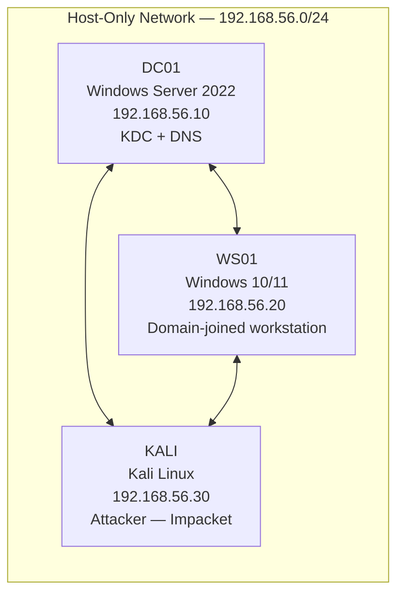

## Overview

Every note in this section assumes you have an Active Directory domain to practice against. This guide builds a minimal three-machine lab — a domain controller, a Windows workstation, and a Kali Linux attacker — configured specifically for the attacks covered here.

By the end you will have:
- A working AD domain (`radiant.local`) running on a Windows Server DC
- A domain-joined Windows workstation with Rubeus and mimikatz ready
- A Kali machine configured for Impacket and Kerberos tooling
- Pre-created users, service accounts, and SPNs (Service Principal Names — unique identifiers that tie a service to the account running it) matching the examples used throughout these notes

> **Prefer a faster start?** Jump to [Quick Alternatives](#quick-alternatives) for automated lab setups using existing projects like GOAD or Vulnerable-AD.

---

## Requirements

### Hardware

| Resource | Minimum | Recommended |
|---|---|---|
| RAM | 8 GB | 16 GB |
| Disk | 80 GB free | 150 GB free |
| CPU | 4 cores | 6+ cores |

Running all three VMs simultaneously is the normal working state. 8 GB RAM is tight but workable if you close other applications.

### Software

- **Hypervisor** — [VirtualBox](https://www.virtualbox.org/) (free) or VMware Workstation Player (free for non-commercial use). Either works; this guide uses VirtualBox commands where relevant.
- **Windows Server 2022** — [evaluation ISO](https://www.microsoft.com/en-us/evalcenter/evaluate-windows-server-2022), 180-day free trial, no license needed for a lab.
- **Windows 10 or 11** — [evaluation ISO](https://www.microsoft.com/en-us/evalcenter/evaluate-windows-10-enterprise) from Microsoft's eval center, 90-day trial.
- **Kali Linux** — [pre-built VirtualBox image](https://www.kali.org/get-kali/#kali-virtual-machines) from kali.org, easiest option.

---

## Lab Architecture

The lab is three machines on one host-only network: a Windows Server 2022 domain controller running the KDC and DNS, a domain-joined Windows 10/11 workstation, and a Kali attack box with Impacket. Host-only networking keeps deliberately vulnerable configurations off any real network while leaving all three able to reach each other.



All three machines sit on a **host-only network** — a private virtual network that keeps your lab traffic isolated from your real network. The DC runs DNS for the domain. Every machine points its DNS at `192.168.56.10`.

---

## Step 1: Create the Virtual Machines

Create three VMs in your hypervisor with these settings:

**DC01 — Domain Controller**
- OS: Windows Server 2022
- RAM: 3 GB
- Disk: 60 GB
- Network: Host-Only Adapter

**WS01 — Windows Workstation**
- OS: Windows 10 or 11
- RAM: 2 GB
- Disk: 40 GB
- Network: Host-Only Adapter

**KALI — Attacker**
- OS: Kali Linux (use the pre-built image)
- RAM: 2 GB
- Disk: 40 GB (pre-allocated in the download)
- Network: Host-Only Adapter

Install each OS from the evaluation ISO. Use standard installation settings — no special partitioning needed. For Windows Server, choose **Windows Server 2022 Standard (Desktop Experience)** so you get a GUI.

---

## Step 2: Configure Static IPs

Static IPs prevent DNS and Kerberos from breaking if your DHCP assigns different addresses after a reboot.

**DC01 — Windows Server**

Open `Control Panel → Network and Internet → Network Connections`, right-click the adapter, select `Properties`, then `Internet Protocol Version 4 (TCP/IPv4)`:

```
IP address:           192.168.56.10
Subnet mask:          255.255.255.0
Default gateway:      (leave blank)
Preferred DNS server: 127.0.0.1
```

The DC points DNS at itself (`127.0.0.1`) because it will run the DNS server for the domain.

**WS01 — Windows Workstation**

Same path, set:

```
IP address:           192.168.56.20
Subnet mask:          255.255.255.0
Default gateway:      (leave blank)
Preferred DNS server: 192.168.56.10
```

**KALI — Linux**

The pre-built Kali image uses **NetworkManager**. First find your connection name:

```bash
nmcli con show
```

```
NAME                UUID                                  TYPE      DEVICE
Wired connection 1  a1b2c3d4-...                          ethernet  eth0
```

Then set the static IP using that name. The `\` at the end of each line is bash's line continuation character — the three lines are one command split for readability:

```bash
sudo nmcli con mod "Wired connection 1" \
  ipv4.addresses 192.168.56.30/24 \
  ipv4.method manual \
  ipv4.dns 192.168.56.10
sudo nmcli con up "Wired connection 1"
```

If you installed Kali manually (not the pre-built image) and it uses the older `networking` service instead, edit `/etc/network/interfaces`:

```bash
sudo nano /etc/network/interfaces
```

```
auto eth0
iface eth0 inet static
    address 192.168.56.30
    netmask 255.255.255.0
    dns-nameservers 192.168.56.10
```

```bash
sudo systemctl restart networking
```

Verify connectivity from each machine:

```bash
ping 192.168.56.10
```

---

## Step 3: Install Active Directory on DC01

On DC01, open **Server Manager** and install the AD DS (Active Directory Domain Services) role.

**Using PowerShell (faster):**

```powershell
Install-WindowsFeature AD-Domain-Services -IncludeManagementTools
```

```
Success Restart Needed Exit Code      Feature Result
------- -------------- ---------      --------------
True    No             Success        {Active Directory Domain Services, ...}
```

**Promote the server to a domain controller:**

The backtick `` ` `` at the end of each line is PowerShell's line continuation character — it lets you split one long command across multiple lines. The entire block is one command:

```powershell
Install-ADDSForest `
  -DomainName "radiant.local" `
  -DomainNetBIOSName "RADIANT" `
  -ForestMode "WinThreshold" `
  -DomainMode "WinThreshold" `
  -InstallDns `
  -Force
```

`-Force` suppresses the confirmation prompt so the command runs without asking "are you sure?" — required when running non-interactively.

You will be prompted to set a **DSRM password** (Directory Services Restore Mode — an emergency recovery password for the DC). Set it to something you won't forget, like `Dsrm@Lab123!`. The server reboots automatically after promotion.

After reboot, log in as `RADIANT\Administrator`. Server Manager will show AD DS as healthy.

> `WinThreshold` is the functional level name for Windows Server 2016 and later. It enables modern Kerberos features including AES encryption and fine-grained password policies needed for the lab scenarios.

---

## Step 4: Join WS01 to the Domain

On WS01, open `Settings → System → About → Rename this PC (Advanced)` and click **Change**. Select **Domain**, enter `radiant.local`, and authenticate with `RADIANT\Administrator` when prompted. Reboot.

**Using PowerShell:**

```powershell
Add-Computer -DomainName "radiant.local" -Credential (Get-Credential) -Restart
```

Enter `RADIANT\Administrator` and its password when the credential dialog appears. The machine reboots and joins the domain.

After reboot, log in with `RADIANT\Administrator` to confirm domain membership:

```powershell
whoami
```

```
radiant\administrator
```

---

## Step 5: Configure Kali for Kerberos

Kali needs two things to work with Kerberos: the `krb5-user` package (which provides `klist` and the Kerberos libraries Impacket uses) and a `/etc/krb5.conf` config file that tells it where the KDC is.

**Install Kerberos tools:**

```bash
sudo apt update && sudo apt install -y krb5-user pipx python3-venv
pipx install impacket
export PATH="${PATH}:/root/.local/bin"
```

When prompted for the default realm during `krb5-user` installation, enter `RADIANT.LOCAL` (uppercase). The `pipx install impacket` step installs all Impacket scripts (`getTGT.py`, `secretsdump.py`, `psexec.py`, etc.) to `/root/.local/bin/`. The `export PATH` line makes them available in the current shell — add it to your `~/.zshrc` or `~/.bashrc` to persist across sessions.

**Configure `/etc/krb5.conf`:**

```bash
sudo nano /etc/krb5.conf
```

Replace the contents with:

```ini {linenos=table}
[libdefaults]
    default_realm = RADIANT.LOCAL
    dns_lookup_realm = false
    dns_lookup_kdc = false
    forwardable = true

[realms]
    RADIANT.LOCAL = {
        kdc = 192.168.56.10
        admin_server = 192.168.56.10
    }

[domain_realm]
    .radiant.local = RADIANT.LOCAL
    radiant.local = RADIANT.LOCAL
```

`forwardable = true` tells the Kerberos libraries to request forwardable tickets by default — required for delegation-based techniques.

**Configure `/etc/hosts` for hostname resolution:**

Kerberos requires that hostnames resolve correctly — using an IP address instead of a hostname can cause authentication to fail because the [service ticket](/docs/kerberos/tickets/) is issued for a specific hostname SPN (Service Principal Name), not an IP.

```bash
sudo nano /etc/hosts
```

Add:

```
192.168.56.10   dc01.radiant.local   dc01
192.168.56.20   ws01.radiant.local   ws01
```

**Sync time with the DC:**

Kerberos enforces a 5-minute clock skew limit — if your Kali clock differs from the DC by more than 5 minutes, authentication fails with `KRB_AP_ERR_SKEW`. Sync before running attacks:

```bash
sudo ntpdate 192.168.56.10
```

```
11 Mar 09:00:00 ntpdate[1234]: adjust time server 192.168.56.10 offset 0.012345 sec
```

If `ntpdate` is not installed: `sudo apt install ntpdate`.

**Verify Impacket works:**

```bash
getTGT.py radiant.local/Administrator:'Admin@Radiant1!'
```

```
Impacket v0.12.0 - Copyright Fortra, LLC

[*] Saving ticket in Administrator.ccache
```

---

## Step 6: Install Tools on WS01

Download these to `C:\Tools\` on WS01. [Windows Defender](/docs/redteam/defender-bypass/) will flag both — add `C:\Tools\` as an exclusion in **Windows Security → Virus & threat protection → Exclusions** before downloading.

**Rubeus** — [latest release from GhostPack/Rubeus](https://github.com/GhostPack/Rubeus/releases) — `Rubeus.exe`

**mimikatz** — [latest release from gentilkiwi/mimikatz](https://github.com/gentilkiwi/mimikatz/releases) — extract the zip, use `mimikatz.exe` from the `x64` folder

Verify both run:

```powershell
C:\Tools\Rubeus.exe help
C:\Tools\mimikatz.exe "exit"
```

---

## Step 7: Provision Lab Accounts

Run this on DC01 (as `RADIANT\Administrator` in an elevated PowerShell) to create all the accounts the attack notes use. As in Step 3, the backtick `` ` `` at the end of each line is PowerShell's line continuation character — paste each full command block as one unit.

```powershell {linenos=table}
# Standard domain user — used as the "requesting account" in Diamond/Sapphire Tickets
New-ADUser -Name "John Doe" -SamAccountName "jdoe" `
  -UserPrincipalName "jdoe@radiant.local" `
  -AccountPassword (ConvertTo-SecureString "Password123!" -AsPlainText -Force) `
  -Enabled $true -PasswordNeverExpires $true

# Service account for SQL Server — has an SPN registered, targetable by Kerberoasting and Silver Ticket
New-ADUser -Name "SQL Service" -SamAccountName "svc_sql" `
  -AccountPassword (ConvertTo-SecureString "Service123!" -AsPlainText -Force) `
  -Enabled $true -PasswordNeverExpires $true

# @{Add="..."} is PowerShell's syntax for adding to a multi-value attribute without overwriting it
Set-ADUser svc_sql -ServicePrincipalNames @{Add="MSSQLSvc/sqlserver.radiant.local:1433","MSSQLSvc/sqlserver.radiant.local"}

# Service account for IIS — targetable by Silver Ticket (HTTP SPN)
New-ADUser -Name "IIS Service" -SamAccountName "svc_iis" `
  -AccountPassword (ConvertTo-SecureString "Service456!" -AsPlainText -Force) `
  -Enabled $true -PasswordNeverExpires $true

# webserver.radiant.local doesn't need to physically exist — the SPN just needs to be
# registered on an account for Silver Ticket practice. The ticket targets the account, not the machine.
Set-ADUser svc_iis -ServicePrincipalNames @{Add="HTTP/webserver.radiant.local"}

# User with Kerberos pre-authentication disabled — targetable by AS-REP Roasting
New-ADUser -Name "No PreAuth" -SamAccountName "nopreauth" `
  -AccountPassword (ConvertTo-SecureString "Roast123!" -AsPlainText -Force) `
  -Enabled $true -PasswordNeverExpires $true

Set-ADAccountControl nopreauth -DoesNotRequirePreAuth $true
```

```
(no output means success for New-ADUser and Set-ADUser)
```

Confirm the accounts exist:

```powershell
Get-ADUser -Filter * | Select-Object SamAccountName, Enabled
```

```
SamAccountName  Enabled
--------------  -------
Administrator   True
Guest           False
krbtgt          False
jdoe            True
svc_sql         True
svc_iis         True
nopreauth       True
```

`Guest` is disabled by default — an unused built-in account for anonymous access that Windows ships with turned off. `krbtgt` is also always disabled — no one ever logs in as it directly, the KDC uses its keys internally to sign tickets. Both being `False` is expected and correct.

Confirm the SPNs are registered:

```powershell
Get-ADUser svc_sql -Properties ServicePrincipalName | Select-Object -ExpandProperty ServicePrincipalName
```

```
MSSQLSvc/sqlserver.radiant.local:1433
MSSQLSvc/sqlserver.radiant.local
```

---

## Step 8: Verify the Lab End to End

From Kali, confirm you can request a TGT for each lab account:

```bash
getTGT.py radiant.local/jdoe:'Password123!'
```

```
[*] Saving ticket in jdoe.ccache
```

```bash
export KRB5CCNAME=jdoe.ccache
klist
```

```
Ticket cache: FILE:jdoe.ccache
Default principal: jdoe@RADIANT.LOCAL

Valid starting       Expires              Service principal
03/11/2026 09:00:00  03/11/2026 19:00:00  krbtgt/RADIANT.LOCAL@RADIANT.LOCAL
        renew until 03/18/2026 09:00:00
```

From WS01 (logged in as `RADIANT\jdoe`), confirm Rubeus can see tickets:

```powershell
C:\Tools\Rubeus.exe triage
```

```
Action: Triage Kerberos Tickets (All Users)

-----------------------------------------------------------------------------------
 | LUID     | UserName              | Service              | EndTime              |
 -----------------------------------------------------------------------------------
 | 0x...    | jdoe @ RADIANT.LOCAL     | krbtgt/RADIANT.LOCAL    | 3/11/2026 7:00:00 PM |
 -----------------------------------------------------------------------------------
```

The lab is ready.

---

## Quick Alternatives

If you want a more realistic multi-machine lab without the manual setup, these projects automate everything:

**[GOAD — Game of Active Directory](https://github.com/Orange-Cyberdefense/GOAD)**
A five-machine lab based on Game of Thrones with a full AD forest, multiple domains, and dozens of pre-configured vulnerabilities. Requires Vagrant and Ansible. More complex to set up but much closer to a real environment. Best for intermediate and above.

**[Vulnerable-AD](https://github.com/WazeHell/vulnerable-AD)**
A single PowerShell script that configures an existing AD domain with a wide range of misconfigurations — ACL abuses, AS-REP roastable users, Kerberoastable accounts, [unconstrained delegation](/docs/kerberos/delegation/unconstrained-delegation/), and more. Run it on top of the manual lab above to add extra attack surface instantly.

**[DetectionLab](https://github.com/clong/DetectionLab)**
More blue-team focused — ships with a Splunk instance, [Sysmon](/docs/blueteam/lolbins-hunting/), and Windows Event Forwarding pre-configured. Good if you want to practice detection alongside the attacks. Requires more RAM (16 GB minimum).

---

## Lab Account Reference

| Account | Password | Purpose |
|---|---|---|
| `Administrator` | `Admin@Radiant1!` (recommended) | Domain admin, used for [DCSync](/docs/redteam/credential-dumping/) and initial setup |
| `jdoe` | `Password123!` | Standard user — requesting account for Diamond/Sapphire Tickets |
| `svc_sql` | `Service123!` | SQL service account with SPN — [Kerberoasting](/docs/kerberos/kerberoast/), [Silver Ticket](/docs/kerberos/ticket-attacks/silver-ticket/) |
| `svc_iis` | `Service456!` | IIS service account with SPN — Silver Ticket (HTTP) |
| `nopreauth` | `Roast123!` | Pre-auth disabled — [AS-REP Roasting](/docs/kerberos/asreproast/) |

| IP | Hostname | Role |
|---|---|---|
| `192.168.56.10` | `dc01.radiant.local` | Domain Controller / KDC |
| `192.168.56.20` | `ws01.radiant.local` | Windows workstation |
| `192.168.56.30` | (Kali) | Attacker |

## References

### Software
- [Impacket](https://github.com/fortra/impacket) — Python network protocol library and scripts
- [Rubeus](https://github.com/GhostPack/Rubeus) — C# Kerberos toolkit
- [mimikatz](https://github.com/gentilkiwi/mimikatz) — Windows credential extraction and ticket manipulation

### Specifications
- [RFC 4120 — The Kerberos Network Authentication Service (V5)](https://www.rfc-editor.org/rfc/rfc4120)
