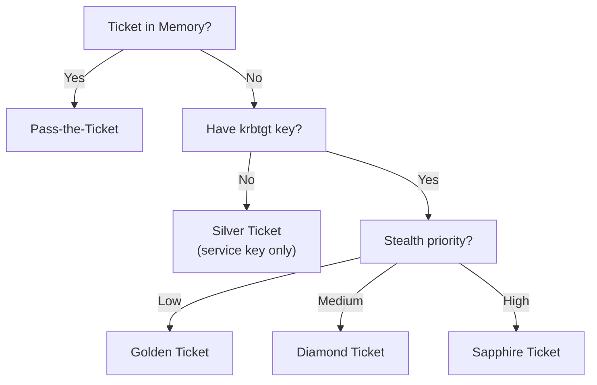

## Overview

Ticket-based attacks abuse the Kerberos ticket system in one of two ways: either by stealing a legitimate ticket from memory and injecting it into a new session, or by forging a ticket from scratch using a compromised account key. Both approaches let an attacker authenticate as another user or escalate privileges without knowing any plaintext passwords.

Before reading these notes, the [Kerberos Tickets](/docs/kerberos/tickets/) reference covers the internal structure of tickets, encryption types, and how the PAC is signed. Understanding that foundation makes each attack here significantly easier to follow.

## Attacks at a Glance

| Attack | Credential Required | What You Get |
|---|---|---|
| [Pass-the-Ticket](/docs/kerberos/ticket-attacks/pass-the-ticket/) | A stolen TGT or ST from memory | Authenticated session as the ticket owner |
| [Silver Ticket](/docs/kerberos/ticket-attacks/silver-ticket/) | Service account NTLM hash or AES key | Forged ST for one specific service, no KDC contact |
| [Golden Ticket](/docs/kerberos/ticket-attacks/golden-ticket/) | `krbtgt` NTLM hash or AES key | Forged TGT for any user in the domain |
| [Diamond Ticket](/docs/kerberos/ticket-attacks/diamond-ticket/) | `krbtgt` AES key + a valid TGT | Legitimate-looking TGT with modified PAC, harder to detect |
| [Sapphire Ticket](/docs/kerberos/ticket-attacks/sapphire-ticket/) | `krbtgt` AES key + S4U2Self | Real PAC content from a target user, nearly undetectable |

## How Do the Ticket Attacks Relate?

Pass-the-Ticket requires no forgery. You take a ticket that already exists in memory and move it to your session. The ticket was legitimately issued by the KDC.

Silver and Golden Tickets are forged from scratch. Silver Ticket only needs the key of one service account, so its blast radius is limited to that service. Golden Ticket needs the `krbtgt` key, which means full domain compromise, but gives you a ticket that works for any service.

Diamond and Sapphire Tickets are refinements of Golden Ticket designed to evade detection. Diamond modifies a real TGT rather than forging one entirely. Sapphire goes further by pulling the real PAC content from a legitimate user through S4U2Self, making the ticket indistinguishable from a genuine one.

Each note covers the attack from both Windows and Linux, including required tools, commands, expected output, and detection indicators.

## References

### Tools
- [Impacket](https://github.com/fortra/impacket) — Python library and scripts for network protocols (ticket forging, extraction, and use across all attacks covered here)
- [Rubeus](https://github.com/GhostPack/Rubeus) — C# Kerberos toolkit (dump, ptt, silver, golden, diamond, sapphire)
- [mimikatz](https://github.com/gentilkiwi/mimikatz) — Windows credential tool (ticket export, injection, hash and key extraction)

### Specifications
- [RFC 4120 — The Kerberos Network Authentication Service (V5)](https://www.rfc-editor.org/rfc/rfc4120)
- [MS-PAC — Privilege Attribute Certificate Data Structure](https://learn.microsoft.com/en-us/openspecs/windows_protocols/ms-pac/)
- [MS-KILE — Kerberos Protocol Extensions](https://learn.microsoft.com/en-us/openspecs/windows_protocols/ms-kile/)
- [MS-SFU — Kerberos Protocol Extensions: Service for User and Constrained Delegation](https://learn.microsoft.com/en-us/openspecs/windows_protocols/ms-sfu/)
