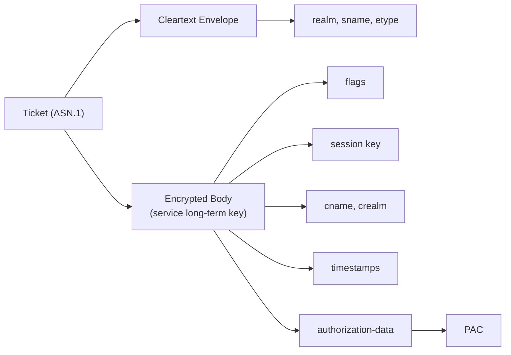
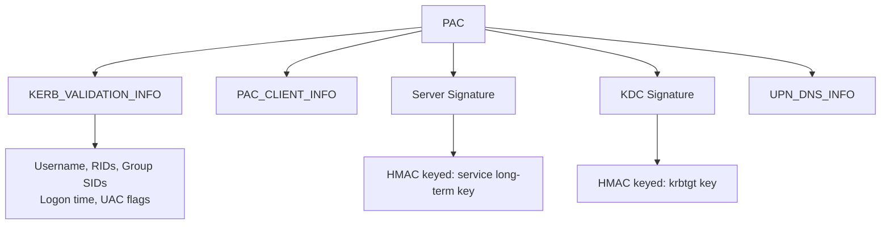
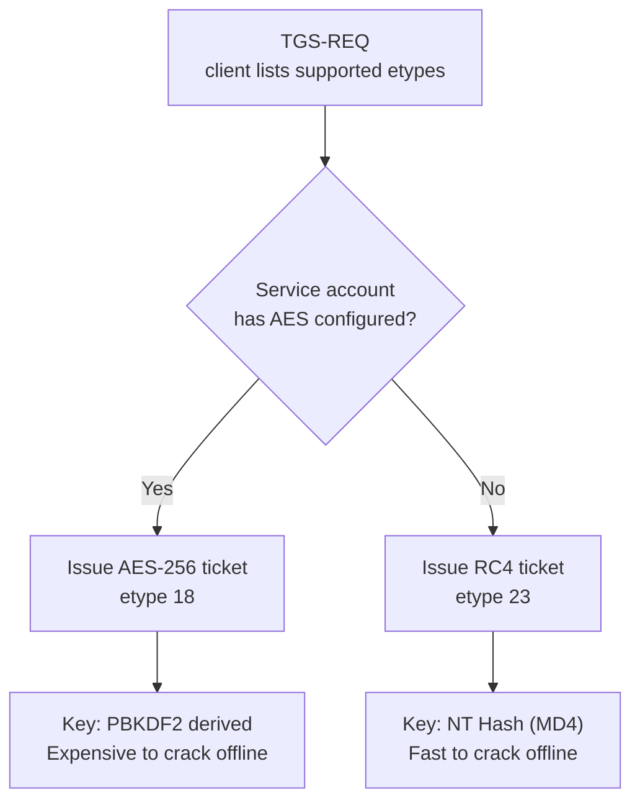

## Overview

Kerberos tickets are the building block every other technique in this series builds on. A ticket is a structured binary blob, encoded in ASN.1[^asn1], that carries an identity claim from the KDC to a service. Forging, stealing, injecting, and cracking tickets all require knowing exactly what is inside them, how the pieces are encrypted, and what each field controls. This note covers the full structure before the attack-focused notes begin.

## Ticket Structure

A Kerberos ticket is an ASN.1 DER[^der]-encoded structure defined in RFC 4120[^rfc4120]. It has two logical parts: a cleartext envelope and an encrypted body.

Think of it like a sealed letter. The envelope has the destination address written on the outside so the postal system can route it. The letter inside is sealed and can only be read by the intended recipient. In Kerberos, the cleartext envelope tells the network where the ticket belongs, and the encrypted body contains the actual identity claims that only the target service can open.

The envelope contains the information needed to route and identify the ticket. The encrypted body contains the sensitive content, locked with the long-term key of the service the ticket is issued for.

The cleartext envelope fields are:

- `tkt-vno`: protocol version number, always 5
- `realm`: the Kerberos realm, equal to the AD domain name in uppercase
- `sname`: the Service Principal Name this ticket is valid for
- `enc-part`: the encrypted body, tagged with the encryption type used

The encrypted body, readable only by the target service, contains:

- `flags`: bitmask of ticket properties
- `key`: the session key for this ticket
- `crealm` and `cname`: the client identity
- `authtime`, `starttime`, `endtime`, `renew-till`: validity window
- `transited`: chain of realms crossed in cross-domain scenarios
- `authorization-data`: where the PAC lives



## Ticket Granting Ticket

The TGT is issued by the Authentication Service component of the KDC after a successful AS exchange. The critical difference between a TGT and a service ticket is what key the encrypted body is locked with. A TGT is encrypted with the long-term key of the `krbtgt` account, meaning only the KDC can decrypt and read it. The `krbtgt` account is a built-in service account that exists in every Active Directory domain. It has no interactive login and no password anyone knows. Its only purpose is to sign and encrypt every TGT issued in the domain, making its key the single most sensitive secret in Active Directory.

The `sname` in every TGT is `krbtgt/<domain>`. When a client presents a TGT in a TGS-REQ, the KDC decrypts it with the `krbtgt` key, reads the session key from inside, and verifies the client's authenticator[^authenticator]. The user's password hash is not needed again after the TGT is issued. The TGT session key is what drives all further exchanges in that logon session.

Possession of a TGT is equivalent to holding an authenticated session for the full validity window. An attacker who extracts a TGT from memory can impersonate that user to any service in the domain until the ticket expires.

## Service Ticket

A service ticket is issued by the Ticket Granting Service component of the KDC in response to a TGS-REQ. The encrypted body is locked with the long-term key of the account running the target service, identified by its SPN[^spn].

For services running as machine accounts, the service key is derived from the computer account password: a 120-character random string rotated every 30 days. These are not practical [Kerberoasting](/docs/kerberos/kerberoast/) targets. For services running as domain user accounts, the key is derived from that user's password, which is often weak enough to crack offline. That distinction is the entire premise of Kerberoasting.

The service ticket carries its own session key, separate from the TGT session key. The client and service use this new session key to secure the application channel after the AP-REQ/AP-REP handshake.

## The Privilege Attribute Certificate

The PAC is a Microsoft extension to Kerberos defined in MS-PAC[^mspac]. It is embedded inside the `authorization-data` field of the ticket's encrypted body. The PAC carries the authorization data the KDC gathered from Active Directory at authentication time. Services read the PAC to make access control decisions without calling back to a domain controller on every request.

The PAC is a sequence of typed buffers. The key ones are:

**KERB_VALIDATION_INFO (type 1)**: The core authorization data. Contains the username, domain name, logon and logoff times, password last set time, user RID[^rid], primary group RID, all group memberships as RID arrays, user account control flags (account property flags such as "password never expires" or "account disabled", not the Windows admin-approval prompt), and supplemental SID lists including universal group SIDs and resource domain SIDs.

**PAC_CLIENT_INFO (type 10)**: The client name and authentication timestamp. A redundant record of who authenticated and when.

**PAC_SIGNATURE_DATA server (type 6)**: An HMAC[^hmac] of the entire PAC, keyed with the long-term key of the service the ticket is issued for. The service verifies this locally to confirm the PAC has not been modified.

**PAC_SIGNATURE_DATA KDC (type 7)**: An HMAC of the entire PAC, keyed with the `krbtgt` key. The KDC checks this when the ticket is presented in a subsequent TGS-REQ.

**UPN_DNS_INFO (type 12)**: The user's UPN[^upn] and DNS domain name. Used by services that need the email-style identifier rather than the legacy SAM[^sam] account name.



### Why Does PAC Validation Matter for Attacks?

When a service receives an AP-REQ it can optionally send the PAC to a domain controller for full validation via a NETLOGON[^netlogon] call. Most services skip this because of the latency cost. They verify only the server signature locally using their own key and trust the contents.

This is why Silver Tickets work. The attacker forges the ticket encryption and the server signature using the service key. The KDC signature is wrong or absent. Because the service never calls back to the DC to check the KDC signature, the ticket is accepted as valid and the forged group memberships inside the PAC are honored.

## Encryption Types

Active Directory supports three encryption types for Kerberos. Which one is used depends on the client, KDC, and target service account configuration.

### RC4-HMAC (etype 23)

RC4-HMAC uses the NT hash directly as the encryption key. The NT hash is the MD4 hash of the Unicode password. Because the key is derived from a simple fast hash with no iteration or salting, tickets encrypted with RC4 are the most practical target for offline cracking. Kerberoasting requests RC4 tickets specifically for this reason: cracking an MD4-derived key is orders of magnitude faster than cracking an AES key derived from PBKDF2[^pbkdf2].

RC4 is now considered legacy. It can be disabled at the domain level but many environments still permit it for compatibility.

### AES128-CTS-HMAC-SHA1-96 (etype 17)

AES128 uses a 128-bit key derived from the account password using PBKDF2 with 4096 iterations, salted with the realm and account name. The iteration cost makes offline cracking significantly more expensive compared to RC4.

### AES256-CTS-HMAC-SHA1-96 (etype 18)

AES256 uses a 256-bit key derived by the same PBKDF2 process. This is the default encryption type in modern AD environments. When "Pass-the-Key" appears in an attack context, the key being passed is typically an AES256 key extracted from [LSASS](/docs/redteam/credential-dumping/).

### How Is the Encryption Type Selected?

The KDC issues a ticket using the strongest encryption type supported by both the client and the target service account. The service account's `msDS-SupportedEncryptionTypes` attribute controls which types it advertises. If the account predates AES support or has only RC4 configured, the TGS falls back to etype 23.



## Ticket Flags

Ticket flags are stored in the ticket's encrypted body as a bitmask, meaning a set of on/off switches packed into a single number where each bit represents one property. They control how a ticket can be used and what operations the KDC and services are permitted to perform with it.

| Flag           | Value      | Meaning                                |
| -------------- | ---------- | -------------------------------------- |
| FORWARDABLE    | 0x40000000 | KDC may issue a forwarded ticket       |
| FORWARDED      | 0x20000000 | This ticket has been forwarded         |
| PROXIABLE      | 0x10000000 | KDC may issue proxy tickets            |
| RENEWABLE      | 0x00800000 | Ticket may be renewed before endtime   |
| INITIAL        | 0x00400000 | Issued directly by the AS, not the TGS |
| PRE-AUTHENT    | 0x00200000 | Client used pre-authentication         |
| OK-AS-DELEGATE | 0x00040000 | Service is trusted for delegation      |

`FORWARDABLE` is required for delegation. Unconstrained delegation works by embedding a forwardable TGT inside the service ticket. If the TGT was issued without the FORWARDABLE flag, [unconstrained delegation](/docs/kerberos/delegation/unconstrained-delegation/) cannot extract and reuse it.

`OK-AS-DELEGATE` is set by the KDC on service tickets for services that are configured for [constrained delegation](/docs/kerberos/delegation/constrained-delegation/). It signals to the client that forwarding credentials to this service is permitted by policy.

`INITIAL` marks tickets issued directly by the AS rather than the TGS. Some services require an INITIAL ticket as proof the user authenticated recently, not just that they hold an old TGT.

`RENEWABLE` combined with a long `renew-till` timestamp is a common indicator of a forged [Golden Ticket](/docs/kerberos/ticket-attacks/golden-ticket/). Legitimate tickets have a `renew-till` at most 7 days out. Forged tickets frequently show `renew-till` set years in the future.

## Session Keys and Long-Term Keys

The distinction between session keys and long-term keys explains exactly what each attack steals and why it works.

A long-term key is derived from an account password and persists until the password changes. The `krbtgt` long-term key encrypts all TGTs. A service account's long-term key encrypts service tickets issued for its SPNs. These are the keys Kerberoasting targets offline.

A session key is generated fresh by the KDC for each ticket. Two session keys are active during a typical Kerberos exchange:

The TGT session key is shared between the client and the KDC. The client encrypts authenticators with it in each TGS-REQ. It is stored inside the TGT's encrypted body and is also returned to the client in the AS-REP, encrypted with the client's long-term key.

The service session key is shared between the client and the service. The KDC embeds it in both the service ticket (encrypted for the service) and the TGS-REP (encrypted with the TGT session key for the client). Both parties derive the same application channel from it after the AP exchange.

Session keys live in the ticket cache. Long-term keys live in LSASS memory as NT hashes or AES keys, and in the `ntds.dit` database on domain controllers.

## Ticket Lifetimes

Every ticket carries four timestamps in its encrypted body.

`authtime` records when the user originally authenticated with the AS. It never changes across renewals or new TGS tickets. It ties every ticket in a session back to the original login event.

`starttime` is when the ticket becomes valid. Normally equal to issuance time. Post-dated tickets (tickets created now but not valid until a future time) carry a future starttime and are marked INVALID until that time arrives.

`endtime` is the expiry time. The Active Directory default is 10 hours from issuance for both TGTs and service tickets.

`renew-till` is the latest point at which the ticket may be renewed. The default is 7 days from `authtime`. Renewal extends `endtime` without a new AS exchange, as long as the ticket has not yet expired and `renew-till` has not passed.

Kerberos enforces a 5-minute clock skew tolerance. The client encrypts the current time in each authenticator and the KDC rejects requests where that time differs from its own clock by more than 5 minutes, and also rejects duplicate authenticators seen within the skew window, preventing an attacker from capturing a valid one and re-submitting it.

## Ticket Storage

### Windows: LSASS

On Windows, tickets are held in LSASS memory by the Kerberos SSP[^ssp]. Each logon session has its own ticket cache. The built-in `klist` command shows tickets for the current session.

```
klist
```

``` {linenos=table}
Current LogonId is 0:0x4f2a1

Cached Tickets: (2)

#0>     Client: jdoe @ RADIANT.LOCAL
        Server: krbtgt/RADIANT.LOCAL @ RADIANT.LOCAL
        KerbTicket Encryption Type: AES-256-CTS-HMAC-SHA1-96
        Ticket Flags 0x40e10000 -> forwardable renewable initial pre_authent
        Start Time: 3/11/2026 09:00:00 (local)
        End Time:   3/11/2026 19:00:00 (local)
        Renew Time: 3/18/2026 09:00:00 (local)

#1>     Client: jdoe @ RADIANT.LOCAL
        Server: cifs/fileserver.radiant.local @ RADIANT.LOCAL
        KerbTicket Encryption Type: AES-256-CTS-HMAC-SHA1-96
        Ticket Flags 0x40a50000 -> forwardable ok_as_delegate pre_authent
        Start Time: 3/11/2026 10:15:00 (local)
        End Time:   3/11/2026 19:00:00 (local)
```

### Kirbi Format

Rubeus and mimikatz export tickets as `.kirbi` files. A kirbi is a DER-encoded `KRB-CRED` structure containing one or more tickets alongside their session keys. This makes the file self-contained for injection into another session.

```powershell
.\Rubeus.exe dump /nowrap
```

``` {linenos=table}
[*] Action: Dump Kerberos Ticket Data (All Users)

  UserName                 : jdoe
  Domain                   : RADIANT
  LogonId                  : 0x4f2a1

    [*] Ticket[0]
    ServiceName              : krbtgt/RADIANT.LOCAL
    EncryptionType           : aes256_cts_hmac_sha1
    Flags                    : name_canonicalize, pre_authent, initial, renewable, forwardable
    Base64EncodedTicket      : doIFpDCCBaCgAwIBBaEDAgEWooIE...
```

### Linux: ccache Format

On Linux, tickets are stored in credential cache files, typically at `/tmp/krb5cc_<uid>`. The `KRB5CCNAME` environment variable points to the active cache. Impacket tools read ccache files directly.

```bash
klist -c /tmp/krb5cc_1000
```

```
Ticket cache: FILE:/tmp/krb5cc_1000
Default principal: jdoe@RADIANT.LOCAL

Valid starting       Expires              Service principal
03/11/2026 09:00:00  03/11/2026 19:00:00  krbtgt/RADIANT.LOCAL@RADIANT.LOCAL
        renew until 03/18/2026 09:00:00
```

### Cross-Format Conversion

Tickets obtained from Windows need to be converted to ccache format before Impacket tools can use them.

```bash
ticketConverter.py ticket.kirbi ticket.ccache
export KRB5CCNAME=/tmp/ticket.ccache
```

To use a base64-encoded ticket from Rubeus output, decode it first.

```bash
base64 -d ticket.b64 > ticket.kirbi
ticketConverter.py ticket.kirbi ticket.ccache
```

## Inspecting Ticket Contents

Rubeus can decode a ticket's ASN.1 structure and print every field without injecting it into a session.

```powershell
.\Rubeus.exe describe /ticket:<base64blob>
```

``` {linenos=table}
  ServiceName              : krbtgt/RADIANT.LOCAL
  ServiceRealm             : RADIANT.LOCAL
  UserName                 : jdoe
  UserRealm                : RADIANT.LOCAL
  StartTime                : 3/11/2026 09:00:00
  EndTime                  : 3/11/2026 19:00:00
  RenewTill                : 3/18/2026 09:00:00
  Flags                    : name_canonicalize, pre_authent, initial, renewable, forwardable
  KeyType                  : aes256_cts_hmac_sha1
  PAC Parsed               : True
    Domain SID             : S-1-5-21-3623811015-3361044348-30300820
    User RID               : 1104
    GroupCount             : 5
    Groups                 : 513, 512, 520, 519, 518
```

On Linux, `describeTicket.py` from Impacket decodes ccache tickets the same way.

```bash
describeTicket.py ticket.ccache
```

---

The next note covers Roasting: how the ticket structure described here enables offline cracking attacks against both service accounts and user accounts with pre-authentication disabled.

[^asn1]: **ASN.1** (Abstract Syntax Notation One) is a standard language for describing data structures independently of any machine architecture or programming language. Kerberos uses it to define the exact layout of tickets, requests, and responses so any compliant implementation can read them. Think of it as a schema language for binary data.

[^der]: **DER** (Distinguished Encoding Rules) is a strict binary serialization format for ASN.1 structures. DER enforces exactly one valid byte encoding for any given value, which matters for cryptographic operations where the bytes being signed must be reproducible. When you dump a Kerberos ticket to a file, the bytes you see are DER-encoded ASN.1.

[^rfc4120]: **RFC 4120** is the IETF specification that defines Kerberos Version 5, covering message formats, exchanges, encryption, and ticket structure. Available at [rfc-editor.org/rfc/rfc4120](https://www.rfc-editor.org/rfc/rfc4120).

[^mspac]: **MS-PAC** is Microsoft's open specification that defines the Privilege Attribute Certificate structure. It extends RFC 4120 with the Windows-specific authorization data that Active Directory embeds in every ticket. Searchable by name in the Microsoft Open Specifications documentation portal.

[^hmac]: **HMAC** (Hash-based Message Authentication Code) combines a cryptographic hash function with a secret key to produce an authentication tag. It verifies both integrity (has the data been modified?) and authenticity (was it produced by someone who holds the key?). The PAC computes two separate HMACs over the same content using two different keys, one for the service and one for the KDC.

[^rid]: **RID** (Relative Identifier) is the last component of a Windows Security Identifier (SID). A full SID looks like `S-1-5-21-<domain>-<RID>`. Common well-known RIDs: 500 is the built-in Administrator, 512 is Domain Admins, 513 is Domain Users. The PAC stores group memberships as a list of RIDs rather than full SIDs to save space.

[^pbkdf2]: **PBKDF2** (Password-Based Key Derivation Function 2) runs a password through a pseudorandom function thousands of times with a salt to produce the final encryption key. Active Directory uses 4096 iterations, meaning an attacker must perform 4096 hash operations per password guess instead of one. This makes brute-force attacks significantly slower compared to RC4-HMAC, which uses a single MD4 operation.

[^authenticator]: An **authenticator** is a small data structure the client sends alongside a ticket to prove it actually possesses the session key, not just the ticket itself. It contains the client name and the current timestamp, encrypted with the session key. Because only someone who holds the session key can produce a valid authenticator, and because the timestamp is checked against the KDC clock to prevent replays, it proves both identity and freshness.

[^spn]: **SPN** (Service Principal Name) is a unique identifier for a service instance in Active Directory. It ties a service to the account running it so Kerberos knows which account key to use when encrypting a ticket. Format is `ServiceClass/host:port`, for example `HTTP/webserver.radiant.local` or `MSSQLSvc/db.radiant.local:1433`. If no SPN is registered for a service, Kerberos cannot issue tickets for it.

[^upn]: **UPN** (User Principal Name) is the email-style login identifier for an Active Directory account, for example `jdoe@radiant.local`. It is the format most users recognise as their login name. Windows also supports the older `DOMAIN\username` (SAM) format for compatibility.

[^sam]: **SAM account name** refers to the legacy `DOMAIN\username` identifier from the Security Accounts Manager, the original Windows user database. Example: `RADIANT\jdoe`. Still widely used internally by Windows services even though UPN is the modern standard.

[^netlogon]: **NETLOGON** is a Windows RPC service that runs on every domain controller and handles domain authentication tasks. It is the channel a member server uses to call back to a DC to verify credentials or, in this case, to ask the DC to validate a PAC. Because this call adds a round-trip network delay on every authentication, most services avoid it and verify the PAC locally instead.

[^ssp]: **SSP** (Security Support Provider) is Windows' plug-in model for authentication packages. Each SSP handles a specific protocol: the Kerberos SSP handles Kerberos tickets, the NTLM SSP handles NTLM hashes, and so on. LSASS (Local Security Authority Subsystem Service) loads and manages all SSPs. When you dump credentials from LSASS you are reading from the memory of whichever SSPs are loaded, including the Kerberos ticket cache.

## References

### Original Research
- Sean Metcalf — adsecurity.org Kerberos research (multiple posts)

### Tools
- [Impacket](https://github.com/fortra/impacket) — Python network protocol library and scripts
- [Rubeus](https://github.com/GhostPack/Rubeus) — C# Kerberos toolkit
- [mimikatz](https://github.com/gentilkiwi/mimikatz) — Windows credential extraction and ticket manipulation

### Specifications
- [RFC 4120 — The Kerberos Network Authentication Service (V5)](https://www.rfc-editor.org/rfc/rfc4120)
- [RFC 6113 — A Generalized Framework for Kerberos Pre-Authentication (FAST)](https://www.rfc-editor.org/rfc/rfc6113)
- [MS-PAC — Privilege Attribute Certificate Data Structure](https://learn.microsoft.com/en-us/openspecs/windows_protocols/ms-pac/)
- [MS-KILE — Kerberos Protocol Extensions](https://learn.microsoft.com/en-us/openspecs/windows_protocols/ms-kile/)
- [MS-SFU — Kerberos Protocol Extensions: Service for User and Constrained Delegation](https://learn.microsoft.com/en-us/openspecs/windows_protocols/ms-sfu/)
