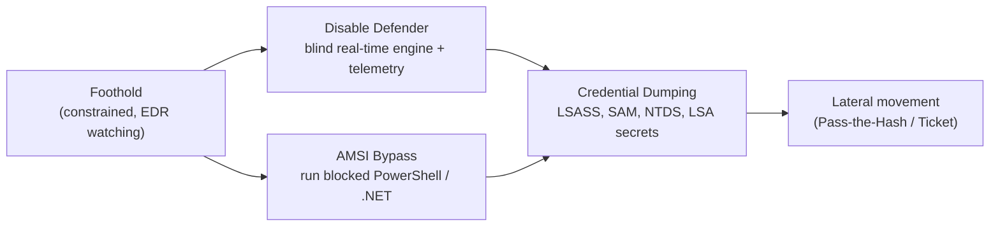

Offensive techniques for constrained environments where standard tooling gets flagged, EDR is watching, or application controls are enforced. Each note documents the technique, why it works at a technical level, and detection considerations where relevant.

These notes chain in a natural order: blind the defensive stack first, then act. Defender and AMSI bypasses clear the way; credential dumping is what you do once the process is no longer watched.


  
  
  
